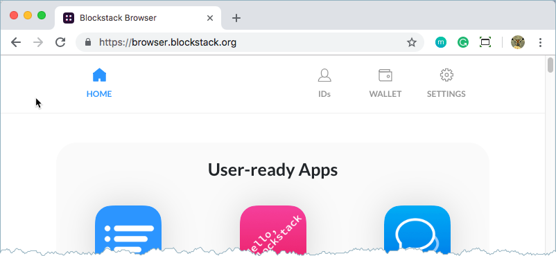

# Introduction to the Blockstack Browser
{:.no_toc}

The Blockstack Browser gives users the ability to explore and use the
decentralized applications (Dapps). Dapps are a new way to interact with the
internet. Dapps give users control of their data. Data about them personally,
name, birthdate, phone number and data about what they do such as visiting a
website or buying an item.

* TOC
{:toc}

## Understand the Blockstack Browser

Through the Blockstack browser application you can create an identity. An identity
represents you as you interact with others through Dapps. The Blockstack
Browser is itself, a simple Dapp. It allows you to:

* create one or more identities
* send and receive bitcoin
* manage the storage of your profile and application data
* find and launch Dapps

There are two editions of the Blockstack Browser, the web edition is an
application you access through your web browser by simply <a
href="https://browser.blockstack.org/" target="\_blank">visiting the application's
address</a> in your computer's browser. You can also install the browser as a
client application on your computer.

If all you want to do is create, manage, and fund an identity and then interact
with Dapps, you can simply use the web edition. If you have concerns about net
censorship, heightened security concerns, or want to develop a Dapp yourself, you may
want to download and install the browser's client edition.

To use the web application to create an identity,

## Using the Browser on public computers

Before you use the web application, it is important to note that once you log
into the application with the brower, your session does not expire until you
choose **Settings > RESET BROWSER**.  For this reason, you should be careful
when using the browser on public computers.

If you are in a library, for example, and log into the browser, simply
closing the tab or even rebooting the computer does not log you out. Instead,
you should be sure to choose **Settings > RESET BROWSER** before leaving the web
application.

For more informatin about your identity and the browser, see [Get and use a Blockstack ID](ids-introduction).

## Overview of the browser functions

The Blockstack Browser allows you to use the new internet. Toward this end, the Browser navigation has the following areas:

<table class="uk-table">
  <thead>
    <th>Item</th>
    <th>Purpose</th>
  </thead>
<tbody>  
<tr>
    <td>Home</td>
    <td>Takes you to the initial page. This page contains a list of the available applications. You can also find available applications at the <a href="https://app.co/blockstack" target="\_blank">App.co</a> site.</td>
  </tr>
  <tr>
    <td>IDs</td>
    <td>Allows you to establish the identity of your primary ID. You also go here to create additional, sub identities.</td>
  </tr>
  <tr>
    <td>Wallet</td>
    <td>Allows you to send and receive Bitcoin.</td>
  </tr>
  <tr>
    <td>Settings</td>
    <td>Configure settings for storage, change session password, reset the Browser, and more.</td>
  </tr>
  </tbody>
</table>
