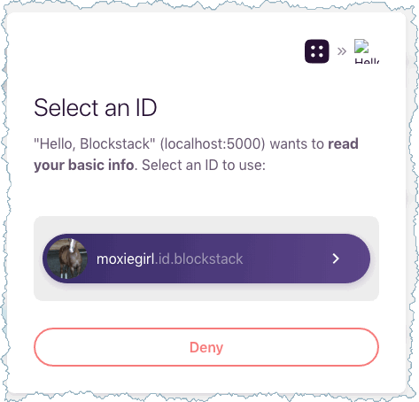

# Hello, Blockstack Tutorial

In this tutorial, you generate a simple application on Blockstack. The application
is a single-page application (SPA) that runs completely client-side. The
application has no backend API to talk to, other than the identity and storage
API that the user provides. In this sense, the application is a completely
decentralized, server-less application. You work through the following sections:

* TOC
{:toc}



## About this tutorial and the prerequisites you need

For this tutorial, you will use the following tools:

- Node.js v10 or higher is recommended the minimum supported version is Node.js v8.
- `blockstack.js` to authenticate the user and work with the user's identity/profile information

The application you build is a React.js application that is completely
decentralized and server-less.  While not strictly required to follow along,
basic familiarity with React.js is helpful.

When complete, the app is capable of the following:

- authenticating users using Blockstack
- posting new statuses
- displaying statuses in the user profile
- looking up the profiles and statuses of other users

The basic identity and storage services are provided by `blockstack.js`. To test
the application, you need to have already registered a Blockstack ID.

Before you begin, verify you have the correct version of Node.js and its tools installed.

```bash
$ node -v
v12.10.0
$ which npm npx
/usr/local/bin/npm
/usr/local/bin/npx
```

If you don't have these installed, take a moment to install or upgrade as needed.

Finally, make sure you have [created at least one Blockstack ID]({{ site.baseurl }}/browser/ids-introduction.html#create-an-initial-blockstack-id). You'll use this ID to interact with the application.
    
## Generate an initial Blockstack application




In this section, you build an initial React.js application called `hello-world-tutorial`. For this example, you will use the React scaffolding.


1. Create the `hello-world-tutorial` directory.

    ```bash
    mkdir hello-world-tutorial
    ```

2. Change into your new directory.

    ```bash
    cd hello-world-tutorial
    ```

3. Create your initial `hello-world-tutorial` application.

    ```bash
    $ npx generator-blockstack --react
      npx: installed 338 in 13.792s
        create package.json
        create .gitignore
        create webpack.config.js
        create netlify.toml
        create firebase.json
        ...
        I'm all done. Running npm install for you to install the required dependencies. If this fails, try running the command yourself.

      > fsevents@1.2.9 install /private/tmp/testymc/node_modules/fsevents
      > node install
      added 775 packages from 455 contributors and audited 9435 packages in 20.934s
      found 0 vulnerabilities

     ```

    Depending on your environment you may have some warnings with the installation. Optionally, you can fix these before continuing to the next section.

## Review the basic application structure

The initial application you create is a generic Javascript application you run
with a local express node. Before you continue, take a moment to examine the
scaffolding of this generic application structure. In the `/` (root) of the generated sample you have the following files:

| File/folder            | Description                       |
|------------------|-----------------------------------|
| `.gitignore`       | Git configuration file.           |
| `package.json`     | Specifies required packages.       |
| `cors`             | Configuration for cross-domain origin support.|
| `node_modules`     | Package files installed by `npm`.|
| `src`              | Application source code.|
| `public`           | Starter web app code.|


In the `public` folder you find these files:

| File             | Description                       |
|------------------|-----------------------------------|
| `favicon.ico`      | Web app site icon.                |
| `index.html`       | Single page.                      |
| `manifest.json`    | Tells the browser about the application and how it should behave.|
| `white-logo.svg`       | Configures crawling and indexing. |


## Start the server and view the application

When you start the server, it will create a Node.js server, start it locally,
and open your browser 'http://localhost:5000'.  From the root of your new application directory:

1. Start the application server.

    ```bash
    npm run start
    ```

    The first time you run it, your system may prompt you to accept incoming connections.

    

2. Choose **Allow**.

   The system opens your browser to `http://127.0.0.1:3000`.

   You should see a simple application:

   

4. Choose **Sign In with Blockstack**.

    The application detects whether the user has the Blockstack client edition installed or
    not. This is done automatically by the Blockstack API, more about this later.
    What the browser displays depends on the users' current state.

    | Using web app    | Has client edition installed      |
    |------------------|-----------------------------------|
    |  |  |

    If the user logged into the Blockstack Browser but not reset it, the user can
    simply use the exiting identity.

   

   If the user chooses **Deny**, the Blockstack Browser displays its
   **Home** page but the user is not logged into the sample application.

5. Leave your new application running and move onto the next section.

## Understand the generated application code

In this section, you look at the basic application generated with the `yo
blockstack` command. The generated code contains simple authentication methods
that allow a user to log into the browser. The main application code is located
in the `src/App.js` file. Open this file now.

All of the code in the file is wrapped in an event listener.

```js
import React, { Component } from 'react';
import Profile from './Profile.js';
import Signin from './Signin.js';
import {
  UserSession,
  AppConfig
} from 'blockstack';

const appConfig = new AppConfig()
const userSession = new UserSession({ appConfig: appConfig })
  ...
```

The `appConfig` contains configuration data for the app while the  `userSession` objects represent the instance of a user on this app. On browser platforms, creating an `AppConfig` instance without any arguments will use `window.location.origin` as the app domain. On non-browser platforms, you need to specify an app domain as the first argument. You can refer to the [blockstack.js Library Reference](https://docs.blockstack.org/common/javascript_ref.html) for information about available functions. 

The `UserSession` API supplies both sign in and sign out that handle user onboarding for you with a set of defaults: 

```js
  handleSignIn(e) {
    e.preventDefault();
    userSession.redirectToSignIn();
  }

  handleSignOut(e) {
    e.preventDefault();
    userSession.signUserOut(window.location.origin);
  }
```

This `render` code checks if the user is signed in or not:

```js
  render() {
    return (
      <div className="site-wrapper">
        <div className="site-wrapper-inner">
          { !userSession.isUserSignedIn() ?
            <Signin userSession={userSession} handleSignIn={ this.handleSignIn } />
            : <Profile userSession={userSession} handleSignOut={ this.handleSignOut } />
          }
        </div>
      </div>
    );
  }
```

The `isSignInPending()` method loads the `userData` or not depending on the sign in determination.

```js
  componentDidMount() {
    if (userSession.isSignInPending()) {
      userSession.handlePendingSignIn().then((userData) => {
        window.history.replaceState({}, document.title, "/")
        this.setState({ userData: userData})
      });
    }
  }
```

A single *Sign in with Blockstack* or *Logout* button is rendred and presented to the user. The `Profile.js` code actually renders the user data.

```js
render() {
    const { handleSignOut, userSession } = this.props;
    const { person } = this.state;
    return (
      !userSession.isSignInPending() ?
      <div className="panel-welcome" id="section-2">
        <div className="avatar-section">
          
        </div>
        <h1>Hello, <span id="heading-name">{ person.name() ? person.name() : 'Nameless Person' }</span>!</h1>
        <p className="lead">
          <button
            className="btn btn-primary btn-lg"
            id="signout-button"
            onClick={ handleSignOut.bind(this) }
          >
            Logout
          </button>
        </p>
      </div> : null
    );
  }

  componentWillMount() {
    const { userSession } = this.props;
    this.setState({
      person: new Person(userSession.loadUserData().profile),
    });
  }
```

When the user is signed in, Blockstack loads the user data from local storage and displays the profile and a *Logout* button. If the user is signed out, the application displays *Sign in with Blockstack* button. When the user presses this button, the user has a pending sign in request, the application sends the user into the Blockstack onboarding, signs the user in, and redirects the user back to the home page.

### Application manifest

The  application's `/public/manifest.json` file configures your app. The
configurations dictate how the application is displayed in auth views and on
user home screens. The contents are very simple:

```json
{
  "name": "Hello, Blockstack",
  "description": "A simple demo of Blockstack Auth",
  "icons": [
    {
    "src": "favicon.ico",
    "sizes": "192x192",
    "type": "image/png"
    }
  ],
  "start_url": "./index.html",
  "display": "standalone"
}
```

Keep it as is or fill it in with new information that describes your app.

### Congratulations you are all done!

You're done! You just built your first Blockstack app and shipped the code. You're well on your way to becoming a Blockstack app legend. If you want to save your code, you can upload it to GitHub or similar code repository. 
