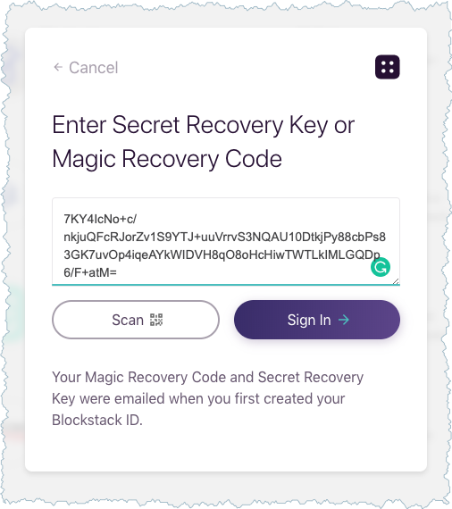

# Get and use a Blockstack ID
{:.no_toc}

Through the Blockstack browser you can create an identity. Your identity is a
point of contact as you interact with others through DApps. Others may be
individual users or companies or software. Unless you allow it, none of these
others have access to anything other than your identity label, for example
`moxiegirl.id.blockstack`. To learn more about you, others must ask and you can
choose to share -- or not.

This document explains one type of identity, the Blockstack ID. You learn how to
create them, as well as when and how to restore them. It contains the following sections:

* TOC
{:toc}

## Understand how identities function in the Blockstack Ecosystem

In this section you learn about identity so you can use it securely.

### Why is an identity not an account

In the internet of today, an account you create for an applications stays with
the company providing that app. This company keeps data you enter about yourself
and data about how you use their application. When you close your account, the
company retains that data.

In decentralized, blockchain software, an _identity_ is a combination of
username and key. The data associated with that identity stays with it, this
means applications or central authorities do not keep our control access to your
data.

You give a DApp access to your data but when you decide to no longer use that
application, you withdraw that access. The DApp developer can no longer access
information about you.

### How do you get an identity

Think of the ID as a form of identification, like a drivers license.  Like
drivers' licenses, each identity is unique but this license identifies you on
the virtual internet highway. An identity is created through a registrar of which there are many.

For DApps in the Blockstack Ecosystem,  Blockstack maintains an identity
registrar. The Blockstack Browser is Blockstack's DApp for creating and managing
identities in the Blockstack registration space.  An example of a registered
Blockstack ID is the `larry.id` ID. The `.id` designation is required, the
`larry` porition is a unique string.

The Blockstack Browser allows new users to create free IDs. These free IDs have
include the word blockstack in the ID, like this `moxiegirl.id.blockstack`. The
additional `blockstack` portion of the name is called a _namespace_. It just
means all the names belong to a particular entity. You don't have to use a free
`id.blockstack` identity. You can also buy an identity that just has a unique
name and the  `.id` portion.

This first ID you create is a _primary ID_. Once you create a primary identity,
you can add other, sub-identities to it. Sub-identities can have the
`id.blockstack` or the `.id` format. You might created sub-identities for the
same reason you have a work and home email.

### What is a key?

IDs have keys. These key unlock your identity like opening a door to a private
home. You should be keep your ID secret and in a safe place. When you create an
ID, Blocktack creates the key for you. When you create an ID, Blockstack sends
you an email with a recovery code you can use to view your key.

* _secret recovery key_ which is a sequence of words `applied binge crisp pictorial fiery dancing agreeable frogs light finish ping apple`
* _recovery code_ an encrypted string, for example `36mWivFdy0YPH2z31EflpQz/Y0UMrOrJ++lH=0EI7c3mop2JuRBm5W1P0BwXxSTazJsUjOAmC55rFUWINqDqGccLio0iwzGclAhaHGZQ5M52`

You receive the recovery code only once. When you get this email, You should
**View Secret Recovery Key** immediately and save to a secure location such as a
password manager.

When Blockstack registers your human readable ID and the recovery key. _You_ must
record the:

<ul>
<li>recovery key</li>
<li>recovery code (in the order the words appear)</li>
<li>initial password (the password lasts until you **RESET** the browser)</li>
</ul>

Blockstack does not store them, so it can't give them to you later if they are
lost.

### Where can you use a Blockstack ID

You can use your Blockstack ID with every DApp in the Blockstack Ecosystem.  To
create an ID, you use a DApp called the Blockstack Browser. Any DApp data you
create is linked to this ID.

For example, if you add a picture to a DApp, the picture appears in the DApp but
the picture's bits and bytes are stored in your personal storage. When you log
into another DApp with your ID, that application can ask for access to your
storage.

## Create an initial Blockstack ID



## Restore a Blockstack ID

When you return to the Blockstack Browser, the browser prompts you to create a
new Blockstack ID or restore an existing Blockstack ID. If you have a
Blockstack identity, you can open the browser by restoring the identity. To
restore an identity, there are two available methods.

Method 1: Supply the identity recovery code (`36mWivFdy0YPH2z31E...`) and the
password you provided when you _initially_ created your identity. Method 2:
Supply the recovery key which is a sequence of words (`applied binge ...`)

If you loose either the recovery code or the password you provided when you
_initially_ created your identity, you can no longer use method 1 to restore
your identity. If you lose the recovery key, you can no longer use method 2.
Once you no longer have access to either method, your identity is estranged and
not accessible by anyone.

### Restore with a recovery key

1. Open the [Blockstack web application in your browser](https://browser.blockstack.org/sign-up?redirect=%2F).
2. Choose **Restore a Blockstack ID**.

   The system displays a dialog where you can enter your recovery code or a
   recovery key.

3. Enter the recovery key.

   The recovery key is a squence of words.

   

4. Press **Next**.

   The system prompts you for an email address. This email can be one you
   entered previously or an entirely new one. Blockstack doesn't store this
   address; it is used during your current Blockstack browser interaction to communicate
   important information with you.

5. Enter an email and press **Next**.

   The system prompts you for an password and its confirmation. This password
   can be one you entered previously or an entirely new one. Write this password
   down. You can use the password during your current Blockstack browser
   interaction  to reveal your keychain or change your password. Blockstack does
   not store this information past the session.

6. Enter a password and press **Next**.

   The system welcomes you back.

   

   At this point, you can go onto work with DApps or you can review your recovery key.

### Restore with a recovery code and original password

1. Open the [Blockstack web application in your browser](https://browser.blockstack.org/sign-up?redirect=%2F).
2. Choose **Restore a Blockstack ID**.

   The system displays a dialog where you can enter your recovery code or a
   recovery key.

3. Enter your recovery code.

  The recovery code is an encrypted string.

  

4. Press **Next**.

   The system prompts you for an email address. This email can be one you
   entered previously or an entirely new one. Blockstack doesn't store this
   address; it is used during your current Blockstack browser interaction to
   communicate important information with you.

5. Enter an email and press **Next**.

   The system prompts you for an password. This must be the password entered
   when you first created your identity. If you have forgetten this passowrd,
   Blockstack cannot provide it to you. Instead, you must switch to using your
   recovery key rather than your code to restore your identity.

6. Enter your origin password and press **Next**.

  The system welcomes you back.

  

  At this point, you can go work with DApps or you can review your recovery key.
