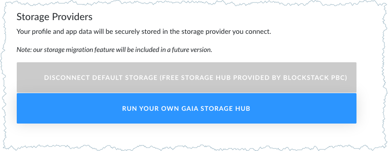
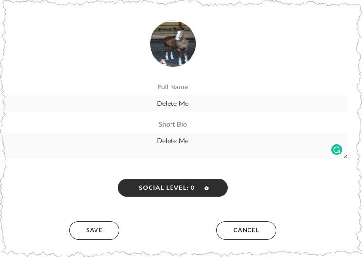
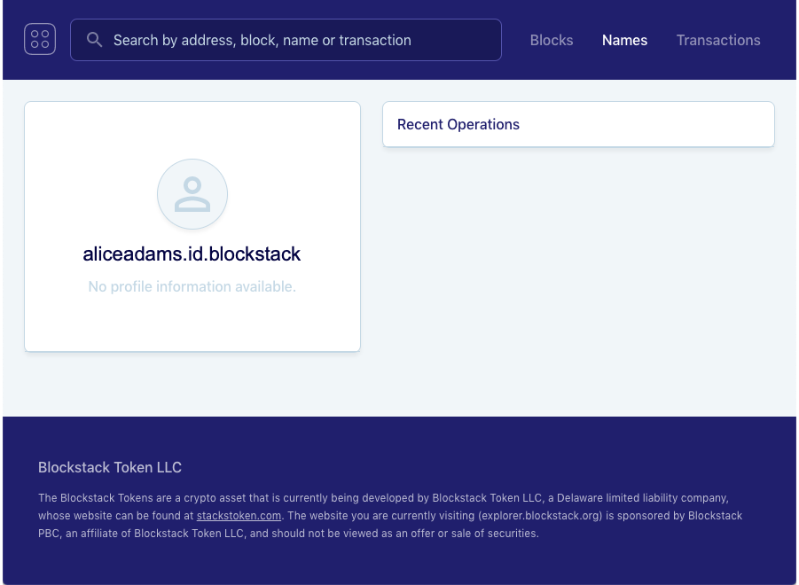

# Get and use a Blockstack ID
{:.no_toc}

Through the Blockstack Browser you can create an identity. You use this single identity to log into applications that allow you to **Login with Blockstack**. Your identity is also your
point of contact as you interact with others through DApps. Others may be
individual users or companies or software. Unless you allow it, none of these
others have access to anything other than your identity, for example
`moxiegirl.id.blockstack`. Typically, others must ask to learn more about you,
and you can choose to share &ndash; or not.

This document explains the free Blockstack ID, though there are others you can get for fee. You learn how to
create a Blockstack ID, how to restore an ID, and how to delete data associated with an ID. This page contains the following sections:

* TOC
{:toc}


## Understand how identities function in the Blockstack Ecosystem

In this section, you learn about identity so you can use it securely.

### Why is an identity not an account

In today's Internet, an account you create to use an applications stays with the company providing that app. This company keeps data you enter about yourself and collects data about how you use their application. This data is valuable and companies use your data to attract advertises. If you stop using that application and close your account, the company retains your data because even old data has value. 

Companies combine data from different applications you visit to build a profile of you. This profile lets them target you for particular information and craft your experience of it. For example, an advertiser can determine if you might be interested in a product and _how much they can charge you for it_. In return for allowing this subtle messaging to you and lack of privacy, you receive a free application or service.

A decentralized identity is a new way to use applications without surrendering your data. A, _decentralized identity_ is a combination of username and key. The data associated with that identity stays with it, this means big companies, their applications or central authorities cannot build data profiles about you. You remain private.

A Blockstack ID is a decentralized identity. You use this single identity to log into decentralized applications (DApps) that present the **Login with Blockstack** button. A single identity gives you access to 100s of applications. When you log into a DApp, you create data but that data is encrypted and stored with your identity. When you log out of an application, the application no longer can read that data so it can't make use of it to build up a profile of you or sell your data to other companies. Your privacy is preserved.

### How do you get a Blockstack identity

Think of the ID as a form of identification, like a drivers license. Like drivers' licenses, each identity is unique, but this license identifies you on the virtual internet highway. An identity is created through a registrar of which there are many. When you create a Blockstack ID, your registrar records the identity creation on the Stacks blockchain. 

The Blockstack Browser allows new users to create free IDs. These free IDs have included the word `blockstack` in the ID, like this `moxiegirl.id.blockstack`. The additional `blockstack` portion of the name is called a _namespace_. It just means all the names belong to a particular entity. You don't have to use a free `id.blockstack` identity. 

This first Blockstack ID you create is a _primary ID_. Once you create a primary identity, you can add other, sub-identities to it. Sub-identities can have the `id.blockstack` or the `.id` format. You might created sub-identities for the same reason you have a work and home email.

If you want a primary identity without the `blockstack` namespace in it, you can buy one. An example of purchased ID is the `larry.id` ID. The `.id` designation is required, the `larry` portion is a unique string.

### What is a key?

Blockstack IDs have keys. These key unlock your identity like opening the door to a private
home. You should keep your ID secret and in a safe place. Blocktack creates your identity key for you. There are two pieces of important information associated with your key:

* The key itself also called the _magic recovery key_ which is a sequence of words `applied binge crisp pictorial fiery dancing agreeable frogs light finish ping apple`
* The _secret recovery code_ an encrypted string, for example, `36mWivFdy0YPH2z31EflpQz/Y0UMrOrJ++lH=0EI7c3mop2JuRBm5W1P0BwXxSTazJsUjOAmC55rFUWINqDqGccLio0iwzGclAhaHGZQ5M52`

When you create Blockstack ID, Blockstack sends you an email with a recovery code you can use to view your key. You receive the recovery code only once. When you get this email, You should
**View Secret Recovery Key** immediately and save to a secure location such as a
password manager.


<div class="uk-card uk-card-default uk-card-body">
<p>When Blockstack registers your human-readable ID and the recovery key. _You_ must
record the:
</p>
<ul>
<li>secret recovery key</li>
<li>magic recovery code (in the order the words appear)</li>
<li>initial password (the password lasts until you <strong>RESET</strong> the browser)</li>
</ul>
<p>Blockstack does not store the key or recover code, so it can't give them to you later if you lose them.</p>
</div>

### Where can you use a Blockstack ID

You can use your Blockstack ID with every DApp in the Blockstack Ecosystem. To
create an ID, you use a DApp called the Blockstack Browser. Any DApp data you
create is linked to this ID.

For example, if you add a picture to a DApp, the picture appears in the DApp, but
the picture's bits and bytes are stored in your personal storage. When you log
into another DApp with your ID, that application can ask for access to your
storage.

Visit the <a href="https://app.co/" target="_blank">App.co, the Universal DApp Store</a> to find apps you can use with your Blockstack ID.

## Create an initial Blockstack ID



## Sign in with an existing a Blockstack ID

When you return to the Blockstack Browser, the browser prompts you to create a
new Blockstack ID or signing in with an existing Blockstack ID.  When you do this the system provides you with this prompt:

 

From this dialog you can choose between these two methods:

* Method 1: Supply the secret key which is a sequence of words (`applied binge ...`)
* Method 2: Supply the identity recovery code (`36mWivFdy0YPH2z31E...`) and the password you used when you created the identity

If you loose either the recovery code or the password you provided when you
_initially_ created your identity, you can no longer use method 1 to restore
your identity. If you lose the recovery key, you can no longer use method 2.
Once you no longer have access to either method, your identity is estranged and
not accessible by anyone, not even Blockstack.

### Sign in with a magic recovery key

1. Open the [Blockstack web application in your browser](https://browser.blockstack.org/sign-up?redirect=%2F).
2. Choose **Sign in with an existing ID**.

   The system displays a dialog where you can enter your recovery code or a
   recovery key.

3. Enter the recovery key.

   The recovery key is a sequence of words.

   

4. Press **Next**.

   The system prompts you for an email address. This email can be one you
   entered previously or an entirely new one. Blockstack doesn't store this
   address; it is used during your current Blockstack Browser interaction to communicate
   important information with you.

5. Enter an email and press **Next**.

   The system prompts you for a password and its confirmation. This password
   can be one you entered previously or an entirely new one. Write this password
   down. You can use the password during your current Blockstack Browser
   interaction  to reveal your keychain or change your password. Blockstack does
   not store this information past the session.

6. Enter a password and press **Next**.

   The system welcomes you back.

   

   At this point, you can go onto work with DApps or you can review your recovery key.

### Restore with a secret recovery code and original password

1. Open the [Blockstack web application in your browser](https://browser.blockstack.org/sign-up?redirect=%2F).
2. Choose **Sign in with an existing ID**.

   The system displays a dialog where you can enter your recovery code or a
   recovery key.

3. Enter your recovery code.

  The recovery code is an encrypted string.

  

4. Press **Next**.

   The system prompts you for an email address. This email can be one you
   entered previously or an entirely new one. Blockstack doesn't store this
   address; it is used during your current Blockstack Browser interaction to
   communicate important information with you.

5. Enter an email and press **Next**.

   The system prompts you for a password. **This must be the password entered
   when you first created your identity.** If you have forgotten this password,
   Blockstack cannot provide it to you. Instead, you must switch to using your
   recovery key rather than your code to restore your identity.

6. Enter your origin password and press **Next**.

  The system welcomes you back.

  

  At this point, you can go work with DApps or you can review your recovery key.

## Can you delete a Blockstack ID?

An ID is recorded on the Blockstack's blockchain; For this reason, once you create an identity, you can’t delete it. You can abandon or simply stop using your ID. Estranged identities like this can’t be used by another person or organization because only you have access to the ID's 12 word recovery phrase.

However, you **can delete** the data associated with your ID. Storage deletion is *only possible* if you used that ID with the default Blockstack Gaia storage hub. If your ID used your own or another Gaia storage hub, Blockstack cannot delete the data, instead, you should contact your storage hub provider for that service.

Do the following to delete the default storage provided with your ID.

1. Log into the Blockstack Browser.
2. Choose <a href="https://browser.blockstack.org/profiles/i/all" target="_blank"><strong>Identity > More page</strong></a>.

   This page lists your **Default ID** and any other IDs associated with it. Each ID has a Gaia storage location associated with it. You may just have one ID, that is typical.

3. Make sure you are using <a hreg="https://browser.blockstack.org/account/storage" target="_blank">the default storage hub</a>.

   If you are using the default hub, the page looks like this:

   

4. Visit the <a href="https://browser.blockstack.org/profiles" target="_blank"><strong>Identity</strong></a> page on your browser.
5. Enter `Delete Me` and the date you made the request for the **Full Name** and the **Short Bio**.

   

6. Press **Save**.
7. Email the list of IDs to <a href='mailto:support@blockstack.com'>support@blockstack.com</a>, the content of your email should contain details similar to the following:

   ```txt
   Please delete the Gaia storage associated with the following ids:
   - user1.id.blockstack
   - user2.id
   - user3.id.blockstack
   All of these IDs used the Gaia default storage.
   ```

   The support team will respond with an email confirming your data was deleted.
  
8. To confirm your data was deleted, navigate to <a href="https://explorer.blockstack.org/" target="_blank">the Blockstack Explorer</a> and enter your ID into the search bar.

   You should see something similar to the following:

   