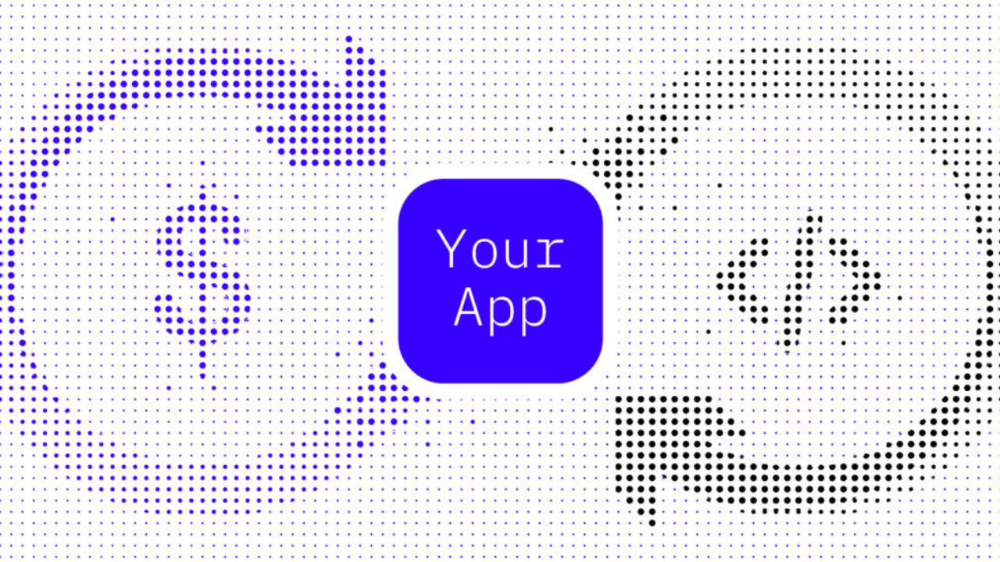

A guide featuring insights from App Reviewers and the Blockstack PBC team

<strong>Disclaimer</strong>: App Mining is currently being piloted by Blockstack PBC with the intent of refining it to the point it can be implemented at the protocol level on the Stacks Blockchain. The program is constantly improving thanks to feedback collected via the forum, Github, and ongoing App Mining calls with miners. 

## Introduction
{:.no_toc}

App Mining is built (and constantly refined) in a way that should help bootstrap quality applications that people want to use. As an app improves relative to others in the App Mining pool, so too should its rank and therefore the associated payout. Different independent App Reviewers focus on different aspects of what makes an app high-quality or successful, the aspect they focus on being a function of their expertise. In this guide we'll feature advice from each of these App Reviewers so you can best understand how to score well with each, thus improving your overall score.

It's worth noting that if at any point as an App Miner, you feel compelled to do something to improve your score that you don't feel is also improving your app or helping you acquire users, it's a potential area for feedback that could improve App Mining, so please don't hesitate to use the forum or regular call to do so. 

## Before you begin

<table class="uk-table">
    <tbody>
        <tr>
            <td> </td>
            <td>
            <h4>Zero-to-Dapp Tutorial</h4>
            
If you've found this guide and have not yet built an app, please start with the <a href="{{site.baseurl}}/develop/zero_to_dapp_1.html" target="\_blank" style="color:#0666b1;">Zero to Dapp Tutorial</a>. It's the easiest way for anyone to start building on Blockstack. The tutorial will not only help you start building, but will guide you through the App Mining submission process as well!

            </td>
        </tr>
                <tr>
            <td></td>
            <td>
            <h4>How App Mining Rankings Work</h4>
            
If you haven't yet, check out these two resources on how the ranking works. It's not required know how everything is calculated, but it's openly shared and calculated in the interest of transparency. This post covers the full process including a <a href="https://blog.blockstack.org/app-mining-game-theory-algorithm-design/" target="\_blank" style="color:#0666b1;">video explainer and the white paper.
Recommendations from Blockstack PBC</a>

            </td>
        </tr>
    </tbody>
</table>

## Recommendations from Blockstack PBC

### Marketing and Growth

Don't make Marketing and Growth an afterthought. Content and social media interaction attracts new users. Apps with more users get more feedback. More feedback means better apps. Sooner than later, you'll need to be growing your user base so don't neglect these activities early on as they'll support you in building and maintaining a viable project in the long-term.

    

        

            
            <h4 class="uk-card-title uk-padding-small uk-padding-remove-vertical">How AppSumo Beat the Tech Giants</h4>
            
<a class="uk-button uk-button-secondary" href="https://appsumo.com/appsumo-study/">Download</a>

        

    

    

        

            
            <h4 class="uk-card-title uk-padding-small uk-padding-remove-vertical">Free Ebook: The Ultimate How-to Marketing Guide</h4>
                
<a class="uk-button uk-button-secondary" href="https://offers.hubspot.com/ultimate-how-to-marketing-guide">Download</a>

        

    

    

        

        
            <h4 class="uk-card-title uk-padding-small uk-padding-remove-vertical">Definitive Guide to 40 Marketing Guides</h4>
                
<a class="uk-button uk-button-secondary" href="https://www.campaignmonitor.com/blog/email-marketing/2016/03/definitive-guide-to-40-definitive-marketing-guides/">All the Guides</a>

        

    

#### Don't lead with 'decentralized'
{:.no_toc}

Most people don't care how your app works behind the scenes. The decentralized nature of Blockstack and your app is a means to an end. Focus on the value your app provides to your users instead of how it provides it. Show that your app is more secure or private, that users own their data at all times, that their data is not sold, etc. Decentralization will likely come up in describing your app, but don't make the mistake of thinking many will jump at the app simply because it's decentralized.

#### Do things that don't scale
{:.no_toc}

Get your hands dirty, <a href="http://paulgraham.com/ds.html">do things that don't scale</a>. Paul Graham of Y Combinator recommends this method and it's one that will help you find product market fit faster and more cheaply. Here are <a href="https://ducttapemarketing.com/activities-that-win-customers/">a handful of ways</a> to find users that aren't that scalable, but will work. Here's another list of <a href="https://www.singlegrain.com/growth/14-ways-to-acquire-your-first-100-customers/">17 ways to find your first 100 customers</a>. You get the idea, there are more of these out there if you look and it's that kind of hustle that will get your user acquisition kick-started. Beyond that, you'll be learning along the way how to talk about your app the right way—take notes on what works so you can weave those learnings into scalable efforts down the road.

#### Publish content and interact
{:.no_toc}

While there isn't currently a direct measure for number of users, having real users is critical to your success. Not only do they provide the opportunity for you to build a sustainable business, they also provide feedback. Do everything you can to reach new users. In the earliest days, a mix of less scalable activities like those above and the longer-term investment in content is important. Creating content has SEO benefits (people need to find you) in addition to establishing your brand as trustworthy. Create content regularly and distribute it via social networks, groups you're a part of, your personal network, to relevant bloggers and media, investors if you have them, your customers, and other influencers willing to listen. Start with <a href="https://moz.com/beginners-guide-to-content-marketing">Moz's Beginner's Guide to Content Marketing</a>.

#### Hone your message
{:.no_toc}

Chances are the first way you describe your app and its value proposition won't be the most effective ones. Find ways to test what sticks with people and converts new users. A small spend on social or search ads will let you quickly learn what works. You should also experiment with landing pages for specific audiences. There are countless tools to make this easy, you can also pull down free templates for whatever CMS you may be working on. Check out this <a href="https://neilpatel.com/blog/beginners-guide-to-landing-pages/">Beginner's Guide to Landing Pages from Neil Patel</a> and work on <a href="https://blog.hubspot.com/marketing/brand-story">the story of your brand/app/project</a>.

### Design and Interaction

With TryMyUI officially onboard, UI is not just important, but a critical piece of the score you receive.

#### Get more feedback
{:.no_toc}

In addition to the feedback you'll get each month from TryMyUI, you should gather your own information too. This <a href="https://www.helpscout.com/blog/customer-feedback/">guide from Help Scout</a> has some great tips for ways you can gather feedback of all kinds from customers. Real people using your app will provide you invaluable feedback.

#### Keep a close eye on visitor behavior
{:.no_toc}

Going hand in hand with gathering feedback from users, you should find ways to ethically track website visitors so you can make strategic decisions about where they are falling off in your funnels. Analytics tools such as <a href="https://usefathom.com/">Fathom</a>, Fullstory, and many more will give you insights, but be sure to take advantage of the options they provide to obfuscate personally identifiable information. Everything from the color of a button, to the image you chose, to the copy you wrote can have an effect on potential new users dropping off. An experienced designer should be able to quickly help you fix problem areas with better design and get more people all the way from your site to into your app.

#### Invest in graphic design work (even if lightly)
{:.no_toc}

First impressions of your app (even just the logo appearing on a blog) can be the difference between someone taking your app seriously or just scrolling right past. Quality design work can be found in many places, here's a quick list of resources you can try:

* <a href="https://www.upwork.com/">Upwork</a>
* <a href="https://www.fiverr.com/">Fiverr</a>
* <a href="https://www.toptal.com/designers">Toptal</a>
* <a href="https://www.canva.com/">Canva (DIY)</a>
* <a href="https://graphicriver.net/">Graphic River</a>

## Recommendations from TryMyUI

### The TryMyUI Score

TryMyUI's panelists will score using a special survey they developed expressly for the App Mining program: the ALF Questionnaire (Adoption Likelihood Factors). Answers to this questionnaire will be used to calculate an overall score reflecting the following 4 factors:

<table class="uk-table">
   <tr>
      <td>
         <ol>
            <li><strong>Usability</strong>: Is the app intuitive and easy to interact with? Can users perform the central functions without difficulty?</li>
            <li><strong>Usefulness</strong>: Does the app meet a real need? Does it provide a valuable solution to a problem that users face?</li>
            <li><strong>Credibility</strong>: Does the app inspire trust in users? Do they feel that it is safe to use? Does the information on the app feel authoritative and believable?</li>
            <li><strong>Desirability</strong>: Do users enjoy being on the app? Does it make them want to return for future use? Are they excited about the app and what it allows them to do?</li>
         </ol>
      </td>
      <td class="uk-width-1-3"></td>
   </tr>
</table>

Each factor corresponds to 4 questionnaire items, for a total 16 items that comprise the ALFQ. Users mark their answers on a 5-point Likert scale, with 5 meaning "Strongly agree" and 1 meaning "Strongly disagree." The final result is a score for each of the 4 factors, and a composite ALF score.

### How to use your TryMyUI videos & data

Every month after the scores are released, you will be given access to 8 user videos from your app, with the accompanying ALF scores and written survey responses. This data will contain deep insights into the User Experience of your app – what you're doing well, and where you can improve.
All of this will be really helpful over the next few weeks as you work to improve your app design for the next month's round of testing. Here's our tips for diving into your TryMyUI test data:

<table class="uk-table uk-table-small uk-table-striped">
    <thead>
        <tr>
            <th class="uk-width-1-3">Tip</th>
            <th>Description</th>
        </tr>
    </thead>
    <tbody>
        <tr>
            <td>Check your ALF scores first.</td>
            <td>You'll be able to see each individual tester's score. Check who had the best and worst experiences. This will be helpful to know before you start watching the videos. </td>
        </tr>
        <tr>
            <td>Scan your written survey responses.</td>
            <td> Look for themes that appear across multiple testers' answers. Keep an eye out for any glaring issues that may have specially impacted users' experiences.</td>
        </tr>
        <tr>
            <td>Formulate an attack plan.</td>
            <td>Now that you've reviewed the ALF scores and written responses, start watching your videos. You already have an idea of the kinds of issues you'll find, and which users experienced those issues, so start there. This will allow you to quickly identify your main areas for improvement, and to understand why users are having trouble in those spots. </td>
        </tr>
        <tr>
            <td>Take notes.</td>
            <td>As you watch your videos, take notes on what you see. Users will give verbal feedback as they go, explaining their thoughts, reactions, and impressions of your app. Look in particular for gaps between what they expected and the actual experience your app delivered. </td>
        </tr>
        <tr>
            <td>Read between the lines.</td>
            <td>Observe what users do as well as what they say. The verbal feedback is important, but sometimes users won't comment on every issue, or even realize that something has gone wrong! Pay close attention to behaviors that are different from what you anticipated, or things that are hindering users' progress towards your desired outcomes. </td>
        </tr>
        <tr>
            <td>Interpret your findings.</td>
            <td>Figure out what users' feedback means for your roadmap by identifying the problem at the root of their complaints. For example, a user might wish for a video tutorial, but that doesn't necessarily mean you should add a video tutorial. Instead, think about what's missing from the information you currently provide that caused the user to feel so disoriented.</td>
        </tr>
    <tr>
            <td>Look for positives too!</td>
            <td>Your TryMyUI data won't just show you where things aren't working smoothly, it will also show you what you're doing right. It's important to take note of these insights, so you can emphasize those elements and avoid eliminating features that people like.
</td>
        </tr>
    </tbody>
</table>

### UI/UX Recommendations

Here are some quick tips from the TryMyUI team on improving your app's design and providing better experiences for your users:

* First impressions matter! Clearly communicate your main value proposition up front. If visitors don't understand what you can do for them, they won't even bother moving on to the next step.

* Pretty isn't everything, but a visually attractive design <a href="https://conversionxl.com/blog/first-impressions-matter-the-importance-of-great-visual-design/">increases your credibility</a> and makes users feel more comfortable using your app. A good-looking homepage will start you off on the right foot with users.

* Show, don't tell. People never read as much as you think. Wherever possible, try to explain your app's benefits and functionalities with a combination of text, illustration, and interaction.

* Define <a href="https://www.romanpichler.com/blog/10-tips-writing-good-user-stories/">user personas and stories</a>, and design your app based on these. If you can step into the shoes of your users, you'll be better able to create something they'll want to use.

* Simplify. <a href="https://www.trymyui.com/blog/2015/05/27/is-your-design-drowning-out-your-message/">Trim the fat</a> in your designs. Simple is better – focus on the main actions, and minimize distractions.

### Analyzing and improving your UX

    

        

            
            
TryMyUI.com

            <h4 class="uk-card-title uk-padding-small uk-padding-remove-vertical">Understanding first impressions on your site</h4>
            
<a class="uk-button uk-button-secondary" href="https://www.trymyui.com/blog/2016/06/09/understanding-users-first-impressions-of-website/">Read More</a>

        

    

    

        

            
            
TryMyUI.com

            <h4 class="uk-card-title uk-padding-small uk-padding-remove-vertical">5 psychology principles for better UX design</h4>
                
<a class="uk-button uk-button-secondary" href="https://www.trymyui.com/blog/2018/08/21/5-psychology-principles-better-ux-design/">Read More</a>

        

    

    

        

        
                
Smashing Magazine

                <h4 class="uk-card-title uk-padding-small uk-padding-remove-vertical">A Comprehensive Guide To Mobile App Design</h4>
                
<a class="uk-button uk-button-secondary" href="https://www.smashingmagazine.com/2018/02/comprehensive-guide-to-mobile-app-design/">See the Guide</a>

        

    

## Thank you!
{:.no_toc}

We hope you enjoyed this guide and are enjoying your App Mining experience. Please contact <a href="mailto:mining@app.co">mining@app.co</a> at any time with suggestions or questions.
