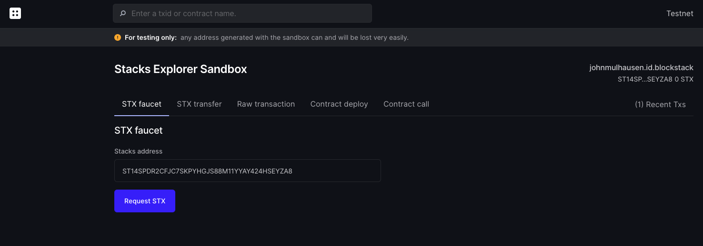

# Hello, World!

## Overview

| Experience | | **Beginner**  |
| Duration | | **18 minutes** |

Clarity, Blockstack's smart contracting language, is based on LISP and uses a its parenthesized notation. Clarity is an [interpreted language](https://en.wikipedia.org/wiki/Interpreted_language), and [decidable](https://en.wikipedia.org/wiki/Recursive_language). In this tutorial, you will learn how to use Clarity and how to deploy and interact with a smart contract on the Stacks 2.0 blockchain. By the end of this tutorial, you will:

* Have a working Clarity starter project and local dev environment
* Understand basic Clarity language design principles
* Called public methods of the deployed smart contract
* Understand how to use the Explorer Sandbox functionality

## Prerequisites

### Node environment

To complete the tutorial, you should have [NodeJS](https://nodejs.org/en/download/) installed on your workstation. To install and run the starter project, you need to have at least version `8.12.0`. You can verify your installation by opening up your terminal and run the following command:

```shell
node --version
```

### Visual Studio Code with Clarity Extensions

[Visual Studio Code](https://code.visualstudio.com/) (aka VS Code) is a free development interface for which Blockstack has created custom extensions, to make it easier to create smart contracts with Clarity.

[Install Visual Studio Code](https://code.visualstudio.com/download) and be sure to install the following extensions for the best coding experience:

- [Clarity](https://marketplace.visualstudio.com/items?itemName=blockstack.clarity), the official language extension by Blockstack that defines the Clarity language for VS COde and provides auto-complete and syntax highlighting.
- [clarity-lsp](https://marketplace.visualstudio.com/items?itemName=lgalabru.clarity-lsp), which adds inline help functionality for Clarity to VS Code
- [Rainbow Brackets](https://marketplace.visualstudio.com/items?itemName=2gua.rainbow-brackets), which adds helpful colorization of matching pairs of parentheses while you code

> **Note**: If you need help installing extensions, review [Extension Marketplace](https://code.visualstudio.com/docs/editor/extension-gallery) in the Visual Studio Code docs.

## Step 1: Download a starter project

Using your terminal, run the following command to create a new folder and initialize a new project:

```bash
mkdir hello-world; cd hello-world
npm init clarity-starter
```

After the starter project is loaded up, you have to select a template for your local project folder. Select `hello-world`, which is the default, by hitting ENTER.

```bash
? Template - one of [hello-world, counter]: (hello-world)
```

After the project is created and its dependencies are installed, your project is ready for development.

## Step 2: Review the contract

Select **File** > **Add Folder to Workspace** in VS Code, and add the `clarity-hello-world` folder. Then, navigate to `contracts/hello-world.clar`.

Notice how the program and each statement is enclosed in `()` (parentheses). You'll see that the smart contract consists of two public functions.

```cl
(define-public (say-hi)
  (ok "hello world"))

(define-read-only (echo-number (val int))
  (ok val))
```

On the first line, a new public function `say-hi` is declared. The reason public functions exist is to enable re-using code that is already available in other smart contracts, and to enable developers to break complex smart contracts into smaller, simpler smart contracts (an exercise in [separating concerns](https://en.wikipedia.org/wiki/Separation_of_concerns)).



The function doesn't take any parameters and simply returns "hello world" using the [`ok`](https://docs.blockstack.org/core/smart/clarityref#ok) response constructor.

Let's review the second public function, `echo-number`. As opposed to the function before, this takes an input parameter of the type [`int`](https://docs.blockstack.org/core/smart/clarityref#int-type). Along with integer, Clarity supports the following types:
* [uint](https://docs.blockstack.org/core/smart/clarityref#uint-type): 16-byte unsigned integer
* [principal](https://docs.blockstack.org/core/smart/clarityref#principal-type): spending entity, roughly equivalent to a Stacks address
* [boolean](https://docs.blockstack.org/core/smart/clarityref#bool-type): `true` or `false`
* [buffer](https://docs.blockstack.org/core/smart/clarityref#buffer-type): fixed-length byte buffers
* [tuple](https://docs.blockstack.org/core/smart/clarityref#tuple-type): named fields in keys and values

The function simply uses the `ok` response and returns the value passed to the function.

## Access the Explorer Sandbox

{% include note.html content="This tutorial uses a developer preview release of the <a href='https://testnet-explorer.blockstack.org/'>Stacks 2.0 Explorer</a>. Please feel free to report issues or request enhancements on the <a href='https://github.com/blockstack/explorer/issues/new'>blockstack/explorer</a> repository. For more details about this release, see the <a href='https://forum.blockstack.org/t/explore-the-stacks-2-0-testnet-with-the-new-explorer-developer-preview/10889'>Explore the Stacks 2.0 Testnet</a> post in the Blockstack forums." %}

Open up the [Stacks 2.0 Explorer Sandbox view](https://testnet-explorer.blockstack.org/sandbox). The Explorer Sandbox is a web-enabled view of the Testnet blockchain, and has tools for validating contracts, testing out transactions, and generating Testnet STX tokens. Here, we will run the code from `hello-world` right in the browser and create blockchain transactions right in the browser.

You will be asked to sign in with or sign up for a Blockstack ID, which creates a new STX address for you on the Testnet blockchain. Follow the steps on the screen to complete the process.



Once completed, you will see the Sandbox screen and a confirmation, indicating you were provided with a new STX address for testing purposes.

## Obtain STX tokens

Uploading and calling smart contracts requires fees to be paid to the network to process the transactions. The Testnet Explorer features the capability to request STX tokens that can be used to pay the fees ("STX faucet").

Still on the first screen of the Sandbox, you will notice that you are looking at the ["STX faucet"](https://testnet-explorer.blockstack.org/sandbox?tab=faucet) tab. Your new STX address should already be prefilled. Hit "Submit" to request 0.5 STX to be transferred to your account.

A confirmation for a new transaction will pop up. Click on "View transaction" to review the pending faucet transaction. You might have to refresh the page a few times. In the next seconds, your transaction should be confirmed and you will see a token transfer success screen.


## Deploy the contract

Go back to the Sandbox screen and switch to the ["Contract deploy"](https://testnet-explorer.blockstack.org/sandbox?tab=contract-deploy) tab, and do the following:

1. Enter a slug-like name for the contract under **Contract name** that uses lower-case letters, dashes, and numbers only.
2. Replace code in the text area under **Contract source code** with the contents of `contracts/hello-world.clar`.
3. Click **Deploy contract**.


A confirmation will pop up, indicating that a new contract deploy transaction was issued. Click on "View transaction" to review the pending transaction, and refresh the page a few times. In the next seconds, your contract deployment should be confirmed and you will see a contract creation success screen.

As you can see on the screen, every smart contract's source code is publicly verifiable through the explorer.

## Call the public method

Switch to the ["Contract call"](https://testnet-explorer.blockstack.org/sandbox?tab=contract-call) tab. In the form, enter the following details:

* **Contract address**: Your generated STX address. Hover over the identity component on the right side of the screen to see your full address.
* **Contract name**: Whatever you entered as your contract name in the previous step. If you forgot, you can review your recent transactions by following the link on the upper-right.


Verify your input and hit "Fetch" to look up available methods. You should see the 2 public methods implemented in the smart contract.

Locate the `(echo-number)` method, provide any integer for the `val` argument, set the post condition mode to "Allow" and hit **Submit**. A result confirmation will be displayed, indicating that a new contract call transaction was issued. Click on the transaction to review it. In the next seconds, your contract call should be completed and you will see a contract call success screen. Scroll down to the function summary section to verify your contract call:


**Congratulations! You just deployed your smart contract and called a public function on the Testnet.**

## Get familiar with CLI (optional)

The steps above represent an easy way to get started with contract deployment and contract calls. If you want to stay in the terminal and get access to more advanced capabilities, you should use the Blockstack CLI.

The following set of commands will achieve the same goals as steps 1-4.

```shell
# Install early release of the new Blockstack CLI for Stacks 2.0
sudo npm install -g "https://github.com/blockstack/cli-blockstack#feature/stacks-2.0-tx"

# Create a new STX address and save keychain details, add -t flag for Testnet
blockstack make_keychain -t > new_keychain.txt

# See STX address
cat new_keychain.txt

# Call faucet to get STX tokens, replace <stx_address>
curl -XPOST "https://sidecar.staging.blockstack.xyz/sidecar/v1/debug/faucet?address=<stx_address>" | json_pp

# Confirm faucet transaction, replace <stx_address>, add -t flag for Testnet
blockstack balance <stx_address> -t

# Deploy a contract file, replace <stx_private_key>, add -t flag for Testnet
blockstack deploy_contract ./hello-world.clar hello-world 2000 0 <stx_private_key> -t

# Call increment method of contract, replace <stx_address> and <stx_private_key>
blockstack call_contract_func <stx_address> hello-world echo-number 2000 1 <stx_private_key> -t
```

To learn more about the Blockstack CLI commands, you can run `blockstack-cli help all`.

---

With the completion of this tutorial, you now:

* Have a working Clarity starter project and local dev environment
* Understand basic Clarity language design principles
* Have called public methods of the deployed smart contract
* Understand how to use the Explorer Sandbox functionality

Congratulations!

## Where to go next

{:.no_toc}


* <a href="tutorial-counter.html">Next tutorial: Writing a counter smart contract</a>
* <a href="tutorial-test.html">Tutorial: Testing contracts with JavaScript and Mocha</a>
