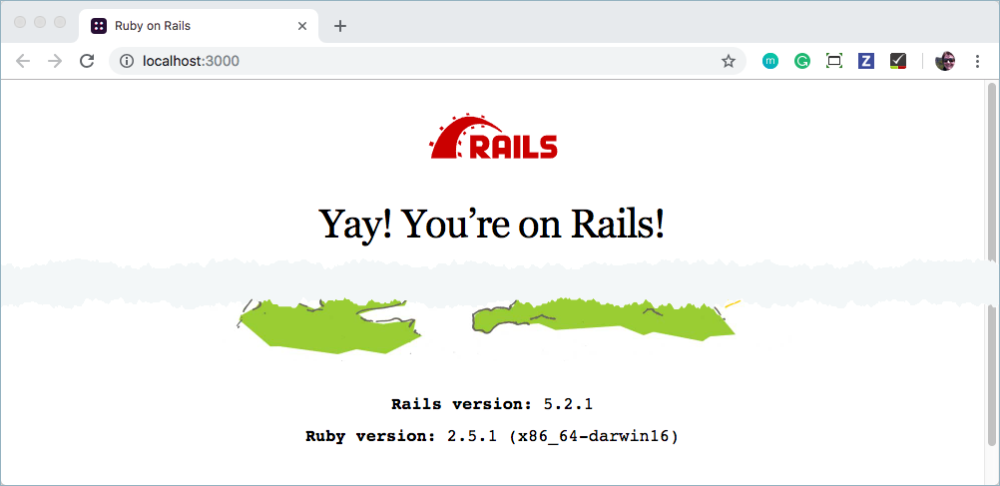
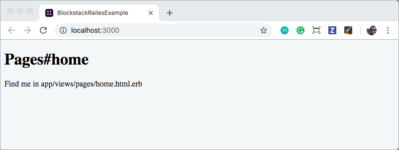

# Add Blockstack Auth to a website
{:.no_toc}

This tutorial walks you through adding Blockstack authentication to a web app.
The site you build is a simple Rails site. You don't require any specialized
Ruby or Rails knowledge to build this site. However, if you are a knowledgeable
Rails programmer, you should be able to complete or extend this tutorial easily.

* TOC
{:toc}



## Set up your environment

This tutorial requires Ruby 2.0 or higher. To confirm you have Ruby installed and
that the version, enter the following:

```
$ ruby -v
ruby 2.5.1p57 (2018-03-29 revision 63029) [x86_64-darwin16]
```

If you do not have Ruby installed, you should <a
href="https://www.ruby-lang.org/en/documentation/installation/"
target="\blank">install it</a>. If you want to run multiple, different versions
of Ruby on your workstation, you can use <code><a href="https://rvm.io"
target="\blank">rvm</a></code>.

After successfully installing Ruby, install the `rails` gem. This tutorial was
written using `rails` version 5.2.1. You can use the `gem list` command to see
if the `gem` is already installed. To install the `rails` gem, do the following:

```
$ gem install rails
```


## Create a Rails website

1. Create a new Rails project by using the `rails new` command:

    ```
    $ rails new blockstack-rails-example
    ```

    The command generates a project directory.

2. Change directory to the `blockstack-rails-example` project directory.

    ```bash
    $ cd blockstack-rails-example
    ```

3.  Start your project with the `rails` server.

    ```bash
    $ rails s
    ````

    The `s` flag is the alias for server.

4. Load the `http://localhost:3000` address in your browser.

   You chould see default homepage that says `Yay! You're on Rails!`.

   


5. Go ahead and stop the server by entering `CTRL-C` on the command line.

## Add a homepage

In this section, you add a homepage to your new website. To do this, you create
a new controller, called `PagesController`, that includes the homepage. To set
this up and test this, do the following:

1. Use `rails` to generate the home page.

    ```bash
    $ rails generate controller pages home
    ```

    This command instructs rails to create a `controller` names `pages`, that
    includes the method `home`. After running this, you'll have a few new files:

    - `/app/controllers/pages/pages_controller.rb` - this is the new controller you created, with a `home` method
    - `/app/views/pages/home.html.erb` - this is the template that rails will use to render the view for `home`.

    The command also modifies the pre-existing file `/config/routes.rb` and
    configures your server to use the `home` method for the route `/pages/home`.

2. Edit the `/config/routes.rb` file to match the following:

    ```ruby
    Rails.application.routes.draw do
      root to: 'pages#home'
      # For details on the DSL available within this file, see http://guides.rubyonrails.org/routing.html
    end
    ```

    This code calls the `root` method with the `to` option which instructs rails
    to use the `home` method in the `pages` controller as the homepage.

3. Save and close the `/config/routes.rb` file.

4. Start the rails server (`rails s`) and open the new [homepage](http://localhost:3000/), you should see your new homepage.

   

   You can find the source for the home page in the  `/app/views/pages/home.html.erb` file.

## Install OmniAuth and OmniAuth-blockstack gems

You'll use the <a href=https://github.com/OmniAuth/OmniAuth=“\_blank">OmniAuth</a> plugin to setup Blockstack authentication. OmniAuth is a popular framework for integrating third-party authentication with a ruby on rails website. Blockstack provides an OmniAuth plugin, <a href="https://github.com/blockstack/OmniAuth-blockstack" target="\_blank">OmniAuth-blockstack</a> to make this easy for you.

1. Stop the Rails server if it is running.

2. Edit the `Gemfile` in the root of your project and add two gems, one for OmniAuth and one for the Blockstack plugin.

    ```ruby
    gem 'omniauth'
    gem 'omniauth-blockstack'
    ```

3. Save and close the `Gemfile`.

4. Install the gems by running the  `bundle install` command.

   ```bash
   $ bundle install
   ```

   


## Add a OmniAuth callback for Blockstack


1. Create a new file at `config/initializers/omniauth.rb`.

   ```bash
   $ touch config/initializers/omniauth.rb
   ```

   You'll use this file to configure the OmniAuth gem and the Blockstack plugin.

2. Edit your new `config/initializers/omniauth.rb` file and add the following code:

   ```ruby
    Rails.application.config.middleware.use OmniAuth::Builder do
      provider :blockstack
    end
   ```

   This adds the OmniAuth middleware to your project, and tells OmniAuth
   to use the Blockstack provider. After a user signs in with OmniAuth, you need
   to specify a `callback` method for Blockstack to handle the rest of the sign in flow.

   The callback method is typically where you grab the authentication information from the
   third party, save some data, and sign the user in to your application by
   saving information in cookies.

3. Save and close the `config/initializers/omniauth.rb` file.

3. Edit the `/app/controllers/pages_controller.rb` file

    This file defines a `PagesController` class where you will add the
    `blockstack_callback` method. When you are done the file should look like
    the following:

    ```ruby
    class PagesController < ApplicationController
      def home
      end

      def blockstack_callback
        puts 'in the callback'
        blockstack_info = request.env['omniauth.auth']
        session[:blockstack_user] = blockstack_info
        redirect_to '/'
      end
    end
    ```

    The `puts` line is just a debug output to the console. The gets the user's
    Blockstack info from `env['omniauth.hash`], which is where OmniAuth stores
    all authentication info. Then, that info is loaded into the `session` object
    under the key `:blockstack_user`. By adding this info to the session, the
    info is saved to a cookie which is easy to reference later on.

4. Edit the `/app/views/pages/home.html.erb` file and direct the user to sign in with Blockstack.

    Modify the HTML to look like this:

    ```html
    <h1>Pages#home</h1>
    <p>Find me in app/views/pages/home.html.erb</p>
    <p><a href="/auth/blockstack">Log In with Blockstack</a></p>
    <code><%= debug session[:blockstack_user] %></code>
    ```

    The home page directs the user to sign in with Blockstack.    The `<%= debug
    session[:blockstack_user] %>` tag tells rails to output the variable
    `session[:blockstack_user]` in an easy-to-read format.

    This page creates a link to the route `/auth/blockstack`. By default, OmniAuth
    adds routes to your application in the form of `/auth/:provider`. When the
    user visits that page, they're redirected through the third party
    authentication flow.

5. Save and close the `/app/views/pages/home.html.erb` file.
6. Edit the `config/routes.rb` file and configure a route to handle the Blockstack callback.

    ```ruby
    Rails.application.routes.draw do
      root to: 'pages#home'
      get '/auth/blockstack/callback' => 'pages#blockstack_callback'
      # For details on the DSL available within this file, see http://guides.rubyonrails.org/routing.html
    end
    ```

    The `get` line tells the your server to invoke the `blockstack_callback`
    method when the user visits `/auth/blockstack/callback`. By default,
    OmniAuth redirects the user to `/auth/:provider/callback` whenever the users
    comes back from a third-party login.

7. Save and close the `config/routes.rb` file.


## Test the Blockstack authentication

1. Start the rails server.

    ```
    $ rails s
    ```

    You should see the following:

    

2. Click the **Log In with Blockstack** link.

    

    This connect takes you to the Blockstack

    

3. Log in with the Blockstack web application.

   For information on creating or logging in with a Blockstack identity, see the
   <a href="{{ site.baseurl }}/browser/ids-introduction.html"
   target="\_blank">use a Blockstack identity</a>.  After you finish signing in
   with your identity, you are redirected back to your homepage:

    

    At this point, the Blockstack information is stored in the `session`.

If you want to develop your application further, you would use a standard log
out to complete the session. Your code to log out would  call
`session[:blockstack_user] = nil` to destroy the Blockstack information.


## Conclusion
{:.no_toc}

Congratulations! You've successfully integrated Blockstack authentication into a
website. You can now build out a fully-fledged rails app with the ability to use
Blockstack for decentralized user authentication.

| Let folks know your work by tweeting: | <a href="https://twitter.com/share?ref_src=twsrc%5Etfw" class="twitter-share-button" data-size="large" data-text="I just built a sample decentralized application with Blockstack! " data-hashtags="blockstack, blockchain" data-show-count="false">Tweet your work!</a><script async src="https://platform.twitter.com/widgets.js" charset="utf-8"></script> |
