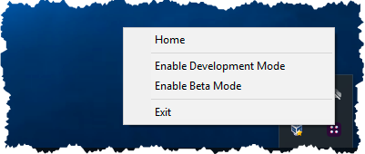

# Test Blockstack beta features

Blockstack is updated when our team releases new functionality. Significant issues may require patches as well and so result in new releases. A new release of Blockstack is first previewed through a beta before the official release. This allows developers on the Blockstack platform to test their applications with the new functionality before app users.

* TOC
{:toc}

## How to locate your version

If you are running the local version of Blockstack, you are also running the most current release of the blockstack.js library.  The actual values are available from <a href="https://github.com/blockstack/blockstack-browser/releases" target="_blank">blockstack/blockstack-browser</a> and <a href="https://github.com/blockstack/blockstack.js/releases" target="_blank">blockstack/blockstack.js</a>.

If you have installed the local Blockstack client on macOS, you can use the "hidden" menu on the client to check for version updates. If you have installed the Windows version, you cannot check for updates in this way. Instead, you must visit the installed application in your control center and find the version listed there.

## Using the beta version

The beta version of Blockstack uses the code from the Blockstack  `develop` branch. When using this code, you can test the latest versions but you may encounter issues. Please file any issues on the <a href="https://github.com/blockstack/blockstack-browser/issues" target="_blank">blockstack/blockstack-browser</a> repository.

To use the beta version of the web application, simply visit the <a href="https://beta.browser.blockstack.org" target="_blank">beta.blockstack.browser.org</a> app. If you are using a local client, you can use the hidden menu to turn beta mode on. To turn it off, simply return to using the regular menu.

Once beta mode is engaged, your local Blockstack redirects all activity to a hosted version of Blockstack at `beta.browser.blockstack.org`. You'll have to sign in with your Blockstack ID again to the beta code. You can resume usage of your local Blockstack client at any time by disabling the beta mode in the hidden menu.



## Display the hidden menu on the Blockstack client

Before you begin, make sure you have started the local Blockstack client. Once started, the client appears in your OS toolbar as a small, Blockstack icon.

To display the hidden menu, on macOS, you can do the following:

1. Hover over the Blockstack icon in your menu bar.
2. Press and hold down the **option** key while clicking the Blockstack icon.

   The system displays the hidden menu.

   

3. Check for updates.

To display the hidden menu on Windows:

1. Hover over the Blockstack icon in your desktop toolbar.
2. Press and hold down the **ALT** key while clicking the Blockstack icon.

   The system displays the hidden menu.

   

