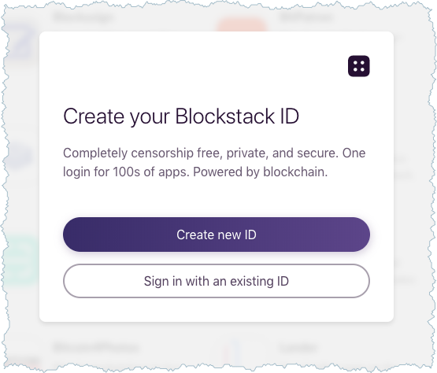
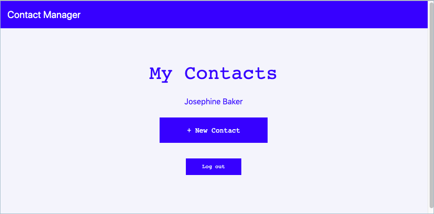

# Work with Collections (Preview)
{:.no_toc}

Collections is that feature designed to make data portable among Blockstack applications. Sharing is accomplished by storing a user's data in a standard, structured way in a known Gaia location. Collections associate the data with a user's distributed ID. When users move among apps, the same data is available to each application. 

On this page, you learn what collections are and how to use them. You'll learn about the `Contacts` collection in particular. The following topics are covered:

* TOC
{:toc}

{% include note.html content="This is a preview release of the <code>Contact</code> collections is a preview release. This release allows developers to try out the new collections functionality and we are interested in collecting feedback. Please feel free to report issues or request enhancements with collections or <code>Contacts</code> themselves on the <a href='https://github.com/blockstack/blockstack-collections/issues/new' target='_blank'>blockstack/blockstack-collections</a> repository.  If you encounter problems with <code>blockstack.js</code> you can <a href='https://github.com/blockstack/blockstack.js/issues/new' target='_blank'>file issues or request enhancements on its repo</a>." %}

## Understand how collections work

One of Blockstack's goals is to give users true data ownership by enabling *data portability*.  Data portability allows users to login with their digital ID on any app and have access to the same data. For example, if a user adds a photo of a Hawaiian vacation in one app, that photo enters the user's data pool. Then, when the user opens a second app, that same photo is already in use because the user's digital ID login is identical for both apps. 

How do collections work? Blockstack builds a library containing commonly used data schemes. Developers use these classes and objects instead of creating their own, unique data schemes. Using a class from the collections library guarantees class data is stored in Gaia in that format; And, when retrieved, guarantees the same format is returned. This pre-release provides the `Contact` collection. A contact schema produces this structure:

```
{
   "lastName": "jeffries",
   "firstName": "sally",
   "blockstackID": "",
   "email": "",
   "website": "",
   "telephone": "",
   "identifier": "sally jeffries"
}
```

A collection schema is neither validated or enforced. The goal is to incentivize collection use rather that enforce use. Developers have the ability to roll-back in case apps make undesirable changes that break compatibility with collections. To support this rollback in the pre-release, collections data store is conceptually an event log. Every data write an app makes is stored as a separate file. By placing data in files it ensures that data is never lost and developers can return files back to any previous state. 

<div class="uk-card uk-card-default uk-card-body">
<h5 class="uk-card-title">The Future of Collections Envisioned</h5>
<p>Blockstack believes that collections feature of the Blockstack platform can reduce the damage that faulty and malicious apps can cause to user’s data. For end=users, Blockstack seeks to enable:</p>
<ul class="uk-list uk-list-bullet uk-text-small">
  <li>True data portability across applications for each distributed ID</li>
  <li>Management of application access and permissions to collection data.</li>
</ul>
<p>For developers, collections can incentivize user adoption by reducing user friction.  Users can easily try new apps and move to them without the overhead or barrier of re-entering data. You are <a href="https://forum.blockstack.org/t/feedback-wanted-collections-design/7752" target="_blank">welcome to review and comment</a> on the current design document.</p>
</div>

## Try the Contact Manager demo app

Before adding collections to your DApp, you can try it for yourself using the Contact Manager demo application. Blockstack Contacts is a simple contacts manager that allows users to add and manage their contacts. The data stored by this app can be used in another app that receives the contacts collection permissions.

The tutorial relies on the `npm` dependency manager. Before you begin, verify
you have installed `npm` using the `which` command to verify.

```bash
$ which npm
/usr/local/bin/npm
```

If you have `npm` installed, do the following to run the Contact Manager demo app:

1. If you have a local Blockstack installed, <a href="{{"/browser/local_browser.html" | prepend:site.baseurl}}" >uninstall it</a>.

2. Download and install the <a href="https://github.com/blockstack/blockstack-browser/releases/tag/collections-alpha.1" target="_blank">Collections Alpha Build</a> of the Blockstack Browser client for your OS.

3. Launch the alpha build of the local Blockstack Browser client.

   

4. Go to the local Blockstack Browser and make sure you see this:

   

   Do not create an ID yet.

5. In your Internet browser, visit the <a href="https://github.com/yknl/blockstack-contacts" target="_blank">https://github.com/yknl/blockstack-contacts</a> repository.

6. Download or clone the repository code to you local workstation.

7. In your workstation terminal, change directory where you downloaded the demo code.

8. Install the dependencies using `npm`.

    ```bash
    npm install
    ```

9. Start the application running.

    ```bash
    npm run start
    ```

    The system starts the application and launches it in your browser at  127.0.0.1:3000

10. Choose **Sign In with Blockstack**.

    This system displays this pop-up

    

11. Use the local browser by choosing  **Open Blockstack.app**.

12. Choose **Create new ID** from the pop up.

    The onboarding should prompt you to store your data with the `https://develop-hub.blockstack.org` provider.

13. Choose **Yes, use the recommended provider** and complete the creation of your test ID.

    The system should return you to the Contact Manager demo application.

Try adding a contact using the Contact Manager. When you have successfully created a contact, the Contact Manager displays that contact on the list. Here you can see that Alfred Newman was entered as a contact.




## How to add the Contact collections to your DApp

In this section, you learn how to add `Contact` collection functionality to an existing application. Before beginning, make sure your application is using Blockstack auth and is storing data with Gaia. To start using the `Contact` collection in your Blockstack app, do the following:

1. Change to the root directory of your app project.  
2. Install the preview branch of the `blockstack.js`.

    ```
    npm install blockstack@20.0.0-alpha.3
    ```

3. Add the ``blockstack-collections` package to your app.

    ```
    npm install blockstack-collections@0.1.7
    ```

4. Edit your code to import the `Contact` collection type.

    ```
    import { Contact } from `blockstack-collections`
    ```

5. Customize your sign in request to include the contacts collection scope `Contact.scope`. 

    This scope grants your app permission to read and write to the user’s `Contacts` collection. 

    ```javascript
    import { UserSession, AppConfig, makeAuthRequest } from 'blockstack'
    import { Contact } from '`blockstack-collections'

    const scopes = ['store_write', 'publish_data', Contact.scope]
    const appConfig = new AppConfig(scopes)
    const userSession = new UserSession({appConfig: appConfig})

    const authRequest = makeAuthRequest(undefined, undefined, undefined, scopes, undefined, undefined, {
    solicitGaiaHubUrl: true,
    recommendedGaiaHubUrl: 'https://develop-hub.blockstack.org'
    })

    userSession.redirectToSignInWithAuthRequest(authRequest)
    ```

    

## Collection storage operations

Collection storage was designed around an ORM-like interface. This approach ensures that you’ll be working with typed objects instead of the `getFile`, `putFile` functions provided by blockstack.js.

### Example: Create and save a Contact object

```javascript
    const newContact = {
      lastName: 'Stackerson',
      firstName: 'Blocky',
      blockstackID: 'Blockstacker.id',
      email: 'blockstacker@blockstack.org',
      website: 'blockstack.org',
      telephone: '123123123'
    }
    
    var contact = new Contact(newContact)
    contact.save().then((contactID) => {
      // contact saved successfully   
    })
```


### Example: Read a Contact object

```javascript
    let contactID = 'Blocky Stackerson'
    Contact.get(contactID).then((contact) => {
      // Do something with the contact object
      console.log('Hello ${contact.firstName}')
    })
```


### Example: List Contact objects

```javascript
    let contacts = []
    Contact.list((contactID) => {
      // This callback is invoked for each contact identifier
      // To get the actual object you'll need to use Contact.get
      // Or you can add the IDs to an array for display
      contacts.push(contactID)
      // Return true to continue iterating, return false to stop
      return true
    })
```


### Example: Delete a Contact

```javascript
    var contact = new Contact(newContact)
    contact.delete().then(() => {
      // contact deleted successfully   
    })
```
{:.no_toc}

Collections make data portable among Blockstack applications by storing a user's data in structured way in a Gaia location. On this page you learn about collections:

* TOC
{:toc}


{% include note.html content="Collections is a preview release. The purpose of this release is to allow developers to try out new collections functionality. The Blockstack team is interested in feedback on this release. Please feel free to report issues or request enhancements with collections on the <a href='https://github.com/blockstack/blockstack-collections/issues/new' target='_blank'>blockstack/blockstack-collections</a> repository.  If you encounter problems with <code>blockstack.js</code> you can <a href='https://github.com/blockstack/blockstack.js/issues/new' target='_blank'>file issues or request enhancements on its repo</a>." %}


## Try the Contact Manager demo app

Before adding collections to your DApp, you can try it for yourself using the Contact Manager demo application. Blockstack Contacts is a simple contacts manager that allows users to add and manage their contacts. The data stored by this app can be used in another app that receives the contacts collection permissions.

The tutorial relies on the `npm` dependency manager. Before you begin, verify
you have installed `npm` using the `which` command to verify.

```bash
$ which npm
/usr/local/bin/npm
```

If you have `npm` installed, do the following to run the Contact Manager demo app:

1. If you have a local Blockstack installed, <a href="{{"/browser/local_browser.html" | prepend:site.baseurl}}" >uninstall it</a>.

2. Download and install the <a href="https://github.com/blockstack/blockstack-browser/releases/tag/collections-alpha.1" target="_blank">Collections Alpha Build</a> of the Blockstack Browser client for your OS.

3. Launch the alpha build of the local Blockstack Browser client.

   

4. Go to the local Blockstack Browser and make sure you see this:

   

   Do not create an ID yet.

5. In your Internet browser, visit the <a href="https://github.com/yknl/blockstack-contacts" target="_blank">https://github.com/yknl/blockstack-contacts</a> repository.

6. Download or clone the repository code to you local workstation.

7. In your workstation terminal, change directory where you downloaded the demo code.

8. Install the dependencies using `npm`.

    ```bash
    npm install
    ```

9. Start the application running.

    ```bash
    npm run start
    ```

    The system starts the application and launches it in your browser at  127.0.0.1:3000

10. Choose **Sign In with Blockstack**.

    This system displays this pop-up

    

11. Use the local browser by choosing  **Open Blockstack.app**.

12. Choose **Create new ID** from the pop up.

    The onboarding should prompt you to store your data with the `https://develop-hub.blockstack.org` provider.

13. Choose **Yes, use the recommended provider** and complete the creation of your test ID.

    The system should return you to the Contact Manager demo application.

Try adding a contact using the Contact Manager. When you have successfully created a contact, the Contact Manager displays that contact on the list. Here you can see that Alfred Newman was entered as a contact.


## How to add collections to your DApp

In this section, you learn how to add collection functionality to an existing application. Before beginning, make sure your application is using Blockstack auth and is storing data with Gaia. To start using collections in your Blockstack app, do the following:

1. Change to the root directory of your app project.  
2. Install the preview branch of the `blockstack.js`.

    ```
    npm install blockstack@20.0.0-alpha.3
    ```

3. Add the `blockstack-collection-schemas` package to your app.

    ```
    npm install blockstack-collections@0.1.7
    ```

4. Edit your code to import the `Contact` collection type.

    ```
    import { Contact } from `blockstack-collections`
    ```

5. Customize your sign in request to include the contacts collection scope `Contact.scope`. 

    This will grant your app permission to read and write to the user’s contacts collection. 

    ```javascript
    import { UserSession, AppConfig, makeAuthRequest } from 'blockstack'
    import { Contact } from 'blockstack-collection-schemas'

    const scopes = ['store_write', 'publish_data', Contact.scope]
    const appConfig = new AppConfig(scopes)
    const userSession = new UserSession({appConfig: appConfig})

    const authRequest = makeAuthRequest(undefined, undefined, undefined, scopes, undefined, undefined, {
    solicitGaiaHubUrl: true,
    recommendedGaiaHubUrl: 'https://develop-hub.blockstack.org'
    })

    userSession.redirectToSignInWithAuthRequest(authRequest)
    ```

    

## Collection storage operations

Collection storage has been designed around an ORM-like interface. What this means is that you’ll be working with typed objects instead of the `getFile`, `putFile` functions provided by blockstack.js.

### Creating and saving a collection object

```javascript
    const newContact = {
      lastName: 'Stackerson',
      firstName: 'Blocky',
      blockstackID: 'Blockstacker.id',
      email: 'blockstacker@blockstack.org',
      website: 'blockstack.org',
      telephone: '123123123'
    }
    
    var contact = new Contact(newContact)
    contact.save().then((contactID) => {
      // contact saved successfully   
    })
```


### Reading a collection object

```javascript
    let contactID = 'Blocky Stackerson'
    Contact.get(contactID).then((contact) => {
      // Do something with the contact object
      console.log('Hello ${contact.firstName}')
    })
```


### Listing collection objects

```javascript
    let contacts = []
    Contact.list((contactID) => {
      // This callback is invoked for each contact identifier
      // To get the actual object you'll need to use Contact.get
      // Or you can add the IDs to an array for display
      contacts.push(contactID)
      // Return true to continue iterating, return false to stop
      return true
    })
```


### Deleting collection objects

```javascript
    var contact = new Contact(newContact)
    contact.delete().then(() => {
      // contact deleted successfully   
    })
```