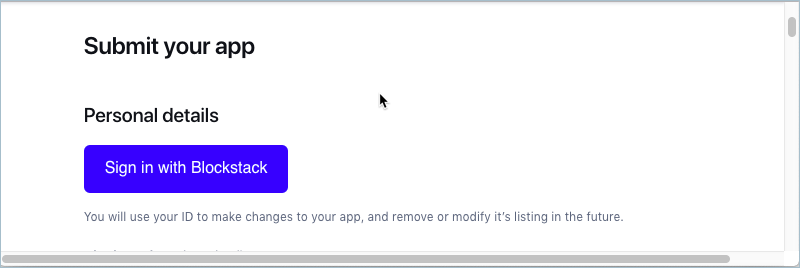
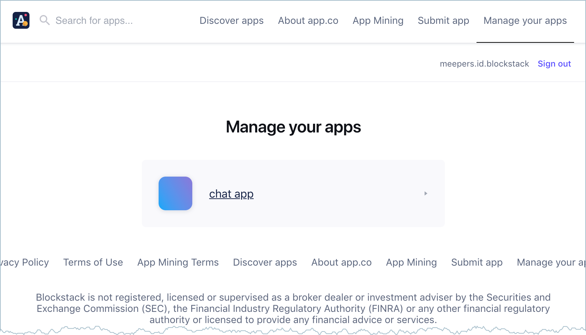
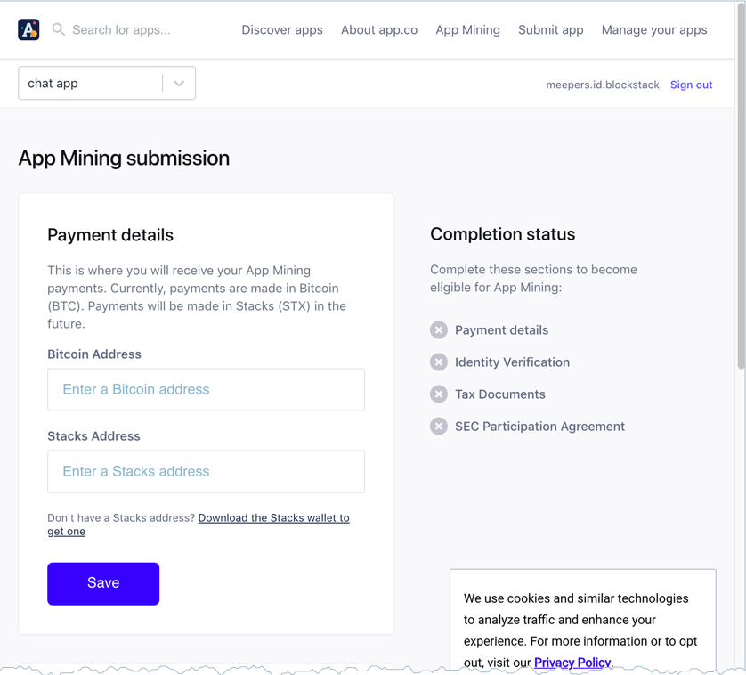

# How to enroll in App Mining

Application mining rewards developers for building decentralized applications
(DApps). You must enroll your application to be eligible for these
rewards. This section explains the enrollment process and covers the following topics:

* TOC
{:toc}

{% include warning.html content="You must complete enrollment including <b>submission of verification materials and BTC address</b> prior to the month in which you wish to be considered. If your submission is incomplete it will not be reviewed. Please note that the submission process can take time to complete. <strong>No late submissions will be accepted</strong>, but we'll be happy to include you in the following month's ranking. You should register early to allow for sufficient time for collection of all required materials." %}

## Complete the add and submission forms on App.co

Make sure you enroll in advance of the month you would first like your app to complete.  You need only enroll in App Mining once.  A single submission enrolls your app in the month you submit and every month following automatically. You can submit multiple applications.

To submit an application, do the following:

1. Create an application that integrates Blockstack Auth.

   Your application code can reside in a public or a private repository.

2. Choose <a href="https://app.co/submit" target="\_blank"><strong>Submit app</strong></a> from the App.co site.

3. Sign into the submission form with your Blockstack ID.

   

   You will use your Blockstack ID to access your submission in the future. If you have multiple IDs, make sure you keep track of which ID you use during your submission

4. Fill out all the form's required fields. 

   

   
   
   You must choose **Blockstack** from the **Authentication** category on the form; If you do not, you cannot participate in App Mining.

5. Check the box that says *App is publicly accessible and user-ready(required)*.
6. Agree to the terms and policies.

7. Press **Submit your app**.

   The system responds with the a completion dialog. 

   
   
   You will also receive an email from the App.co team acknowledging receipt of your submission.

8. Click **Participate in App Mining** to view a list of your submissions.

## Provide pay out and tax details

After you submit an app to the App.co site **you must supply the additional details** for your application to be complete. To do this, do the following:

1. Navigate to the App.co site.
2. Choose <a href="https://staging.app.co/maker/apps" target="\_blank"><strong>Manage your apps</strong></a>.
   
   Your device must be authenticated with the same Blockstack ID you used to submit the app. If you are not signed in, you are prompted to. After you are authenticated, the system lists the apps submitted under your id:

   

3. Select the app you want to manage.

   The system displays the **App Mining Submission** dialog. 
   
   
   
   This dialog guides you for providing the following materials.

    <table class="uk-table uk-table-small uk-table-divider">
      <tr>
        <th>Required</th>
        <th>Why?</th>
      </tr>
      <tr>
        <td><strong>Payment Details</strong></td>
        <td>Presently, App Mining payments are made in Bitcoin (BTC) but we anticipate paying in Stacks (STX) soon. For your Stacks payment to start accruing for future delivery, you must provide both BTC and STX addresses. Your app cannot participate in App Mining without Blockstack having both address types on file. To get a STX address, you need to install the <a href="{{site.baseurl}}/org/wallet-install.html" target="_blank">Stacks Wallet</a>. </td>
      </tr>
      <tr>
        <td><strong>Identity verification</strong></td>
        <td>We are ready to pay you Bitcoin and Stacks tokens for building a great Blockstack app, but we also need to comply with all applicable laws. This means we must confirm your identity before you can participate in App Mining. Identity verification is a process designed to confirm your identity and protect you from identity theft. You must submit an image of your ID document, which is checked to ensure it is legitimate and has not been altered or manipulated. Valid identity documents are a passport, an identity card, or a driver's license.
    </td>
    </tr>
    <tr>
        <td><strong>Legal Documents</strong></td>
        <td> 
The documents you provide depend on who is representing the app. Once you provide an email and select how you want to represent yourself, you see two sections:

        
<strong>Document Signing</strong>: You must sign our participation agreement to become eligible to participate in App Mining. Signing is a process, you provide an email and download some accompanying materials. Then, you complete the signing process via an online process.

        
<strong>Tax Documents</strong>: Person's or entities (businesses or organizations and so forth) must provide tax documents to participate. US persons or entity supply a <a href="[LINK](https://www.irs.gov/pub/irs-pdf/fw9.pdf)" target="_blank">IRS Form W-9</a>. Persons outside of the US supply a <a href="https://www.irs.gov/pub/irs-pdf/iw8.pdf" target="_blank">IRS Form W-8</a> while entities supply a <a href="https://www.irs.gov/pub/irs-pdf/fw8bene.pdf" target="_blank">IRS Form W-8BEN-E</a>. You upload your completed forms via Dropbox, a DropBox account is <em>not</em> required to upload.

      </td>
      </tr>
    </table>

    After you submit your materials, Blockstack verifies your information and your DApp appears in the list of registered apps.

## How to check the status of your submission

From the App.co, choose <a href="https://staging.app.co/maker/apps" target="\_blank"><strong>Manage your apps</strong></a>. Make sure you are authenticated on the device using the identity you used to create your application.
