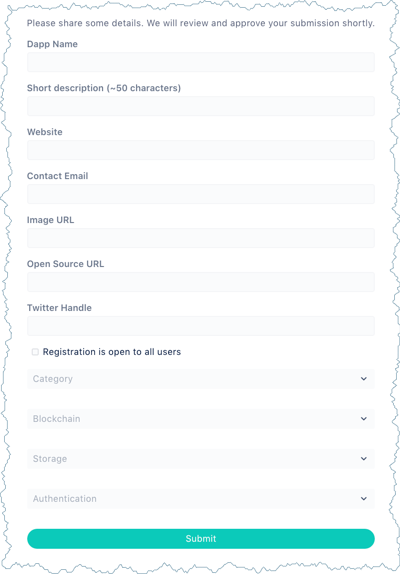
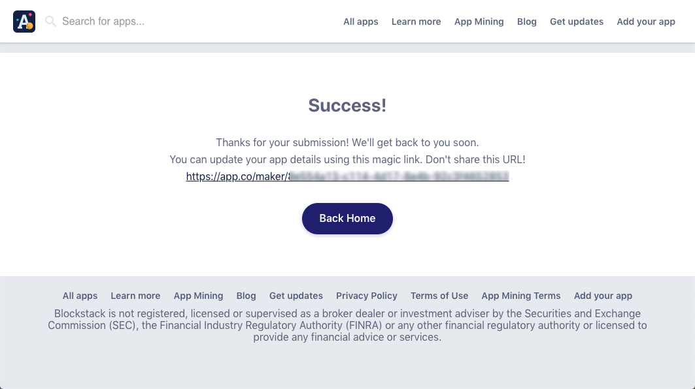

# How to enroll in App Mining

Application mining pays developers for building decentralized applications
(DApps). Enrolling in App Mining also makes your application eligible for
rewards.

* TOC
{:toc}

{% include warning.html content="You must complete enrollment including <b>submission of verification materials and BTC address</b> prior to the month in which you wish to be considered. If your submission is incomplete it will not be reviewed. Please note that the submission process can take time to complete. <strong>No late submissions will be accepted</strong>, but we'll be happy to include you in the following month's ranking. You should register early to allow for sufficient time for collection of all required materials." %}

## Complete the add and submission forms on App.co

Make sure you enroll at least one business week in advance of the month you
would first like your app to complete.  You need only enroll in App Mining once.  A single
submission enrolls your app in the month you submit and every month following
automatically.

To apply, do the following:

1. Integrate Blockstack Auth into your app.

   Your application code can reside in a public or a private repository.

2. Complete the  <a href="https://app.co/submit" target="\_blank">App.co</a> form.

   You should fill out all the required fields. 

   

   
   
   Make sure you choose **Blockstack** from the **Authentication** list on the form.

3. Press **Submit App**.

   The system responds with the a completion dialog and an application link. 

   
   
   You will also receive an email from the App.co team acknowledging receipt of your submission.

4. Copy and store the application link.

## Provide pay out and tax details

After you submit an app to the App.co site **you must supply the additional details** for your application to be complete. When you successfully submitted your application, you received a link to your submission on App.co. This link gives you the ability to submit your  application details such as your tax and payment addresses. 

This dialog requires that you provide the following materials.

<table class="uk-table uk-table-small uk-table-divider">
  <tr>
    <th>Required</th>
    <th>Why?</th>
  </tr>
  <tr>
    <td><strong>Payment Details</strong></td>
    <td>Presently, App Mining payments are made in Bitcoin (BTC) but we anticipate paying in Stacks (STX) soon. For your Stacks payment to start accruing for future delivery, you must provide both BTC and STX addresses. Your app cannot participate in App Mining without Blockstack having both address types on file. To get a STX address, you need to install the <a href="{{site.baseurl}}/org/wallet-install.html" target="_blank">Stacks Wallet</a>. </td>
  </tr>
  <tr>
    <td><strong>Identity verification</strong></td>
    <td>We are ready to pay you Bitcoin and Stacks tokens for building a great Blockstack app, but we also need to comply with all applicable laws. This means we must confirm your identity before you can participate in App Mining. Identity verification is a process designed to confirm your identity and protect you from identity theft. You must submit an image of your ID document, which is checked to ensure it is legitimate and has not been altered or manipulated. Valid identity documents are a passport, an identity card, or a driver's license.
</td>
  </tr>
    <tr>
    <td><strong>Document Signing</strong></td>
    <td>You must sign our participation agreement to become eligible to participate in App Mining. Signing is a process, you provide an email and download some accompanying materials. Then, you complete the signing process via an online process.</td>
  </tr>
  <tr>
    <td><strong>Tax Documents</strong></td>
    <td>Person's or entities (businesses or organizations and so forth) must provide tax documents to participate. US persons or entity supply a <a href="[LINK](https://www.irs.gov/pub/irs-pdf/fw9.pdf)" target="_blank">IRS Form W-9</a>. Persons outside of the US supply a <a href="https://www.irs.gov/pub/irs-pdf/iw8.pdf" target="_blank">IRS Form W-8</a> while entities supply a <a href="https://www.irs.gov/pub/irs-pdf/fw8bene.pdf" target="_blank">IRS Form W-8BEN-E</a>. You upload your completed forms via Dropbox, a DropBox account is <em>not</em> required to upload.
    </td>
  </tr>
</table>

After you submit your materials, Blockstack verifies your information and your DApp appears in
the list of registered apps.

## How to check the status of your submission

You can use your application details link to check on your submission status:

 