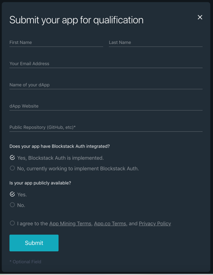

# How to enroll

Application mining pays developers for building decentralized applications
(DApps). Enrolling in app mining also makes your application eligible for
rewards.

* TOC
{:toc}



## Complete the add and submission forms on App.co

Make sure you enroll at least one business week in advance of the month you
would first like your app to complete.  You need only enroll in App Mining once.  A single
submission enrolls your app in the month you submit and every month following
automatically.

To apply, do the following:

1. Integrate Blockstack Auth into your app.

   Your application code can reside in a public or a private repository.

2. Add your app to <a href="https://app.co/submit" target="\_blank">App.co</a>.

   Make sure you choose **Blockstack** from the **Authentication** list on the form.

   

3. Complete the <a href="https://app.co/mining" target="\_blank">submission form for App Mining</a>.

    

## Provide pay out and tax materials

After you complete the submission form on the App.co site **you must supply the following additional
materials** for your application to be complete.

<table class="uk-table uk-table-small uk-table-divider">
  <tr>
    <th>Required</th>
    <th>Why?</th>
    <th>How to provide</th>
  </tr>
  <tr>
    <td><strong>BTC address</strong></td>
    <td>The payout for app mining is currently Bitcoin.  If you win, this is the address we will send your payout to. The address you provide will be visible in any related transactions via the blockchain.</td>
    <td>Email to: <a href="mailto:mining@app.co" target="\_blank">mining@app.co</a></td>
  </tr>
  <tr>
    <td><strong>Tax form</strong></td>
    <td>Required for both US citizens and non-citizens. US Citizens should <a href="http://bit.ly/2QrRbSD" target="\_">fill out a W-9 form</a>.
    
Non-citizens should fill out <a href="http://bit.ly/2QPo9Mo" target="\_blank">the applicable W-8 form</a>. Please note, the version of the W-8 form you must fill out depends on your country's treaty status with the US. We cannot assist you in completing the form: you are responsible for completing it accurately.
</td>
    <td><a href="https://www.dropbox.com/request/sCpPzIILkhKFvfDjB620" target="\_blank">Secure dropbox link</a></td>
  </tr>
</table>

After you enroll and submit your materials, Blockstack verifies your information and your DApp appears in
the list of registered apps.
