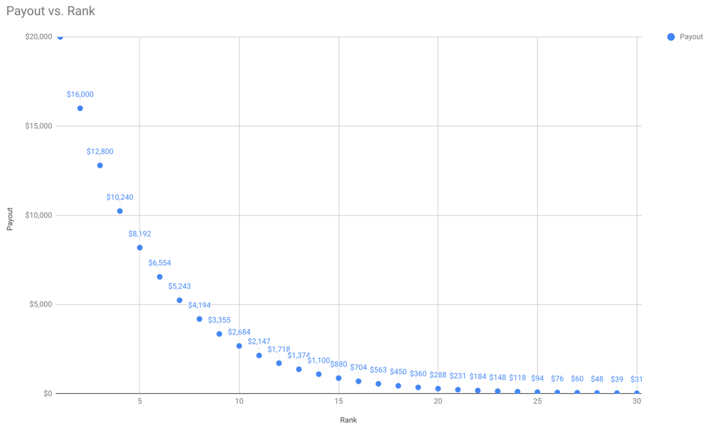

# Understand app mining

Traditionally the term ‘mining’ in cryptocurrency refers to the process of
contributing compute resources to the network and earning a reward. On the
Blockstack network, however, instead of just “mining” through computation,
developers can “mine” by contributing apps to the ecosystem and making
applications the community wants.

Founders that build apps using Blockstack developer tools like Blockstack Auth
get paid each month, in amounts proportional to that month’s app quality
ranking. Blockstack PBC, in cooperation with App.co, currently administers the
payouts. A set of independent “App Reviewers” determines the monthly ranking
during the pilot phase.

## How apps are reviewed

This section is an outline of the general algorithm and process that is used to
rank and reward apps. Blockstack worked with a team of Ph.D. game theorist
and economists from Princeton and NYU to put together a ranking algorithm which
is fair and resistant to abuse.

Blockstack has partnered with two different third-party reviewers, Product Hung
and Democracy.earth. These reviewers are independent, and generally rely on
their own proprietary data and insights to generate rankings.

### Product Hunt

Product Hunt is the place to find the best new products in tech. They have a
massive trove of user data (upvotes, comments, etc), that they use for ranking.
Product Hunt comes up with two different scores for each app — a “community”
score and a “team” score.

Their community score is determined only by the number of upvotes an app
received on Product Hunt, relative to other apps that are registered. For
example, if an app got more upvotes than any other app in a cohort, their
community score would be 100. If a different app got 60% as many upvotes, they’d
get a score of 60.

Their team score is determined by internal team members conducting reviews on
different aspects of an app. They judge based on a few criteria, like execution,
uniqueness, and desirability. Each app gets ranked 1-10 on each criterion, and
their final score is the average of each criterion. Finally, this average is
multiplied by 10, so the highest score you can get is 100.

Once each app has a community and team score, Blockstack converts these scores into
_z-scores_, more about z-scores below.

### Democracy Earth

Democracy Earth is a platform for borderless peer-to-peer democracy. They’ve
built a platform that anyone can use to gather votes in a trust-less,
decentralized way.

Democracy Earth has built a platform for Stacks token holders to vote on how
apps should be ranked. Each token holder gets a certain number of votes, and
they can distribute those votes however they want. It’s possible to give all of
your votes to a single app, and you can also “downvote” an app with one of your
votes.

After a voting period, each app has a certain amount of upvotes and downvotes.
First, Blockstack calculates the percentage of total votes that are upvotes. If
you got 90 upvotes and 10 downvotes, you’d get a “likability score” of 90.
Secondly, Blockstack calculates a “traction score”, which ranks how many total
votes (including downvotes) an app received, relative to other apps.

## Reaching the final scores

Once the reviewer-partners generate reviews, we have 4 raw scores for each app, each between 0 and 100:

* Product Hunt community score
* Product Hunt team score
* Democracy Earth likability score
* Democracy Earth traction score

First Blockstack's determine a ‘z-score’ for each ranking category community,
team, likability, and traction. This is a statistical technique to account for
different distributions of scores within categories. Second, Blockstack computes
the average and standard deviation of each category. Finally, for each app’s
score in that category, Blockstack determines how many standard deviations it is
away from the average score in that category.

For example, let’s say a category has an average score of 60, with a standard
deviation of 15. A score of 90 would get a z-score of 2, because it’s 2 standard
deviations higher than the average.

Once each app has a calculated a z-score in every category, the average of those
4 z-scores results in a final number. A higher number is better than a lower
one, and so apps are ranked from highest to lowest.

## Determining how much an app is paid

For each app mining cohort, there is determined a “pot” of total earnings that will
get paid to apps. For the Alpha run, Blockstack paid a total of $25,000 USD. Starting in
December, Blockstack will pay $100,000 USD and the awards will be paid out in Bitcoin.

The top app gets paid 20% of the total pot. So, for a pot of $100k, the top app
receives $20,000 USD. The next app gets paid 20% of the remaining pot. The
remaining pot is $80k, and 20% of that is $16,000. This process continues until
every app has been paid.

Here is a chart that visualizes the decay in rewards, depending on rank:

This first release of App Mining is uses our first version of our ranking and
payout mechanism. Blockstack has taken care to be thoughtful and fair, but things may
change as we learn more and get feedback from the community. Please let us know
what you think by commenting below or emailing us at <hello@app.co>!
