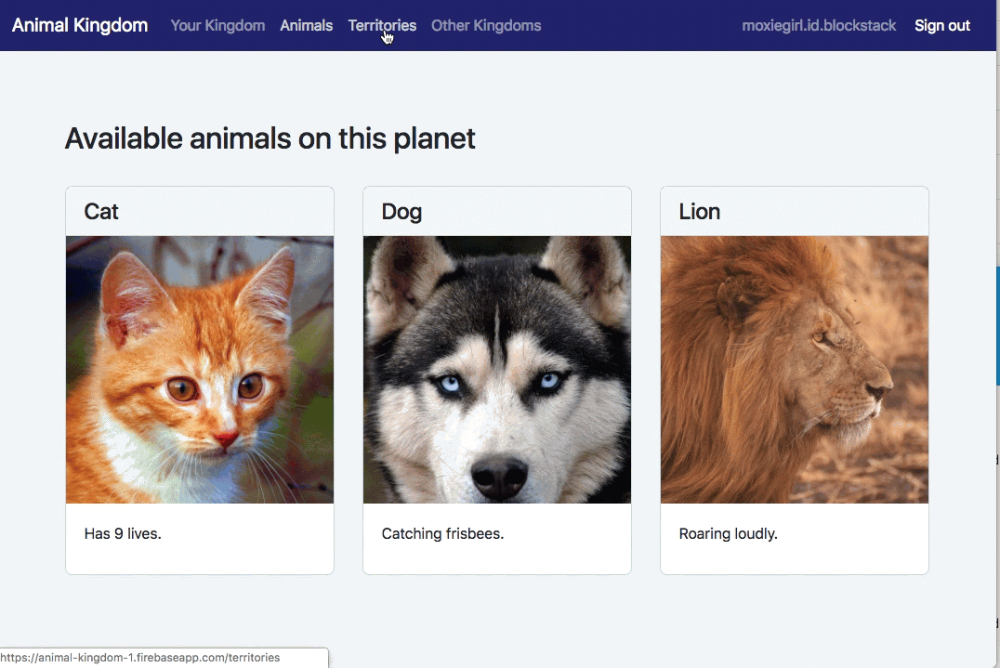

# 1 About DApps and App Mining
{:.no_toc}

**Zero-to-DApp 1 of 4**

Welcome to the Blockstack Zero-to-DApp tutorial. In this tutorial, you build,
run, modify, and deploy a decentralized application (DApp) called Animal
Kingdom. This application makes use of blockchain technology through the use of
the Blockstack platform. As you follow along, you'll learn what makes a DApp
different than traditional applications. You'll also learn about the Blockstack
Signature Fund and its Application Mining designed to fund DApp development.

The tutorial has four parts of which this is first. This part contains the
following topics:

* TOC
{:toc}

### Skills you need to follow this tutorial
{:.no_toc}

This tutorial is written for developers and others who want to learn about DApps
and how the Blockstack ecosystem supports their development. As a result, the
target audience is intentionally broad. Anyone with access to a Windows, Mac, or
Linux computer and some familiarity with a command line should be able to follow
along.

If you are good at following directions, chances are you can complete this
tutorial even if you have no programming experience. Knowledgeable developers
should easily be able to complete the tutorial within an hour by following
along.

If you are a developer superhero, you may want to skim or move
quickly through the pages and that's fine too.



## How traditional and decentralized applications differ

A decentralized application (DApp) uses blockchain technology for the
authentication and data storage components of an application’s platform.
Blockchain applications are decentralized applications, meaning they move data
control and identity management from central authorities and organizations to
individual users.  

Anyone who has had their identity stolen or lost money because of a data breach,
understands that centralized applications come with personal risk. Anyone who
has lived in or visited a foreign country and lost access to a site, to a
service, or to information because of government censorship also understands how
centralization impacts how people live.

Users and businesses see DApps as valuable because they solve the
centralization problems of traditional applications. The following table
describes the features of traditional applications and the features of
blockchain applications:

<table class="uk-table uk-table-small uk-table-divider">
  <tr>
    <th>Traditional application</th>
    <th>Decentralized application</th>
  </tr>
  <tr>
    <td>Users must create many username and password combinations for each service or application. Each combination must be managed and maintained. Also, each creation requires the user to provide important or unique information into the care of a third-party.</td>
    <td>Users create and own one or more identities. They use their identities with all applications and services. For example, a user could use the same identity for buying books online as they use for social media.</td>
  </tr>
  <tr>
    <td>Multiple third-party applications and services store personal data from individual users in backend servers. These backend servers are under the control of the application or service. Users leaving the application leave their data behind.</td>
    <td>Personal information and data is encrypted and remains under the control of the user. Users leaving an application leave no data behind because none was stored with the application.</td>
  </tr>
  <tr>
    <td>Multiple accounts across many servers make personal data subject to attack, misuse, and uncontrolled collection.</td>
    <td>Users can audit access to their data and know who accessed their data and which data were accessed.</td>
  </tr>
  <tr>
    <td>Central authorities and middlemen control network access enabling them to censor applications and/or users that use them.</td>
    <td>Companies are developing blockchains that run over peer-to-peer networks. These future networks can make shutting down or entirely blocking a decentralized application close to impossible.</td>
  </tr>
</table>

The blockchain technology you build a DApp with determines the features available to your application.

## Try your first DApp by creating an identity

The Blockstack Web browser is a DApp for the web. Users can use it to create and
manage identities in the Blockstack Ecosystem.  DApps built with the Blockstack
platform, use the on-boarding sequence provided by the browser to onboard their
users.  Currently, users can create a Blockstack ID for free or buy their own
ID.

If you haven't already created your own Blockstack ID, do this now. As you
create an ID, consider what interactions are familiar to you from traditional
applications, and which are not.



If you already have a Blockstack ID, launch the browser and try resetting it. Or
trying logging on from a device or browser software you haven't used before.

## Seeding DApp market with application mining

Blockchain applications are a new paradigm for both application developers and
application users. New paradigms in any market, think solar power or electric
vehicles, need private and private coalitions to grow. The centralized hosting
and services known as cloud computing were once new paradigms. It was the
investment of billions in funds and incentives from governments and private
companies that grew the cloud computing market.  



<h5>App Mining Eligibility Requirements</h5>

DApps that are eligible for application mining must:

<ul>
<li>Implement Blockstack authentication</li>
<li>Invite registration and use by the general public</li>
</ul>

Storing data in a Gaia storage hub is optional. Potentially in the future it may be required.

As you work through this Zero-to-DApp tutorial, you’ll build and deploy a sample
application that meets these requirements. While the application you build won't
be eligible for application mining, completing the tutorial makes you
eligible for a free, limited edition t-shirt:

You'll learn how to get your t-shirt in part 4 of this tutorial.

## Overview of the  DApp you will build

You are going to build a DApp called AnimalKingdom. Animal Kingdom is a DApp for
the web. Users log into it and create an animal persona that rules over a
specific territory. The combination of persona and territory is a kingdom. Once
you create a kingdom, you can add subjects from other kingdoms.

The Animal Kingdom interacts with two Blockstack services, the Blockstack
Browser (https://browser.blockstack.org) and the Gaia data storage hub
(https://hub.blockstack.org/). The Blockstack Browser is itself
a DApp. The storage hub is purely a service without user-facing functionality.

The following table describes the key interactions and screens in the DApp.

<table class="uk-table uk-table-striped">
  <tr>
    <th>Click to enlarge</th>
    <th> Description</th>
  </tr>
  <tr>
    <td>

         
    

    </td>
    <td>
Users log in (authenticate) with a Blockstack identity. By authenticating, the user gives the application the ability to get and put data in the user's Gaia storage hub.
</td>
  </tr>
  <tr>
    <td>

          
     

     </td>
    <td>
The Blockstack login dialogs are part of the Blockstack Browser which is itself
    a DApp. Once a user authenticates, the DApp code automatically
    returns them to the Kingdom they were attempting to enter.
</td>
  </tr>
  <tr>
  <td>

    
    
</td>
  <td>
First-time visitors to a kingdom are prompted to create an animal persona and
  a territory to rule. Once they make a selection, users click <strong>Done</strong> to create a
  kingdom to rule. Behind the scenes, the data about the user's selection is stored in the user's Gaia hub.

  </td>
</tr>
<tr>
  <td> 

     
   
</td>
  <td>
Each kingdom has animals and territories. Users can edit their original persona/animal combination. You'll learn how to modify the Animal Kingdom code to add new animals and territories.
</td>
</tr>
<tr>
  <td>

  
  
</td>
  <td>
  
Users can add subjects from territories in their own Animal Kingdom. The DApp updates the user's GAI hub each time the user adds a subject. Users can also visit other Animal Kingdom installations and add subjects from these as well. You'll learn how to modify the <b>Other Kingdoms</b> available in your installation.
  

  </td>
</tr>
</table>

You can try a completed version of this application for yourself by using your
Blockstack identity to log into the <a href="https://animalkingdoms.netlify.com/" target="\_blank">Blockstack Animal Kingdom</a>.

## Where to go next
{:.no_toc}

This section introduced you to the benefits of a decentralized application
(DApp). You also learned that, similar to other new paradigms, both
the public and private companies are committing serious resources to developing
blockchain tech. Finally, you learned Blockstack is designed so that you
can quickly build a DApp and enter this emerging market.

In the next section, you learn more about developing DApps and how they are
different from traditional applications. You’ll also learn about the resources
Blockstack provides for DApp developers that help you clarify where to put your
efforts and how to fund them.

Continue to [2 of 4, Zero-to-DApp](zero_to_dapp_2.html).
