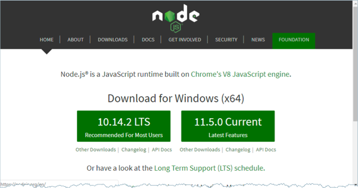
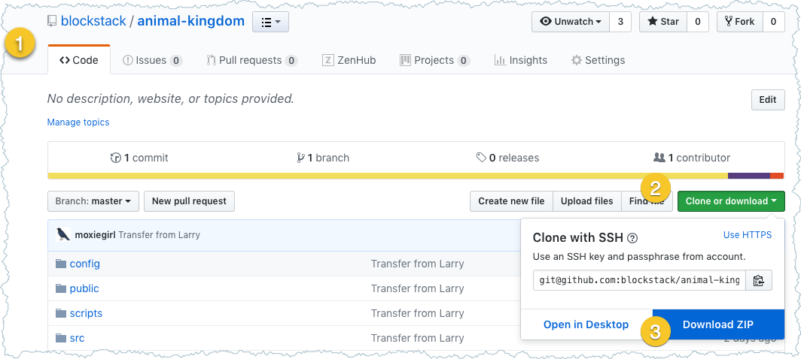
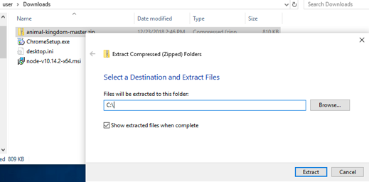

# 2 Learn about the Blockstack platform (Windows)
{:.no_toc}

**Zero-to-DApp  2 of 4 for Windows (or [MacOS/Linux](zero_to_dapp_2.html))**

In this part, you learn how the Blockstack platform lowers the barriers to
building with blockchain technology. You'll set up all the prerequisites you
need to build a typical web DApp. Finally, you'll build and run your own version
of the Animal Kingdom DApp introduced in [part 1](zero_to_dapp_1.html). This
part has the following topics:

* TOC
{:toc}


## A blockchain platform without pain

Blockstack’s mission is to bring about a new internet where users control the
access to their data and how it is used. With this mission in mind, Blockstack
Public Benefit Corp. (PBC) started development of the Blockstack platform in 2017.  

The platform’s development philosophy followed two simple principles. First,
create backend services that allow decentralized applications to be both
performant and scalable.  Second, provide simple, familiar development
interfaces to blockchain technology. The result of this philosophy is a
technology platform that allows you to:

* **Build your application in any Javascript framework.**  You can use the blockchain without learning a new programming language or extending your application stack. Currently, Blockstack supports a react generator for web applications and SDKs for both iOS and Android.
* **Use well-defined REST endpoints that simplify and encapsulate the blockchain backend.** The Blockstack Javascript API reduces blockchain operations to familiar GET and PUT operations.
* **Access the Blockstack’s Naming System (BNS).**  The system has over 90K users that can immediately start using your application.
* **Scale quickly to large, performant production systems.**  Blockstack’s Gaia storage system gives fast, scalable performance on a level comparable to Amazon S3, Google Drive, or Azure.

Using Blockstack’s technology you can start building immediately on the
blockchain with the knowledge you have today.  You won’t need to spend time or
effort developing additional knowledge of specialized languages or technologies.

## Get prerequisites and set up your environment

To follow the procedures in the rest of this tutorial, you need the following:

* A Blockstack ID (identity) to test your Animal Kingdom.
* Access to the Windows Powershell window and some familiarity with the command line it provides.
* The Node Package Manager package manager.
* Python and similar additional tools.

Follow the procedures in this section to install these components.

<div class="uk-card uk-card-default uk-card-body">
<h5>Windows versions and browser clients tested against this setup</h5>
<p>This setup procedure was tested on Windows 7 and Windows 10 images using VirtualBox. The Chrome browser was used in both environments. For best results, you should use Chrome as well. Currently, IE and the Edge browsers are not supported with Blockstack Dapps.
</p>
</div>


### Confirm or get a Blockstack ID
{:.no_toc}

Confirm you have a Blockstack ID also known as an identity; `joe.id.blockstack`
is an example of an identity.

* If you have an existing ID, log into the <a href="https://browser.blockstack.org/" target="\_blank">Blockstack Browser</a> in your browser.

   Logging in confirms you have a valid ID with the required _secret recovery
   key_ or _magic recovery code_. The secret recovery key is a 12 or 24 word
   phrase you recorded when you created the ID. The magic recovery code is a
   string of characters Blockstack emailed to you when you created your
   identity. You can confirm your identity with either.

* If you do not yet have a Blockstack ID, <a href="https://browser.blockstack.org/" target="\_blank">create one through the Blockstack Browser</a>.

    Instructions for creating an ID are <a href="{{ site.baseurl
    }}/browser/ids-introduction.html#create-an-initial-blockstack-id"
    target="\_blank">available in this documentation</a>.


###  Ensure command-line access
{:.no_toc}

If you are using Windows 10 Enterprise Edition, you search for the **Powershell** from the **Start Menu**.


Click on the Powershell icon to open the shell.


If you don't often use the Powershell, take a moment to test some common commands.

<table class="uk-table uk-table-small uk-table-divider">
 <tr>
   <th>Command</th>
   <th>What it does</th>
 </tr>
 <tr>
   <td><code>pwd</code></td>
   <td>Print the name of the working directory; the current directory your command line is in.</td>
 </tr>
 <tr>
   <td><code>ls</code></td>
   <td>Lists the files and directories in the current directory.</td>
 </tr>
 <tr>
   <td><code>cd</code></td>
   <td>Change directory to navigate to locations in your file system.</td>
 </tr>
</table>

### Install Node Package Manager (NPM)
{:.no_toc}

Open source developers from every continent use NPM to share software components
called packages. The Animal Kingdom uses  React, Babel, and many other
components. You'll use the `npm` command to install these packaged components.

1. Open a web browser (for example, Chrome) window on your system.
2. Navigate to the  <a href="https://www.nodejs.org/en/download/" target="\_blank">install it using the instructions for your operating system</a>.

   

3. Download the **10.15.3** version.
4. Open the the `msi` download.

   The system displays the installer.

   

5. Press **Next** accepting all the defaults until you reach the **Install** button.
6. Press **Install**.

   Installing the NPM tool can take several minutes depending on your connection speed.

6. Open a new Powershell window being sure to **Run as Administrator**.

7. Check the node.js version you just installed.

   

8. From the command prompt, install them

    ```bash
    PS C:\windows\system32> npm install --global --production windows-build-tools
    ```

    This is installation can take a lot of time, when it is done, you see message similar to the following:

    

## Get the Animal Kingdom code

In this section, you copy the code for Animal Kingdom to your workstation.

1. In your browser (Chrome is recommended), <a href="https://github.com/blockstack/animal-kingdom" target="\_blank">open the Animal Kingdom code repository</a>.

   The AnimalKingdom code is kept in a public GitHub repository.

2. Click the **Clone or download** button.

   If you have a GitHub account you can choose to clone the original repository
   or fork it and then clone it. These instructions assume you are downloading
   the code.

3. Move the download file to your c:/user

4. Choose the **Download ZIP** for Animal Kingdom.

   

5. Check your **Download** directory for the `animal-kingdom-master.zip` file.
6. Right click on the file to display the context menu, and choose **Extract All**.

    

6. When prompted for the destination of the extracted files, choose the `C:\` directory.

    

7. Click **Extract** file.

   After extracting the file you should have the `C:\animal-kingdom-master` directory on your system.

8. In your Powershell change directory into the top of the directory by entering:

   ```bash
   cd C:\animal-kingdom-master
   ```
9. Use the `pwd` command to confirm which directory you are in.

   ```bash
   C:\animal-kindom-master> pwd

   Path
   ----
   C:\animal-kingdom-master
   ```

8. Take a minute review the files and subdirectories in your Animal Kingdom project.

   Use the `ls` command to list directory contents.

   <table class="uk-table uk-table-striped">
   <tr>
   <th><b>Name</b> </th>
   <th><b>Description</b></th>
   </tr>
   <tr>
   <td><code>README.md</code></td>
   <td>Contains a quick reference for building and running Animal Kingdom. </td>
   </tr>
   <tr>
   <td><code>package.json</code></td>
   <td>An NPM project file.</td>
   </tr>
   <tr>
   <td><code>config</code></td>
   <td>Environment configuration files written in Javascript.</td>
   </tr>
   <tr>
   <td><code>public</code></td>
   <td>Files that are copied into the root of the site you are building.</td>
   </tr>
   <tr>
   <td><code>scripts</code></td>
   <td>NPM scripts used to do common tasks in the project.</td>
   </tr>
   <tr>
   <td><code>src</code></td>
   <td>React source code for the site.&nbsp;&nbsp;This contains configuration files.</td>
   </tr>
   </table>

## Build the sample in development mode

You can build and run the Animal Kingdom on your local workstation. Before you
can run the program you use NPM to get install all the dependent packages. One
of the key packages `npm` installs for you is the Blockstack Javascript library.

1. Make sure you are in the root directory of the project.

    ```bash
    PS C:\> cd .\animal-kingdom-master\
PS C:\animal-kingdom-master> „
    PS C:\animal-kingdom-master> pwd

    Path
    -----
    C:\animal-kingdom-master
    ```

2. Enter `npm install` to get the software components Animal Kingdom needs.

    ```bash
     C:\animal-kingdom-master> npm install

     > fsevents@1.2.4 install /Users/manthony/animal-kingdom-master/node_modules/fsevents
     > node install

     node-pre-gyp WARN Tried to download(404): https://fsevents-binaries.s3-us-west-2.amazonaws.com/v1.2.4/fse-v1.2.4-node-v67-darwin-x64.tar.gz
     node-pre-gyp WARN Pre-built binaries not found for fsevents@1.2.4 and node@11.1.0 (node-v67 ABI, unknown) (falling back to source compile with node-gyp)
      SOLINK_MODULE(target) Release/.node
      CXX(target) Release/obj.target/fse/fsevents.o
     In file included from ../fsevents.cc:6:

      ...

     added 1390 packages from 766 contributors and audited 15238 packages in 16.11s
     found 1 high severity vulnerability
      run `npm audit fix` to fix them, or `npm audit` for details
     C:\animal-kingdom-master>
    ```

    This command creates a `node_modules` subdirectory to your project code and
    installs all the code libraries you need for your Animal Kingdom project.

3. Enter the `ls` command to list the contents of your project directory to verify `npm` installed correctly.

    ```
    C:\animal-kingdom-master> ls
    ```

    The `node_modules`directory contains many core libraries used by Animal
    Kingdom. For example, the Blockstack Javascript library is in the
    `nodule_modules/blockstack/lib` subdirectory.


## Start you Animal Kingdom DApp

1. Start the Animal Kingdom DApp running on your workstation by entering:

   ```bash
   C:\animal-kingdom-master> npm start
   ```

   The `npm` program uses the `scripts/start.js` file to package the Animal
   Kingdom application. Once the code is packaged, the DApp opens Animal Kingdom
   running at the `http://localhost:3000` URL in your browser.

   

2. From the initial Animal Kingdom screen, choose an animal person and a territory.

   

3. Press **Done** at the bottom of the page.

   The Animal Kingdom makes a call to the Gaia hub to store your selection.
   After a brief pause, the DApp returns you to the **Your Kingdom** page. If
   you have problems,  refresh the page and click **Your Kingdom** in the menu.

   

4. Spend a little time exploring the application.

   For example, you could edit your animal or visit the other pages such as **Animals** or **Territories**.

5. Go back to your Powershell where you started your application is running.
6. Press `CTRL-C` to stop the application.

   

You can always start the application again with `npm start` command as you will later in this tutorial.

## Resources for Blockstack developers

Blockstack provides several resources that help developers who are building on
the Platform. Take a moment to investigate these resources:

* Visit <a href="https://forum.blockstack.org/" target="\_blank">the Blockstack forum</a>.
  This is a valuable resource to learn about the questions that other developers have now or have had in the past.
* Visit the <a href="https://community.blockstack.org/" target="\_blank">Blockstack Community website</a> to learn about events that may be coming to your area.
* Join the Blockstack <a href="https://slofile.com/slack/blockstack" target="\_blank"> Slack channel</a> which you can join by filling in the following <a href="https://docs.google.com/forms/d/e/1FAIpQLSed5Mnu0G5ZMJdWs6cTO_8sTJfUVfe1sYL6WFDcD51_XuQkZw/viewform">form</a>.


## Where to go next
{:.no_toc}

In this section, you learned about the Blockstack platform and why it makes
Blockchain development a painless process by encapsulating the complexity of the
blockstack backend. You also set up a typical development environment for
developing a Blockstack web application.  Finally, you started and ran the
Animal Kingdom application locally.

In the next section, you explorer the application code and learn which recorded
elements in a DApp make it eligible for App Mining. Continue to [Zero-to-DApp, 3
of 4 (Windows)](zero_to_dapp_3_win.html).
