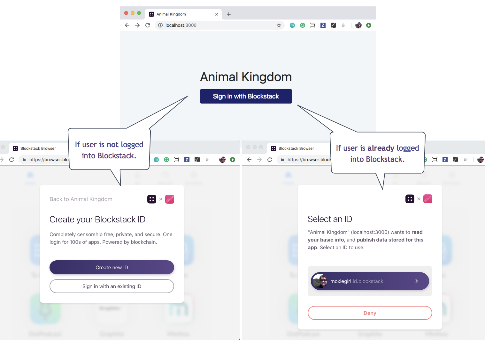
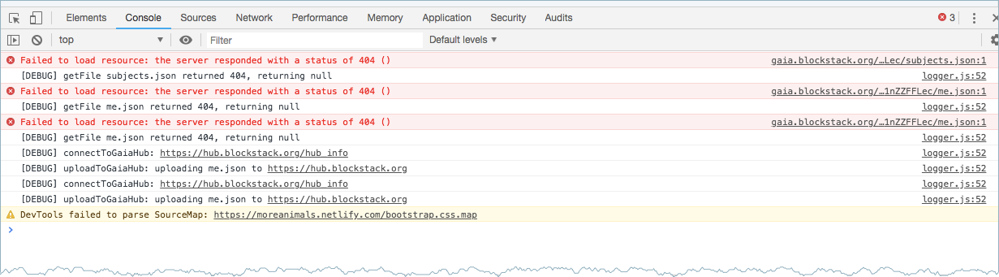
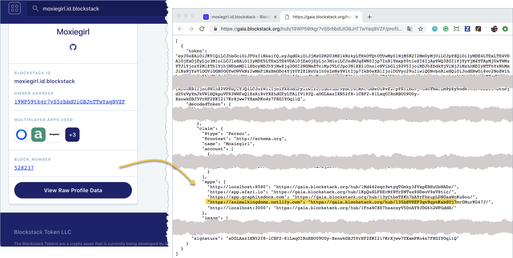
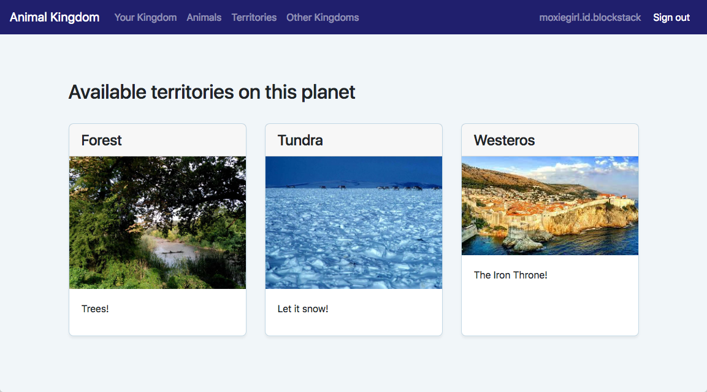
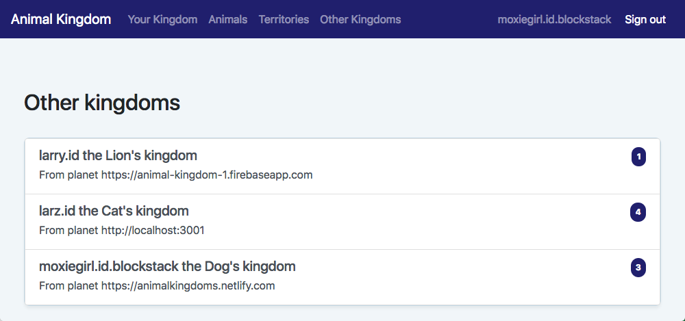
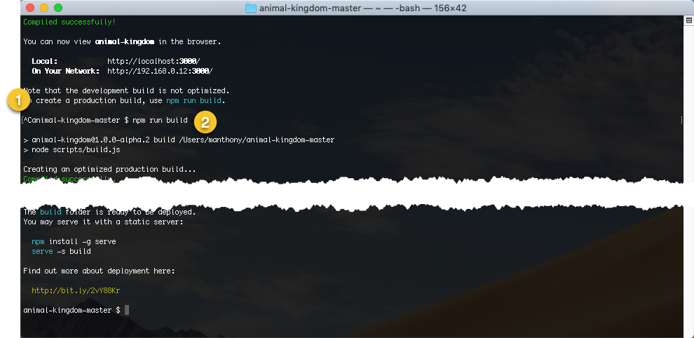
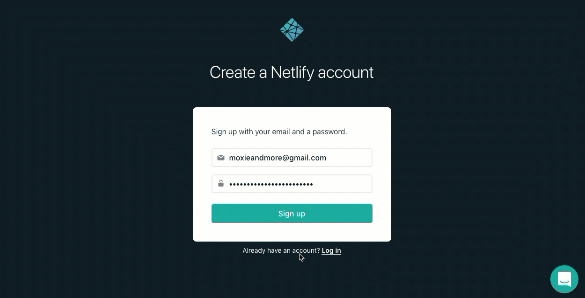
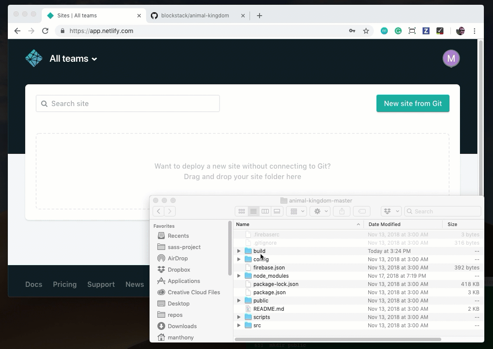
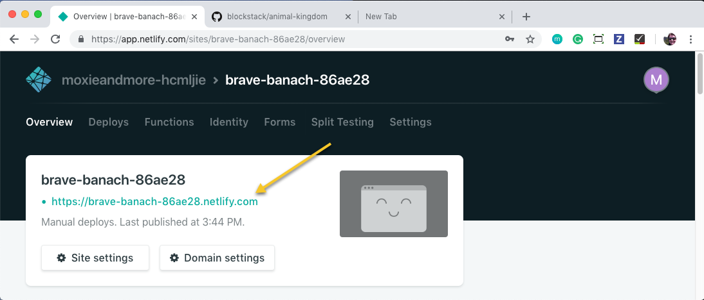

# 3 Customize your Animal Kingdom
{:.no_toc}

 **Zero to DAPP 3 of 4**

In this page, you examine and modify the Animal Kingdom DApp [you built in part
2](zero_to_dapp_2.html). You'll review the underlying code and locate the
portions of it which fulfill the requirements necessary to qualify an
application for App Mining. You'll expand your knowledge of the application by
extending it. Finally, you'll learn how to deploy a DApp.

This page contains the following topics

 * TOC
 {:toc}


### Before you get started
{:.no_toc}

Before you continue, make sure you can locate the key files and
directories (folders) in your project. You'll need to make sure you have opened
a terminal and have changed directory to the top of your Animal Kingdom project.


If you find it easier to navigate, you can use the Finder as well. Just remember
you'll need the command line to run your project.

## Understand the Animal Kingdom application code

The Animal Kingdom application has two major components, React and Blockstack.
React is used to build all the web components and interactions. You could
replace React with any framework that you like; Blockstack is web framework
agnostic. This section does not explain the React in any detail; The discussion
focuses on the Blockstack Javascript library the DApp instead.

The <a href="https://blockstack.github.io/blockstack.js/"
target="\_blank">Blockstack Javascript library is all a developer needs to
create a DApp. It grants</a> the application the ability to authenticate a
Blockstack identity and to read and write to the user's data stored in a Gaia
hub.



### Authenticating user identity

The `src/App.js` file creates a Blockstack `UserSession` and uses that session's
`isUserSignedIn()` method to determine if the user is signed in or out of the
application. Depending on the result of this method. The application redirects
to the `src/SignedIn` page or to the `src/Landing.js` page.

```js
 import React, { Component } from 'react'
 import './App.css'
 import { UserSession } from 'blockstack'

 import Landing from './Landing'
 import SignedIn from './SignedIn'

 class App extends Component {

   constructor() {
     super()
     this.userSession = new UserSession()
   }

   componentWillMount() {
     const session = this.userSession
     if(!session.isUserSignedIn() && session.isSignInPending()) {
       session.handlePendingSignIn()
       .then((userData) => {
         if(!userData.username) {
           throw new Error('This app requires a username.')
         }
         window.location = `/kingdom/${userData.username}`
       })
     }
   }

   render() {
     return (
       <main role="main">
           {this.userSession.isUserSignedIn() ?
             <SignedIn />
           :
             <Landing />
           }
       </main>
     );
   }
 }

 export default App
```

The first time you start the application, this code determines if the user has
signed into the DApp previously. If not, it opens the  `Landing.js` page. This
page offers the user an opportunity to **Sign in to Blockstack**.

Clicking the button ends up calling the `redirectToSignIn()` method which generates an
authentication request and redirects the user to the Blockstack browser to
approve the sign in request. The actual Blockstack sign-in dialog depends on
whether the user already has an existing session in the Blockstack Browser.



Signing in with an identity is the means by which the user grants the DApp
access. Access means the DApp can read the user profile and read/write user data
for the DApp. Data is encrypted at a unique URL on a Gaia storage hub.

The source code imports `UserSession` from the Blockstack library. Data related to a given user-session is encapsulated in the session. In a web
browser, `UserSession` default behavior is to store session data in the
browser's local storage. This means that app developers can leave management of
session state to users. In a non-web browser environment, it is necessary to
pass in an instance of `AppConfig` which defines the parameters of the current
app.

<div class="uk-card uk-card-default uk-card-body">
<h5>App Mining Requirement: Blockstack Authentication</h5>
<p>To participate in application mining your application must integrate Blockstack authentication.
</p>
</div>

### Get and put user data to a Gaia Hub

Gaia is the Blockstack data storage hub (https://hub.blockstack.org). Once a user
authenticates, the application can get and put application data in the user's
storage. After a user signs in, the `SignedIn.js` code checks the user's Gaia
profile by running the `loadMe()` method.

```js
loadMe() {
    const options = { decrypt: false }
    this.userSession.getFile(ME_FILENAME, options)
    .then((content) => {
      if(content) {
        const me = JSON.parse(content)
        this.setState({me, redirectToMe: false})
      } else {
        const me = null

        this.setState({me, redirectToMe: true})
      }
    })
  }
```

Most of the imports in this file are locally coded React components. For example, `Kingdom.js`, `EditMe.js`, and `Card.js`.  The key Blockstack imports is the `UserSession` and an `appConfig` which is defined in the `constants.js` file.

The `loadMe()` code uses the Blockstack's `UserSession.getFile()` method to get
the specified file from the applications data store. If the users' data store on
Gaia does not have the data, which is the case for new users, the Gaia hub
responds with HTTP `404` code and the `getFile` promise resolves to null. If you
are using a Chrome Developer Tools with the DApp, you'll see these errors in a
browser's developer **Console**.



After a user chooses an animal persona and a territory, the user presses **Done**
and the application stores the user data on Gaia.

```js
saveMe(me) {
  this.setState({me, savingMe: true})
  const options = { encrypt: false }
  this.userSession.putFile(ME_FILENAME, JSON.stringify(me), options)
  .finally(() => {
    this.setState({savingMe: false})
  })
}
```

The Blockstack <a href="https://blockstack.github.io/blockstack.js/#putfile"
target="\_blank"><code>putFile()</code></a> stores the data provided in the
user's DApp data store. You can view the URL for the data store from a user's
profile.

If you tested your Animal Kingdom, you can see this on your profile. To see your
profile, go to the <a href="https://explorer.blockstack.org">Blockstack
explorer</a> and search for your ID:



<div class="uk-card uk-card-default uk-card-body">
<h5>App Mining Optional: Gaia Storage</h5>
<p>Use of Gaia storage is not required for application mining. Keep in mind, using Gaia may make data storage easier as it is designed to work in the Blockstack Ecosystem.
</p>
</div>

### Application configuration

Your DApp contains three pages **Animals**, **Territories**, and **Other
Kingdoms** that are derived from three code elements:

 * The `src/constants.js` file defines the application's data profile (`AppConfig`).
 * The `public/animals` directory which contains images.
 * The `public/territories` directory which contains images.

In the next section, you extend your Kingdom's configuration by modifying these files.

## Add a territory

If your application is still running in localhost stop it with a `CTRL-C` from
your keyboard.  

1. Decide what kind of territory to add &emdash; desert, ocean, or city!

   This example adds Westeros, a fictional territory.

2. Search for an image to represent your new territory.

   Google images is a good place to find <a href="images/westeros.jpg" target="\_blank">a JPEG image of Westeros</a>.

3. Save the image to the `public/territories` folder in your Animal Kingdom project code.

   

4. Use the `ls` command to confirm your file appears in `territories` directory and has the correct name.

   ```bash
   ls public/territories/
   forest.jpg   tundra.jpg   westeros.jpg
   ```

4. Open the `src/constant.js` file in your favorite editor.
5. Scroll down to the section that defines the **Territories**.

   ```js
   export const TERRITORIES = [
     {
       id: 'forest',
       name: 'Forest',
       superpower: 'Trees!'
     },
     {
       id: 'tundra',
       name: 'Tundra',
       superpower: 'Let it snow!'
     }
   ]
   ```

6. Add your new territory.

   ```js
   export const TERRITORIES = [
     {
       id: 'forest',
       name: 'Forest',
       superpower: 'Trees!'
     },
     {
       id: 'tundra',
       name: 'Tundra',
       superpower: 'Let it snow!'
     },
     {
       id: 'westeros',
       name: 'Westeros',
       superpower: 'The Iron Throne!'
     }
    ]
    ```
7. Save and close the `constant.js` file.
8. Back in a terminal window, restart your application.

   ```bash
   $ npm start
   ```
9. After the application starts, navigate to the **Territories** page and look for your `Westeros` territory.

   

## Add the Blockstack kingdom to Other Kingdoms

Your Animal Kingdom has only recognizes two **Other Kingdoms**. In this section,
you add a third, the Blockstack kingdom (`https://animalkingdoms.netlify.com`).

1. Open the `src/constant.js` file in your favorite editor.

   On Mac you can use TextEdit or Vim.

2. Scroll down to the section that defines the **Other Kingdoms**

   ```js
   export const OTHER_KINGDOMS = [
     {
       app: 'https://animal-kingdom-1.firebaseapp.com',
       ruler: 'larry.id'
     },
     {
       app: 'http://localhost:3001',
       ruler: 'larz.id'
     }
   ]
   ```

   To add a kingdom, you need its URL and the ID of its owner.

3. Edit the file and add the `https://animalkingdoms.netlify.com` which is owned by `moxiegirl.id.blockstack`.

   When you are done the file will look like this.


   ```js
   export const OTHER_KINGDOMS = [
     {
       app: 'https://animal-kingdom-1.firebaseapp.com',
       ruler: 'larry.id'
     },
     {
       app: 'http://localhost:3001',
       ruler: 'larz.id'
     },
     {
       app: 'https://animalkingdoms.netlify.com',
       ruler: 'moxiegirl.id.blockstack'
     }
   ]
   ```

4. Save and close the `constants.js` file.
5. Back in your browser, navigate to the **Other Kingdoms** page.

   

7. Got to the `moxiegirl` kingdom by clicking on her kingdom.
8. Try adding a subject from Moxiegirl's kingdom to yours.


## Deploy your DApp on the web

So far, you've been running the application locally. This means you are the only
person that can use it to create a kingdom. You can make your application
available to others by hosting it out on the internet. You can do this for free
with a Netlify account.

<div class="uk-card uk-card-default uk-card-body uk-section-muted">
<h5>App Mining Requirement: Review Accessibility</h5>
<p>To participate in application mining your application must be available for review. Open source projects must provide the URL to their code. Projects with private repositories can provide their application in a package form.
</p>
</div>

Before you begin, you need to build a site that is ready to deploy.

1. In your terminal, press `CTRL-C` on your keyboard to stop your `npm start` build.
2. Build a website from your code by entering the `npm run build` command:

   ```bash
   npm run build
   ```

   

   When the command completes, you should have a new `build` subdirectory in your project.

3. Open your project in the Finder.
4. Locate the newly created `build` subfolder.

   

5. <a href="https://app.netlify.com/signup" target="\_blank">Sign up for a free Netlify account</a>

   This example assumes you create an account by providing an email and password.

   

6. In your email inbox, find Netlify's welcome email and verify your account.

   

7. Log into Netlify and go to the **Overview** page in your browser.
8. Drag your `build` subdirectory from the Finder into the drop zone in Netlify.

   

   After a moment, Netlify builds your code and displays the location of your new website.

   

9. Click on your website name to display the website.

   You are prompted to sign into this new site with your Blockstack ID.

10. Click **Sign in with Blockstack**.

    After you sign in, your website presents you with this message:

       

    You get this message because, when you authenticate, your DApp at one URL
    requested a resource (an identity) from another DApp, the Blockstack
    Browser. A request for a resource outside of the origin (your new website)
    is called as a _cross-origin request_(CORs). Getting data in this manner can
    be risky, so you must configure your website security to allow interactions
    across origins.

    <div class="uk-inline">
    <button class="uk-button uk-button-primary" enter="button">Click me to learn how CORS is like borrowing a ladder.</button>
    <div uk-dropdown>
    You can think of CORS interactions as an apartment building with Security.
    For example, if you need to borrow a ladder, you could ask a neighbor in
    your building who has one. Security would likely not have a problem with
    this request (i.e., same-origin, your building). If you needed a particular
    tool, however, and you ordered it delivered from an online hardware store
    (i.e., cross-origin, another site), Security may request identificatin
    before allowing the delivery man into the apartment building.
    <br>
    Credit: <a href="https://www.codecademy.com/articles/what-is-cors" target="\_blank">Codecademy</a>
    </div>
    </div>

    The way you configure CORs depends on which company is serving your website.
    You are using Netlify for this example.

11. Locate the `cors/_headers` and `cors/_redirects` files in your project.

    You can use the Finder or the `ls` command.

    

12. Copy them into your `public` directory.

    To copy them with the `ls` command, enter the following in the root of the `animal-kingdom-master` project.

    ```bash
    cp cors/_headers public
    cp cors/_redirects public
    ```

    The name of each file, with the underscore, is essential.

13. Make sure you are in the `animal-kingdom-master` directory, run the `npm run build` command again.
15. Drag the `build` file back into the Netlify drop zone.

    After a moment, Netlify publishes your site. Check the published location, it may have changed.

16. Click on the link and log into your Animal Kingdom.
17. Recreate your animal person and territory.

    The Animal Kingdom is identified by its location on the Internet, remember?
    So, the animal kingdom you created on your local workstation is different
    than the one you create on Netlify.

## Add your Kingdom to our Clan

At this point, your kingdom is isolated. If you know another kingdom, you can
add subjects from that kingdom but other kingdoms can't access your subjects. In
this section, you use a free GitHub account to add your kingdom to the
Blockstack kingdom.

1. If you have a GitHub account, go to step 2 otherwise go to GitHub <a href="https://github.com/" target="\_blank">site and create a new account</a>.  
2. Go to the <a href="https://github.com/blockstack/animal-kingdom/issues" target="\_blank">https://github.com/blockstack/animal-kingdom/issues</a> repository on Github.
2. Click **New Issue**.

   The new issue dialog appears.

3. Fill out the issue with the URL from Netlify and your Blockstack id.

   When you are done, your issue will look like the following:

   

4. Press **Submit new issue**.

   The Blockstack team will add your Netlify kingdom to ours. When we do that, we will notify you on the issue and you'll also get an email.

5. When you receive the email, login to the Blockstack Animal kingdom to see your kingdom under **Other Kingdoms**.


## Next steps (and a cool tshirt!)
{:.no_toc}


In the next part, you learn about how application mining can fund your DApp
development efforts. And you will take a couple of minutes to add your Animal Kingdom [DApp to App.co
&mdash; the Universal App store](zero_to_dapp_4.html). Completing this step earns you a
limited edition t-shirt.

If you have a twitter account, why not tell some folks about your progress?

<a href="https://twitter.com/share?ref_src=twsrc%5Etfw"
class="twitter-share-button" data-size="large" data-text="I just built a DApp
using @blockstack's  Zero-to-DApp tutorial! " data-hashtags="blockstack,
blockchain, blockchainnopain, blockchainnopainblockstack"
data-show-count="true">Tweet your work!</a><script async
src="https://platform.twitter.com/widgets.js" charset="utf-8"></script>
