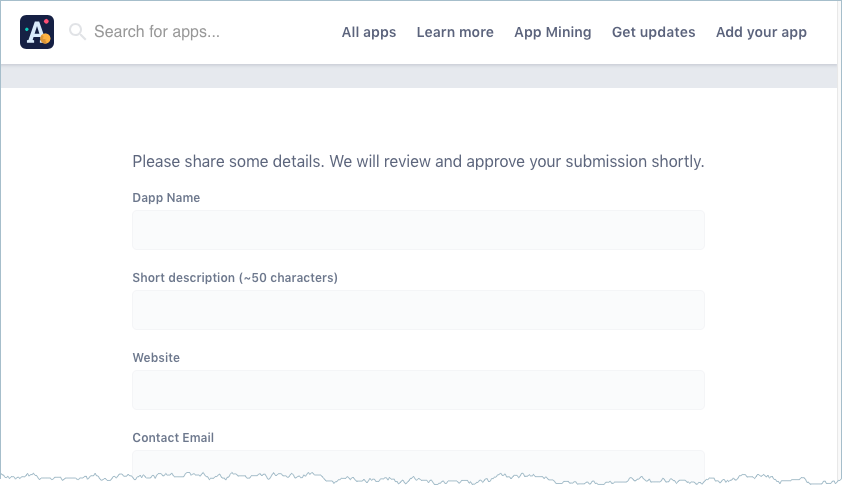

# 4 - List and fund thru App.co
{:.no_toc}

 **Zero to DAPP 4 of 4**

In this part, you learn about application mining as a funding source for your
new DApp efforts. You'll submit your sample Animal Kingdom to App.co, the
Universal DApp store and earn a t-shirt. You'll also learn about other ways
Blockstack helps your development efforts. This part contains the following topics:

* TOC
{:toc}

This page assumes you have customized and deployed your Animal Kingdom as
[described in part 3](zero_to_dapp_3).

## Add your Animal Kingdom to App.co

App.co accepts applications from all decentralized protocols such as Ethereum,
Blockstack, and many others. When you add an app, it is not automatically
eligible for application mining, you must submit it using an another procedure.
You can also submit an application for App Mining but not add it to App.co.

In this section, you add your Animal Kingdom to the **Blockstack Sample
Application** category on App.co.  Adding your Animal Kingdom app to this
category earns you a limited edition a Zero-to-DApp t-shirt. Only submit your
sample application if you have deployed the application on the internet. This
allows us to confirm you completed the tutorial. You can submit more than one
example, only your first submission receives a t-shirt.

To add an app, do the following:

1. In your browser, navigate to <a href="https://app.co/" target="\_blank">the App.co website</a>.
2. Choose **Add your app** option from the menu.

   The system opens the submit your App form.

   

3. Complete the following fields.
    
   

4. Check **App is publicly accessible and user-ready**.
5. Agree to the terms.
6. Press the **Submit** button.

   The Blockstack team will email you information about how to obtain your
   limited edition t-shirt at our store.

<h6><a class="uk-button uk-button-primary" href="https://app.co/mining/latest" target="_blank">See the list of the latest earners</a></h6>

## Congratulations
{:.no_toc}

You've completed the Zero-to-DApp tutorial and have joined the growing
DApp developer community on Blockstack. We hope you've taken the extra
step of submitting your Animal Kingdom application to the App.co site.

<a href="https://twitter.com/share?ref_src=twsrc%5Etfw"
class="twitter-share-button" data-size="large" data-text="I'm the ruler of my Animal Kingdom. Just submitted my Blockstack sample DApp to App.co @TheDAppStore! DApp on people." data-hashtags="blockstack,
blockchain, blockchainnopain, blockchainnopainblockstack"
data-show-count="true">Tweet your work!</a>
