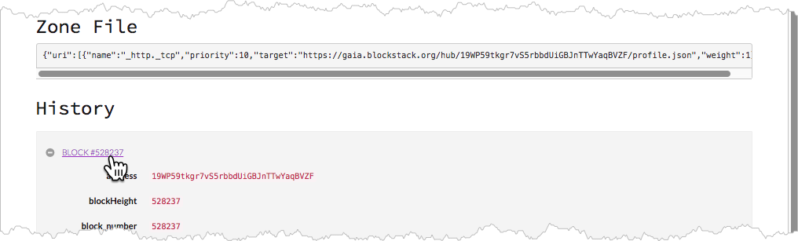

# Explore the Stacks blockchain

Blockchains are often compared to databases. And they are similar to databases
in that they store information which users (people or programs) can examine or
search. Each blockchain creator provides a _blockchain explorer_ for searching
the data in their particular blockchain. This section explains how to use
the Stacks explorer to explore the Stacks blockchain.

This section is written for people who are blockchain beginners. If you are a developer interested in the technical specifications behind the Stacks explorer, please see [this discussion in the forum](https://forum.blockstack.org/t/announcing-blockstack-explorer/491). Detailed information about naming, registration, and so forth can be found in the [Using the Naming Service section](https://docs.blockstack.org/core/naming/introduction.html) of this documentation.

## What you can search

You use <a href="https://explorer.blockstack.org/" target="_blank" >the Stacks explorer</a> to search for the following objects:

<table class="uk-table">
  <tr>
    <th>Object</th>
    <th>Description</th>
    <th>Example of a search</th>
  </tr>
  <tr>
    <td>name</td>
    <td>An identifier or name. If you have signed into the Blockstack Browser, you created a name. If an application developer registered an application within Blockstack, then they registered a name.</td>
    <td><code>graphite.it</code> or <code>moxiegirl.id.blockstack</code></td>
  </tr>
  <tr>
    <td>block</td>
    <td>A block is a complete record on the blockchain.  A good analogy is entry in a diary entry. Each entry completes at particular point in time, contains one or more activities, and the activity took place in the past. A block is a history of completed activity from a specific point of time on the blockchain. The sequential number associated with a block is called a _height_.</td>
    <td><code class="uk-text-small">1001</code></td>
  </tr>
  <tr>
    <td>transaction</td>
    <td>A transaction is unit of work within a block. To use the diary entry analogy, a diary entry for yesterday may include a run to the lake, lunch as Spago, and auditioning for a movie.  Lunch at Spago is a "transaction" in this analogy. Each transaction, like a block, has a unique value associated with it called a _hash_. You can use this hash in the explorer to look up the transaction. And, you can be confident that no other transaction has that particular hash, it is unique.</td>
    <td><code>000000007136b5c...</code>
    This hash is a partial hash, an actual hash value is very long.</td>
  </tr>
  <tr>
    <td>address</td>
    <td>An address is an identifier used during a transaction. It is a unique number that represents the origination or destination of a transaction. Addresses encrypt a participant in a transaction so that the person or entity that took part in the transaction remains private.</td>
    <td><code>3AKx3kBhTFC58Ws</code> This address is a partial address, an actual address value is very long.</td>
  </tr>
</table>

Users like investors or application users typically don't need to use an explorer. However, there are a few interesting things to do if you are an investor or user or both.

## Explorer the Explorer

An easy thing to explore is an identity. If you created an identity through the Blockstack Browser, you can explore that identity.  Identities that you create through the browser are free if you create them in the Blockstack namespace.  

What is a namespace? Well, think of it a bit like an email address, you can get an email address on your own suffix `yourname@myuniquename.com` or you can get email with a service type suffix such as `yahoo` or `msn` or `gmail`.  Blockstack identity behaves like this service type suffix. So, there is only one `moxigirl.id.blockstack` but someone else can be `moxiegirl2.id.blockstack`. You can see this in action yourself with the explorer, by doing the following:

1. Open the explorer.

2. Select the **Names** tag.

   

   The **Names** page lists all the names (users or organizations) that are registered on the Stacks blockchain. There are over 77 thousand names on this list! So, you probably do not want to scroll down the page looking for yours. You can search for a known name, `moxiegirl.id.blockstack` is one of those.

3. Place your cursor in the search bar in the right hand corner and type `moxiegirl.id.blockstack` and then press return.

   The explorer looks for the name and then loads the information for it. You should see it:

   

   At the top is some friendly looking information from the person whose identity this is --- a photo maybe, the friendly name for the person, and some socialy identifiers.  This is the public information the person opted to share. Identifying information is helpful for establishing trust that a person is who they say they are. This particular ID has an unverified account with the Social coding network GitHub. So, perhaps they are shady.

   Below the personal information comes the more technical information associated with that identity. This information is not as friendly for non-technical people. A  **Zone File** information is basically a way for using the identity and "mapping" it to stored data and other things.  Below the **Zone File** you see a list of all the blocks associated with this identity.

4. Click on the plus sign to expand the block information.

   

   This information is technical and really not helpful to us because it doesn't show the particular transactions on the block.

5. Click now on the block number itself.

   

   You should see this new page displayed:

   

   This detail page gives you some useful information. You can see that this block is related to name operations. It is, in fact, the very block on the blockchain when this identifier was created. The **Timestamp** will tell you the exact date.

A blockchain gives you both privacy about your data and trust among the people in the space. The identity `moxiegirl` looks a bit shady now but you may comeback and find the she has verified her identity. Try looking at the identity of our Blockstack founder, `muneeb.id`. You can see, he is a trusted and well known person. Try searching for your own identity, or see [this document]({{ site.baseurl }}/browser/ids-introduction.html) to create your own identity.

In the section [For current investors](investors.html) you can find out how to
use the explorer to search for details about a Stacks token evaluation.
