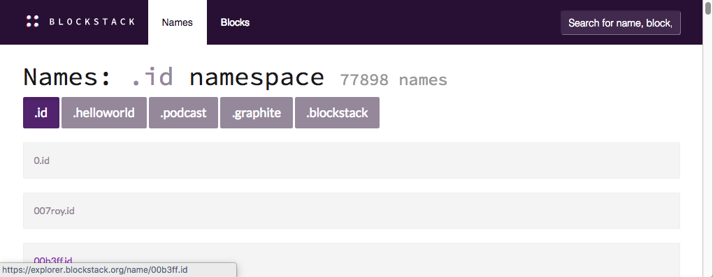
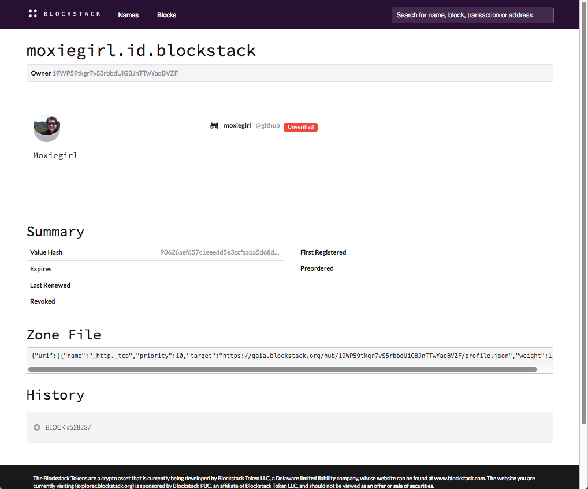
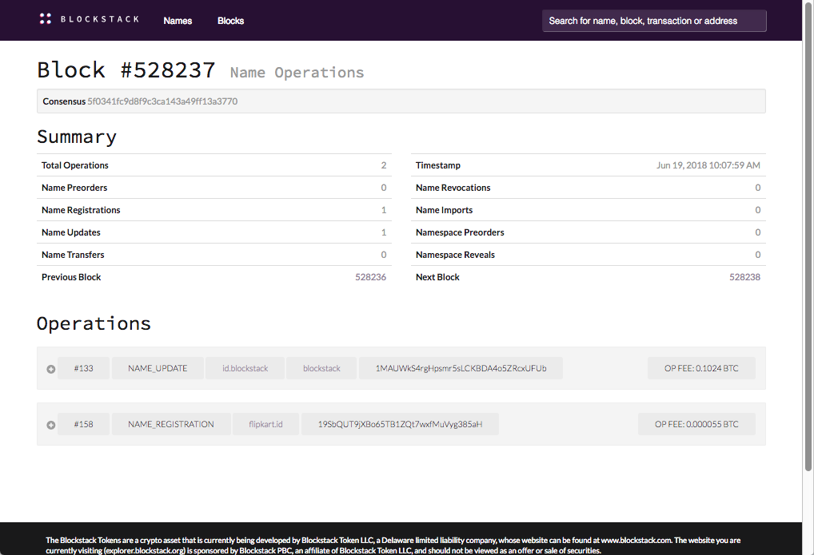

# Explore the Stacks blockchain

Blockchains are often compared to databases. They are similar in that they store
information which users (people or programs) can examine or search. Each
blockchain platform provides a _blockchain explorer_ for searching the data in
their particular blockchain. This section explains how to use the Stacks
explorer to investigate the Stacks blockchain.

This page is written for people who are blockchain beginners. If you are a developer interested in the technical specifications behind the Stacks explorer, please see [this discussion in the forum](https://forum.blockstack.org/t/announcing-blockstack-explorer/491). Detailed information about naming, registration, and so forth can be found in the [Using the Naming Service section](https://docs.blockstack.org/core/naming/introduction.html) of this documentation.

## What you can search

You use {::nomarkdown}<a href="https://explorer.blockstack.org/" target="\_blank"> the Stacks explorer</a>{:/}  to search for the following objects:

<table class="uk-table">
  <tr>
    <th>Object</th>
    <th>Description</th>
    <th>Example of a search</th>
  </tr>
  <tr>
    <td>name</td>
    <td>An identifier or name. A name is a type of digital asset on the Blockstack network.  If you have signed into the Blockstack Browser, you created a name. If an application developer registered an application within Blockstack, then they registered a name.</td>
    <td><code>graphite.it</code> or <code>moxiegirl.id.blockstack</code></td>
  </tr>
  <tr>
    <td>block</td>
    <td>A block is a complete record on the blockchain.  A good analogy is a diary entry. Each entry completes at a particular point in time, contains one or more activities which took place in the past. A block is a history of completed activity from a specific point of time on the blockchain. The sequential number associated with a block is called a <i>height</i>.</td>
    <td><code class="uk-text-small">1001</code></td>
  </tr>
  <tr>
    <td>transaction</td>
    <td>A transaction is a unit of work within a block. To use the diary entry analogy, an entry for Sunday may include a run to the lake, lunch at Spago, and auditioning for a movie.  Lunch at Spago is a "transaction" in this analogy. Each transaction, like a block, has a unique value associated with it called a <i>hash</i>. You can use this hash in the explorer to look up the transaction. And, you can be confident that no other transaction has that particular hash, it is unique.</td>
    <td><code>000000007136b5c...</code>
    This hash is a partial hash, an actual hash value is very long.</td>
  </tr>
  <tr>
    <td>address</td>
    <td>An address is an identifier used during a transaction. It is a unique number that represents the origination or destination of a transaction. Addresses encrypt a participant in a transaction so that the person or entity that took part in the transaction remains private.</td>
    <td><code>3AKx3kBhTFC58Ws</code> This address is a partial address, an actual address value is very long.</td>
  </tr>
</table>

People such as token holders or application users typically don't need to use an explorer. However, there are a few interesting things to do if you are a token holder, a user, or both.

## Investigate the Explorer

An easy thing to explore is an identity. If you have an identity through the
Blockstack Browser, you can explore that identity.  Identities that you create
through the browser are free if you create them in the Blockstack namespace.  If you don't have an identity, you [can create one]({{ site.baseurl }}/browser/ids-introduction.html).

What is a namespace? Well, think of it a bit like an email address, you can get
an email address on your own suffix `yourname@myuniquename.com`, or you can get
email with a service type suffix such as `yahoo` or `msn` or `gmail`.
Blockstack identity behaves like this service type suffix. So, there is only one
`moxiegirl.id.blockstack` but someone else can be `moxiegirl2.id.blockstack`. You
can see this in action yourself with the explorer, by doing the following:

1. Open the [explorer](https://explorer.blockstack.org/).

2. Select the **Names** tag.

   

   The **Names** page lists all the names (users or organizations) that are registered on the Stacks blockchain. There are over 77 thousand names on this list! So, you likely do not want to scroll down the page looking for yours. You can search for a known name, try searching for the `moxiegirl.id.blockstack` name.

3. Place your cursor in the search bar in the right hand corner and type `moxiegirl.id.blockstack` and then press return.

   The explorer looks for the name and then loads the information for it. You should see this result:

   

   At the left is some friendly looking information from the person whose
   identity this is --- a photo maybe, personal name, and social community
   verifications.  This is the public information the person opted to share.
   Identifying information is a step for establishing trust that a person is who
   they say they are. This particular ID has an unverified account with the
   social-coding network GitHub. So, perhaps they are shady.

   **View Raw Profile Data** allows you to see the information a Blockstack core
   leverages, such as the identity and "map" it to stored data and other things.
   On the right, you see a list of all the blocks
   associated with this identity.

4. Click on the block link to expand its information.

    This information is not as friendly for non-technical people.

   

   You can click on transactions to go further down into this technical information.

Try searching for your own identity. If necessary, you can first  [create your own identity]({{ site.baseurl }}/browser/ids-introduction.html). The identity `moxiegirl` looks a bit shady now but you may comeback and find the she has verified her identity. Try looking at the identity of our Blockstack founder, `muneeb.id`. You can see, he is a trusted and well known person.  How does your identity compare?

## For Stacks token holders

In the section [For current token holders](tokenholders.html) current token holders can find out how to
use the explorer to search for details about your Stacks token allocation.
