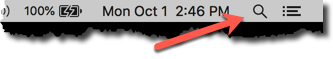

# Setup Stacks wallet

You use the Stacks Wallet software to generate a unique address for storing your
Stacks tokens. This section teaches you how to install and verify your Stacks
token wallet and contains the following sections:

Use this procedure if you are a Blockstack investor in the Blockstack Genesis
block.

During you wallet download, you are at risk of a man-in-the-middle attack (as an
example) from hackers interested in stealing your tokens or your other
information.  To protect yourself from this type of attack, you should verify
your downloaded wallet software before you install it. Verification confirms
that you received the software signed by Blockstack PBC.

## Do not lose your Stacks tokens

When you create a wallet you receive a _seed phrase_. With one very important
exception, a seed phrase is similar to a banking pin in that it gives you
access to your wallet and the tokens it contains.  The exception is, that if you
lose your seed phrase you can never access your wallet or the tokens it contains
ever again.



Keep your seed phrase secret. Just as with a banking pin, anyone that knows or
steals your seed phrase can access your tokens.

For this reason, you should keep your seed phrase safe. You should write your
seed phrase down and store it in at least two locations. A safe or lock box is a
good location. You can also store it online in a password manager.

## Before you start

You link your wallet with a Coinleist account. Before you begin, make sure that
you have [an account with CoinList](https://coinlist.co/register). You must
create this account yourself.

## Mac OSX: Download, verify, and install on Mac OSX

You use the command line terminal to confirm your download in Mac OSX. Perform this procedure after you dowanlod

1. Log into your Coinlist Account

2.  [Download the stacks ](https://blockstack.org/wallet/macos-stacks-wallet.dmg)

3. From your Mac desktop, click on the magnifying glass in the top, right corner of your screen.

   

   The Spotlight search bar appears.

2. Enter terminal in the search field.

   

3. Select the **Terminal.app** to launch it.

4. tbd.

## Windows: Download, verify, and install

TBD
