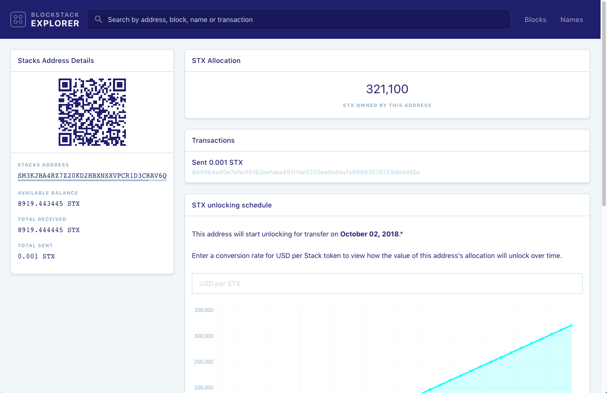
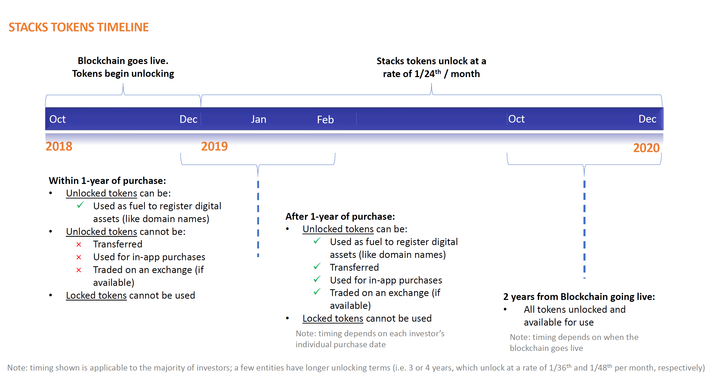

# Information for Investors

The information on this page is intended for investors who took part in
Blockstack's original coin offering in 2017.

* TOC
{:toc}

## Find your token balance and unlock date

During your the initial grant process, you should have submitted a _public
Stacks wallet address_ to Blockstack. This a string of letters and numbers
starting with an 'SP' or SM', for example
`SP077AFV5YRM7HT3TSQXJF7FCCYXETAB276BQ6XS` is a wallet address.

If you purchased Stacks tokens through CoinList, you can find your address at
[CoinList](https://coinlist.co/distributions). If you downloaded and used the Stacks Wallet
software from Blockstack, you can find your address after restoring the wallet
with your seed phrase. If you have lost or need directions for using the Stacks
wallet, contact us at <token@blockstack.org> for more information.

Use the following form to check your Stacks allocation:

<form class="uk-form-horizontal" onSubmit="return process();">
 

<input style="background: #fff !important;" class="uk-input" type="text" name="url" id="url" placeholder="Enter public Stacks wallet address">
<input class="uk-button uk-button-default uk-form-width-medium uk-align-center" type="submit" value="Get allocation">

</form>

You should see a report detailing the tokens allocated to your address and when they unlock:

If you have questions or concerns about your report, please contact <token@blockstack.org>.

## Understanding the timeline for unlocking your tokens

In October 2018, the Stacks blockchain went launched under the Stacks token.
With the launch, Stacks tokens unlock for accredited investors under a
predetermined unlocking schedule. The events on the unlocking schedule are the
same for each investor, *the dates of these events* depend on the investor's
purchase date.

Your tokens unlock giving you access to them on a rolling schedule. The general
timeline for unlocking tokens is as follows:

Your specific unlock date depends on when you invested or were granted tokens.
You can use the Blockstack Explorer to discover how many tokens you have
registered and when they will unlock.
