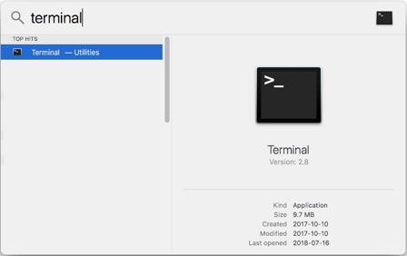
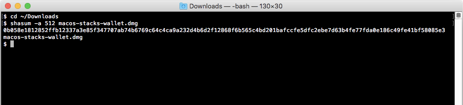

# Install the Stacks Wallet software


You use the Stacks Wallet software client alone or with a hardware wallet to
generate and manage the addresses for storing your Stacks token. On this page,
you learn how to install the Stacks Software wallet. This page contains the
following:

* TOC
{:toc}

If you have already installed the latest Stacks wallet, see [Use the Stacks
Wallet software](wallet-use.html) instead.





## Mac Installation

1. Select the **MacOS Download** button <a href="https://blockstack.org/wallet/" target="\_blank">on this page</a>.

   This button downloads the software to your computer.

2. Open a terminal window.

   To find the terminal software, enter `terminal` into the Spotlight search.

   

3. In the terminal window, enter the command to change directory to the folder where you downloaded the wallet software.

   The default location is the **Downloads** folder, type the following into the terminal and press RETURN on your keyboard.

   ```
   cd ~/Downloads
   ```

4. In the terminal window, type the following Command

    ```
    shasum -a 512 macos-stacks-wallet.dmg
    ```

    

5. Verify that the resulting hash (a string of letters and numbers) is the same as the latest hash published on <a href="https://blockstack.org/wallet/" target="\_blank">on this page</a>.


## Windows Installation

1. Select the **Windows Download** button <a href="https://blockstack.org/wallet/" target="\_blank">on this page</a>.

   This button downloads the software to your computer.

2. Open a command prompt.

   To find the command prompt software, enter `command` into the Start menu.

   

3. In the command prompt window, enter the command to change directory to the folder where you downloaded the wallet software.

   The default location is the **Downloads** folder, type the following at the command prompt and press RETURN on your keyboard.

   ```
   cd <You-User-Directory>/Downloads
   ```

4. In the command prompt window, type the following at the command prompt.

    ```
    certUtil -hashfile windows-stacks-wallet.exe SHA512
    ```

    

5. Verify that the resulting hash (a string of letters and numbers) is the same as the latest hash published on <a href="https://blockstack.org/wallet/" target="\_blank">on this page</a>.


## Before you start using the Stacks Wallet software

You fuel your wallet transactions with Bitcoin via a Coinlist or other account.
Before you begin, make sure that you have [an account with
CoinList](https://coinlist.co/register). You must create this account yourself.
You use this account to load very small fractions of Bitcoin to fuel your wallet
transactions.
