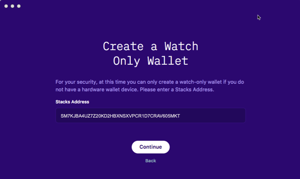
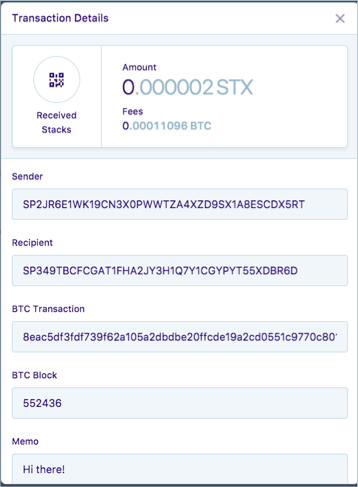
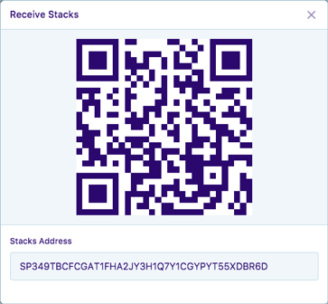
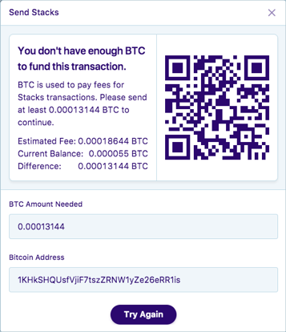
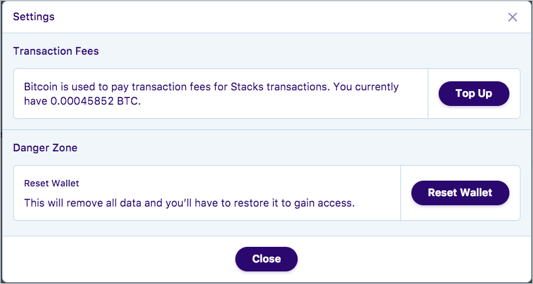
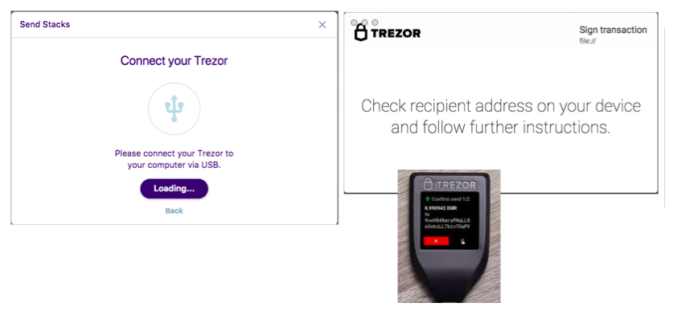
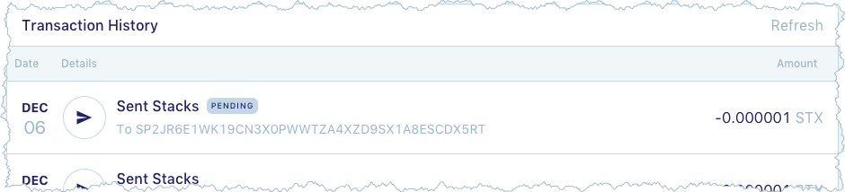

# Use the Stacks Wallet software
{:.no_toc}

This page describes how to manage your Stacks using the Stacks Wallet software.
The Stacks Wallet software is installed on your computer. This page contains
the following topics:

* TOC
{:toc}

This page assumes you have already [downloaded, verified, and installed the
wallet software](wallet-install.html).

## Use the Stacks Wallet with or without a hardware wallet

You can use the Stacks Wallet software by itself or together with a hardware
wallet. When used by itself, the Stacks Wallet software acts as a _watch-only
wallet_. You can view STX balances and transaction history.

When you use the Stacks Wallet together with a hardware wallet, you can also
send and receive Stacks. To do this, you must first top up the wallet's "gas" which is
Bitcoin.  A **_very small_** amount of Bitcoin is required to send Stacks. No
gas is required to receive Stacks. You can use any of these hardware wallets with the Stacks wallet:

* Trezor One
* Trezor Model T
* Ledger Nano S
* Ledger Blue

Once connected, the Stacks Wallet only uses the hardware wallet when signing
send transactions. This means, you can connect to the hardware wallet when you
start the Stacks Wallet software. After starting, you can disconnect the
hardware wallet and put it away until you want to send Stacks.

The **Reset** function is always available regardless of whether you are using a
hardware wallet as well. A reset returns the Wallet Software to its original
state. It does not change your Stacks balance or your hardware wallet in any
way.

## Open the wallet

You can use the Stacks Wallet software with or without a hardware wallet. To
send Stacks, a hardware wallet is required.

### Stacks Wallet software only

You need at least one Stacks Address to create a wallet. A Stacks address is a
unique string of letters and numbers, for example:
`SM7KJBA4UZ7Z20KD2HBXNSXVPCR1D7CRAV605MKT`.

1. Double-click on the wallet software to open it.
2. Select **Use a Stacks Address**.

   The system asks you to enter an address. If you are a token holder, you
   should have generated several Stacks address during your the initial grant
   process. You can provide one of these addresses to the Stacks wallet when you
   start it.

   

3. Select **Continue**.

   The system displays the balance for that address.

### Hardware wallet

It is a good idea to connect your hardware wallet to your computer before
starting the Stacks wallet software, but it is not required. Some hardware
wallets require that you have additional software installed to support the
hardware wallets interactions with the Stacks wallet.

| Hardware wallet 	| Prerequisite software 	|
|-----------------	|------------------------	|
| Trezor One      	| <a href="https://doc.satoshilabs.com/trezor-user/download.html" target="\_blank">Trezor Bridge</a>          	|
| Trezor Model T  	| <a href="https://doc.satoshilabs.com/trezor-user/download.html" target="\_blank">Trezor Bridge </a>         	|
| Ledger Nano S   	| None.                  	|
| Ledger Blue     	| None.                  	|

Make sure you have installed any prerequisite software. Then, do the following to start the Stacks Wallet with a Hardware wallet:

1. Connect your hardware wallet to your computer as you normally would.
2. Double-click on the wallet software to open it.
3. Select **Use a Hardware Wallet**.
4. Select the hardware wallet you want to use.

   This example uses a Trezor wallet.

   

   The system prompts you to connect your
   device.

5. Connect your wallet to your computer and choose **Continue**.

   The system prompts you to export a public key.

   

6. Select **Export**.

   The Stacks Wallet shows the current wallet balance.

## View Balance, Allocation, and transaction history

The default view for an open and loaded wallet is the **Wallet Balance** view.

If you have started with a hardware wallet, your view includes **Send** and
**Receive** buttons. If you open the same address in a watch-only wallet, you do
not see these buttons:

Both balances show **Transaction History** if it exists for an address. A
transaction summary appears on the initial screen. To see details,
click on a transaction:

Not all addresses will have a balance. If you are a Stacks token holder, your
address shows with both a **Balance** and **Allocation**. The **Balance** is the
Stackes you have unlocked. The **Allocation** is the amount still locked up.

## Receive Stacks

To receive Stack you pass a STX address directly to a user via email, for
example. If your Stackes Wallet is connected to a hardware wallet, click the **Receive** button to
display an address where others can send Stacks to.

A stack address is a public addresses. Anyone with the address, can view the
address balance or send money _**to**_ the address.



Blockchain transactions take time. There may be minutes or hours while the
transaction is recorded in the blockchain. When the transaction is complete, you
can see a receipt for the transaction in Software Wallet in watch-only mode or
connected to a hardware wallet.

## Top up Bitcoin gas

You require very small fractions of Bitcoin (.00001) to send Stacks with the wallet.



The Stacks Software wallet uses very small amounts of Bitcoin to pay fees for
transactions. You can only receive Bitcoin with the wallet, you cannot send it
from the Stacks Wallet. You need an account with Coinbase or similar exchange to
buy Bitcoin or send Bitcoin.

If you attempt to send Stacks with your wallet and you do not have enough
Bitcoin to fuel the transaction, you see this dialog:

 To increase your Bitcoin for transactions, do the following:

 1. Click the 
  (settings icon) in the upper right corner of the wallet.

    The system opens the **Settings** dialog.

    

    This dialog shows you how much BTC you currently have in your account.

2. Select **Top up**.

   The systems displays the **Top Up** dialog with a Bitcoin address.

3. Record the address.

4. Go to your Coinbase or similar account.
5. Send Bitcoin to the address presented by the Stacks Wallet.

   

Review your Stacks Wallet settings to see the increase in your balance. Your
transaction history also shows any Bitcoin sent to your wallet.

## Send stacks

You can only send Stacks if you have connected your Stacks wallet to a hardware
wallet. The Stacks Wallet software uses the hardware wallet to sign your send
transactions.

1. Open the Stacks wallet.

   If you are starting after a reset, choose **Use a Hardware Wallet**.

2. Connect your hardware wallet to your computer.
3. Select **Send**.

   The system displays the **Send** dialog.

3. Complete the dialog with the transaction information.

    | **Recipient**      	| A Stacks address.	|
    | **Amount to Send** 	| Enter a value.   	|
    | **Note**   	        | A memo for the transaction.  	|

4. Select **Continue**.

    If you do not have enough Bitcoin to fuel the transaction, the system
    notifies you. If you don't have enough Bitcoin, you must **Top Up**.
    Otherwise, the system prompts you to connect to your hardware wallet. Your
    hardware wallet will prompt you for additional information and actions.

    

4. Select **Continue**.

   The Stacks Wallet displays a confirmation dialog.

   

5. Select **Confirm** to complete your transaction.

   

6. Select **Close**.

   The send transaction appears in your **Transaction History**. Blockchain
   transactions can take minutes or hours to complete. Transactions that have
   not cleared yet show as **PENDING**.

      

   Select **Refresh** if you don't immediately see the transaction in your
   history.

## Reset the wallet

Resetting a wallet clears all your data from the Stacks wallet and returns the
wallet to its original state.

* If you entered a Stacks address, resetting clears the address from the Stacks wallet.
* If you connected to a hardware wallet, resetting removes the connection to the hardware wallet.

Resetting the wallet does nothing to your addresses or their associated balances.
They are maintained.

Once you reset the wallet, you have to start over from the *Terms of Use*. If
you do not restart the wallet, you can simple close it.

1. Click the 
 (settings icon) in the upper right corner of the wallet.

   The system opens the **Settings** dialog.

   

   The **Top Up** button is only visible when you have connected the Stacks
   Wallet to a hardware wallet.

2. Select **Reset Wallet**.

   System asks for confirmation. If, for some reason, you want to stop the reset
   you would press  (right corner) or **Close**.

3. Select **Are you sure?** to complete the reset.

   The wallet displays the **Terms of Use**. You can accept to enter the wallet
   again or choose **Quit**.
