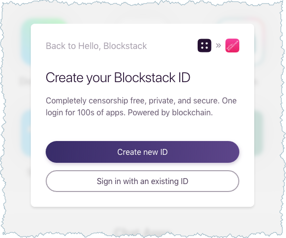
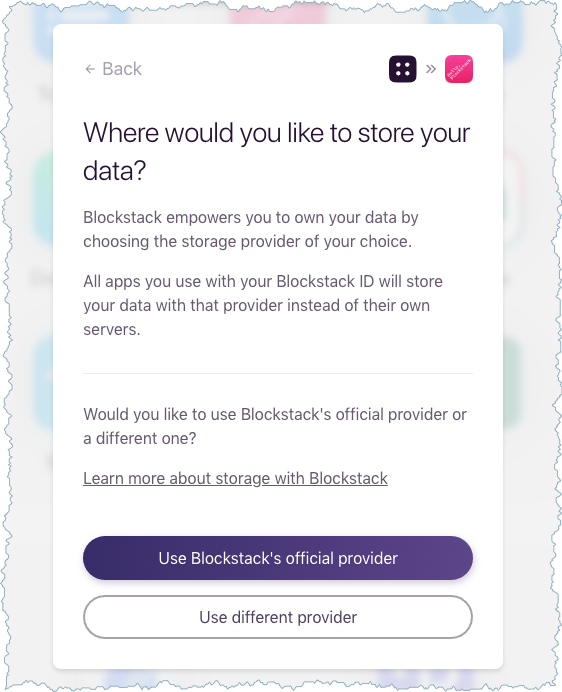

# Hello hub choice tutorial
{:.no_toc}

In this tutorial, you build on the <a href="{{ site.baseurl }}/browser/hello-blockstack.html" target="\_blank">Hello, Blockstack Tutorial</a>. You'll modify the authentication code so that it prompts users who have not yet created a Blockstack identity, to choose a hub URL.

* TOC
{:toc}



## About this tutorial and the prerequisites you need

This tutorial assumes you already set up your environment and tooling as specified in the <a href="{{ site.baseurl }}/browser/hello-blockstack.html" target="\_blank">Hello, Blockstack Tutorial</a>. You should also review that tutorial for basic information about

## Task 1: Generate an initial Blockstack application

In this section, you build an initial React.js application called `hello-hub-choice`.

1. Create the `hello-hub-choice` directory.

    ```bash
    mkdir hello-hub-choice
    ```

2. Change into your new directory.

    ```bash
    cd hello-hub-choice
    ```

3. Use Yeoman and the Blockstack application generator to create your initial `hello-hub-choice` application.

    ```bash
    yo blockstack
    ```

    You should see several interactive prompts.


    
    ```bash
    $ yo blockstack

    ...

    ? Are you ready to build a Blockstack app in React? (Y/n)
    ```
    

4. Respond to the prompts to populate the initial app.

    After the process completes successfully, you see a prompt similar to the following:

    
    ```bash
    ...
   create public/icon-192x192.png
   create public/index.html
   create public/robots.txt
   create public/manifest.json


    Im all done. Running npm install for you to install the required dependencies. If this fails, try running the command yourself.
    ```
    

5. Verify that you have version `18.3.0` of blockstack.js or higher.

   ```
   $ npm ls blockstack
    hello-blockstack@0.0.0 /Users/manthony/sampleapps/hello-blockstack
    └── blockstack@18.3.0
   ```

   If you don't have the correct version, install it.

   ```
   npm install blockstack@18.3.0
   ```


Depending on your environment you may have some problems with the `npm` packages. Go ahead and fix these before continuing to the next section.

## Task 2. Start the server and view the application

When you start the server, it will create a Node.js server, start it locally,
and open your browser `http://localhost:5000`.  From the root of your new application directory:

1. Start the application server.

    ```bash
    npm start
    ```

2. Choose **Allow**.

3. Open your browser to `http://localhost:8080`.

   You should see a simple application:

   

4. Leave your new application running and move onto the next section.

## Task 3: Enable hub selection

By default, the app generator assumes you want to use the default flow `redirectToSignIn()` method.  In this section, you replace that method and use the `makeAuthRequest()` method instead. The `makeAuthRequest()` method takes the following parameters:

<dl class="uk-description-list">
   <dt class="uk-text-lowercase">
      <code>transitPrivateKey(String = generateAndStoreTransitKey())</code>
   </dt>
   <dd>A HEX encoded transit private key.</dd>
   <dt class="uk-text-lowercase">
      <code>redirectURI(String = `${window.location.origin}/`)</code>
   </dt>
   <dd>Location to redirect the user to after sign in approval.</dd>
   <dt class="uk-text-lowercase">
      <code>manifestURI(String = `${window.location.origin}/manifest.json`)</code>
   </dt>
   <dd>
      Location of this app's manifest file.
      </dd>
   <dt class="uk-text-lowercase">
      <code>scopes (Array = DEFAULT_SCOPE)</code>
   </dt>
   <dd>The permissions this app is requesting.</dd>
   <dt class="uk-text-lowercase">
      <code>appDomain(String = window.location.origin)</code>
   </dt>
   <dd>The origin of this app.</dd>
   <dt class="uk-text-lowercase">
      <code>expiresAt(Number = nextHour().getTime())</code>
   </dt>
   <dd>The time at which this request is no longer valid.</dd>
   <dt class="uk-text-lowercase">
      <code>extraParams(Object = {})</code>
   </dt>
   <dd>Any extra parameters to pass to the authenticator. Use this to pass options that aren't part of the Blockstack authentication specification, but might be supported by special authenticators.</dd>
</dl>

To replace the default login, do the following:

1. Using your favorite editor, open the `public/app.js` file.
2. Locate the `redirectToSignIn()` method at line 4.
3. Replace `redirectToSignIn()` method with the `blockstack.redirectToSignInWithAuthRequest(authRequest)` method.

   The `authRequest` is the authentication request generated by `makeAuthRequest()` method.

4. Immediately above the method you just added and below the `event.preventDefault()` method, construct a String `const` for the `authRequest`:

    ```
    const authRequest = blockstack.makeAuthRequest(
      blockstack.generateAndStoreTransitKey(),
      'http://localhost:8080/',
      'http://localhost:8080/manifest.json',
      ['store_write', 'publish_data'],
      'http://localhost:8080/',
      blockstack.nextHour().getTime(), {
        solicitGaiaHubUrl: true
      } // new options param
    );
    ```

    

   The extra `solicitGaiaHubUrl` parameter of `true` will cause the Blockstack Browser to prompt new identity creators for a storage hub URL.

5. Save and close the `public/app.js` file.
6. Make sure your app rebuilds cleanly.


## Task 4: Try the new authentication flow

Try your new authentication code.

1. Refresh the client at `http://localhost:8080/`.
2. Click *Sign in with Blockstack*.

   The Blockstack Browser prompts you to sign in. I you are _not already authenticated_ with the browser, you should see the following:

   

   If you are already authenticated with an existing ID, you can choose that ID
   or **Deny**. Choosing an existing ID, signs you into the Hello Blockstack
   application, without offering a hub choice. Instead, choose **Deny**. This
   ends the authentication process. Then, reset the Blockstack Browser.

3. Choose **Create new ID**.

   The system prompts you to enter a username.

4. Enter a name and press **Check Availability**.
5. Press **Continue** after you find an available name you like.
6. Enter a password and chose **Register ID**.

   The system prompts you for a provider.

   

   The default is to user Blockstacks' Gaia hub.

7. Choose **Use a different provider**.

   The system prompts you for a URL.

   

8. Enter a Gaia hub URL.

   If you have one of your own enter it here. You can also just enter the Blockstack URL (`https://hub.blockstack.org`).

9. Press **Continue**.

   The system takes a moment to check the hub is responsive and establish it in your new identity profile. Then, the system prompts you for an email.

10. Enter an email and press **Next**.

    The system creates your user and prompts you to continue to your application.

11. Choose **Go to Hello, Blockstack**.

    The system prompts you to allow Hello Blockstack access.

12. Grant the access to the DApp.

    You user should be authenticated.

## How to recommend a Gaia hub URL for new users

If you want to create specific sign-up flows for your DApp, you can pass a preset Gaia storage hub URL also. For example, you might
do this if you have a corporate client whose employees would all like to use
your application with a company-run Gaia hub.

To suggest a Gaia hub URL,  provide an additional `recommendedGaiaHubUrl` value
alongside the `solicitGaiaHubUrl`, for example:

```javascript
import {
  makeAuthRequest,
  redirectToSignInWithAuthRequest
} from 'blockstack';

const authRequest = makeAuthRequest(undefined, undefined, undefined, undefined, undefined, undefined, {
   solicitGaiaHubUrl: true,
  recommendedGaiaHubUrl: 'https://mygaiahub.com'
});

const authRequest = makeAuthRequest(
  generateAndStoreTransitKey(),
  'http://localhost:8080/',
  'http://localhost:8080/manifest.json',
  ['store_write', 'publish_data'],
  'http://localhost:8080/',
  nextHour().getTime(), {
    solicitGaiaHubUrl: true, //new options param
    recommendedGaiaHubUrl: 'https://mygaiahub.com' // new options param
  }
);

redirectToSignInWithAuthRequest(authRequest);
```

Passing these parameters changes the storage hub URL prompt to the following:


## Related information
{:.no_toc}

[`makeAuthRequest()`](https://blockstack.github.io/blockstack.js/#makeauthrequest) method
