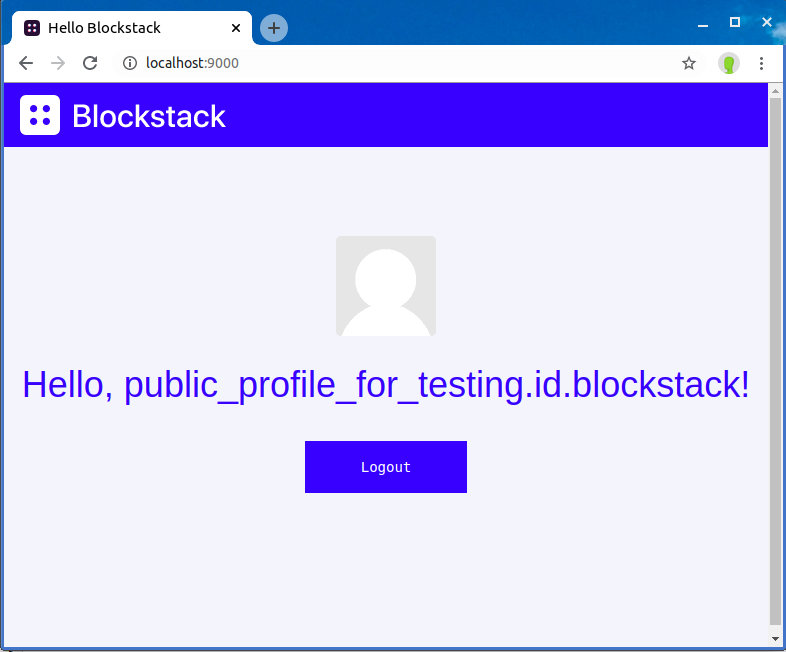

---

description: Learn about the Android SDK

---

# Android DApps

{:.no_toc}

This tutorial is written for readers who are new to either or both Blockstack
and Android to create a decentralized application. It contains the following
content:

TOC
{:toc}

This tutorial was extensively tested using Android Studio 3.6 on a Dell XPS 13
running Ubuntu 19. If your environment is different, you may encounter
slight or even major discrepancies when performing the procedures in this
tutorial. Please [join the Blockstack discord server](https://chat.blockstack.org) and post questions or comments to
the `#support` channel.

Finally, this tutorial is written for all levels from the beginner to the most
experienced. For best results, beginners should follow the guide as written. It
is expected that the fast or furiously brilliant will skip ahead and improvise
on this material at will. Fair journey one and all.

If you prefer, you can skip working through the tutorial all together. Instead,
you can [download the final project code](images/helloandroid.zip) and import it
into Android Studio to review it.

## Understand the sample application flow

When complete, the sample application is a simple `hello-world` display. It is
intended for user on an Android phone.


Only users with an existing blockstack id can run your
final sample application. When complete, users interact with the sample
application by doing the following:


## Set up your environment

This sample application has two code bases, a Blockstack `hello-blockstack`
web application and a `hello-andriod` Android application. Before you start
developing the sample, there are a few elements you need in your environment.

### Install Android Studio

If you are an experienced Android developer and already have an Android
development environment on your workstation, you can use that and skip this
step. However, you will need to adjust the remaining instructions for your
environment.

Follow the installation instructions to download and [Android Studio
3.6](https://developer.android.com/studio/install) for your operating system.
Depending on your network connection, this can take between 15-30 minutes.


### Do you have Node.js?

Node.js v10 or higher is recommended the minimum supported version is Node.js v8. Before you begin, verify you have the correct version of Node.js and its tools installed.

```bash
$ node -v
v12.10.0
$ which npm npx
/usr/local/bin/npm
/usr/local/bin/npx
```

If you don't have these installed, take a moment to install or upgrade as needed.

## Build the Blockstack hello-world web app

In this section, you build a Blockstack `hello-world` web application that acts as the companion site to your Android application.

### Generate and launch your hello-blockstack application



In this section, you build an initial React.js application called
`hello-blockstack`.

1. Create a `hello-blockstack` directory.

   ```bash
   mkdir hello-blockstack
   ```

2. Change into your new directory.

   ```bash
   cd hello-blockstack
   ```

3. Use the Blockstack application generator to create your initial `hello-blockstack` application.

   ```bash
   $ npx generator-blockstack --plain
       create package.json
       create .gitignore
       create webpack.config.js
       create netlify.toml
       create firebase.json
       ...
       npm WARN ajv-errors@1.0.1 requires a peer of ajv@>=5.0.0 but none is installed. You must install peer dependencies yourself.

       added 840 packages from 582 contributors and audited 843 packages in 18.84s
       found 0 vulnerabilities
   ```

   Depending on your environment you may have some warnings with the installation. Optionally, you can fix these before continuing to the next section.

4. Depending on your environment, respond to the prompts to populate the initial app.
   You might see a prompt similar to the following:

   ```bash
   [fsevents] Success:
   "/Users/theuser/repos/hello-blockstack/node_modules/fsevents/lib/binding/Release/node-v59-darwin-x64/fse.node"
   is installed via remote npm notice created a lockfile as package-lock.json.
   You should commit this file. added 1060 packages in 26.901s
   ```

5. After the initial setup you can now run the initial application.

   ```bash
   $ npm run start

    > hello-blockstack-webpack@0.0.0 start /home/user/hello-blockstack
    > webpack-dev-server

    ℹ ｢wds｣: Project is running at http://localhost:9000/
    ℹ ｢wds｣: webpack output is served from /
    ℹ ｢wds｣: Content not from webpack is served from /home/user/hello-blockstack/dist
    ℹ ｢wdm｣: Hash: f5d88efe9c9194f66ddd
    Version: webpack 4.43.0
    Time: 2733ms
    Built at: 05/19/2020 10:44:50 AM
      Asset      Size  Chunks             Chunk Names
    main.js  5.39 MiB    main  [emitted]  main
   ....
    [./src/index.js] 1.8 KiB {main} [built]
        + 610 hidden modules
    ℹ ｢wdm｣: Compiled successfully.
   ```

   The system opens a browser displaying your running application.

   

   At this point, the browser is running a Blockstack server on your local host.
   This is for testing your applications only.

6. Choose **Get started**

   The system displays a prompt allowing you to create a new Blockstack ID or restore an existing one.

   

7. Follow the prompts appropriate to your situation.

   At this point you have only a single application
   on your test server. So, you should see this single application, with your
   own `blockstack.id`, once you are signed in:

   

## Create the hello-android project

In this section, you'll create an Android application in Android Studio. You'll
run the application in the emulator to test it.

### Create a simple project

In this section, you create an inital project. You'll validate the application's
iniatial state by creating an emulator to run it in. Open Android Studio and do the following:

1. Open Android Studio and choose **Start a new Andriod Studio project**.

   If studio is already started, choose **File > New > New Project**.

2. Choose a project template: select **Empty Activity** and press **Next**

3. Enter these fields in the **Create Android Project** page.

<table class="uk-table">
<tr>
  <th>Name</th>
  <td><code>Hello Android</code></td>
</tr>
<tr>
  <th>Package name</th>
  <td><code>blockstack.id.<i>USERNAME</i>.hello</code></td>
</tr>
<tr>
  <th>Project location</th>
  <td><code>/home/<i>USERNAME</i>/AndroidStudioProjects/helloandroid</code></td>
</tr>
<tr>
  <th>Language</th>
  <td>Select (Kotlin)</td>
</tr>
<tr>
  <th>Minimum SDK</th>
  <td>Select (API 21: Android 5.0 (Lollipop))</td>
</tr>
</table>


4. Press **Finish**.

   Android studio builds your initial project. This can take a bit the first time you do it.

### Run the app in an emulator

In this section, you run the appliation and create an emulator when prompted.

1. Once the project is imported into studio, click the `app` module in the **Project** window.

2. Then, select **Run > Run** (or click the green arrow in the toolbar).

   Studio prompts you to **Select Deployment Target**.

3. Choose **Create New Virtual Device** and press **OK**.

   Studio prompts you to **Select Hardware**.

4. Choose a Phone device configuration like "Pixel".

   

   Studio prompts you for a system image.

5. Choose **Q** which is API level 29 and press **Next**.

   

   Studio asks you to verify your new emulator configuration.

6. Press **Finish**.

   The emulation takes a moment to build. Then, studio launches the emulation and opens your application.

   

### Configure your application with the Blockstack SDK

Now that you have created your initial project and verified it running in an emulator, you are ready to begin configuring the application for use with Blockstack.

1. In studio, open the `AndroidManifest.xml` file.

2. Add an `<intent-filter>` with the custom handler for Blockstack. Replace the host ("flamboyant-darwin-d11c17.netlify.app") with your own url once you have hosted your web app publicly.

   ```XML
   <intent-filter>
     <action android:name="android.intent.action.VIEW" />
     <category android:name="android.intent.category.DEFAULT" />
     <category android:name="android.intent.category.BROWSABLE" />
     <data android:scheme="https" android:host="flamboyant-darwin-d11c17.netlify.app" />
    </intent-filter>
   ```

3. Open the Project's `build.gradle` file ("Project: Hello Android").
4. Add the Jitpack repository `maven { url 'https://jitpack.io' }` to the `repositories` section. for all projects

   When you finish, that section looks like this:

   ```JS
   allprojects {
     repositories {
         google()
         jcenter()
         maven { url 'https://jitpack.io' }
     }
   }
   ```

5. Open the Module `build.gradle` file ("Module: app").
6. Fix a problem with duplicate meta data in the Android SDK: add `packagingOptions`

   ```JS
   android {
      ...
      packagingOptions {
        exclude 'META-INF/*'
    }
   }
   ```

7. Below this, add the Blockstack Android SDK dependency to your project's `dependencies` list:

   When you are done you should see:

   ```JS
    dependencies {
        implementation fileTree(dir: 'libs', include: ['*.jar'])
        implementation "org.jetbrains.kotlin:kotlin-stdlib-jdk7:$kotlin_version"
        implementation 'androidx.appcompat:appcompat:1.1.0'
        implementation 'androidx.core:core-ktx:1.2.0'
        implementation 'androidx.constraintlayout:constraintlayout:1.1.3'
        testImplementation 'junit:junit:4.12'
        androidTestImplementation 'androidx.test.ext:junit:1.1.1'
        androidTestImplementation 'androidx.test.espresso:espresso-core:3.2.0'

        implementation 'com.github.blockstack:blockstack-android:7940940'
        implementation 'androidx.lifecycle:lifecycle-runtime-ktx:2.2.0'
    }

   ```

   **NOTE**: Ignore the warning on the `junit` dependencies.

8. Sync your project.

   

   Be sure to check the sync completed successfully.

   

9. Run your app in the emulator.

   You've made a lot of changes, make sure the emulator is still running
   correctly.

### Add a simple interface

1.  Open the `app/res/layout/activity_main.xml` file.

    The `activity_main.xml` file defines the graphical elements. Some elements are required before you can functionality to your `MainActivity.kt` code.

2.  Replace the entire content of the file with the following code:

    The new interface includes a `BlockstackSignInButton` which is provided by
    the SDK. This SDK includes a themed "Get Started" button
    (`BlockstackSignInButton`). You use this button here with the
    `org.blockstack.android.sdk.ui.BlockstackSignInButton` class.

    ```XML
    <?xml version="1.0" encoding="utf-8"?>
    <androidx.constraintlayout.widget.ConstraintLayout xmlns:android="http://schemas.android.com/apk/res/android"
        xmlns:app="http://schemas.android.com/apk/res-auto"
        xmlns:tools="http://schemas.android.com/tools"
        android:layout_width="match_parent"
        android:layout_height="match_parent"
        android:layout_margin="16dp"
        tools:context=".MainActivity">

        <org.blockstack.android.sdk.ui.BlockstackSignInButton
            android:id="@+id/signInButton"
            android:layout_width="match_parent"
            android:layout_height="wrap_content"
            app:layout_constraintTop_toTopOf="parent"
            app:layout_constraintEnd_toEndOf="parent"
            app:layout_constraintStart_toStartOf="parent"
            app:layout_constraintBottom_toTopOf="@id/userDataTextView"/>

        <TextView
            android:id="@+id/userDataTextView"
            android:layout_width="wrap_content"
            android:layout_height="wrap_content"
            android:text="Hello World!"
            app:layout_constraintBottom_toBottomOf="parent"
            app:layout_constraintLeft_toLeftOf="parent"
            app:layout_constraintRight_toRightOf="parent"
            app:layout_constraintTop_toBottomOf="@id/signInButton" />

    </androidx.constraintlayout.widget.ConstraintLayout>
    ```

    This codes adds a button and some text to your application.

3.  Choose **Run > Apply changes**.

4.  Choose **Run > Run app** in the emulator.

    The emulator now contains a new interface with a button:

    

### Add session & authentication code

1. Open the `MainActivity.kt` file.
2. Add some additional imports to the top, replace the `android.os.Bundle` import.

   When you are done, your imports should appear as follows:

   ```kotlin
    import android.content.Intent
    import android.os.Bundle
    import androidx.appcompat.app.AppCompatActivity
    import androidx.lifecycle.lifecycleScope
    import kotlinx.android.synthetic.main.activity_main.*
    import kotlinx.coroutines.Dispatchers
    import kotlinx.coroutines.launch
    import org.blockstack.android.sdk.BlockstackSession
    import org.blockstack.android.sdk.BlockstackSignIn
    import org.blockstack.android.sdk.SessionStore
    import org.blockstack.android.sdk.getBlockstackSharedPreferences
    import org.blockstack.android.sdk.model.UserData
    import org.blockstack.android.sdk.model.toBlockstackConfig
    import org.blockstack.android.sdk.ui.SignInProvider
    import org.blockstack.android.sdk.ui.showBlockstackConnect
   ```

3. Add one variable for the Blockstack sign-in flow and one for the Blockstack session that deals with all other function. This needs to be added before `onCreate`.

   ```kotlin
   class MainActivity : AppCompatActivity() {

      private lateinit var blockstackSession: BlockstackSession
      private lateinit var blockstackSignIn: BlockstackSignIn

       override fun onCreate(savedInstanceState: Bundle?) {
         super.onCreate(savedInstanceState)
         setContentView(R.layout.activity_main)
       }
    }
   ```

4. Replace the existing the `onCreate` function with the following, use your own domain if you are already hosting your web app somewhere:

   ```kotlin
   override fun onCreate(savedInstanceState: Bundle?) {
      super.onCreate(savedInstanceState)
      setContentView(R.layout.activity_main)

      val appConfig =
          "https://flamboyant-darwin-d11c17.netlify.app".toBlockstackConfig()
      val sessionStore = SessionStore(getBlockstackSharedPreferences())
      blockstackSession = BlockstackSession(sessionStore, appConfig)
      blockstackSignIn = BlockstackSignIn(sessionStore, appConfig)
      BlockstackSignIn.shouldLaunchInCustomTabs = false

      signInButton.setOnClickListener {
          showBlockstackConnect()
      }

      if (intent?.action == Intent.ACTION_VIEW) {
          // handle the redirect from sign in
          userDataTextView.text = "Signing in now ..."
          lifecycleScope.launch(Dispatchers.IO) {
              handleAuthResponse(intent)
          }
      }
   }
   ```

   This new `onCreate` does several things:

   - Supply authentication information for connecting to your Blockstack app: `appDomain` (for `scopes`, `redirectURI`, `manifestURI` the default values are used)
   - Add a listener for the button click.
   - Handles the redirect intent from the sign-in flow.

   Notice that the application in this example is a URI you have not set up.
   Registering and application name takes time, so in time's interest you'll
   use an existing app (https://flamboyant-darwin-d11c17.netlify.app) that is identical to the `hello-world` you created
   earlier. For a production version, you'll need to replace `appDomain`,
   `redirectURI`, `manifestURI` and `scopes` with values appropriate for your
   app.

5. Add a private function to reflect when a user successfully signs in.

   ```kotlin
   private fun onSignIn(userData: UserData) {
   		userDataTextView.text = "Signed in as ${userData.decentralizedID}"
   		signInButton.isEnabled = false
   }
   ```

6. Create a handler for the authentication response.

   ```kotlin
   private fun handleAuthResponse(intent: Intent) {
      val authResponse = intent.data?.getQueryParameter("authResponse")
      if (authResponse != null) {
          val userData = blockstackSession.handlePendingSignIn(authResponse)
          if (userData.hasValue) {
              // The user is now signed in!
              runOnUiThread {
                  onSignIn(userData.value!!)
              }
          }
      }
   }
   ```

7. Add `SignInProvider` interface for better user onboarding. Let the activity implement the interface and implement the member function `getBlockstackSignIn`

   ```kotlin
   class MainActivity : AppCompatActivity(), SignInProvider {
   ...

     override fun provideBlockstackSignIn(): BlockstackSignIn {
       return blockstackSignIn
     }
   }
   ```

8. Verify your final `MainActivity.kt` code looks like this:

   ```kotlin
   package blockstack.id.user.hello

    import android.content.Intent
    import android.os.Bundle
    import androidx.appcompat.app.AppCompatActivity
    import androidx.lifecycle.lifecycleScope
    import kotlinx.android.synthetic.main.activity_main.\*
    import kotlinx.coroutines.Dispatchers
    import kotlinx.coroutines.launch
    import org.blockstack.android.sdk.BlockstackSession
    import org.blockstack.android.sdk.BlockstackSignIn
    import org.blockstack.android.sdk.SessionStore
    import org.blockstack.android.sdk.getBlockstackSharedPreferences
    import org.blockstack.android.sdk.model.UserData
    import org.blockstack.android.sdk.model.toBlockstackConfig
    import org.blockstack.android.sdk.ui.SignInProvider
    import org.blockstack.android.sdk.ui.showBlockstackConnect

    class MainActivity : AppCompatActivity(), SignInProvider {

        private lateinit var blockstackSession: BlockstackSession
        private lateinit var blockstackSignIn: BlockstackSignIn

        override fun onCreate(savedInstanceState: Bundle?) {
            super.onCreate(savedInstanceState)
            setContentView(R.layout.activity_main)

            val appConfig =
                "https://flamboyant-darwin-d11c17.netlify.app".toBlockstackConfig()
            val sessionStore = SessionStore(getBlockstackSharedPreferences())
            blockstackSession = BlockstackSession(sessionStore, appConfig)
            blockstackSignIn = BlockstackSignIn(sessionStore, appConfig)
            BlockstackSignIn.shouldLaunchInCustomTabs = false

            signInButton.setOnClickListener {
                showBlockstackConnect()
            }

            if (intent?.action == Intent.ACTION_VIEW) {
                // handle the redirect from sign in
                userDataTextView.text = "Signing in now ..."
                lifecycleScope.launch(Dispatchers.IO) {
                    handleAuthResponse(intent)
                }
            }
        }

        private fun onSignIn(userData: UserData) {
            userDataTextView.text = "Signed in as ${userData.decentralizedID}"
            signInButton.isEnabled = false
        }

        private suspend fun handleAuthResponse(intent: Intent) {
            val authResponse = intent.data?.getQueryParameter("authResponse")
            if (authResponse != null) {
                val userData = blockstackSession.handlePendingSignIn(authResponse)
                if (userData.hasValue) {
                    // The user is now signed in!
                    runOnUiThread {
                        onSignIn(userData.value!!)
                    }
                }
            }
        }

        override fun provideBlockstackSignIn(): BlockstackSignIn {
            return blockstackSignIn
        }

    }
   ```

### Run the final app in the emulator

1. Choose **Run > Apply changes**.
2. Choose **Run > Run app** in the emulator.
3. When you see the application open, choose **Get Started**.
4. A small information is presented about the sign-in flow


5. Select **Get Started**
   The system might prompt you how to select a browser.

6. Work through the Blockstack prompts to login.
7. Blockstack redirects you to a web site. Open it with your Android app: Select **Hello Android** and **Always**


8. The screen after the sign-in flow shows the owner address of the username that was entered during sign-in.


## Where to go next

Congratulations, you've completed your Android app using the Blockstack Android SDK.

Learn more about Blockstack by [trying another tutorial](https://blockstack.org/tutorials).
