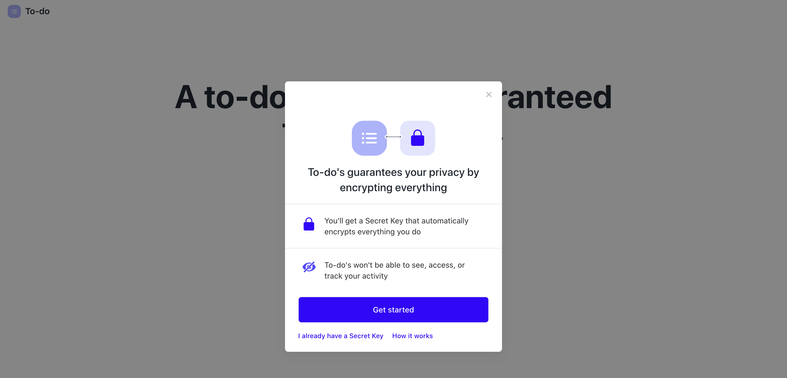
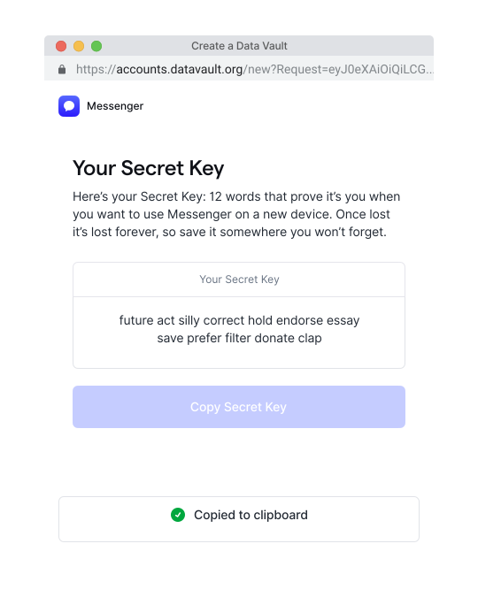
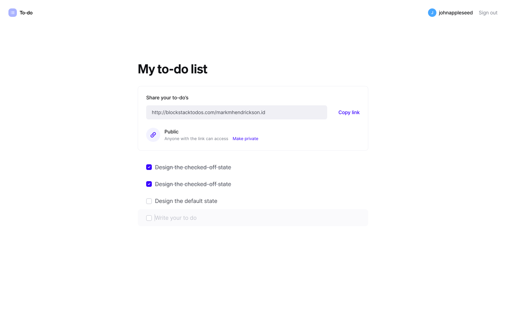

---

description: Single-page application with Blockstack

---
# Tutorial for App Integration
{:.no_toc}

In this tutorial, you will learn about Blockstack authentication and storage by installing, running and reviewing the code for a "Todos" web app built with Blockstack and [React](https://reactjs.org/).

This app highlights the following platform functionality:

- Generate Secret Key with associated Blockstack username to authenticate app
- Add, edit and delete encrypted app data with Gaia
- Decrypt data on Gaia for public sharing by URL
- Unauthenticate and re-authenticate app with Secret Key

[Preview the app](https://todos.blockstack.org) or [view its code on GitHub](https://github.com/blockstack/blockstack-todos).

Existing familiarity with React is recommended for reviewing this app's code.

* TOC
{:toc}

### Install and run the app

You must have recent versions of Git and [Node.js](https://nodejs.org/en/download/) (v12.10.0 or greater) installed already.


1. Install the code and its dependencies:

    ```
    git clone https://github.com/blockstack/blockstack-todos
    cd blockstack-todos
    npm install
    ```

2. Run the application:

    ```bash
    $ npm run start
    ```
    
    You should see output similar to the following:

    ```bash
      Compiled successfully!

      You can now view bs-todo in the browser.

        http://localhost:3000/

      Note that the development build is not optimized.
      To create a production build, use npm run build.
      ```

2. Open your local browser to [`http://localhost:3000`](http://localhost:3000) if it doesn't open automatically.
  
    You should see the app's landing page:

    

### Onboard into your first Blockstack app

1. Choose **Get started** to start onboarding into the app.

    The app displays a standardized introductory modal using [Blockstack Connect](https://github.com/blockstack/ux/tree/master/packages/connect), a JavaScript library that makes it easy to integrate Blockstack into the UI of any web app.

    

    Below, you can see the relevant parts of the [React component](https://reactjs.org/docs/react-component.html) that triggers this modal in [`src/components/Signin.jsx`](https://github.com/blockstack/blockstack-todos/blob/master/src/components/Signin.jsx):

    ```js
    import { useConnect } from '@blockstack/connect';

    export const Signin = () => {
      const { doOpenAuth } = useConnect();

      return (
        <Button onClick={() => doOpenAuth()}>Get Started</Button>
      );
    };

    ```

    This component imports the [React hook](https://reactjs.org/docs/hooks-overview.html) [`useConnect`](https://github.com/blockstack/ux/blob/master/packages/connect/src/react/hooks/use-connect.ts) from the Blockstack Connect library.

    `useConnect` returns many helper functions such as [`doOpenAuth`](https://github.com/blockstack/ux/blob/master/packages/connect/src/react/hooks/use-connect.ts#L33), which triggers this modal upon click of the "Get started" button.

    The modal is designed to prepare new users for a different type of relationship with Blockstack apps, one in which they authenticate with a *Secret Key* that's used to encrypt their private data.

    The modal displays the app's name and icon as configured in [`src/components/App.jsx`](https://github.com/blockstack/blockstack-todos/blob/master/src/components/App.jsx#L26):

    ```js

      appDetails: {
        name: 'Blockstack App',
        icon: window.location.origin + '/favicon.ico'
      }

    ```

    This component loads the [`UserSession`](https://blockstack.github.io/blockstack.js/classes/usersession.html) module from a second Blockstack library called [blockstack.js](https://github.com/blockstack/blockstack.js/), which complements Blockstack Connect by providing an API for many protocol-level operations, such as for authentication and storage.

    ```js

    import { UserSession } from 'blockstack';
    import { appConfig } from '../assets/constants'

    // ...

    const userSession = new UserSession({ appConfig })

    ```

    This module handles user session operations and is initiated using the [`appConfig`](https://github.com/blockstack/blockstack-todos/blob/master/src/assets/constants.js#L3) object, which contains an array of [scopes](/develop/overview_auth.html#scopes) that indicate just what permissions to grant during authentication:

    ```js
    export const appConfig = new AppConfig(['store_write', 'publish_data'])
    ```

    The `appDetails` and `userSession` objects are joined by the callback function [`finished`](https://github.com/blockstack/blockstack-todos/blob/master/src/components/App.jsx#L31) in configuring Blockstack Connect for authentication with the `authOptions` object:

    ```js
    finished: ({ userSession }) => {
      this.setState({ userData: userSession.loadUserData() });
    }

    ```

    This function simply saves data about the user into the app's state upon authentication.

    Further down in the component we see in [`componentDidMount`](https://github.com/blockstack/blockstack-todos/blob/master/src/components/App.jsx#L46) that it checks upon mount to either process completion of authentication with `userSession.handlePendingSignIn()` or otherwise load session data into app state as above with `userSession.isUserSignedIn()`:

    ```js
    componentDidMount() {
      if (userSession.isSignInPending()) {
        userSession.handlePendingSignIn().then((userData) => {
          window.history.replaceState({}, document.title, "/")
          this.setState({ userData: userData})
        });
      } else if (userSession.isUserSignedIn()) {
        this.setState({ userData: userSession.loadUserData() });
      }
    }
    ```


2. Choose **Get started** to generate a *Secret Key*.

    The app triggers a popup window in which [the Blockstack App](https://github.com/blockstack/ux/tree/master/packages/app) is loaded from [`app.blockstack.org`](http://app.blockstack.org/) and begins generating a new *Secret Key*.

    

3. Choose **Copy Secret Key** to copy your *Secret Key* to the clipboard.

    The *Secret Key* is a unique 12-word [mnemonic phrase](https://en.bitcoinwiki.org/wiki/Mnemonic_phrase) that empowers the user not only to access Blockstack apps securely and independently. It's also used to encrypt all of the private data they create and manage with Blockstack apps.

    *Secret Keys* are like strong passwords. However, they can never be recovered if lost or reset if stolen. As such, it's paramount that users handle them with great care.

   

4. Choose **I've saved it** to confirm you've secured your *Secret Key* in a suitable place.

   

5. Enter a username value and choose **Continue**

   The username will be used by the app to generate a URL for sharing your todos, should you choose to make them public.

   It is registered on the Stacks blockchain with the [Blockstack Naming System (BNS)](/core/naming/introduction.html) and associated with your *Secret Key*.

   

6. You've now completed onboarding into the app!

### Add, edit and delete todos privately

Once you've authenticated the app, you can can start adding todos by entering values into the "Write your to do" field and hitting "Enter".


The data for all todos are saved as JSON to the Gaia hub linked to your Secret Key using the [`putFile`](http://blockstack.github.io/blockstack.js/globals.html#putfile) method of the `userSession` object in the [`src/assets/data-store.js`](https://github.com/blockstack/blockstack-todos/blob/master/src/assets/data-store.js#L26) module:

```js
export const saveTasks = async (userSession, tasks, isPublic) => {
  await userSession.putFile(TASKS_FILENAME, JSON.stringify({ tasks, isPublic }), {
    encrypt: !isPublic,
  });
};
```

These todos are subsequently loaded using the [`getFile`](http://blockstack.github.io/blockstack.js/globals.html#getfile) method of the same object in the same module:

```js
export const fetchTasks = async (userSession, username) => {
  const tasksJSON = await userSession.getFile(TASKS_FILENAME, {
    decrypt: false,
    username: username || undefined,
  });
  // code to format and return the tasks
};
```

By default, the `putFile` and `getFile` methods automatically encrypt data when saved and decrypt it when retrieved, using the user's Secret Key. This ensures that only the user has the ability to view this data.

When deleting a todo, the same `putFile` method is used to save a new JSON array of todos that excludes the deleted todo.

### Publish your todos publicly

If you wish to make your todos accessible to the public for sharing via URL, select "Make public".



This will call `saveTasks` with the `isPublic` parameter set to `true`, which is used to disable encryption when using `putFile`.

The app will now show all of your todos to anyone who visits the URL displayed with your Blockstack username as a suffix.

### Sign out and see your public tasks


This triggers an event, which [under the hood](https://github.com/blockstack/blockstack-todos/blob/master/src/components/Header.jsx#L47) calls the [`signUserOut` method](https://blockstack.github.io/blockstack.js/classes/usersession.html#signuserout) of the `UserSession` object.

Now, visit the URL that was provided to you when you made your tasks public. This url is of the format `/todos/:username`, so if your username is `jane_doe.id.blockstack`, the URL would be [`localhost:3000/todos/jane_doe.id.blockstack`](http://localhost:3000/todos/jane_doe.id.blockstack).

When you visit this page, the `TodoList.jsx` component detects that there is a username in the URL. When there is a username, it calls `fetchTasks`, this time providing the `username` argument. This `username` option is then passed to `getFile`, which will lookup where that user's tasks are stored.

### Sign back in

At this point, you will be logged out from the app but not you'll still have an active session with the Blockstack app itself on [app.blockstack.org](https://app.blockstack.org). Navigate to app.blockstack.org and select "Sign out" there if you want to deauthenticate the Blockstack app as well.


Signout is handled in `src/components/App.js`.

```js
  handleSignOut(e) {
    e.preventDefault();
    userSession.signUserOut(window.location.origin);
  }
```

Read [the Blockstack Connect guide](/develop/connect/get-started.html) and [the blockstack.js reference](https://blockstack.github.io/blockstack.js/) to learn more about the libraries used in this tutorial.

