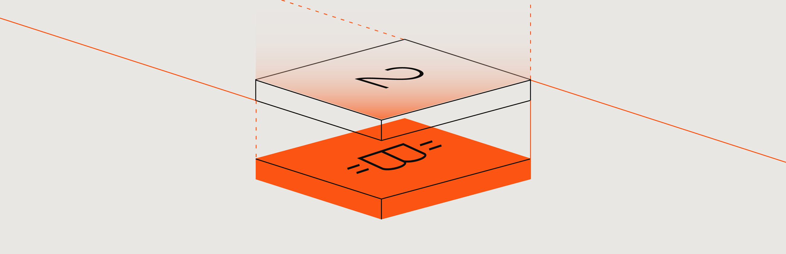

# Introduction

<figure><figcaption></figcaption></figure>

<strong>New to building with Stacks? Check out these weekly virtual meets!</strong>

* **Stacks DevRel office hours**: Follow and enable notifications for [@StacksDevs](https://x.com/StacksDevs) on Twitter to catch alerts for our weekly livestreams every Thursday at 10am EST. Office Hours are the easiest way to stay in the loop on product drops, live demos, community builder spotlights, and more. Stay up-to-date with release discussions, real-time walkthroughs, and builder highlights that matter.
* **Clarity Working Group**: An open, developer-focused initiative dedicated to supporting builders across the Stacks ecosystem. The group brings together experienced Clarity engineers (“Clarity giga chads”), auditors, educators, grant project teams, and new developers to collaborate, learn, and advance smart contract development on Bitcoin. Check out the calendar [link](https://www.addevent.com/event/yc0x95fky8y4) to join every other Tuesday.
* **AI BTC Working Group:** Join the **AI BTC Working Group**'s (WG) weekly meeting on AIBTC's twitter account, where they delve into the exciting intersection of AI and Bitcoin. Check out the calendar [link](https://www.addevent.com/event/c3qjy462xr82) to join every Thursday.
* **Runes Capsule Webinars:** Join a weekly deep-dive into Runes Capsule architecture, Bitcoin bridging, and trust minimized design patterns on Stacks. Check out this [link](https://calendar.google.com/calendar/u/0/r?cid=b247d75eb1a11dc3ebbf0c62eb4a1c83b4a53d4d2f903eaa19d685f28f087f92%40group.calendar.google.com) to join every Sundays.


Stacks ranks #5 among all crypto ecosystems for new developers in 2025! \[source: Electric Capital]


### Hello, Builders 👋

Stacks is a fast, low-cost, builder-friendly layer 2 network on Bitcoin. It’s built on Bitcoin, inheriting Bitcoin’s battle-tested security. By jumping into our docs, you’re joining the Stacks builder community that’s bringing a global onchain economy to Bitcoin.

If you're here on this page, hopefully you've already gotten a good sense of _what_ Stacks' purpose is, if not, head to the [Learn](https://app.gitbook.com/o/hoh4mQXTl8NvI3cETroY/s/H74xqoobupBWwBsVMJhK/) section. Or if you're still on the edge of _why_ you should build with Stacks, head to [Why Build with Stacks](get-started/readme/why-build-with-stacks.md).

***

### How to use these docs

The Stacks documentation is organized into a set of top-level sections, each aligned to a distinct stage of a developer’s journey—from learning core concepts to building applications and operating infrastructure.



**How does the Stacks network&#x20;**_**actually**_**&#x20;work?**\
The [Learn](https://app.gitbook.com/s/H74xqoobupBWwBsVMJhK/) section focuses on building a strong academic foundation. It explains how Stacks functions as a Bitcoin layer 2, providing clarity and context around the network’s design and mechanics.

Topics include Proof of Transfer (PoX), Bitcoin finality, block production, the transaction lifecycle, and more. If you want a deep understanding of how Stacks anchors to Bitcoin and why it works the way it does, this is the best place to start.



**How do you build on Stacks?**\
This section is for experienced developers, but are new to Stacks, who are in the exploratory phase of understanding the general workflow of building apps on Stacks. These guides focus on accomplishing specific tasks—writing contracts, integrating wallets, working with sBTC or USDC—without extensive explainers.

It includes curated quick starts for smart contract development with Clarinet and frontend development with Stacks.js, along with step-by-step guides covering common use cases such as integrating sBTC, onboarding users, working with price oracles, and more.



**How do you run Stacks infrastructure?**\
The [Operate](https://app.gitbook.com/s/4cpTb2lbw0LAOuMHrvhA/) section is designed for node operators and infrastructure providers. It covers how to run and manage Stacks nodes, signers, and miners.

If you’re responsible for operating or maintaining Stacks-related infrastructure, this section contains the resources you’ll need.



**Where do you look up technical details?**\
The [Reference](https://app.gitbook.com/s/GVj1Z9vMuEOMe7oH7Wnq/node-operations/readme) section contains authoritative technical documentation for Stacks devtools and APIs. This includes function and type definitions for Clarity and Stacks.js, API endpoint schemas, and interactive API playgrounds.

If you’re an experienced Stacks developer looking to quickly reference a specific method, type, or API response, this section is built for fast lookup and precision.



**Looking for a more guided, lesson-oriented experience?**\
The [Tutorials](https://app.gitbook.com/s/skGYu79qDNfITOqDNU3s/) section is designed for complete beginner developers who want structured, long-form lessons rather than quick answers.

These tutorials provide step-by-step walkthroughs alongside in-depth explanations of the underlying concepts. The goal isn’t just to help you complete a task, but to help you understand _why_ things work the way they do as you build.

If you’re a complete beginner and prefer a classroom-style, concept-driven learning experience—this section is the best place to start.



***

### Pick your learning path

We all have different styles of learning. If you've already got a good concept of web3 fundamentals and want to get a quick taste of what the DevEx is like on Stacks, then check out the [Developer Quickstart](get-started/developer-quickstart.md). Or find the path that clicks for you — and if bandwidth allows, tackle them all!

<table data-card-size="large" data-view="cards"><thead><tr><th></th><th></th><th data-hidden data-card-target data-type="content-ref"></th></tr></thead><tbody><tr><td><h4><strong>Try the Developer Quickstart</strong></h4></td><td>Your 0→1 guide for building a Clarity contract and app on Stacks.</td><td><a href="get-started/developer-quickstart.md">developer-quickstart.md</a></td></tr><tr><td><h4><strong>Start Learning Clarity</strong></h4></td><td>An easy starting point for learning smart contracts.</td><td><a href="get-started/clarity-crash-course.md">clarity-crash-course.md</a></td></tr><tr><td><h4><strong>Bitcoin Primer Tutorial</strong></h4></td><td>A comprehensive end-to-end experience to building full-stack dApps on Bitcoin.</td><td><a href="https://app.gitbook.com/s/skGYu79qDNfITOqDNU3s/bitcoin-primer">Bitcoin Primer</a></td></tr><tr><td><h4><strong>Earn a Stacks Developer Degree</strong></h4></td><td>A hands-on Stacks bootcamp by LearnWeb3.</td><td><a href="https://learnweb3.io/degrees/stacks-developer-degree/">https://learnweb3.io/degrees/stacks-developer-degree/</a></td></tr><tr><td><h4><strong>Watch Our Hands-On Videos</strong></h4></td><td>Developer insights and workshops from the Stacks ecosystem</td><td><a href="https://www.youtube.com/@stacks-developers">https://www.youtube.com/@stacks-developers</a></td></tr><tr><td><h4><strong>Clarity Development Using Clarinet</strong></h4></td><td>The smart contract toolkit for Stacks</td><td><a href="/broken/pages/UK5Kgh2MHLoQvfoFVnLr">Broken link</a></td></tr></tbody></table>

***

### Who should use what

| If you are…                                                                               | First check out...                                                                                                                                                                                                              |
| ----------------------------------------------------------------------------------------- | ------------------------------------------------------------------------------------------------------------------------------------------------------------------------------------------------------------------------------- |
| Completely new to building with Stacks                                                    | [Developer Quickstart](get-started/developer-quickstart.md)                                                                                                                                                                     |
| Learning smart contract development                                                       | [Clarity Crash Course](get-started/clarity-crash-course.md), [Learn Clarinet](/broken/pages/UK5Kgh2MHLoQvfoFVnLr)                                                                                                               |
| Preferring a structured, guided course that shows you every step to build full-stack apps | [Stacks Developer Degree](https://learnweb3.io/degrees/stacks-developer-degree/), [Bitcoin Primer](https://app.gitbook.com/s/skGYu79qDNfITOqDNU3s/bitcoin-primer/introduction), [EasyA](https://www.easya.io/challenges/stacks) |
| Wanting to integrate sBTC in your app                                                     | [sBTC guides](more-guides/sbtc/)                                                                                                                                                                                                |
| Launching a token                                                                         | [Create Tokens](get-started/create-a-token/)                                                                                                                                                                                    |
| Interested in security / auditing / grants                                                | [Stacks Bug Bounties](https://immunefi.com/bug-bounty/stacks/information/), [Stacks Foundation](https://stacks.org/grants)                                                                                                      |
| Curious about current use cases                                                           | [Use Cases](get-started/use-cases/)                                                                                                                                                                                             |
| Searching for a complete list of devtools                                                 | [Stacks Devtools Ecosystem](stacks-devtools-catalog.md)                                                                                                                                                                         |

***

### Still got questions?

We know, it's a lot. But we, along with our large community, are always more than welcome to help you throughout your journey with Stacks.

* [**Stacks Discord**](https://discord.gg/stacks): Connect with other developers and our team
* [**Stacks Forum**](https://forum.stacks.org/): Ask questions and share projects
* [**Stacks Twitter**](https://x.com/StacksDevs)**:** Follow us on Twitter and ask us questions there&#x20;
