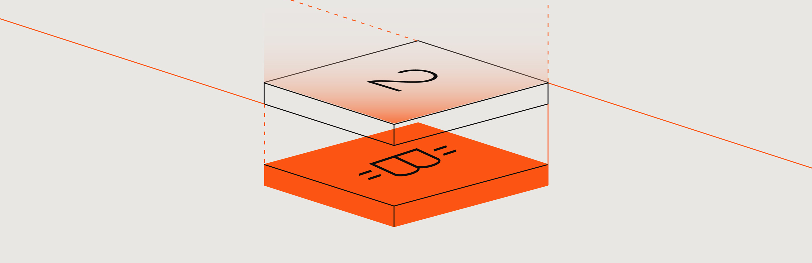

# Introduction

<figure><figcaption></figcaption></figure>

<strong>New to building with Stacks? Check out these weekly virtual meets!</strong>

* **Stacks DevRel office hours**: Follow and enable notifications for [@StacksDevs](https://x.com/StacksDevs) on Twitter to catch alerts for weekly livestreams every Thursday at 10am EST. Office Hours are the easiest way to stay up to date on product releases, live demos, community builder spotlights, and more.
* **Clarity Working Group**: An open, developer-focused initiative dedicated to supporting builders across the Stacks ecosystem. The group brings together experienced Clarity engineers, auditors, educators, grant teams, and new developers to collaborate, learn, and advance smart contract development on Bitcoin. Check out the calendar [link](https://www.addevent.com/event/yc0x95fky8y4) to join every other Tuesday.
* **AI BTC Working Group:** Join the AI BTC Working Group’s weekly meeting on AIBTC’s Twitter account, where they explore the intersection of AI and Bitcoin. Check out the calendar [link](https://www.addevent.com/event/c3qjy462xr82) to join every Thursday.

<strong>Join the Stackers community!</strong>

Stackers is a community of people building on Bitcoin with Stacks.

The purpose of the Stackers community is to provide guided learning paths, developer support, and a central place to discover new events, initiatives, and opportunities.

Join the [Stackers](https://www.skool.com/stackers)!


Stacks ranks #5 among all crypto ecosystems for new developers in 2025! \[source: [Electric Capital](https://x.com/Stacks/status/1978563911948370403)]


### Hello, Builders 👋

Stacks is a fast, low-cost, builder-friendly layer 2 network on Bitcoin. It is built on Bitcoin, inheriting its battle-tested security. By exploring these docs, you are joining a global community building an onchain economy on Bitcoin.

If you're here, you likely already understand what Stacks is. If not, head to the [Learn](https://app.gitbook.com/o/hoh4mQXTl8NvI3cETroY/s/H74xqoobupBWwBsVMJhK/) section. If you're still deciding why to build with Stacks, check out [Why Build with Stacks](get-started/readme/why-build-with-stacks.md).

***

### How to use these docs

The Stacks documentation is organized into top-level sections aligned with each stage of a developer’s journey—from learning core concepts to building applications and operating infrastructure.



**How does the Stacks network actually work?**  
The [Learn](https://app.gitbook.com/s/H74xqoobupBWwBsVMJhK/) section focuses on building a strong foundation. It explains how Stacks operates as a Bitcoin layer 2, providing clarity on its architecture and mechanics.

Topics include Proof of Transfer (PoX), Bitcoin finality, block production, transaction lifecycle, and more.



**How do you build on Stacks?**  
This section is for experienced developers who are new to Stacks and are exploring the workflow of building applications.

It includes quickstarts for smart contracts using Clarinet and frontend development with Stacks.js, along with guides for integrating sBTC, onboarding users, and working with oracles.



**How do you run Stacks infrastructure?**  
The [Operate](https://app.gitbook.com/s/4cpTb2lbw0LAOuMHrvhA/run-a-node) section is designed for node operators and infrastructure providers. It covers how to run and manage nodes, signers, and miners.




**Where do you find technical details?**  
The [Reference](https://app.gitbook.com/s/GVj1Z9vMuEOMe7oH7Wnq/node-operations/readme) section contains detailed documentation for devtools and APIs, including function definitions, schemas, and references.




**Looking for guided learning?**  
The [Tutorials](https://app.gitbook.com/s/skGYu79qDNfITOqDNU3s/) section provides step-by-step walkthroughs with deeper explanations to help you understand both how and why things work.




**Looking for code snippets?**  
The [Cookbook](https://app.gitbook.com/s/uholC0CdufHxYs050O3V/) section provides reusable Clarity and Stacks.js snippets for common use cases.




***

### Pick your learning path

We all have different learning styles. If you want a quick introduction, check out the [Developer Quickstart](get-started/developer-quickstart.md).

<table data-card-size="large" data-view="cards"><thead><tr><th></th><th></th><th data-hidden data-card-target data-type="content-ref"></th></tr></thead><tbody><tr><td><h4><strong>Try the Developer Quickstart</strong></h4></td><td>Your 0→1 guide for building a Clarity contract and app on Stacks.</td><td><a href="get-started/developer-quickstart.md">developer-quickstart.md</a></td></tr><tr><td><h4><strong>Start Learning Clarity</strong></h4></td><td>An easy starting point for learning smart contracts.</td><td><a href="get-started/clarity-crash-course.md">clarity-crash-course.md</a></td></tr><tr><td><h4><strong>Bitcoin Primer Tutorial</strong></h4></td><td>A comprehensive end-to-end experience for building full-stack dApps on Bitcoin.</td><td><a href="https://app.gitbook.com/s/skGYu79qDNfITOqDNU3s/bitcoin-primer">Bitcoin Primer</a></td></tr><tr><td><h4><strong>Earn a Stacks Developer Degree</strong></h4></td><td>A hands-on Stacks bootcamp by LearnWeb3.</td><td><a href="https://learnweb3.io/degrees/stacks-developer-degree/">https://learnweb3.io/degrees/stacks-developer-degree/</a></td></tr><tr><td><h4><strong>Watch Our Hands-On Videos</strong></h4></td><td>Developer insights and workshops from the Stacks ecosystem.</td><td><a href="https://www.youtube.com/@stacks-developers">https://www.youtube.com/@stacks-developers</a></td></tr><tr><td><h4><strong>Clarity Development Using Clarinet</strong></h4></td><td>The smart contract toolkit for Stacks.</td><td>Link currently unavailable</td></tr></tbody></table>

***

### Who should use what

| If you are… | First check out... |
|------------|------------------|
| Completely new | Developer Quickstart |
| Learning smart contracts | Clarity Crash Course |
| Want structured course | Stacks Developer Degree |
| Integrating sBTC | sBTC guides |
| Launching token | Create Tokens |

***

### Still got questions?

* Stacks Discord: https://discord.gg/stacks  
* Stacks Forum: https://forum.stacks.org/  
* Stacks Twitter: https://x.com/StacksDevs  
* Stackers: https://www.skool.com/stackers  
