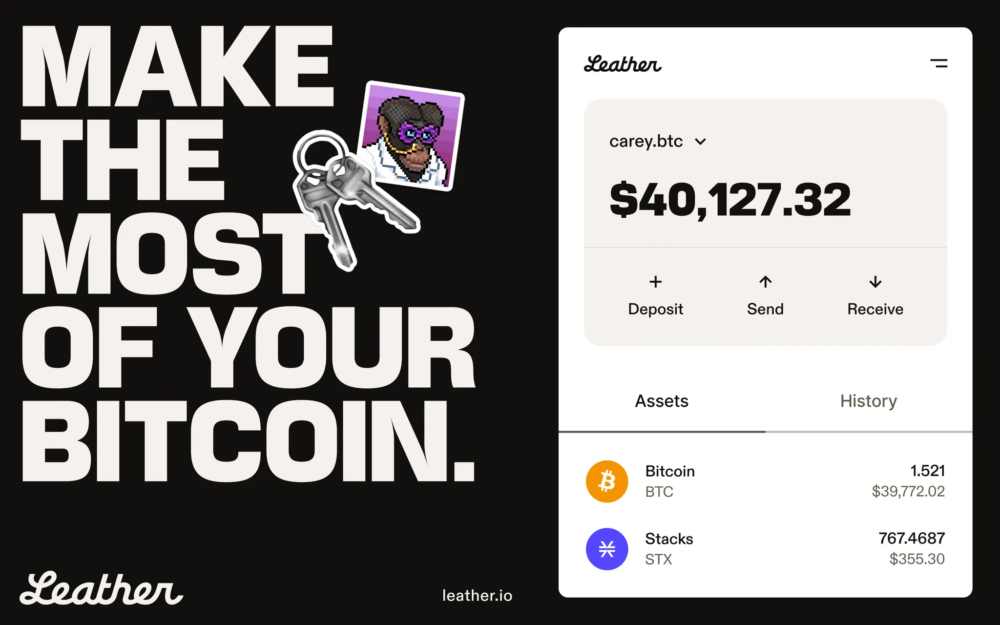

# Sending Bitcoin with Leather

<figure><figcaption><p>source: <a href="https://leather.io/">leather.io</a></p></figcaption></figure>

Using Leather's web wallet, you can initiate a simple Bitcoin transaction from a JS app in a few lines of code.


You must be authenticated with the Leather wallet for this to work. See the Authentication with Stacks.js tutorial for how to authenticate before using the API.




### Prepare the send call

Use the `window.btc?.request("sendTransfer", ...)` API to initiate a transaction. Provide the destination address and the amount in satoshis.

```javascript
const sendBitcoin = async () => {
  const resp = await window.btc?.request("sendTransfer", {
    address: "tb1qya9wtp4dyq67ldxz2pyuz40esvgd0cgx9s3pjl", // replace with the recipient address
    amount: "10000", // amount in satoshis
  });

  // Storing txid in local storage
  // We'll get back the transaction ID, which we can then use as needed
  if (typeof window !== "undefined") {
    localStorage.setItem("txid", JSON.stringify(resp.result.txid));
  }

  // Optionally mark the transaction as pending and poll a Bitcoin API (e.g., mempool.space) to check confirmation status
  localStorage.setItem("txStatus", "pending");
};
```



### Hook up the UI

Call the `sendBitcoin` function from your UI (for example, a button click).


```javascript
<button onClick={sendBitcoin}>Send Bitcoin</button>
```




### Next steps

* To verify a transaction was mined, use the returned txid and query a Bitcoin explorer or API (for example, mempool.space).
* See the "Verifying a transaction on the BTC chain" recipe for a more complete flow using the returned transaction ID as a starting point.




