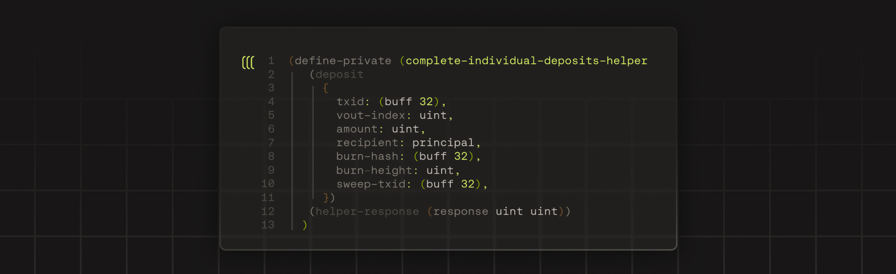

# Clarity Formatter

<div data-with-frame="true"><figure><figcaption></figcaption></figure></div>

The Clarity formatter automatically shapes your smart contract code to follow standardized style rules. Consistent formatting improves readability and makes collaboration easier across teams.

## Formatting philosophy

The formatter applies an opinionated standard designed to make Clarity code more readable:

* **Line length** – wraps lines at 80 characters by default
* **Indentation** – uses two spaces for consistency
* **Structure** – enforces consistent patterns for functions, let bindings, and control flow

You can customize these defaults to match your preferences.

### Integration points



**Clarity VS Code Extension**

Format directly in the editor.



**Clarinet CLI**

Format via command line, including entire projects.



## Comparison table

| Aspect            | Manual formatting      | Clarity formatter           |
| ----------------- | ---------------------- | --------------------------- |
| Consistency       | Varies by developer    | Uniform across the codebase |
| Speed             | Time-consuming         | Instant                     |
| Error-prone       | Yes                    | No                          |
| Team coordination | Requires a style guide | Automatic enforcement       |

## Best practices

* **Format on save** – enable automatic formatting in VS Code
* **Pre-commit hooks** – ensure code is formatted before commits
* **Team adoption** – share consistent settings with your team

## Formatting rules in detail

### Function definitions

Functions span multiple lines with consistent indentation:

```clarity
(define-public (my-func
    (amount uint)
    (sender principal)
  )
  (ok true)
)
```

Single arguments can remain on the first line:

```clarity
(define-read-only (get-balance (who principal))
  (ok u0)
)
```

### Let expressions

Bindings are placed on separate lines with consistent indentation:

```clarity
(let (
  (a u1)
  (b u2)
)
  (body-expression)
)
```

### Control flow (if, match)

Each branch receives its own line:

```clarity
(if condition
  (then-expression)
  (else-expression)
)

(match optional-value
  value (handle-some value)
  (handle-none)
)
```

### Tuples and maps

The formatter automatically converts to sugared syntax with proper formatting:

```clarity
;; Input: (tuple (n1 u1) (n2 u2))
;; Output:
{
  n1: u1,
  n2: u2,
}
```

## Usage examples

### VS Code integration

```json
// settings.json
"[clarity]": {
  "editor.formatOnSave": true
}
```

### CLI usage

```bash
clarinet format --in-place
```

Format with custom settings:

```bash
clarinet format -i 4 -l 120 --in-place
```

Check formatting in CI/CD pipelines:

```bash
clarinet format --check
```

The `--check` flag validates that all Clarity files are properly formatted without changing them, which is ideal for continuous integration workflows.

## Ignoring blocks of code

Prevent formatting for specific code blocks:

```clarity
;; @format-ignore
(define-constant something (list
  1     2  3  ;; Preserves custom spacing
  4 5 ))
```
