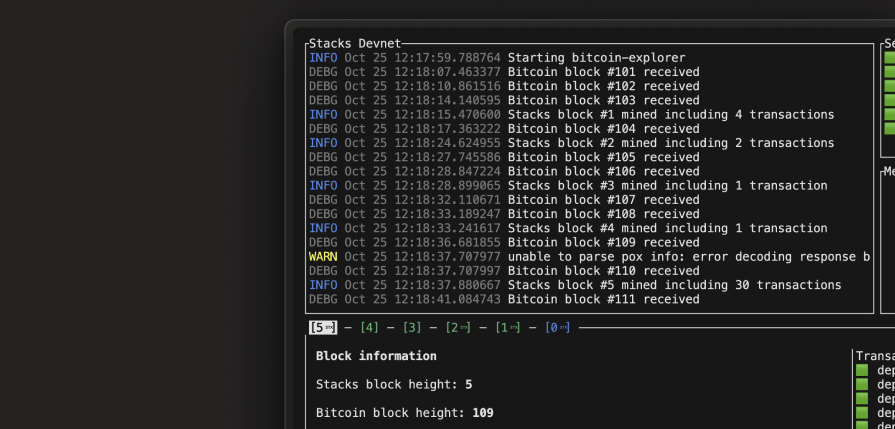

# Local Blockchain Development

<div data-with-frame="true"><figure><figcaption></figcaption></figure></div>

Clarinet ships with a complete local blockchain environment so you can build, test, and debug smart contracts without deploying to a public network. This environment is called Devnet.

<details>

<summary>What is Devnet?</summary>

* Devnet is a local blockchain development environment in which your smart contracts and front-end application can interact with simulated blockchain entities.
* With Devnet, your smart contract application can interact with simulated blockchain entities (miners, nodes, and a stream of mined blocks), all within your local machine.
* The entities Devnet simulates (other contracts, transactions, or nodes) resemble the conditions your application will meet in production.
* Devnet lets you create different blockchain configurations.
* You can share a simnet environment with other devs and collaborate with them.
* You can start Devnet at an arbitrary block height with a specified network upgrade at a later block, and with many simulated users, to see how your application responds.

</details>

## Starting your local blockchain

Launch Devnet with all required services:

```bash
clarinet devnet start
```

Useful flags:

| Option                           | Description                                                                             |
| -------------------------------- | --------------------------------------------------------------------------------------- |
| `--manifest-path <path>`         | Use an alternate `Clarinet.toml`                                                        |
| `--no-dashboard`                 | Stream logs instead of showing the interactive UI                                       |
| `--deployment-plan-path <path>`  | Apply a specific deployment plan                                                        |
| `--use-on-disk-deployment-plan`  | Use an existing plan without recomputing                                                |
| `--use-computed-deployment-plan` | Recompute and overwrite the plan                                                        |
| `--package <path>`               | Load a packaged Devnet configuration                                                    |
| `--from-genesis`                 | Skip the embedded Epoch 4.0 snapshot and boot from genesis, walking through every epoch |
| `--create-new-snapshot`          | Boot from genesis and save a new global snapshot after the first Epoch 4.0 Stacks block |


Prerequisites

Devnet requires Docker. If you see "clarinet was unable to create network," ensure Docker Desktop is running or the Docker daemon is started.


By default the dashboard displays service health, recent transactions, block production, contract deployments, and resource usage. Use `--no-dashboard` in CI or when you prefer streaming logs.

## Core services and features

Devnet starts these services:

| Service          | Port  | Purpose                                  |
| ---------------- | ----- | ---------------------------------------- |
| Stacks node      | 20443 | Processes transactions and mines blocks  |
| Bitcoin node     | 18443 | Provides block anchoring in regtest mode |
| Stacks API       | 3999  | REST API for blockchain data             |
| Postgres         | 5432  | Indexes blockchain data                  |
| Stacks Explorer  | 8000  | Browse transactions in a web UI          |
| Bitcoin Explorer | 8001  | View the Bitcoin regtest chain           |

Devnet includes pre-funded accounts:

```clarity
::get_assets_maps
;; +-------------------------------------------+-----------------+
;; | Address                                   | STX Balance     |
;; |-------------------------------------------+-----------------|
;; | ST1PQHQKV0RJXZFY1DGX8MNSNYVE3VGZJSRTPGZGM | 100000000000000 |
;; | ST1SJ3DTE5DN7X54YDH5D64R3BCB6A2AG2ZQ8YPD5 | 100000000000000 |
;; | ST2CY5V39NHDPWSXMW9QDT3HC3GD6Q6XX4CFRK9AG | 100000000000000 |
;; | ST2JHG361ZXG51QTKY2NQCVBPPRRE2KZB1HR05NNC | 100000000000000 |
;; | ST2NEB84ASENDXKYGJPQW86YXQCEFEX2ZQPG87ND  | 100000000000000 |
;; +-------------------------------------------+-----------------+
```

When Devnet starts, it automatically deploys your project contracts so you can interact with them immediately.

```
$ clarinet devnet start
Deploying contracts...
Deploying counter.clar        ✓  ST1PQHQKV0RJXZFY1DGX8MNSNYVE3VGZJSRTPGZGM.counter
Deploying token.clar         ✓  ST1PQHQKV0RJXZFY1DGX8MNSNYVE3VGZJSRTPGZGM.token
Deploying marketplace.clar   ✓  ST1PQHQKV0RJXZFY1DGX8MNSNYVE3VGZJSRTPGZGM.marketplace

All contracts deployed successfully
```

## Configuration and customization

Configuration files in your project control Devnet behavior.

### Basic configuration

`settings/Devnet.toml` defines network settings:

```toml
[network]
name = "devnet"

[devnet]
# Service ports
stacks_node_rpc_port = 20443
stacks_api_port = 3999
stacks_explorer_port = 8000
bitcoin_node_rpc_port = 18443

bitcoin_controller_block_time = 30_000  # 30 seconds

disable_bitcoin_explorer = false
disable_stacks_explorer = false
disable_stacks_api = false
```

### Port configuration

Avoid local conflicts by customizing ports:

```toml
[devnet]
stacks_node_rpc_port = 30443
stacks_api_port = 4999
postgres_port = 6432
stacks_explorer_port = 4020
```

### Mining intervals

Control block production speed. Set the key once; the commented lines show other values:

```toml
[devnet]
bitcoin_controller_block_time = 30_000      # 30 seconds, the generated default
# bitcoin_controller_block_time = 1_000     # 1 second, fast development
# bitcoin_controller_block_time = 120_000   # 2 minutes
```

### Custom accounts

Add accounts with specific balances:

```toml
[accounts.treasury]
mnemonic = "twice kind fence tip hidden tilt action fragile skin nothing glory cousin"
balance = 10_000_000_000_000

[accounts.alice]
mnemonic = "female adjust gallery certain visit token during great side clown fitness like"
balance = 5_000_000_000_000
```

## Accessing services

Devnet exposes several ways to interact with the blockchain.

### Stacks Explorer

Visit the explorer to browse transactions, blocks, contract state, and account balances:

```
http://localhost:8000
```

### API endpoints

Query blockchain data with the Stacks API:

```bash
curl http://localhost:3999/v2/info
```

Common endpoints:

* `/v2/info`: network information
* `/v2/accounts/{address}`: account details
* `/v2/contracts/source/{address}/{name}`: contract source code
* `/extended/v1/tx/{txid}`: transaction details

### Direct RPC

Submit transactions directly to the Stacks node:

```bash
curl -X POST http://localhost:20443/v2/transactions \
  -H "Content-Type: application/json" \
  -d @transaction.json
```

Useful RPC endpoints:

* `/v2/transactions`: broadcast transactions
* `/v2/contracts/call-read`: read-only contract calls
* `/v2/fees/transfer`: fee estimates for STX transfers

## Advanced configuration

### Performance optimization

For faster development cycles:


```toml
[devnet]
bitcoin_controller_block_time = 1_000

disable_bitcoin_explorer = true
disable_stacks_explorer = true
disable_stacks_api = false
```


### Epoch configuration

Devnet activates each Stacks epoch at a Bitcoin block height set under `[devnet]` in `settings/Devnet.toml`. These are the Clarinet v3.24.1 defaults; a key you leave out takes the default.

```toml
[devnet]
epoch_2_0 = 100
epoch_2_05 = 100
epoch_2_1 = 101
epoch_2_2 = 102
epoch_2_3 = 103
epoch_2_4 = 104
epoch_2_5 = 108
epoch_3_0 = 142   # Nakamoto
epoch_3_1 = 144
epoch_3_2 = 146
epoch_3_3 = 148
epoch_3_4 = 150
epoch_4_0 = 162   # PoX-5 and Clarity 6
```

Devnet's PoX cycle is 20 Bitcoin blocks long with a 5-block prepare phase, starting at block 100. `epoch_3_0` has to fall inside a reward phase; Clarinet refuses to start otherwise and names the offending height in the error.

By default `clarinet devnet start` restores an embedded snapshot taken after the first Epoch 4.0 Stacks block, so the chain is in Epoch 4.0 with `pox-5` deployed as soon as the dashboard shows the network ready. Changing any `epoch_*` height makes the snapshot unusable; Clarinet prints which fields differ from the snapshot and boots from genesis instead, which takes longer because every epoch transition is mined live. `--from-genesis` forces that path without editing the file.

To test against PoX-5 on Devnet, keep the defaults. To test a contract's behavior across an epoch boundary, raise `epoch_4_0` so the contract deploys before it, then watch the transition in the `--no-dashboard` logs.


Devnet accounts carry an `sbtc_balance` next to `balance` in `settings/Devnet.toml` (1,000,000,000 sats for the generated wallets). Devnet funds each account's `sbtc_balance` on both snapshot and genesis boots, so sBTC-backed bond tests have a balance to draw on.


### Custom node/signer images

Clarinet runs Devnet with a pinned tag for each Docker image. Clarinet v3.24.1 uses:

* stacks node: `ghcr.io/stacks-network/stacks-core:4.0.1-alpine`
* stacks signer: `ghcr.io/stacks-network/stacks-signer:4.0.1-alpine`

Keep the defaults unless you are testing a node build. The Clarinet release pins the image that matches its epoch defaults; an older node image cannot reach `epoch_4_0`.

To run other images, set `stacks_node_image_url` and `stacks_signer_image_url` under `[devnet]` in `settings/Devnet.toml`. This example runs the stacks-core 4.0.4 release in its Debian build, pinned by digest so the image cannot change under the same tag:

```toml
# settings/Devnet.toml
[network]
name = "devnet"
deployment_fee_rate = 10

# ...

[devnet]
# stacks-core 4.0.4 (Debian)
stacks_node_image_url = "ghcr.io/stacks-network/stacks-core@sha256:a35bf7468139469c3da248f37396d59eed51f9c4df86a9b28df73814d13d38fa"
# stacks-signer 4.0.4 (Debian)
stacks_signer_image_url = "ghcr.io/stacks-network/stacks-signer@sha256:af346187bc779d75daef47baaa12a0ece7fda78b5357f338d2db5536dd176608"
```

For the Alpine builds of the same release, use the `4.0.4-alpine` tags (`ghcr.io/stacks-network/stacks-core:4.0.4-alpine` and `ghcr.io/stacks-network/stacks-signer:4.0.4-alpine`).

Clarinet does not compare the image when it decides whether to restore its snapshot: the check covers the `epoch_*` heights, the signer keys, and the stacking orders. A custom image therefore still starts from the snapshot embedded in the Clarinet release. Add `--from-genesis` to boot the custom image from genesis instead.

<details>

<summary>Build an image locally and use it</summary>

* Clone the stacks-core repository (or a fork) and check out the release tag or branch you want to test.

```
git clone git@github.com:stacks-network/stacks-core.git
cd stacks-core
git checkout 4.0.4
```

* Build the Docker image `stacks-node:local`:

```
docker build -t stacks-node:local -f ./Dockerfile ./
```

* Clarinet needs the image in a registry. You can host a local one and push the image to it:

```
docker run -d -e REGISTRY_HTTP_ADDR=0.0.0.0:5001 -p 5001:5001 --name registry registry:2
docker tag stacks-node:local localhost:5001/stacks-node:local
docker push localhost:5001/stacks-node:local
```

* Set the image:

```
# settings/Devnet.toml
[network]
name = "devnet"
deployment_fee_rate = 10

# ...

[devnet]
stacks_node_image_url = "localhost:5001/stacks-node:local"
```

* Then start Devnet:

```
clarinet devnet start
```

</details>

### Package deployment

Create reusable Devnet configurations:

```bash
$ clarinet devnet package --name demo-env
Packaging devnet configuration...
Created demo-env.json
```

Use a packaged configuration:

```bash
$ clarinet devnet start --package demo-env.json
```

## Common issues

<details>

<summary>Docker connection errors: "clarinet was unable to create network"</summary>

* Ensure Docker Desktop is running (macOS/Windows).
* Start the Docker daemon (`sudo systemctl start docker`) on Linux.
* Confirm permissions with `docker ps`.
* Reset Docker to factory defaults if problems persist.

Verify Docker status:

```bash
docker --version
docker ps
```

</details>

<details>

<summary>Port already in use: "bind: address already in use"</summary>

Find and stop the conflicting process (macOS/Linux):

```bash
lsof -i :3999
kill -9 $(lsof -t -i:3999)
```

Windows equivalent:

```bash
netstat -ano | findstr :3999
taskkill /PID <PID> /F
```

Or update ports in `settings/Devnet.toml`:

```toml
[devnet]
stacks_api_port = 4999
stacks_explorer_port = 4020
postgres_port = 6432
```

</details>

<details>

<summary>High resource usage (slow performance, high CPU or memory)</summary>

Optimizations:

```toml
[devnet]
disable_bitcoin_explorer = true
disable_stacks_explorer = true
bitcoin_controller_block_time = 60_000
```

Set Docker resource limits:

```bash
docker update --memory="2g" --cpus="1" <container_id>
```

Clean up old data:

```bash
clarinet devnet stop
docker system prune -a
rm -rf tmp/devnet
```

</details>

<details>

<summary>Network already exists: "network with name `.devnet` already exists"</summary>

Remove the orphaned network:

```bash
docker network rm <project>.devnet
```

If you're unsure of the name:

```bash
docker network ls | grep devnet
docker network rm <network-name>
```

Prevent the issue by stopping Devnet with `Ctrl+C` and pruning orphaned networks:

```bash
docker network prune
```

</details>

<details>

<summary>Docker stream error during startup: "Fatal: unable to create image: Docker stream error"</summary>

This error often occurs when Docker images are corrupted or when explorers fail to start properly.

**Solution 1: Disable explorers**

If you don't need the web explorers, disable them in `settings/Devnet.toml`:

```
[devnet]
disable_bitcoin_explorer = true
disable_stacks_explorer = true
```

**Solution 2: Clean Docker environment**

Remove all containers and images, then restart:

```
docker stop $(docker ps -a -q)
docker system prune -a
docker volume prune
```

**Solution 3: Full cleanup and restart**

```
docker stop $(docker ps -a -q)
docker network rm <project-name>.devnet
docker system prune --all --volumes
clarinet devnet start
```

</details>

<details>

<summary>Contract deployment failures</summary>

Ensure dependencies deploy first in `Clarinet.toml`:

```toml
[contracts.sip-010-trait]
path = "contracts/sip-010-trait.clar"

[contracts.token]
path = "contracts/token.clar"
```

Validate contracts before deployment:

```bash
clarinet check
```

Check logs:

```bash
clarinet devnet start --no-dashboard
```

Deploy manually if needed:

```bash
clarinet deployments generate --devnet
clarinet deployments apply --devnet
```

</details>

<details>

<summary>Epoch settings have no effect</summary>

Older versions of this page showed the epoch keys in a top-level `[epochs]` table. Clarinet reads them only under `[devnet]`. Move the keys there and start Devnet again.

</details>

***
