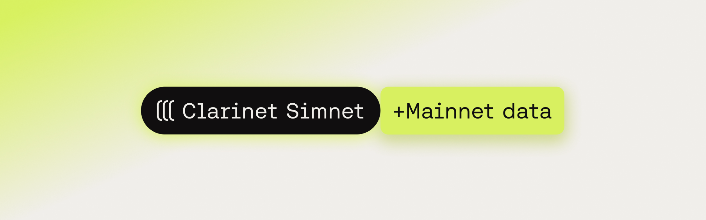

# Mainnet Execution Simulation

<div data-with-frame="true"><figure><figcaption></figcaption></figure></div>

Mainnet execution simulation (MXS) lets you test your Clarity contracts against real mainnet data without deploying experimental code. You can reproduce historical state, validate complex integrations, and debug edge cases while keeping the speed of local development.

## What you'll learn

* Set up MXS in a Clarinet project
* Write tests that interact with mainnet contracts
* Simulate historical transactions
* Understand MXS limitations

## What is Mainnet execution simulation?

Testing smart contracts in realistic conditions is essential. Simnet offers an isolated environment but lacks the live Stacks mainnet's complexity and history.

MXS fills this gap by enabling unit tests with the Clarinet JS SDK and Vitest to simulate the Stacks mainnet state at a specific block height. This allows you to:

* **Validate contract logic with real data:** Directly test mainnet contracts or data within your tests.
* **(Re)simulate transactions:** Analyze mainnet transactions' results, execution, or costs without deploying or using actual STX.

## Enable MXS in your project

Add the following configuration to your `Clarinet.toml` file:

```toml
[repl.remote_data]

# Enable mainnet execution simulation
enabled = true

# Specify the Stacks block height to fork from
initial_height = 522000

# API URL (optional, defaults to https://api.hiro.so)
api_url = 'https://api.hiro.so'
```


Pro tip

Set a specific `initial_height` to keep tests reproducible.


## Using mainnet addresses

When testing contracts that check or require mainnet addresses, set `use_mainnet_wallets = true`. This enables your simnet tests to use mainnet addresses (SP/SM) instead of testnet addresses (ST).

```toml
[repl.remote_data]
enabled = true
initial_height = 522000
use_mainnet_wallets = true  # !mark
```

This is particularly useful when:

* Testing against mainnet-only contracts like DEX protocols
* Your contract includes [`(is-standard standard-or-contract-principal)`](mainnet-execution-simulation.md) validation
* Simulating transactions that require mainnet address formats

## Configure API access

While MXS works without an API key, you may encounter rate limits. Set up an API key for reliable access:

```bash
export HIRO_API_KEY="<your-api-key>"
```

## Write tests with mainnet data

Once MXS is enabled, your tests automatically operate against the mainnet state snapshot. Here's an example testing against the mainnet `pox-4` contract:

```ts
import { describe, it, expect } from "vitest";
import { Cl } from "@stacks/transactions";

const accounts = simnet.getAccounts();
const deployer = accounts.get("deployer")!;

describe("pox-4 mainnet interaction", () => {
  it("reads current reward cycle from mainnet", () => {
    // Call the mainnet pox-4 contract
    const call = simnet.callReadOnlyFn(
      "SP000000000000000000002Q6VF78.pox-4", // Mainnet contract
      "current-pox-reward-cycle",
      [],
      deployer
    );

    // Assert the result (adjust based on your initial_height)
    expect(call.result).toBeUint(109);

    console.log("Current POX reward cycle:", Cl.prettyPrint(call.result));
  });
});
```

The test uses `simnet.callReadOnlyFn` just like in standard unit tests, but because MXS is enabled, it targets the actual `pox-4` contract state at the specified block height.

## Try it out

Run your test to see MXS in action:

```bash
npm run test
```

## Common issues

<details>

<summary>Rate limit errors</summary>

Solution: Set up the `HIRO_API_KEY` environment variable.

```bash
export HIRO_API_KEY="<your-api-key>"
```

</details>

<details>

<summary>Inconsistent results</summary>

Solution: Fix `initial_height` in configuration so tests are run against a reproducible block snapshot.

</details>

<details>

<summary>Function not found</summary>

Solution: Check the contract exists at your block height.

</details>

## Testing in the playground



**Visit the playground**

Go to: [https://play.hiro.so/?remote\_data=true](https://play.hiro.so/?remote_data=true)



**Run a mainnet contract call**

Example Clarity call:

```clarity
> contract-call? 'SP000000000000000000002Q6VF78.pox-4 current-pox-reward-cycle
```


