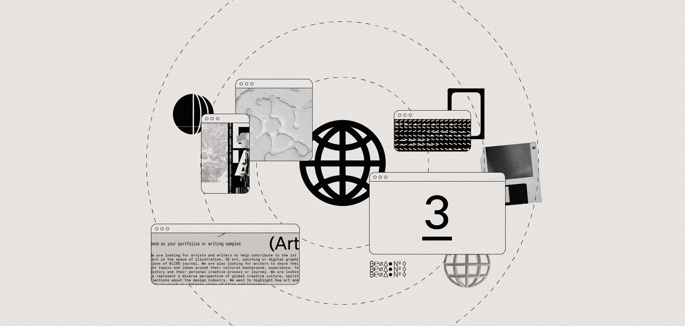

# Build a Frontend

<figure><figcaption>
source: <a href="https://www.hiro.so/blog/3-reasons-the-future-of-apps-will-be-decentralized">Hiro Blog</a>
</figcaption></figure>

A major part of building full-stack Stacks applications is creating a well designed UI with a solid UX. One of your primary tools for this is stacks.js, a JavaScript/Typescript library that simplifies working with contracts, wallets, and the Stacks network.


This section assumes you have basic knowledge in front-end development and bootstrapping frontend frameworks.


### Basic components to your Stacks frontend app

* [Authentication](authentication.md)
* [Post-Conditions](post-conditions.md)
* [Sending Transactions](sending-transactions.md)

### Stacks brand designs for your app's UI

Access the latest Stacks brand design resources at [stacks.co/brand](https://stacks.co/brand). Find and download Stacks brand design materials directly from the linked Figma space.



***

### Additional Resources

* \[[Hiro Blog](https://www.hiro.so/blog/rich-app-templates-in-the-hiro-platform)] Rich App Templates in the Hiro Platform: Accelerating Web3 Development
* \[[Hiro Blog](https://www.hiro.so/blog/lean-devops-strategies-for-your-web3-project)] Lean DevOps Strategies for Your Web3 Project
* \[[Hiro Blog](https://www.hiro.so/blog/introducing-stacks-js-starters-launch-a-frontend-in-just-a-few-clicks)] Introducing Stacks.js Starters: Launch a Frontend in Just a Few Clicks
