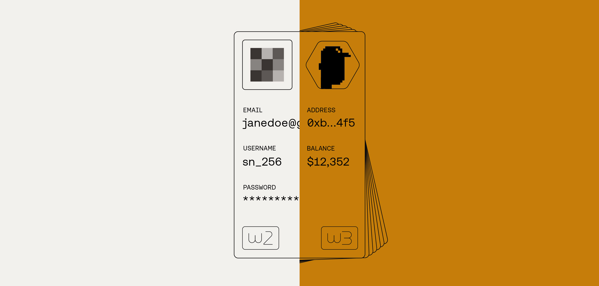

# Authentication

<figure><figcaption></figcaption></figure>

Authenticating (connecting wallets) with a Stacks-supported wallet is a common task when building Stacks apps. On a web2 app, authentication usually means sending credentials to a central provider, which then verifies you and controls access. In web3, authentication uses a wallet and cryptographic signatures with libraries like stacks.js, letting users prove identity without a central party holding the keys.


To learn more about how wallets and accounts work with Stacks, check out this [section](https://app.gitbook.com/s/H74xqoobupBWwBsVMJhK/network-fundamentals/wallets-and-accounts) in Learn.


Below is a simple example showing how to set up front-end authentication with `@stacks/connect` and access user data in the UI. The stacks.js monorepo contains several underlying packages specific to different use cases. The package `@stacks/connect` is the main connectivity package used in Stacks.

## Authentication on the frontend

Using `@stacks/connect` on the frontend will allow our frontend app to authenticate wallets, call our contract functions, and interact with the Stacks network.

In the snippet below, you'll notice we have 3 functions setup to handle `connectWallet` , `disconnectWallet`, and for `getBns` . All 3 functions will be integral in how we want to display the 'Connect' and 'Disconnect' button in the UI.


Retrieving a wallet account's associated [BNS](https://app.gitbook.com/s/H74xqoobupBWwBsVMJhK/network-fundamentals/bitcoin-name-system) is a staple of Stacks and for web3 identity. Check out [BNSv2](https://www.bnsv2.com/) for more information and for availably public API endpoints you could use.


<pre class="language-typescript" data-title="src/App.tsx" data-expandable="true"><code class="lang-typescript">import { connect, disconnect } from '@stacks/connect'
import type { GetAddressesResult } from '@stacks/connect/dist/types/methods'
import { useState } from 'react'

function App() {
  let [isConnected, setIsConnected] = useState&#x3C;boolean>(false)
  let [walletInfo, setWalletInfo] = useState&#x3C;any>(null)
  let [bns, setBns] = useState&#x3C;string>('')

<strong>  async function connectWallet() {
</strong>    let connectionResponse: GetAddressesResult = await connect()
    let bnsName = await getBns(connectionResponse.addresses[2].address)

    setIsConnected(true)
    setWalletInfo(connectionResponse)
    setBns(bnsName)
  }

<strong>  async function disconnectWallet() {
</strong>    disconnect();
  }
  
<strong>  async function getBns(stxAddress: string) {
</strong>    let response = await fetch(`https://api.bnsv2.com/testnet/names/address/${stxAddress}/valid`)
    let data = await response.json()

    return data.names[0].full_name
  }
  
  return (
    &#x3C;>
      &#x3C;h3>Stacks Dev Quickstart Message Board&#x3C;/h3>
      {isConnected ? (
        &#x3C;button onClick={disconnectWallet}>{
<strong>          bns ? bns : walletInfo.addresses[2].address
</strong>        }&#x3C;/button>
      ) : (
        &#x3C;button onClick={connectWallet}>connect wallet&#x3C;/button>
      )}
    &#x3C;/>
  )
}
</code></pre>

The `connect()` method comes with the ability to configure how you want the wallet selector modal to appear for your app. You can decide which wallets to have only appear as an option or allow any wallet that follows the SIP-030 standard to appear as an available Stacks wallet.

For the complete guides check out the [Stacks Connect](../../stacks-connect/connect-wallet.md) section.
