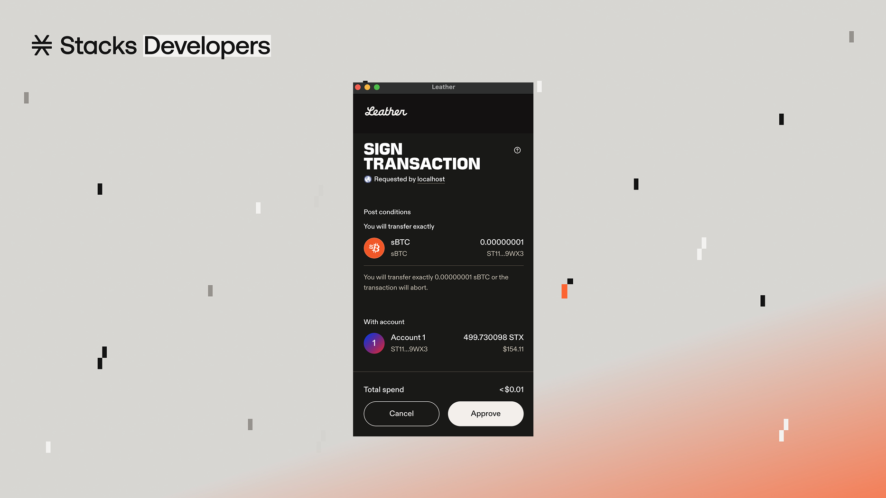
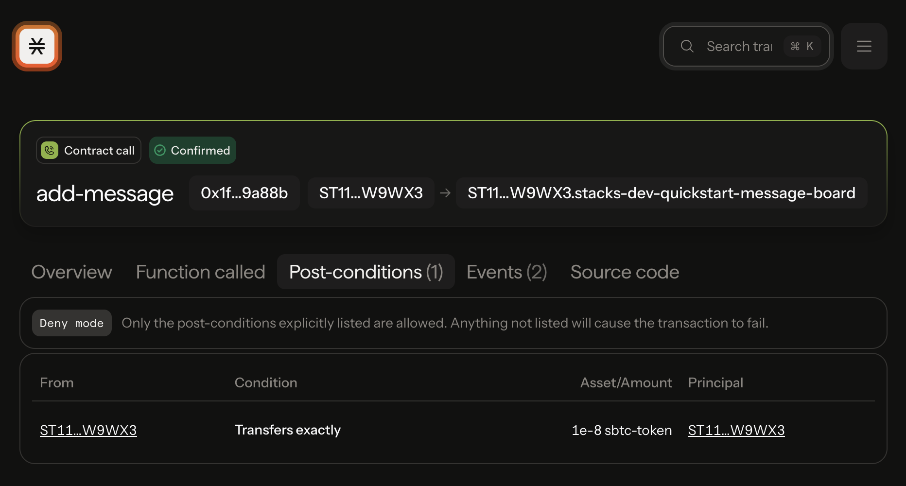

# Post-Conditions

### What are post-conditions?

Post-conditions are assertions about an on-chain transaction that must be met; otherwise, the transaction will abort during execution. In other words, post-conditions act as a safety net, allowing you to specify what state changes can occur in a transaction. This logic helps limit the amount of damage that can be done to a user and their assets, whether due to a bug or malicious behavior.

Post conditions are an additional safety feature built into the Stacks chain itself that help to protect end users. Rather than being a function of Clarity smart contracts, they are implemented on the client side and meant to be an additional failsafe against malicious contracts.

Put simply, post conditions are a set of conditions that must be met before a user's transaction will execute. The primary goal behind post conditions is to limit the amount of damage that can be done to a user's assets due to a bug, intentional or otherwise.

They are sent as part of the transaction when the user initiates it, meaning we need to implement post-conditions on the frontend. Whenever you are transferring an asset (fungible or non-fungible) from one address to another, you should take advantage of post conditions.


Head to the dedicated section on [post-conditions](../../post-conditions/overview.md) for more in-depth information.


We're going to use [stacks.js](https://github.com/stx-labs/stacks.js/tree/master/packages/transactions#post-conditions) to familiarize ourselves with constructing post-conditions on the frontend. And there are several different ways to construct post-conditions based on asset type.

### Simple example

In this example, we are attached a post-condition statement to a contract call transaction to protect the user's assets in the event the contract is malicious.

<pre class="language-typescript"><code class="lang-typescript">import { request } from '@stacks/connect'
import type { TransactionResult } from '@stacks/connect/dist/types/methods'
import { Pc } from '@stacks/transactions'

let postCond_1 = Pc.principal('ST11V9ZN6E6VG72SHMAVM9GDE30VD3VGW5Q1W9WX3')
  .willSendEq(1)
  .ft('ST1F7QA2MDF17S807EPA36TSS8AMEFY4KA9TVGWXT.sbtc-token', 'sbtc-token')

let result: TransactionResult = await request('stx_callContract', {
  // ...
<strong>  postConditions: [postCond_1],
</strong>  postConditionMode: 'deny',
  // ...
})
</code></pre>

Let's walkthrough the example above line-by-line to see what's happening when you attach a post-condition statement to a transaction.



#### Declare post-condition statement

```typescript
let postCond_1 = Pc
  // Specify who the sender of the expected sBTC transfer will originate from
  .principal('ST11V9ZN6E6VG72SHMAVM9GDE30VD3VGW5Q1W9WX3')
  // Specify the equality operator of the amount expected to be sent
  .willSendEq(1)
  // Specify the fungible token’s contract principal and asset name
  .ft('ST1F7QA2MDF17S807EPA36TSS8AMEFY4KA9TVGWXT.sbtc-token', 'sbtc-token')
```

In this statement, you are declaring that the principal (usually the user that'll call this function) `ST11V9ZN6E6VG72SHMAVM9GDE30VD3VGW5Q1W9WX3` should only expect to send out _exactly_ 1 satoshi of sBTC during the execution of this contract call transaction.&#x20;



#### Include post-condition statement to transaction params

<pre class="language-typescript"><code class="lang-typescript">let result: TransactionResult = await request('stx_callContract', {
  // ...
<strong>  postConditions: [postCond_1],
</strong>  // ...
})
</code></pre>

The transaction param of `postConditions` accepts an array of different post-condition statements. This means you can declare many post-condition statements of what the user should expect to happen during the execution of the transaction. This include any asset transfers coming from the user or from a contract.



#### Determine post-condition mode

The other related transaction param of `postConditionMode` is a special setting that is useful when you want to deal with other unexpected/unforeseen asset transfer events that the developer or user may not be aware of.&#x20;

<pre class="language-typescript"><code class="lang-typescript">let result: TransactionResult = await request('stx_callContract', {
  // ...
  postConditions: [postCond_1],
<strong>  postConditionMode: 'deny',
</strong>  // ...
})
</code></pre>

By setting the `postConditionMode` to `deny` we are stating that if any other asset transfers, besides the ones we've declared, happen during the execution of the transaction, then force the entire transaction to fail.



### How post-conditions appear to the user

Since post-conditions are declared on your frontend code, they also need to be visually displayed to users. Stacks-supported wallets handle that by displaying post-conditions on the transaction confirmation modals that popup when a user needs to confirm/approve a transaction.

<div data-with-frame="true"><figure><figcaption><p>Post-conditions when appeared in a wallet's transaction confirmation modal</p></figcaption></figure></div>

After transaction confirmation and broadcasting, users are also able to see what post-conditions were set in their transaction on the transaction page of the Stacks Explorer. This gives users and developers more confidence in analyzing transactions.

<div data-with-frame="true"><figure><figcaption><p>Analyze post-conditions set in transactions on the transactions page of the Stacks Explorer</p></figcaption></figure></div>

***

### Additional Resources

* \[[Post-Conditions](../../post-conditions/overview.md)] Dedicated section on post-conditions in these docs
* \[[Hiro YT](https://youtu.be/xXgQB8NfdEY?si=eSZp4tlLOCkkqGRS)] ELI5: Post-Conditions on Stacks
