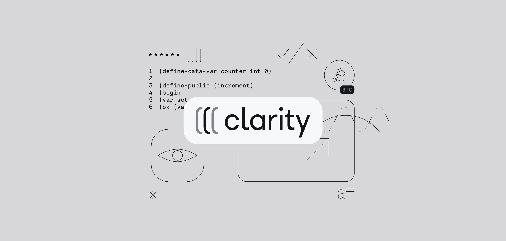
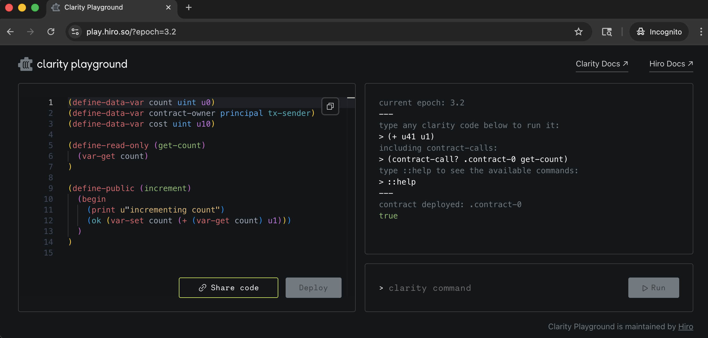
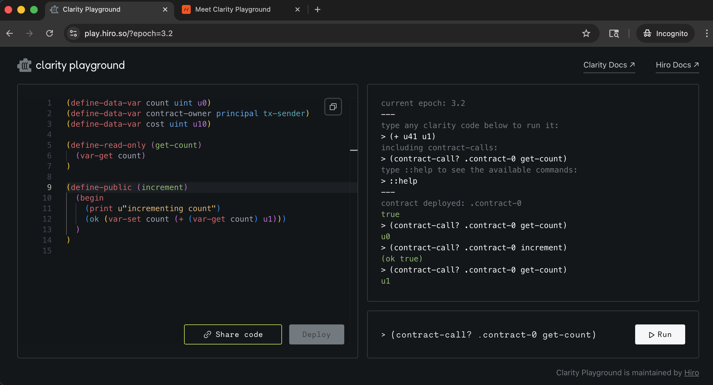
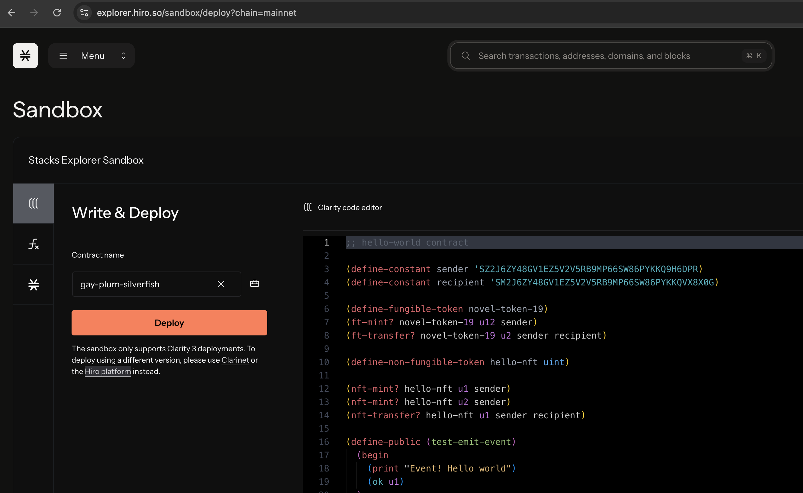
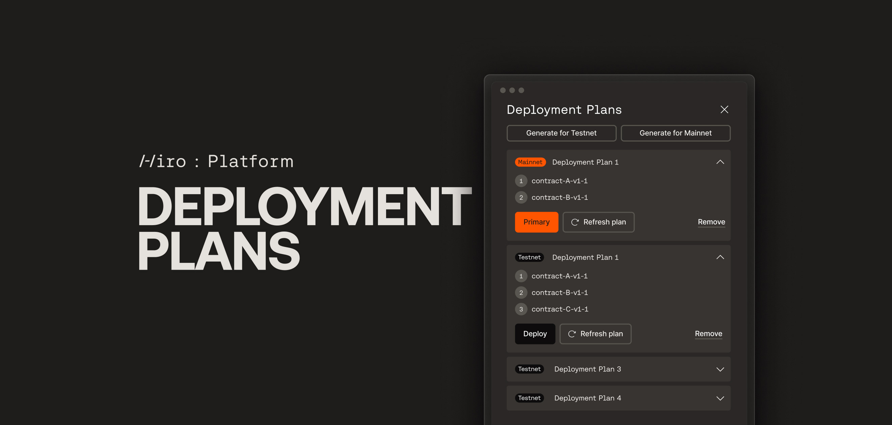

# Clarity Crash Course

<div data-with-frame="true"><figure><figcaption><p>source: <a href="https://www.hiro.so/blog/write-better-smart-contracts-with-the-programming-language-clarity">Hiro Blog</a></p></figcaption></figure></div>

### Intro

This is designed for people with some programming experience who are new to Clarity. You don't need prior smart contract development experience, but if you have experience with languages like Solidity, you'll pick this up quickly.

Once you've briefly familiarized yourself with the language, consider the [Clarity Book](https://book.clarity-lang.org/) or the course [Clarity Universe](https://clarity-lang.org/universe) to continue your learning.


Clarity is developed as a joint effort of [Hiro PBC](https://hiro.so/), [Algorand](http://algorand.com/), and various other stakeholders, that originally targets the Stacks blockchain.


### Your First Clarity Smart Contract

We're going to walkthrough a basic Clarity smart contract using the [Clarity Playground](https://play.hiro.so/), an online REPL environment where you can write and run Clarity code in the browser. Visit that link and it will open up a new example contract for you on the left view, with an interactive REPL on the right view.

<div data-with-frame="true"><figure><figcaption><p>The example counter contract provided when visiting the Clarity Playground</p></figcaption></figure></div>


Clarity Playground is a new tool to write and run Clarity code directly in the browser. With Clarity Playground, developers can test out concepts, try new ideas, or just, well…play around. Learn more [here](https://www.hiro.so/blog/meet-clarity-playground).


The example contract you'll see is a simple counter contract that will store the value of a `count` in a data variable and `increment` the count value by invoking a defined public function.


```clarity
(define-data-var count uint u0)
(define-data-var contract-owner principal tx-sender)
(define-data-var cost uint u10)

(define-read-only (get-count)
  (var-get count)
)

(define-public (increment)
  (begin
    (print u"incrementing count")
    (ok (var-set count (+ (var-get count) u1)))
  )
)
```


Clarity's syntax is inspired by LISP: everything is an expression wrapped in parentheses. Function definitions, variable declarations, and parameters are lists inside lists. This makes Clarity concise and readable once you get used to it. Here are some characteristics of Clarity you'll notice:



#### Everything in parentheses is an expression

Clarity treats everything as expressions inside parentheses. Function definitions are calls to built-in functions; the function body is an expression. This uniformity helps reasoning about programs in Clarity.



#### Uses LISP-like nesting

Expect nested parentheses and expressions. You’ll often read code as lists inside lists, where each parentheses-enclosed group represents a call or expression.




In Clarity, there are public, private, and read-only functions:

* public: can modify chain state and be called externally.
* private: can modify state but only be called within the contract.
* read-only: will fail if they attempt to modify state.


Let's expand on these ideas by walking through that example counter contract line by line.

#### Defining data variables

The built-in Clarity function of `define-data-var` allows you to define a new persisted variable for the contract. Only modifiable by the contract.

```clarity
;; defining a `count` variable to store a variable unsigned integer value
(define-data-var count uint u0)

;; defining a `contract-owner` for a specific `principal` value
(define-data-var contract-owner principal tx-sender)

;; defining a `cost` variable with an initial unsigned integer value of 10
(define-data-var cost uint u10)
```

#### Defining a read-only function to read the current count value

The built-in Clarity function of `define-read-only` defines a public read-only function. Cannot modify data maps or call mutating functions. May return any type.

```clarity
;; allows anyone to read the current `count` value in the contract
(define-read-only (get-count)
  (var-get count)
)
```

#### Defining a public function to increment the count value

This function prints a log event saying it's incrementing a counter, then reads the current counter, adds 1, saves it back on-chain, and returns success.

```clarity
;; Defines a public function named increment that anyone can call
(define-public (increment)
  ;; Starts a begin block, which allows multiple expressions to run in order.
  (begin
    ;; Logs/prints the text "incrementing count" (as a Unicode string) to 
    ;; the transaction output or event stream.
    (print u"incrementing count")
    ;; adds u1 to the current count and wraps the resulting value in a response type
    (ok (var-set count (+ (var-get count) u1)))
  )
)
```

### Interact With Your Contract

The Clarity Playground allows you to call your functions on the right side view via a REPL console that runs a simnet environment.

<details>

<summary><strong>What is Simnet?</strong></summary>

Simnet is optimized for providing fast feedback loops at the cost of correctness. Simnet does not provide a full simulated blockchain environment, so there are no concepts of transaction fees, new blocks, or consensus mechanisms.

Instead, simnet focuses on letting you quickly iterate on your code and test the code of the contract locally through unit testing and integration testing. It’s a good preliminary debugging step before introducing the additional variables that come with a fully-fledged blockchain environment.

Simnet is a local environment spun up on your machine and is a private instance—you cannot share a simnet environment with other devs and collaborate with them—and further, simnet has no persistent state. It resets with each run.

</details>

On page load of the Clarity Playground, the example counter contract is automatically deployed to the REPL console on the right side. If you made any changes to the contract in the code editor on the left view, be sure to click on Deploy.

Calling contracts in the console or calling any externally deployed contracts will need to be passed into the built-in Clarity function called `contract-call?` .

Follow the steps below to interact with your counter contract:



#### Call the read-only \`get-count\` function

In the bottom right Clarity command console, paste in the below command to call your `get-count` function to see the current `count` value.


```clarity
(contract-call? .contract-0 get-count)
```


The console should return an initial value of `u0` since we haven't incremented the `count` yet.



#### Call the public \`increment\` function

Now let's finally increment our count value. In the bottom right Clarity command console, paste in the below command to call your `increment` function, which will increment the `count` value by 1.

The console should return a value of `(ok true)` . This means the public function executed successfully and the count should have incremented.


```clarity
(contract-call? .contract-0 increment)
```




#### Call our \`get-count\` function again

To see if our count value was really incremented, let's call our read-only `get-count` function once again.


```clarity
(contract-call? .contract-0 get-count)
```


The console should now returns a value of `u1` which is exactly what we'd expect.

<div data-with-frame="true"><figure><figcaption></figcaption></figure></div>



Great! You just interacted with your first Clarity smart contract. Hopefully this gives you a good introduction to how the Clarity smart contract language looks and feels.

***

### Read Access into Bitcoin

Clarity smart contracts on the Stacks layer can also read Bitcoin state and can be triggered by standard Bitcoin transactions. This is because Stacks nodes also run Bitcoin nodes as part of consensus, and they read and index Bitcoin state.

Reading Bitcoin state in Clarity is made by possible by the built-in function: `get-burn-block-info?`  and the keyword `burn-block-height` .

* `burn-block-height` : This keyword returns the current block height of the underlying burnchain: Bitcoin. Check out the example snippet below:

```clarity
(> burn-block-height u1000) 
;; returns true if the current height of the underlying burn blockchain has passed 1000 blocks.
```

* `get-burn-block-info?` : This function fetches block data of the burnchain: Bitcoin. Check out the example snippet below:

```clarity
(get-burn-block-info? header-hash u677050)
;; Returns (some 0xe671...)
```

<details>

<summary>Verifying bitcoin transactions in Clarity</summary>

One of the most popular Clarity contracts that leverages read access into Bitcoin is the `clarity-bitcoin-lib` contract, maintained by Friedger. This contract intakes data of a bitcoin transaction and will verify that it was indeed mined in a Bitcoin block.

For more info: [https://github.com/friedger/clarity-bitcoin](https://github.com/friedger/clarity-bitcoin)

</details>

***

### Flexible and secure modularization

Many DAOs of the major Stacks apps implement a familiar contract design and architecture. This familiarity is inspired by the [ExecutorDAO](https://github.com/MarvinJanssen/executor-dao) framework, written by Marvin Janssen. This ExecutorDAO framework leverages the flexibility of having modularization in your smart contracts by compartmentalizing duties.

The core tenets of the ExecutorDAO framework that make this possible are:

1. Proposals are smart contracts.
2. The core executes, the extensions give form.
3. Ownership control happens via sending context.



The main DAO contract acts as the core contract where its sole purpose is to execute proposals and to keep a list of authorised extensions.


```clarity
(use-trait proposal-trait .proposal-trait.proposal-trait)
(use-trait extension-trait .extension-trait.extension-trait)

;; ...

;; --- Authorisation check
(define-private (is-self-or-extension)
	(ok (asserts! (or (is-eq tx-sender (as-contract tx-sender)) (is-extension contract-caller)) err-unauthorised))
)

;; ...

;; --- Admin function to execute proposals
(define-public (execute (proposal <proposal-trait>) (sender principal))
	(begin
		(try! (is-self-or-extension))
		(asserts! (map-insert executed-proposals (contract-of proposal) block-height) err-already-executed)
		(print {event: "execute", proposal: proposal})
		(as-contract (contract-call? proposal execute sender))
	)
)
```




This proposal contract updates the whitelist of an example `.nft-escrow` contract that is owned by the main DAO contract. This proposal contract implements the `proposal-trait` and is passed into the main DAO contract's `execute` function for final approved execution.


```clarity
(impl-trait .proposal-trait.proposal-trait)

(define-public (execute (sender principal))
	(contract-call? .nft-escrow set-whitelisted .some-nft true)
)
```




***

### Testing Clarity Smart Contracts

Once you get to writing more advanced smart contracts, properly testing them is paramount to protecting anyone who interacts with your contract.&#x20;


Smart contracts are immutable once deployed. Bugs are permanent. Test them thoroughly.


* [Rendezvous Fuzz Testing](../rendezvous/overview.md): Use Rendezvous to hammer your contract with random inputs. It helps expose edge cases and vulnerabilities.
* [Unit Testing in Clarinet](../clarinet/testing-with-clarinet-sdk.md): Unit testing verifies that individual contract functions behave as expected.&#x20;

***

### Auditing Clarity Smart Contracts

Auditors provide an independent, expert review of your smart contracts to identify vulnerabilities, logic flaws, edge cases, or design risks that might be missed during development. Here are a few Clarity smart contract auditors that are part of the Stacks community.

* [Clarity Alliance](https://x.com/ClarAllianceSec)
* [SetDev](https://x.com/setdevbtc)

***

### Deploying Clarity Smart Contracts

When you deploy a Clarity smart contract, you're uploading its code to the Stacks blockchain, making it immutable and publicly accessible. Deployment involves submitting a transaction that includes the smart contract code and specific parameters. Once deployed, the contract's logic is fixed, providing transparency and security by ensuring that no further changes can be made.


Do note that not all methods below will support the latest Clarity version.


Here are a few different ways to deploy a Clarity smart contract:

<details>

<summary>Clarinet</summary>

Clarinet is the CLI tool for all things Clarity contract development. Deploying contracts via Clarinet is by far the most conventional and common method. Using Clarinet also provides a myriad amount of configuration options for how you want your deployment to look like.

Check out the dedicated guide [here](../clarinet/contract-deployment.md) to learn how you can deploy contracts with Clarinet.

</details>

<details>

<summary>Stacks.js</summary>

Stacks.js is the frontend javascript library for interacting with the Stacks network. Many token launchpads, that enable no-code solutions for deploying a token, utilize Stacks.js for deploying contracts on the frontend or backend script.

Check out the dedicated guide [here](../stacks.js/contract-deployment.md) to learn how you can deploy contracts with Stacks.js.

</details>

<details>

<summary>Stacks Explorer Sandbox</summary>

The Sandbox in the [Stacks Explorer](https://explorer.stacks.co/) is an interactive Clarity code editor allowing you to write contracts, call functions of existing contracts, and also deploy contracts directly.

<div data-with-frame="true"><figure><figcaption></figcaption></figure></div>

</details>

<details>

<summary>Hiro Platform</summary>

The [Hiro Platform](https://platform.hiro.so/) is a hosted developer experience that enables you to create and deploy Clarity smart contracts directly from a web browser.

<div data-with-frame="true"><figure><figcaption></figcaption></figure></div>

</details>

***

### Smart Contract Monitoring & Alerts

Utilize tools that provide the event-driven infrastructure developers need to observe, index, and react to on-chain activity.

<details>

<summary>Contract Monitoring</summary>

The [Contract Monitoring](https://platform.hiro.so/contract-monitoring) features, available in the Hiro Platform, enable you to set alerts when specific functions are called in your smart contracts. This enables you to detect and respond to suspicious contract activities, enhancing the security of your app throughout the contract lifecycle.

</details>

<details>

<summary>Chainhooks</summary>

[Chainhooks](https://docs.hiro.so/tools/chainhook) indexes Stacks & Bitcoin data, exposes queryable APIs, tracks contract state and transactions. You simply describe your chainhook filters and consume webhooks. The service handles queueing, retries, tier limits, observability, and parity between testnet and mainnet.

</details>

***

### Additional Resources

This brief overview should get your feet wet with Clarity. For deeper learning, we recommend:

* [Clarity Book](https://book.clarity-lang.org/title-page.html)
* [Clarity Universe](https://clarity-lang.org/universe)
* [Clarity Playground](https://play.hiro.so/)
* [Clarity Camp](https://learn.stacks.org/course/clarity-camp)
* \[[StacksGov](https://github.com/stacksgov/sips/blob/main/sips/sip-002/sip-002-smart-contract-language.md)] SIP-002 The Clarity Smart Contract Language
* \[[Hiro Blog](https://www.hiro.so/blog/web3-programming-languages-clarity-vs-solidity)] Web3 Programming Languages: Clarity vs. Solidity
* \[[Stacks YT](https://youtu.be/hFqH1bJEvnw?si=yQADCvRNNjotuAga)] How Stacks' Language Clarity Enables Next Gen Smart Contracts
* \[[StacksDevs YT](https://www.youtube.com/watch?v=WZe1DgJ1w-E)] How Stacks’ Smart Contract Language Prevents Exploitation
* \[[Chainlink YT](https://youtu.be/OAVwd6SNJVU?si=UgfjmisBRbIYv27U)] Marvin Janssen: Clarity Smart Contracts for Stacks&#x20;
* [100+ Days of Clarity video series by Setzeus](https://youtube.com/playlist?list=PLFHm9eE6H5uhNQ4cUXRE-4HkXF1ekS0ZG\&si=q0NmD-e9_QBomK3a)
* \[[waits.dev](https://waits.dev/writing/clarity-vs-solidity)] Clarity vs Solidity

If you prefer jumping into Clarity's reference materials for definitions on all its types, functions, and keywords, head to [Clarity's Reference section](https://app.gitbook.com/s/GVj1Z9vMuEOMe7oH7Wnq/clarity/functions) of the docs.
