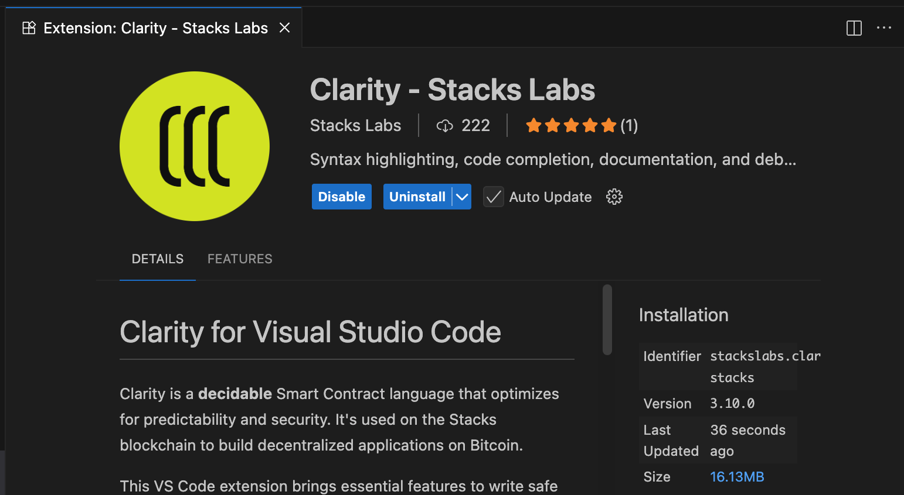
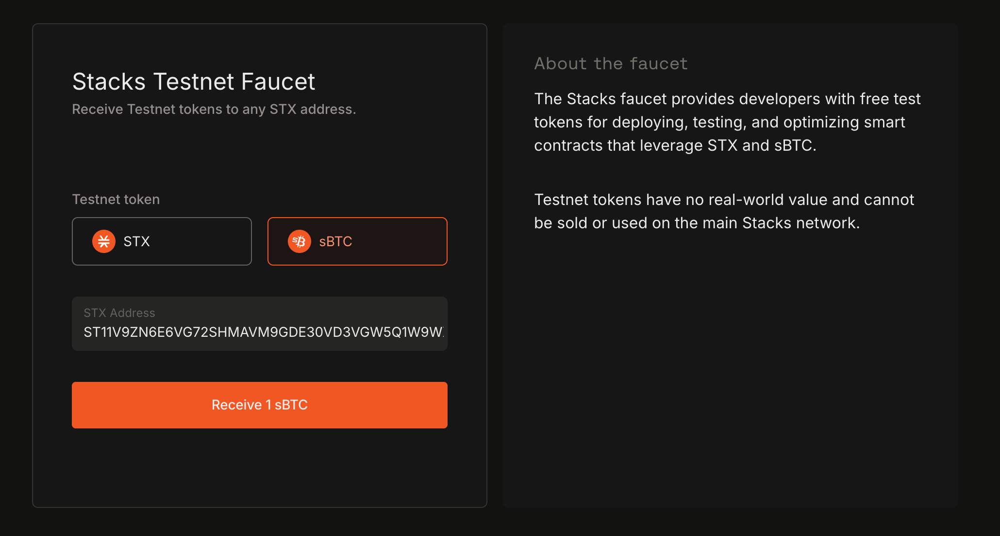
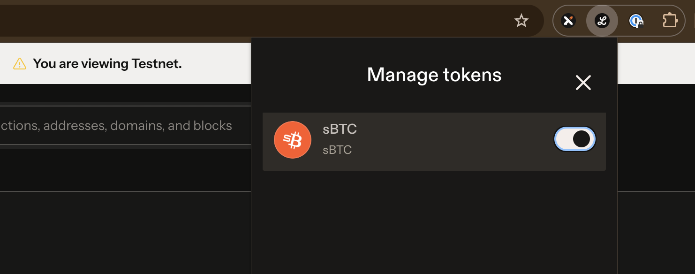
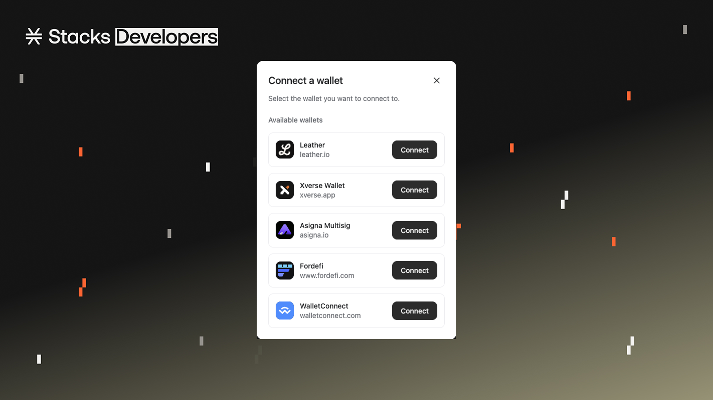
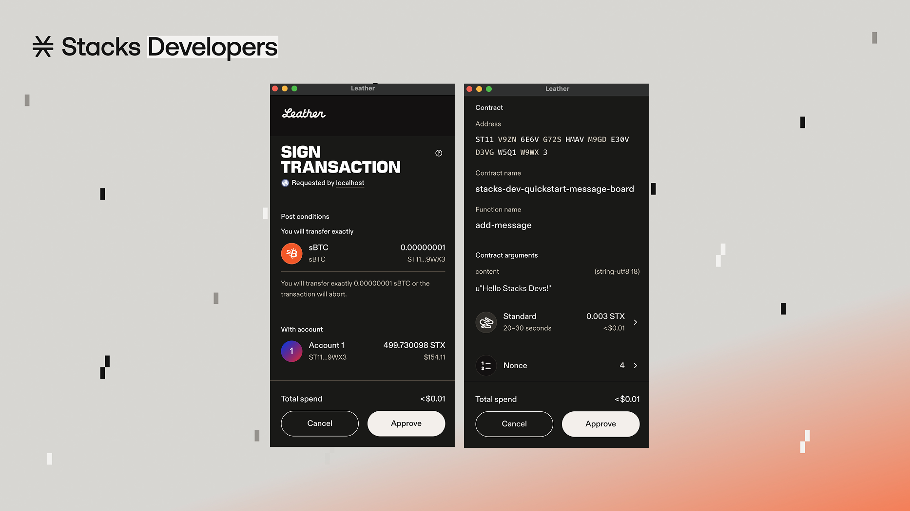

# Developer Quickstart

<figure><figcaption></figcaption></figure>

**Welcome to the Stacks Developer Quickstart Guide!**\
This is your fast-track path for understanding what you'll need to become a Stacks developer. In this guide, you’ll build a real Clarity smart contract, wire up a functioning Stacks app, and pick up about 75% of the practical knowledge every Stacks builder needs. Whether you’re shipping your first project or leveling up your skills, this guide takes you from zero to deployed—quickly and confidently.

### What you'll achieve

By the end of this quickstart, you’ll have built an onchain app by:

* Building a Clarity smart contract with Clarinet
* Utilize the 1:1 Bitcoin backed token, sBTC
* Deploying your smart contract to Stacks' testnet
* Interacting with your deployed contract from a frontend app


**Why Stacks?**

Stacks is a fast, low-cost, builder-friendly layer 2 network on Bitcoin. It’s built on Bitcoin, inheriting Bitcoin’s battle-tested security. By jumping into this guide, you’re joining the Stacks community that’s bringing a global onchain economy to Bitcoin.


### What You'll Build

The app you'll build will be a message board contract. Users can add a new message to store on-chain for a fee of 1 satoshi in sBTC. Other functionality to read data from the contract will also be handled. Besides sBTC, there will be other things that'll be introduced to you such as post-conditions, Bitcoin read access, unit testing, wallet connectivity, BNS, Hiro, and more. Hopefully all this will give you a good flavor of what you can expect in the Stacks builder ecosystem.

Let's start building on Bitcoin! :orange\_square:


**Prerequisites**

* Basic familiarity with web development
* Basic familiarity with web3 concepts
* A modern web browser
* Node.js
* Visual Studio Code or any other popular IDE


### Set Up Your Developer Environment



**Install Clarinet**

Clarinet is the popular CLI tool to build, test, and deploy smart contracts on the Stacks blockchain.

Below are a few different ways to install Clarinet on your machine using your terminal. Refer to the dedicated [installation](../clarinet/overview.md) guide in the 'Learn Clarinet' section for more information.



```bash
brew install clarinet
```



```bash
winget install clarinet
```



```bash
sudo apt install build-essential pkg-config libssl-dev
git clone https://github.com/stx-labs/clarinet
cd clarinet
cargo clarinet-install
```



```bash
wget -nv https://github.com/stx-labs/clarinet/releases/latest/download/clarinet-linux-x64-glibc.tar.gz -O clarinet-linux-x64.tar.gz
tar -xf clarinet-linux-x64.tar.gz
chmod +x ./clarinet
mv ./clarinet /usr/local/bin
```





**Install Clarity Extension**

You'll also want to install the Clarity Extension for your code editor. The official one is '[Clarity - Stacks Labs](https://marketplace.visualstudio.com/items?itemName=StacksLabs.clarity-stacks)' which is maintained by [Stacks Labs](https://stackslabs.com/).

<details>

<summary>What is Clarity?</summary>

Clarity is Stacks' smart contract language, designed for safety and predictability.

Clarity is inspired by LISP and uses a functional programming approach. Everything in Clarity is an expression wrapped in parentheses. This can be a bit overwhelming at first if you are used to languages like JavaScript or Solidity, but the learning curve is short and Clarity is a simple language to understand once you dive in and start using it.

Check out the [Clarity Crash Course](clarity-crash-course.md) for a quick primer.

</details>

<div data-with-frame="true"><figure><figcaption><p>The 'Clarity - Stacks Labs' extension as it appears in Visual Studio Code.</p></figcaption></figure></div>



**Install a Stacks wallet**

There are many Stacks supported wallets in the market. For this guide, we'll be using the [Leather](https://leather.io/) wallet. Leather supports Stacks, Bitcoin, and other Bitcoin related meta-protocols. Download and install its browser extension so you can interact with your smart contract later on in this guide. Make sure to switch to the **Testnet** network in your wallet settings. Later on, we'll show you how to get testnet STX and sBTC tokens that you'll use for contract interaction.



### Create a Clarity smart contract



**Create a new Clarinet project**

Let's start by creating a new Clarinet project which will house our smart contract. The `clarinet new` command sets up everything you need for smart contract development, including a testing framework, deployment configurations, and a local development environment.


```
clarinet new my-stacks-contracts
```


A Clarinet project will be scaffolded with the below:


```
Created directory my-stacks-contracts
Created directory contracts
Created directory settings
Created directory tests
Created file Clarinet.toml
Created file settings/Mainnet.toml
Created file settings/Testnet.toml
Created file settings/Devnet.toml
Created directory .vscode
Created file .vscode/settings.json
Created file .vscode/tasks.json
Created file .gitignore
Created file .gitattributes
Created file package.json
Created file tsconfig.json
Created file vitest.config.ts

----------------------------
Hint: what's next?
Switch to the newly created directory with:

  $ cd my-stacks-contracts

Once you are ready to write your contracts, run the following commands:

  $ clarinet contract new <contract-name>
    Create new contract scaffolding, including test files.

  $ clarinet check
    Check contract syntax for all files in ./contracts.
```




**Generate your contract**

Now that we have our project structure, let's create a smart contract. Navigate into your project directory and use Clarinet's contract generator:

```sh
$ cd my-stacks-contracts
$ clarinet contract new message-board
Created file contracts/message-board.clar
Created file tests/message-board.test.ts
Updated Clarinet.toml with contract message-board
```

Clarinet automatically creates both your contract file and a corresponding test file.



### Write your Clarity smart contract



**Define constants**

Open `contracts/message-board.clar` and remove its existing content. This is where we'll start writing our own Clarity smart contract.

Let's first define some constants:

* contract owner to establish control access
* custom error codes to handle errors in functions

<pre class="language-clarity" data-title="message-board.clar"><code class="lang-clarity">;; Simple Message Board Contract
;; This contract allows users to read and post messages for a fee in sBTC.

;; Define contract owner
<strong>(define-constant CONTRACT_OWNER tx-sender)
</strong>
;; Define error codes
<strong>(define-constant ERR_NOT_ENOUGH_SBTC (err u1004))
</strong><strong>(define-constant ERR_NOT_CONTRACT_OWNER (err u1005))
</strong><strong>(define-constant ERR_BLOCK_NOT_FOUND (err u1003))
</strong></code></pre>

You'll notice in the `CONTRACT_OWNER` constant that `tx-sender` is set in place as the value. When this contract is deployed, the Clarity VM will determine who the `tx-sender` is based on who deployed the contract. This allows the hardcoded `tx-sender` to always point to the principal that deployed the contract.



**Define data storage**

We'll then need to define some data storage:

* A map to store key-value pairs of the message id and it's related metadata
* A data variable to count the total number of messages added

<pre class="language-clarity" data-title="message-board.clar"><code class="lang-clarity">;; Define a map to store messages
;; Each message has an ID, content, author, and Bitcoin block height timestamp
<strong>(define-map messages
</strong>  uint
  {
    message: (string-utf8 280),
    author: principal,
    time: uint,
  }
)

;; Counter for total messages
<strong>(define-data-var message-count uint u0)
</strong></code></pre>



**Define an add message function**

Next up is our main function of the contract. This function allows users to add a new message to the contract for a fee of 1 satoshi in sBTC. Invoking this function will change the state of our contract and update the data storage pieces we setup before.

<pre class="language-clarity" data-title="message-board.clar" data-expandable="true"><code class="lang-clarity">;; Public function to add a new message for 1 satoshi of sBTC
;; @format-ignore
<strong>(define-public (add-message (content (string-utf8 280)))
</strong>  (let ((id (+ (var-get message-count) u1)))
    (try! (restrict-assets? contract-caller 
      ((with-ft 'SM3VDXK3WZZSA84XXFKAFAF15NNZX32CTSG82JFQ4.sbtc-token "sbtc-token" u1))
      (unwrap!
        ;; Charge 1 satoshi of sBTC from the caller
        (contract-call? 'SM3VDXK3WZZSA84XXFKAFAF15NNZX32CTSG82JFQ4.sbtc-token
          transfer u1 contract-caller current-contract none
        )
        ERR_NOT_ENOUGH_SBTC
      )
    ))
    ;; Store the message with current Bitcoin block height
    (map-set messages id {
      message: content,
      author: contract-caller,
      time: burn-block-height,
    })
    ;; Update message count
    (var-set message-count id)
    ;; Emit event for the new message
    (print {
      event: "[Stacks Dev Quickstart] New Message",
      message: content,
      id: id,
      author: contract-caller,
      time: burn-block-height,
    })
    ;; Return the message ID
    (ok id)
  )
)
</code></pre>

There's quite a lot going on in this function above that covers in-contract post-conditions, calling the official sBTC token contract, reading Bitcoin state, emitting events, and etc. We'll break it down for you:

<details>

<summary>Define public function and params</summary>

```clarity
(define-public (add-message (content (string-utf8 280)))
    ;; function body
)
```

By using the `define-public` function, we can literally create a public function where anyone can invoke.

* `(add-message ... )` : the custom name of the public function
* `(content (string-utf8 280))` : the custom paramater name and type

</details>

<details>

<summary>Create let variable binding for next message id</summary>

```clarity
(let ((id (+ (var-get message-count) u1)))
    ;; body expressions
)
```

Creates a "local" variable that can be used inside the function body only. This `id` variable will be used to represent the new message id being added.

</details>

<details>

<summary>Transfer 1 satoshi of sBTC from user to the contract</summary>

<pre class="language-clarity"><code class="lang-clarity">(try! (restrict-assets? contract-caller 
  ((with-ft 'SM3VDXK3WZZSA84XXFKAFAF15NNZX32CTSG82JFQ4.sbtc-token "sbtc-token" u1))
  (unwrap!
    ;; Charge 1 satoshi of sBTC from the caller
<strong>    (contract-call? 'SM3VDXK3WZZSA84XXFKAFAF15NNZX32CTSG82JFQ4.sbtc-token
</strong>      transfer u1 contract-caller current-contract none
    )
    ERR_NOT_ENOUGH_SBTC
  )
))
</code></pre>

This snippet calls the external .`sbtc-token` contract to transfer sBTC.

The `restrict-assets?` acts as an in-contract post-condition to protect user and contract funds when calling external contracts to transfer assets.

</details>

<details>

<summary>Store message data in mapping</summary>

```clarity
(map-set messages id {
  message: content,
  author: contract-caller,
  time: burn-block-height,
})
```

The function `map-set` will allow the existing mapping of `messages` to add a new key-value pair consiting of the metadata of the new message.

We'll be using the current Bitcoin block height (via `burn-block-height`) as a way to capture the time of when this new message was added. Through `burn-block-height` , Clarity allows us to have read access into the Bitcoin state at anytime.

</details>

<details>

<summary>Update the message-count variable</summary>

```clarity
(var-set message-count id)
```

Increments the existing data variable of `message-count` with the `let` id variable.

</details>

<details>

<summary>Emit an event to the network</summary>

```clarity
(print {
  event: "[Stacks Dev Quickstart] New Message",
  message: content,
  id: id,
  author: contract-caller,
  time: burn-block-height,
})
```

The `print` function will allow us to emit a custom event to the Stacks network.

Emitting events on Stacks serves several critical purposes:

1. **Transparency**: Events provide an on-chain record of actions and transactions, ensuring transparency.
2. **Notification**: They serve as a signal mechanism for users and external applications, notifying them of specific occurrences on Stacks.
3. **State Tracking**: Developers can use events to track changes in the state of smart contracts without querying the chain continuously.
4. **Efficient Data Handling**: By emitting events, webhook services, such as Hiro's [Chainhooks](https://docs.hiro.so/en/tools/chainhooks), can filter and handle relevant data efficiently, reducing the on-chain computation load.

</details>

<details>

<summary>Return final response</summary>

<pre class="language-clarity"><code class="lang-clarity">;; Return the message ID
<strong>(ok id)
</strong></code></pre>

Public functions _must_ return a ResponseType (using either `ok` or `err`). In this case, we'll return a response type with an inner value of the new message id.

</details>



**Add sBTC contract requirements**

Since we're working with sBTC in our local developer environment, we'll need to make sure Clarinet can recognize this. Clarinet can automatically wire up the official sBTC contracts so you can build and test sBTC flows locally.

In our case, all we'll need to do is add the [`.sbtc-deposit`](https://explorer.hiro.so/txid/SM3VDXK3WZZSA84XXFKAFAF15NNZX32CTSG82JFQ4.sbtc-deposit?chain=mainnet) contract as a project requirement.


```
clarinet requirements add SM3VDXK3WZZSA84XXFKAFAF15NNZX32CTSG82JFQ4.sbtc-deposit
```


You'll notice in the `add-message` public function, we're making an external contract call to the [`.sbtc-token`](https://explorer.hiro.so/txid/0xead2080826685a98886891cbd9b288d367ae19b357353c71fff4a3330da582c8?chain=mainnet) contract. This is the official sBTC token contract that contains the [SIP-010](https://github.com/stacksgov/sips/blob/main/sips/sip-010/sip-010-fungible-token-standard.md) standard `transfer` function that we are invoking.

Check out the dedicated [sBTC integration](../clarinet-integrations/sbtc-integration.md) page to learn more.



**Allow contract owner to withdraw funds**

In the beginning of our contract, we defined a constant to store the Stacks principal of the contract owner. Having a contract owner allows for specific access control of the contract that is entitled to the owner. Let's allow the owner to be able to withdraw the accumulated sBTC fees that were sent by anyone who created a new message in the contract.

<pre class="language-clarity" data-expandable="true"><code class="lang-clarity">;; Withdraw function for contract owner to withdraw accumulated sBTC
(define-public (withdraw-funds)
  (begin
<strong>    (asserts! (is-eq tx-sender CONTRACT_OWNER) (err u1005))
</strong>    (let ((balance (unwrap-panic (contract-call? 'SM3VDXK3WZZSA84XXFKAFAF15NNZX32CTSG82JFQ4.sbtc-token
        get-balance current-contract
      ))))
      (if (> balance u0)
        (contract-call? 'SM3VDXK3WZZSA84XXFKAFAF15NNZX32CTSG82JFQ4.sbtc-token
          transfer balance current-contract CONTRACT_OWNER none
        )
        (ok false)
      )
    )
  )
)
</code></pre>

You'll notice in the highlighted line that the function performs an `asserts!` check to confirm that the `tx-sender` calling the contract is in fact the `CONTRACT_OWNER` . If it is in fact the owner of the contract, the function body proceeds with transferring the balance of sBTC to the owner or else it'll throw an error that we defined earlier.


The usage of `tx-sender` versus another Clarity keyword, `contract-caller` , is always a tricky concept because it determines who actually initiated the transaction versus who invoked the current function. Both of them can have certain implications on security based on the context of your code. Check out the dedicated [blog](https://www.setzeus.com/public-blog-post/clarity-carefully-tx-sender), written by community dev Setzeus, to learn when you should use either or.




**Implement read only functions**

We'll round out our contract with important read only functions that will return us needed data from the contract.

<pre class="language-clarity" data-expandable="true"><code class="lang-clarity">;; Read-only function to get a message by ID
(define-read-only (get-message (id uint))
  (map-get? messages id)
)

;; Read-only function to get message author
(define-read-only (get-message-author (id uint))
  (get author (map-get? messages id))
)

;; Read-only function to get message count at a specific Stacks block height
(define-read-only (get-message-count-at-block (block uint))
<strong>  (ok (at-block
</strong>    (unwrap! (get-stacks-block-info? id-header-hash block) ERR_BLOCK_NOT_FOUND)
    (var-get message-count)
  ))
)
</code></pre>

You'll notice the usage of a `at-block` function in the highlighted line of code. The `at-block` function evaluates the inner expression _as if_ it were evaluated at the end of a specific Stacks block.



**Test your contract**

Now with the actual writing of your contract complete, we now need to test its functionality. There's a few different ways we can go about iterating and testing the functionality of your contract.

* Contract interaction in the [Clarinet REPL](../clarinet/contract-interaction.md)
* Running your contract in a [local blockchain environment](../clarinet/local-blockchain-development.md)
* Fuzz testing with [Rendezvous](https://stacks-network.github.io/rendezvous/)
* Writing unit tests with the [Clarinet JS SDK](../clarinet-js-sdk/overview.md)

We'll go with unit testing for now. In your `tests` folder, open up the related `message-board.test.ts` file and let's use the unit test written below.

<pre class="language-typescript" data-title="tests/message-board.test.ts" data-line-numbers data-expandable="true"><code class="lang-typescript">import { Cl, ClarityType } from "@stacks/transactions";
import { describe, expect, it } from "vitest";

const accounts = simnet.getAccounts();
const deployer = accounts.get("deployer")!;
const address1 = accounts.get("wallet_1")!;

describe("example tests", () => {
  let content = "Hello Stacks Devs!"

<strong>  it("allows user to add a new message", () => {
</strong>    let currentBurnBlockHeight = simnet.burnBlockHeight;

    let confirmation = simnet.callPublicFn(
      "stacks-dev-quickstart-message-board",
      "add-message",
      [Cl.stringUtf8(content)],
      address1
    )

    const messageCount = simnet.getDataVar("stacks-dev-quickstart-message-board", "message-count");
    
    expect(confirmation.result).toHaveClarityType(ClarityType.ResponseOk);
    expect(confirmation.result).toBeOk(messageCount);    
    expect(confirmation.events[1].data.value).toBeTuple({
      author: Cl.standardPrincipal(address1),
      event: Cl.stringAscii("[Stacks Dev Quickstart] New Message"),
      id: messageCount,
      message: Cl.stringUtf8(content),
      time: Cl.uint(currentBurnBlockHeight),
    });
  });

<strong>  it("allows contract owner to withdraw funds", () => {
</strong>    simnet.callPublicFn(
      "stacks-dev-quickstart-message-board",
      "add-message",
      [Cl.stringUtf8(content)],
      address1
    )
    
    simnet.mineEmptyBurnBlocks(2);

    let confirmation = simnet.callPublicFn(
      "stacks-dev-quickstart-message-board",
      "withdraw-funds",
      [],
      deployer
    )
    
    expect(confirmation.result).toBeOk(Cl.bool(true));
    expect(confirmation.events[0].event).toBe("ft_transfer_event")
    expect(confirmation.events[0].data).toMatchObject({
      amount: '1',
      asset_identifier: 'SM3VDXK3WZZSA84XXFKAFAF15NNZX32CTSG82JFQ4.sbtc-token::sbtc-token',
      recipient: deployer,
      sender: `${deployer}${".stacks-dev-quickstart-message-board"}`,
    })
  })
});

</code></pre>

You'll notice we have two `it` blocks setup to test out 2 different scenarios:

1. Allows user to add a new message
2. Allows owner to withdraw sBTC funds

Run the test via `npm run test` to confirm that the two scenarios are functioning as intended.


```bash
$ npm run test

 ✓ tests/message-board.test.ts (2 tests) 46ms
   ✓ message board tests (2)
     ✓ allows user to add a new message 26ms
     ✓ allows contract owner to withdraw funds 19ms

 Test Files  1 passed (1)
      Tests  2 passed (2)
   Start at  14:05:07
   Duration  886ms (transform 40ms, setup 42ms, collect 8ms, tests 46ms, environment 699ms, prepare 4ms)
```


Great! Now that your contract is working as intended, let's deploy the contract to testnet.



### Get testnet faucet tokens



**Navigate to the Hiro Platform faucet**

[Hiro](https://www.hiro.so/platform) is a platform to build and scale Bitcoin apps, including custom data streams, onchain alerts, API key management, and more. Create an account and navigate to the top tab of 'Faucet'. On the Faucet page, you can request testnet STX and/or sBTC. We'll be needing both so fund your Leather wallet account with both.

<div data-with-frame="true"><figure><figcaption></figcaption></figure></div>

Grab the testnet Stacks address from your Leather wallet and paste it in the recipient field.


**Important**: Switch to the **Testnet** network in your wallet settings




**Confirm testnet tokens in your wallet**

Open up your Leather extension to confirm that you've received testnet STX and sBTC. You might need to enable the viewing of the sBTC token in your wallet under 'Manage tokens'.

<div data-with-frame="true"><figure><figcaption></figcaption></figure></div>

With both testnet STX and sBTC, you're ready to deploy your contract and interact with it from a front-end client.



### Deploy your Clarity smart contract



**Generate testnet deployment plan**

You'll first want to input a mnemonic seed phrase in the `settings/Testnet.toml` file and specify the account derivation path that you want to use for deploying the contract. The account should be the same one you used to request testnet STX to. This will be the account that actually deploys the contract and becomes the contract owner.

<pre data-title="settings/Testnet.toml"><code>[network]
name = "testnet"
stacks_node_rpc_address = "https://api.testnet.hiro.so"
deployment_fee_rate = 10

[accounts.deployer]
<strong>mnemonic = "&#x3C;YOUR TESTNET MNEMONIC>"
</strong>derivation = "m/44'/5757'/0'/0/0"
</code></pre>

Then generate a deployment plan for the testnet network. Deployment plans are YAML files that describe how contracts are published or called.


For more information on configuring deployment plans, check out the specific guide [here](../clarinet/contract-deployment.md).



```bash
$ clarinet deployments generate --testnet --medium-cost
Analyzing contracts...
Calculating deployment costs...
Generating deployment plan
Created file deployments/default.testnet-plan.yaml
```




**Deploy contract to testnet**

Once your deployment plan is generated and configured properly, go ahead and deploy the contract to testnet.


```bash
clarinet deployments apply --testnet
```


If the contract was successfully deployed, you should see the below confirmation:

```
Broadcasting transactions to https://api.testnet.hiro.so
Publish ST11V9ZN6E6VG72SHMAVM9GDE30VD3VGW5Q1W9WX3.message-board Transaction confirmed
```


A sample of the contract we just created above is already deployed to testnet [here](https://explorer.hiro.so/txid/ST11V9ZN6E6VG72SHMAVM9GDE30VD3VGW5Q1W9WX3.stacks-dev-quickstart-message-board?chain=testnet). Check out its contract page on the Stacks Explorer and directly interact with its functions.




### Use stacks.js on the frontend



**Connect wallet**

Using [stacks.js](../stacks.js/overview.md) packages on the frontend will allow our frontend app to authenticate wallets, call our contract functions, and interact with the Stacks network.

We'll first want to connect and authenticate our Leather wallet extension with our frontend app. The stacks.js monorepo contains several underlying packages specific to different use cases. The package `@stacks/connect` is the main connectivity package used in Stacks.

In the snippet below, you'll notice we have 3 functions setup to handle `connectWallet` , `disconnectWallet`, and for `getBns` . All 3 functions will be integral in how we want to display the 'Connect' and 'Disconnect' button in the UI.


Retrieving a wallet account's associated [BNS](https://app.gitbook.com/s/H74xqoobupBWwBsVMJhK/network-fundamentals/bitcoin-name-system) is a staple of Stacks and for web3 identity. Check out [BNSv2](https://www.bnsv2.com/) for more information and for availably public API endpoints you could use.


<pre class="language-typescript" data-title="src/App.tsx" data-expandable="true"><code class="lang-typescript">import { connect, disconnect } from '@stacks/connect'
import type { GetAddressesResult } from '@stacks/connect/dist/types/methods'
import { useState } from 'react'

function App() {
  let [isConnected, setIsConnected] = useState&#x3C;boolean>(false)
  let [walletInfo, setWalletInfo] = useState&#x3C;any>(null)
  let [bns, setBns] = useState&#x3C;string>('')

<strong>  async function connectWallet() {
</strong>    let connectionResponse: GetAddressesResult = await connect()
    let bnsName = await getBns(connectionResponse.addresses[2].address)

    setIsConnected(true)
    setWalletInfo(connectionResponse)
    setBns(bnsName)
  }

<strong>  async function disconnectWallet() {
</strong>    disconnect();
  }
  
<strong>  async function getBns(stxAddress: string) {
</strong>    let response = await fetch(`https://api.bnsv2.com/testnet/names/address/${stxAddress}/valid`)
    let data = await response.json()

    return data.names[0].full_name
  }
  
  return (
    &#x3C;>
      &#x3C;h3>Stacks Dev Quickstart Message Board&#x3C;/h3>
      {isConnected ? (
        &#x3C;button onClick={disconnectWallet}>{
<strong>          bns ? bns : walletInfo.addresses[2].address
</strong>        }&#x3C;/button>
      ) : (
        &#x3C;button onClick={connectWallet}>connect wallet&#x3C;/button>
      )}
    &#x3C;/>
  )
}
</code></pre>

The `connect()` method comes with ability to configure how you want the wallet selector modal to appear for your app. You can decide which wallets to have only appear as an option or allow any wallet that follows the SIP-030 standard to appear as an available Stacks wallet.

<div data-with-frame="true"><figure><figcaption><p>The Stacks Connect wallet selector modal</p></figcaption></figure></div>



**Call \`add-message\` public function**

Next, we'll setup a `stx_callContract` to invoke the `add-message` public function of our contract. This function will accept a string content to be passed into our contract call.

<pre class="language-typescript" data-expandable="true"><code class="lang-typescript">import { request } from '@stacks/connect'
import type { TransactionResult } from '@stacks/connect/dist/types/methods'
import { Cl, Pc } from '@stacks/transactions'
import { useState } from 'react'

function App() {
  // ...
  let [content, setContent] = useState&#x3C;string>('')

  async function addMessage() {
    let postCond_1 = Pc.principal('ST11V9ZN6E6VG72SHMAVM9GDE30VD3VGW5Q1W9WX3')
      .willSendEq(1)
      .ft('ST1F7QA2MDF17S807EPA36TSS8AMEFY4KA9TVGWXT.sbtc-token', 'sbtc-token')
  
<strong>    let result: TransactionResult = await request('stx_callContract', {
</strong>      contract: 'ST11V9ZN6E6VG72SHMAVM9GDE30VD3VGW5Q1W9WX3.stacks-dev-quickstart-message-board',
      functionName: 'add-message',
      functionArgs: [Cl.stringUtf8(content)],
      network: 'testnet',
      postConditions: [postCond_1],
      postConditionMode: 'deny',
      sponsored: false
    })
  
    setContent('')
  }

  return (
    &#x3C;>
      // ...
      &#x3C;span className='input-container'>
        &#x3C;button onClick={addMessage}>add-message&#x3C;/button>
        &#x3C;input type="text" onChange={e => setContent(e.target.value)}/>
      &#x3C;/span>
    &#x3C;/>
  )
}
</code></pre>

You'll notice in the transaction data object that we pass into our string literal method of `stx_callContract`, that we're setting up post-conditions. [Post-Conditions](../post-conditions/overview.md) for the frontend are declared to protect user assets. The `Pc` helper from `@stacks/transactions` helps us to declare post-condition statements for any type of asset and equality operator.

Invoking our `addMessage` function will prompt the user's connected wallet to prompt a transaction confirmation popup. This popup will display all of the relevant information of the transaction as well as the post-condition statements that we've declared.

<div data-with-frame="true"><figure><figcaption></figcaption></figure></div>



**Call read-only function**

As how we've created a few read-only functions in our contract, we'll also want to call these from the frontend to retrieve certain contract data.

Let's setup a `fetchCallReadOnlyFunction` to invoke our contract's `get-message-count-at-block` read-only function. For this, we'll fetch the current Stacks block height from the Hiro API endpoint and pass that returned value into our read-only function.

<pre class="language-typescript" data-expandable="true"><code class="lang-typescript">// ...
import type { ClarityValue } from '@stacks/connect/dist/types/methods'
import { Cl, fetchCallReadOnlyFunction } from '@stacks/transactions'

function App() {
  // ...  
  async function getMessageCountAtBlock() {
<strong>    let response = await fetch('https://api.testnet.hiro.so/v2/info', {
</strong>      headers: {
        "x-api-key": "&#x3C;HIRO_API_KEY>"
      }
    })
    let data = await response.json()
    let stacksBlockHeight = data.stacks_tip_height

    let result: ClarityValue = await fetchCallReadOnlyFunction({
      contractAddress: 'ST11V9ZN6E6VG72SHMAVM9GDE30VD3VGW5Q1W9WX3',
      contractName: 'stacks-dev-quickstart-message-board',
      functionName: 'get-message-count-at-block',
<strong>      functionArgs: [Cl.uint(stacksBlockHeight)],
</strong>      network: 'testnet',
      senderAddress: 'ST11V9ZN6E6VG72SHMAVM9GDE30VD3VGW5Q1W9WX3',
    })
  }
  
  // ...
</code></pre>


For the complete set of available API endpoints for the Stacks network, check out the [Hiro docs](https://docs.hiro.so/). But first create an API key from the [Hiro Platform](https://platform.hiro.so/) to determine your API rate plan.




And that's it, you've successfully created an sBTC powered Clarity smart contract which can be interacted with from a frontend app. There's obviously much more you can do to complete this but you've got some of the basics down pat now. Go ahead and finish creating the frontend functions to call on the other contract functions we have.

***

### Further Improvements

This is just the beginning. There are many ways we can improve upon this app. Here are some suggestions for you to extend the functionality of this app:

* Deploy to mainnet and share your project with the community
* Use [Chainhooks](https://docs.hiro.so/en/tools/chainhooks) to index emitted events from the contract
* Integrate the [`sbtc`](../misc.-guides/sbtc/how-to-use-the-sbtc-js-library-for-bridging/) library so users can directly bridge their BTC to sBTC in-app
* Utilize SIP-009 NFTs to uniquely identify each message for each author

***

### Next Steps

Now that you have the basics down, here are some ways to continue your Stacks development journey:

**Learn More About Clarity**

* [**Clarity Book**](https://book.clarity-lang.org/): Comprehensive guide to Clarity development
* [**Clarity Reference**](https://docs.stacks.co/docs/clarity): Complete documentation of Clarity functions
* [**Clarity Crash Course**](https://docs.stacks.co/docs/clarity-crash-course): Quick introduction to Clarity concepts

**Development Tools**

* [**Clarinet**](https://github.com/stx-labs/clarinet): Local development environment for Clarity
* [**Hiro Platform**](https://platform.hiro.so/): Hosted development environment
* [**Stacks Explorer**](https://explorer.stacks.co/): View transactions and contracts on mainnet

**Community Resources**

* [**Stacks Discord**](https://discord.gg/stacks): Connect with other developers
* [**Stacks Forum**](https://forum.stacks.org/): Ask questions and share projects
* [**Stacks GitHub**](https://github.com/stacks-network): Contribute to the ecosystem
