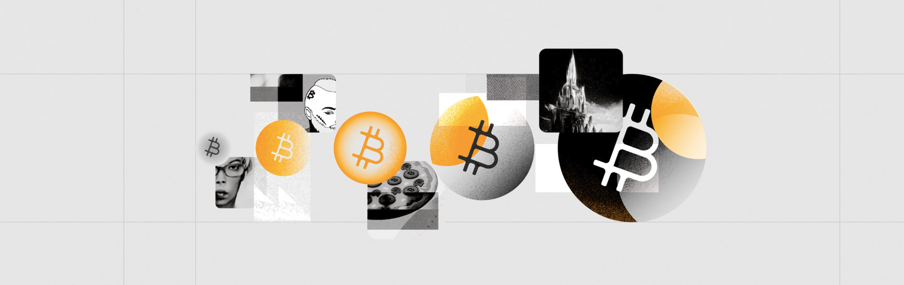

# Use Cases

<figure><figcaption></figcaption></figure>

Stacks extends Bitcoin's functionality, enabling a variety of decentralized applications. Here are some use cases for you to explore and incite new ideas.

<table data-card-size="large" data-view="cards"><thead><tr><th></th><th></th><th data-hidden data-card-target data-type="content-ref"></th></tr></thead><tbody><tr><td><h4>DeFi</h4></td><td>Enable smart contracts for lending, borrowing, and trading of digital assets.</td><td><a href="defi.md">defi.md</a></td></tr><tr><td><h4>Art</h4></td><td>Facilitate the artistic creation and trading of digital art as NFTs.</td><td><a href="art.md">art.md</a></td></tr><tr><td><h4>Payments</h4></td><td>Enable fast, Bitcoin-settled transactions using assets like sBTC and STX, with developer tooling support and easy wallet integrations.</td><td><a href="payments.md">payments.md</a></td></tr><tr><td><h4>Gaming</h4></td><td>Support on-chain economies, verifiable in-game assets as NFTs, and player rewards programs.</td><td><a href="gaming.md">gaming.md</a></td></tr><tr><td><h4>AI</h4></td><td>AI agents can hold sBTC, sign transactions, manage digital assets, and automate workflows while being bound by Clarity-level constraints</td><td><a href="ai.md">ai.md</a></td></tr></tbody></table>

