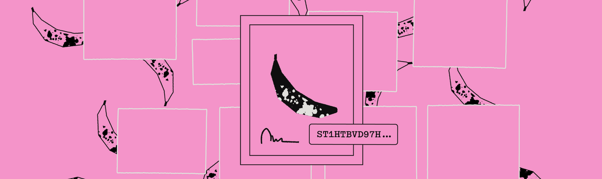

# Art

<div data-with-frame="true"><figure><figcaption></figcaption></figure></div>

Unlock expressive, Bitcoin-secured digital art with NFT assets — all backed by fast, low-cost execution on Stacks. The Stacks ecosystem brings programmability, provenance, and creative tooling to Bitcoin, giving artists and collectors the speed, flexibility, and cultural richness they’ve always wanted _without leaving Bitcoin_. Stacks expands what Bitcoin culture can be: native digital ownership, programmable collectibles, onchain storytelling, and communities that form directly around Bitcoin-secured art.

Here are the creative use cases artists are exploring today:

### **Megapont Ape Club**

Megapont Ape Club is a pixel-art NFT collection built on Stacks. The “universe” behind Megapont is a fictional, stylized world — a retro-inspired pixel-art universe where mutated species evolved, with chimpanzees (apes) playing a central role. Beyond just apes, Megapont supports other NFT lines (e.g. Robot Factory, other “species / world” NFTs) and cross-chain / cross-platform assets.

**Implementation highlight:**\
The below code snippet is taken from the Megapont Ape's NFT contracts. This snippet shows two **internal minting functions** used. They are not public entrypoints—only callable from inside the contract. One handles _mintpass_-based presale minting, the other handles _public sale_ minting.

* **Presale minting** has stricter access rules (mintpasses, whitelists, limits).
* **Public sale minting** is open to anyone once activated.
* The actual NFT lives in a separate contract (`.megapont-ape-club-nft`), keeping logic modular.


```clarity
;; ...

;; Internal - Mint NFT using Mintpass mechanism
(define-private (mintpass-mint (new-owner principal))
  (let ((presale-balance (get-presale-balance new-owner)))
    (asserts! (> presale-balance u0) ERR-NO-MINTPASS-REMAINING)
    (map-set presale-count
              new-owner
              (- presale-balance u1))
  (contract-call? .megapont-ape-club-nft mint new-owner)))

;; Internal - Mint public sale NFT
(define-private (public-mint (new-owner principal))
  (begin
    (asserts! (var-get sale-active) ERR-SALE-NOT-ACTIVE)
    (contract-call? .megapont-ape-club-nft mint new-owner)))
    
;; ...
```


<details>

<summary>Check out more from Megapont</summary>

* \[[Official](https://www.megapont.com/)] Official website of Megapont
* \[[Gamma](https://stacks.gamma.io/collections/megapont-ape-club)] NFT listing page on the Gamma marketplace
* \[[Hiro YT](https://youtu.be/mz1irJUpq0I?t=843)] Muneeb joining the Megapont Ape community
* \[[Hiro YT](https://youtu.be/xwbXNgSvMkk?si=jeHwWQ4oLlj9_ucr)] A Beginner's Overview of the Megapont Ape NFT Clarity Smart Contract
* \[[contract](https://explorer.hiro.so/txid/SP3D6PV2ACBPEKYJTCMH7HEN02KP87QSP8KTEH335.megapont-ape-club-nft?chain=mainnet)] .megapont-ape-club-nft
* \[[contract](https://explorer.hiro.so/txid/SP3D6PV2ACBPEKYJTCMH7HEN02KP87QSP8KTEH335.megapont-ape-club-mint?chain=mainnet\&tab=overview)] .megapont-ape-club-mint

</details>

***

### Satoshibles

Satoshibles is an early, pixel-art NFT collection that originally launched on Ethereum in 2021 and later bridged to Stacks, becoming one of the first established NFT communities to move onto the Bitcoin ecosystem.

The project consists of 5000 algorithmically generated crypto collectible NFTs that have been hand illustrated. Each one unique, and each representing a fun, retro interpretation of “Satoshi-like” personas—quirky, expressive, and distinctly Bitcoin-themed.

**Implementation highlights:**\
This code snippet below enables a flexible, secure commission system by letting each NFT listing specify a commission contract, enforcing its use during purchase, and delegating fee payout logic to that external contract via the commission trait. By accepting a contract implementing `commission-trait`, it creates a _plug-and-play commission system_ where:

* marketplaces decide their fee logic,
* creators can define custom royalty structures,
* different listings can use different commission rules.

The marketplace contract enforces that the same commission contract passed at listing must also be used at purchase time.


```clarity
;; ...

(use-trait commission-trait .commission-trait.commission)

;; ...

(define-public (list-in-ustx (id uint) (price uint) (comm <commission-trait>))
  (let ((listing  {price: price, commission: (contract-of comm)}))
    (asserts! (is-sender-owner id) ERR-NOT-AUTHORIZED)
    (map-set market id listing)
    (print (merge listing {a: "list-in-ustx", id: id}))
    (ok true)))

(define-public (unlist-in-ustx (id uint))
  (begin
    (asserts! (is-sender-owner id) ERR-NOT-AUTHORIZED)
    (map-delete market id)
    (print {action: "unlist-in-ustx", id: id})
    (ok true)))

(define-public (buy-in-ustx (id uint) (comm <commission-trait>))
  (let ((owner (unwrap! (nft-get-owner? Satoshibles id) ERR-NOT-FOUND))
      (listing (unwrap! (map-get? market id) ERR-LISTING))
      (price (get price listing)))
    (asserts! (is-eq (contract-of comm) (get commission listing)) ERR-WRONG-COMMISSION)
    (try! (stx-transfer? price tx-sender owner))
    (try! (contract-call? comm pay id price))
    (try! (trnsfr id owner tx-sender))
    (map-delete market id)
    (print {action: "buy-in-ustx", id: id})
    (ok true)))
    
;; ...
```


<details>

<summary>Check out more from Satoshibles</summary>

* \[[Official](https://satoshibles.com/)] Official website of Satoshibles
* \[[contract](https://explorer.hiro.so/txid/SP6P4EJF0VG8V0RB3TQQKJBHDQKEF6NVRD1KZE3C.satoshibles?tab=overview)] SP6P4EJF0VG8V0RB3TQQKJBHDQKEF6NVRD1KZE3C.satoshibles
* \[[Gamma](https://gamma.io/stacks/collections/satoshibles/items)] Satoshibles' listing page on Gamma marketplace
* \[[YT](https://www.youtube.com/watch?v=gZw4EvV6qig)] BRIDGE from ETH to Stacks | Satoshibles

</details>
