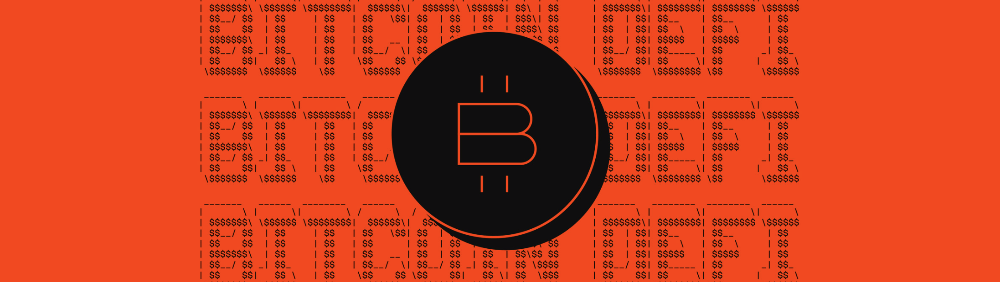

# DeFi

<div data-with-frame="true"><figure><figcaption></figcaption></figure></div>

Stacks enables users to put their BTC to work in trust-minimized ways: borrowing against it, providing liquidity, earning yield, or participating in programmable financial products that settle on Bitcoin. This ecosystem gives builders the foundation to extend Bitcoin from a passive store of value into an active financial layer.

Here are some powerful demonstrations of unlocking DeFi for Bitcoin:

### Hermetica

Hermetica is a DeFi protocol built on Stacks whose mission is to bring fully Bitcoin-native stablecoins and yield products to the Bitcoin ecosystem. Their flagship asset is USDh — a Bitcoin-backed, yield-bearing synthetic dollar.

**Implementation highlight:**\
The code snippet below highlights the **migration lock**, **manager assignment**, and **token deprecation logic** all in one tight block. It captures the “power unlock” of the contract without pulling in the entire file:

* Safely upgrade USDh by freezing old token operations once migration starts.
* Assigns a migration manager to burn and migrate balances securely.
* Ensures consistent supply and a trust-minimized transition to the new token.


```clarity
;; Prevents all token activity once migration has begun
(define-read-only (is-not-migrated)
  (ok (asserts! (is-eq u0 (var-get migration-start-height)) ERR_DEPRECATED_TOKEN))
)

;; Begins the migration process and hands control to a migration manager contract
(define-public (start-migration (manager <token-migration-trait>))
  (begin
    (try! (is-not-migrated))
    (try! (contract-call? .hq-v1 check-is-owner contract-caller))
    (var-set migration-start-height burn-block-height)
    (var-set migration-manager (some (contract-of manager)))
    (contract-call? manager start-migration burn-block-height (ft-get-supply usdh))
  )
)

;; Allows the designated migration manager to burn a user’s balance and extract it for migration
(define-public (migrate-balance (who principal))
  (let ((balance (ft-get-balance usdh who)))
    (asserts! (is-eq (var-get migration-manager) (some contract-caller)) ERR_NOT_MIGRATION_MANAGER)
    (asserts! (> balance u0) (ok u0))
    (try! (ft-burn? usdh balance who))
    (ok balance)
  )
)

```


<details>

<summary>Check out more from Hermetica</summary>

* \[[Official](https://hermetica.fi/)] Official website of Hermetica
* \[[Stacks YT](https://youtu.be/Xb54LJrLicY?si=3wMTBwOskphdsn4S)] Earn up to 25% with Your BTC as Collateral with Jakob Schillinger
* \[[Hiro YT](https://www.youtube.com/watch?v=R6f4jR8S45M)] Lessons From Building Bitcoin DeFi
* \[[Hiro Blog](https://www.hiro.so/blog/how-hermetica-uses-chainhook-to-track-bitcoin-deposits)] How Hermetica Uses Chainhook to Track Bitcoin Deposits
* \[[contract](https://explorer.stacks.co/token/SPN5AKG35QZSK2M8GAMR4AFX45659RJHDW353HSG.usdh-token-v1?chain=mainnet)] SPN5AKG35QZSK2M8GAMR4AFX45659RJHDW353HSG.usdh-token-v1

</details>

***

### StackingDAO

StackingDAO is the hub for liquid stacking on Stacks. One of their liquid stacking services **stSTXbtc**, is a liquid stacking token (LST) backed 1-to-1 with STX, and holders receive sBTC rewards daily that can be claimed at any moment.

**Implementation highlight:**\
This function **initiates a withdrawal of stSTXbtc**, locks the underlying STX for withdrawal, burns the derivative token, and mints an NFT that represents the user’s withdrawal claim. It effectively transforms a liquid derivative token into a time-locked withdrawal right.

* Enforces protocol-level safety checks
* Determines the unlock Bitcoin (burn) height
* Links the withdrawal to an NFT “claim ticket”
* Coordinates state changes across multiple protocol contracts


```clarity
;; --snip--

(define-public (init-withdraw 
  (reserve <reserve-trait>) 
  (direct-helpers <direct-helpers-trait>)
  (ststxbtc-amount uint)
)
  (let (
    (sender tx-sender)
    (unlock-burn-height (unwrap-panic (contract-call? .stacking-dao-core-v4 get-withdraw-unlock-burn-height)))

    (nft-id (unwrap-panic (contract-call? .ststxbtc-withdraw-nft get-last-token-id)))
  )
    (try! (contract-call? .dao check-is-enabled))
    (try! (contract-call? .dao check-is-protocol (contract-of reserve)))
    (try! (contract-call? .dao check-is-protocol (contract-of direct-helpers)))
    (asserts! (not (get-shutdown-init-withdraw)) (err ERR_SHUTDOWN))

    (try! (contract-call? .data-core-v2 set-ststxbtc-withdrawals-by-nft nft-id ststxbtc-amount unlock-burn-height))
    
    (try! (contract-call? direct-helpers subtract-direct-stacking tx-sender ststxbtc-amount))

    ;; Burn stSTXbtc tokens
    (try! (as-contract (contract-call? reserve lock-stx-for-withdrawal ststxbtc-amount)))
    (try! (contract-call? .ststxbtc-token-v2 burn-for-protocol ststxbtc-amount sender))
    (try! (as-contract (contract-call? .ststxbtc-withdraw-nft mint-for-protocol sender)))

    (print { action: "init-withdraw", data: { stacker: tx-sender, nft-id: nft-id, ststxbtc-amount: ststxbtc-amount, unlock-burn-height: unlock-burn-height, block-height: block-height } })
    (ok nft-id)
  )
)
```


<details>

<summary>Check out more from StackingDAO</summary>

* \[[Hiro YT](https://youtu.be/1hWYeqS5r-k?si=GRWag60DUmm08TG_)] Going Under the Hood of stSTXbtc with Philip De Smedt from StackingDAO
* \[[Hiro YT](https://youtu.be/ujpatSY9DhM?si=cr823veqbmcfYr7y)] A Simple Breakdown of the StackingDAO Clarity Contracts on Stacks

</details>
