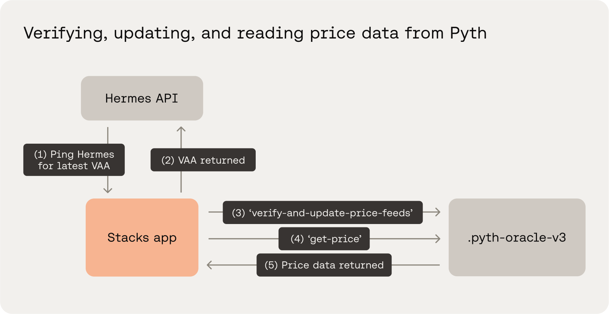

# Using Pyth with Stacks


For the latest releases and versions of the Stacks-Pyth contracts, check out the open-source repo [here](https://github.com/stx-labs/stacks-pyth-bridge).


The contract logic, that we’ll use for this example, will mint an NFT in exchange for $100 of sBTC. Our Clarity contract will read the price of BTC/USD from the Pyth integration contract to calculate the amount of sBTC required to mint the NFT.

Each Pyth Network price feed is referred to via a unique ID. The full list of price feeds is listed on the pyth.network website. To use a price feed on-chain, look up its ID, then store the feed ID in your program for price feed queries. Each price feed has its own unique id:

**Available Pyth price feeds for Stacks:**

* **BTC**: [0xe62df6c8b4a85fe1a67db44dc12de5db330f7ac66b72dc658afedf0f4a415b43](https://www.pyth.network/price-feeds/crypto-btc-usd)
* **STX:** [0xec7a775f46379b5e943c3526b1c8d54cd49749176b0b98e02dde68d1bd335c17](https://www.pyth.network/price-feeds/crypto-stx-usd)
* **USDC:** [0xeaa020c61cc479712813461ce153894a96a6c00b21ed0cfc2798d1f9a9e9c94a](https://www.pyth.network/price-feeds/crypto-usdc-usd)
* **ETH**: [0xff61491a931112ddf1bd8147cd1b641375f79f5825126d665480874634fd0ace](https://www.pyth.network/price-feeds/crypto-eth-usd)


To request more supported price feeds, open an issue in the Pyth maintained repo for Stacks [here](https://github.com/Trust-Machines/stacks-pyth-bridge).


Pyth Network uses a pull price update model that is slightly different from other oracles you may be more familiar with. Most oracles today use a push model, where the oracle runs an off-chain process that continuously sends transactions to update an on-chain price. In contrast, Pyth Network does not operate an off-chain process that pushes prices on-chain. Instead, it delegates this work to Pyth Network users.

<div data-with-frame="true"><figure><figcaption></figcaption></figure></div>

The maintained Pyth integration contract for Stacks is called [.pyth-oracle-v4](https://explorer.stacks.co/txid/SP1CGXWEAMG6P6FT04W66NVGJ7PQWMDAC19R7PJ0Y.pyth-oracle-v4?chain=mainnet). This contract serves as the main entry point for updating and getting price feed data. The Pyth protocol integration is available as a Beta on both testnet and mainnet networks, to help developers test, give feedback, and ensure the reliability and stability of the integration.

#### File setup

Below are how the contracts and mainfest files are setup in this example Clarinet project. We'll be using Clarinet's mainnet simulation for this example, hence why we are adding mainnet contracts for Pyth in our files.




```clarity
(define-constant CONTRACT_OWNER tx-sender)
(define-constant COST-OF-BENJAMIN-NFT u100)

(define-constant ERR_READING_SBTC_BALANCE (err u7001))
(define-constant ERR_NOT_ENOUGH_SBTC (err u7002))
(define-constant ERR_NOT_OWNER (err u7003))

(define-public (join-the-benjamin-club (price-feed-bytes (buff 8192)))
  (let (
      ;; Update & verify VAA for BTC price feed
      (update-status (try! (contract-call? 'SP1CGXWEAMG6P6FT04W66NVGJ7PQWMDAC19R7PJ0Y.pyth-oracle-v4
        verify-and-update-price-feeds price-feed-bytes {
        pyth-storage-contract: 'SP1CGXWEAMG6P6FT04W66NVGJ7PQWMDAC19R7PJ0Y.pyth-storage-v4,
        pyth-decoder-contract: 'SP1CGXWEAMG6P6FT04W66NVGJ7PQWMDAC19R7PJ0Y.pyth-pnau-decoder-v3,
        wormhole-core-contract: 'SP1CGXWEAMG6P6FT04W66NVGJ7PQWMDAC19R7PJ0Y.wormhole-core-v4,
      })))
      ;; Get fresh BTC price
      (price-data (try! (contract-call? 'SP1CGXWEAMG6P6FT04W66NVGJ7PQWMDAC19R7PJ0Y.pyth-oracle-v4
        get-price
        ;; The official BTC price feed id.
        0xe62df6c8b4a85fe1a67db44dc12de5db330f7ac66b72dc658afedf0f4a415b43
        'SP1CGXWEAMG6P6FT04W66NVGJ7PQWMDAC19R7PJ0Y.pyth-storage-v4
      )))
      ;; Adjust price and get user sBTC balance
      ;; Price feeds represent numbers in a fixed-point format. The expo property tells us
      ;; at what certain position is the decimal point implicity fixed.
      (price-denomination (pow 10 (* (get expo price-data) -1)))
      ;; We'll adjust the price to its normal decimal representation.
      (adjusted-price (to-uint (/ (get price price-data) price-denomination)))
      ;; Get the user's current sBTC balance.
      (user-sbtc-balance (unwrap!
        (contract-call? 'SM3VDXK3WZZSA84XXFKAFAF15NNZX32CTSG82JFQ4.sbtc-token
          get-balance-available tx-sender
        )
        ERR_READING_SBTC_BALANCE
      ))
    )
    ;; Determine if the user has at least $100 worth of sBTC to join the Benjamin Club and mint NFT
    (if (> (/ (* user-sbtc-balance adjusted-price) (to-uint price-denomination))
        COST-OF-BENJAMIN-NFT
      )
      (let ((hundred-dollars-in-sbtc (/ (* COST-OF-BENJAMIN-NFT (to-uint price-denomination)) adjusted-price)))
        (try! (contract-call? 'SM3VDXK3WZZSA84XXFKAFAF15NNZX32CTSG82JFQ4.sbtc-token
          transfer hundred-dollars-in-sbtc tx-sender current-contract
          none
        ))
        (contract-call? .nft mint tx-sender)
      )
      ERR_NOT_ENOUGH_SBTC
    )
  )
)
```





```clarity
;; This contract implements the SIP-009 community-standard Non-Fungible Token trait
(impl-trait 'SP2PABAF9FTAJYNFZH93XENAJ8FVY99RRM50D2JG9.nft-trait.nft-trait)

;; Define the NFT's name
(define-non-fungible-token benjamin uint)

;; Keep track of the last minted token ID
(define-data-var last-token-id uint u0)

;; Define constants
(define-constant CONTRACT_OWNER tx-sender)
(define-constant COLLECTION_LIMIT u100)

(define-constant ERR_OWNER_ONLY (err u100))
(define-constant ERR_NOT_TOKEN_OWNER (err u101))
(define-constant ERR_SOLD_OUT (err u300))

(define-data-var base-uri (string-ascii 80) "")

;; SIP-009 function: Get the last minted token ID.
(define-read-only (get-last-token-id)
  (ok (var-get last-token-id))
)

;; SIP-009 function: Get link where token metadata is hosted
(define-read-only (get-token-uri (token-id uint))
  (ok (some (var-get base-uri)))
)

;; SIP-009 function: Get the owner of a given token
(define-read-only (get-owner (token-id uint))
  (ok (nft-get-owner? benjamin token-id))
)

;; SIP-009 function: Transfer NFT token to another owner.
(define-public (transfer
    (token-id uint)
    (sender principal)
    (recipient principal)
  )
  (begin
    ;; #[filter(sender)]
    (asserts! (is-eq tx-sender sender) ERR_NOT_TOKEN_OWNER)
    (nft-transfer? benjamin token-id sender recipient)
  )
)

;; Mint a new NFT.
(define-public (mint (recipient principal))
  ;; Create the new token ID by incrementing the last minted ID.
  (let ((token-id (+ (var-get last-token-id) u1)))
    ;; Ensure the collection stays within the limit.
    (asserts! (< (var-get last-token-id) COLLECTION_LIMIT) ERR_SOLD_OUT)
    ;; Only the contract owner can mint.
    (asserts! (is-eq contract-caller .main) ERR_OWNER_ONLY)
    ;; Mint the NFT and send it to the given recipient.
    (try! (nft-mint? benjamin token-id recipient))
    ;; Update the last minted token ID.
    (var-set last-token-id token-id)
    ;; Return a success status and the newly minted NFT ID.
    (ok token-id)
  )
)

```





```toml
[project]
name = 'clarity-contracts'
description = ''
authors = []
telemetry = false
cache_dir = './.cache'

[[project.requirements]]
contract_id = 'SP2PABAF9FTAJYNFZH93XENAJ8FVY99RRM50D2JG9.nft-trait'

[[project.requirements]]
contract_id = 'SP1CGXWEAMG6P6FT04W66NVGJ7PQWMDAC19R7PJ0Y.pyth-oracle-v4'

[[project.requirements]]
contract_id = 'SP1CGXWEAMG6P6FT04W66NVGJ7PQWMDAC19R7PJ0Y.wormhole-core-v4'

[[project.requirements]]
contract_id = 'SP1CGXWEAMG6P6FT04W66NVGJ7PQWMDAC19R7PJ0Y.pyth-pnau-decoder-v3'

[[project.requirements]]
contract_id = 'SP1CGXWEAMG6P6FT04W66NVGJ7PQWMDAC19R7PJ0Y.pyth-storage-v4'

[[project.requirements]]
contract_id = 'SM3VDXK3WZZSA84XXFKAFAF15NNZX32CTSG82JFQ4.sbtc-token'

[contracts.main]
path = 'contracts/main.clar'
clarity_version = 4
epoch = 'latest'

[contracts.nft]
path = 'contracts/nft.clar'
clarity_version = 4
epoch = 'latest'

[repl.analysis]
passes = ['check_checker']

[repl.analysis.lints]

[repl.analysis.check_checker]
strict = false
trusted_sender = false
trusted_caller = false
callee_filter = false

[repl.remote_data]
enabled = true
api_url = 'https://api.hiro.so'
use_mainnet_wallets = true
```




### Contract Walkthrough

The walkthrough below will use a example contract that will mint an NFT in exchange for $100 of sBTC. Our Clarity contract will read the price of BTC/USD from the Pyth integration contract to calculate the amount of sBTC required to mint the NFT. The action of minting an NFT if one has at least $100 worth of sBTC will be deemed as _"joining the benjamin club"_. Benjamin is in reference to Benjamin Franklin being the face of a one hundred dollar bill, get it?



#### Verify and update the BTC price feed

We'll open up our function by accepting a `(price-feed-bytes (buff 8192))` parameter. This `price-feed-bytes` is in reference to a VAA message payload. Later in this guide we'll show you how to fetch this payload on the front end.&#x20;

You'll notice in the Clarity snippet below we open up `let` bindings of our function to:

1. Verify and update the BTC price feed with its latest VAA message (more on how to pull the VAA later in this guide). This is a means of participating in the pull price update model.
2. Getting a fresh instance of the updated price data for BTC.


The `pyth-oracle-contract`, `pyth-storage-contract`, `pyth-decoder-contract`, and `wormhole-core-contract` do not need to be hardcorded in your contract. It's recommended to pass these contracts into the outer function as arguments since these contracts are susceptible to future upgrades.



```clarity
;; --snip--

(define-public (join-the-benjamin-club (price-feed-bytes (buff 8192)))
  (let (
      ;; Update & verify VAA for BTC price feed
      (update-status (try! (contract-call? 'SP1CGXWEAMG6P6FT04W66NVGJ7PQWMDAC19R7PJ0Y.pyth-oracle-v4
        verify-and-update-price-feeds price-feed-bytes {
        pyth-storage-contract: 'SP1CGXWEAMG6P6FT04W66NVGJ7PQWMDAC19R7PJ0Y.pyth-storage-v4,
        pyth-decoder-contract: 'SP1CGXWEAMG6P6FT04W66NVGJ7PQWMDAC19R7PJ0Y.pyth-pnau-decoder-v3,
        wormhole-core-contract: 'SP1CGXWEAMG6P6FT04W66NVGJ7PQWMDAC19R7PJ0Y.wormhole-core-v4,
      })))
      ;; Get fresh BTC price
      (price-data (try! (contract-call? 'SP1CGXWEAMG6P6FT04W66NVGJ7PQWMDAC19R7PJ0Y.pyth-oracle-v4
        get-price
        ;; The official BTC price feed id.
        0xe62df6c8b4a85fe1a67db44dc12de5db330f7ac66b72dc658afedf0f4a415b43
        'SP1CGXWEAMG6P6FT04W66NVGJ7PQWMDAC19R7PJ0Y.pyth-storage-v4
      )))

;; --snip---
```




#### Handling \`get-price\` data

After updating and verifying the price feed in question, and then getting the updated price feed data, we'll need to handle the price feed data and its properties.

The price feed data returned from invoking the `get-price` function of the `.pyth-oracle-v4` contract looks like the below:

```
{
  price-identifier: 0xe62df6c8b4a85fe1a67db44dc12de5db330f7ac66b72dc658afedf0f4a415b43,
  price: 10603557773590,
  conf: u3776653890,
  ema-price: 10602069900000,
  ema-conf: u4062895700,
  expo: -8,
  publish-time: u1750425711,
  prev-publish-time: u1750425710
}
```



#### Adjust returned price value and determine mint eligibility

With the latest price feed data returned, we can adjust the price based on the `expo` property. Price feeds represent numbers in a fixed-point format. Fixed-point numeric representation is a way of storing numbers with fractional parts using integers, where the decimal point is implicitly fixed at a certain position. So in the above returned price feed data, the returned price of `10603557773590` and given expo of `-8` should be formatted as `106035`. The same exponent is used for both the price and confidence interval.

We can then determine the USD amount of sBTC the user owns and decide if it is enough to mint a `benjamin-nft` for $100 worth of sBTC. Benjamin is in reference to Benjamin Franklin being the face of a one hundred dollar bill, get it?


```clarity
;; --snip--

      ;; Price feeds represent numbers in a fixed-point format. The expo property tells us
      ;; at what certain position is the decimal point implicity fixed.
      (price-denomination (pow 10 (* (get expo price-data) -1)))
      ;; We'll adjust the price to its normal decimal representation.
      (adjusted-price (to-uint (/ (get price price-data) price-denomination)))
      ;; Get the user's current sBTC balance.
      (user-sbtc-balance (unwrap!
        (contract-call? 'SM3VDXK3WZZSA84XXFKAFAF15NNZX32CTSG82JFQ4.sbtc-token
          get-balance-available tx-sender
        )
        ERR_READING_SBTC_BALANCE
      ))
    )
    ;; Determine if the user has at least $100 worth of sBTC to join the Benjamin Club and mint NFT
    (if (> (/ (* user-sbtc-balance adjusted-price) (to-uint price-denomination))
        COST-OF-BENJAMIN-NFT
      )
      (let ((hundred-dollars-in-sbtc (/ (* COST-OF-BENJAMIN-NFT (to-uint price-denomination)) adjusted-price)))
        (try! (contract-call? 'SM3VDXK3WZZSA84XXFKAFAF15NNZX32CTSG82JFQ4.sbtc-token
          transfer hundred-dollars-in-sbtc tx-sender current-contract
          none
        ))
        (contract-call? .nft mint tx-sender)
      )
      ERR_NOT_ENOUGH_SBTC
    )
  )
)
```




### Interact with contract in console using mxs

Since we are using Pyth and sBTC's mainnet contract addresses in our contract, we'll use Clarinet's mainnet simulation feature to interact with the contract in simnet.


Be sure you've enabled mainnet simulation in your manifest file. See the Clarinet.toml file above.




#### Set \`tx\_sender\` to a mainnet address

In the Clarinet console run: `::set_tx_sender <mainnet-address>`     &#x20;

You'll want to grab a `<mainnet-address>` that most likely has over $100 of sBTC. This is so we can have a simulation of being able to mint the NFT. Then switch the `tx_sender` context so that we can have _that_ mainnet address simulate calling our contract.



#### Call \`join-the-benjamin-club\` with a VAA payload

In the Clarinet console run: `(contract-call? 'SP1PQHQKV0RJXZFY1DGX8MNSNYVE3VGZJSRCBGD7R.main join-the-benjamin-club <vaa-payload-hex>)`&#x20;

Pass in a valid VAA payload into the `join-the-benjamin-club` function. If everything passes, you should see the events emitted from the contract along with an `(ok u1)` response.

<details>

<summary>Where to get a sample VAA payload?</summary>

You can use this sample VAA payload to test with. This VAA payload is outdated but should be testable in simnet/console.

```
0x504e41550100000003b801000000040d0064f9d65f754bc6426b50d45047fc50c905196202e888b73182a8177579ec838f652d710879a9a0c3026bd9e44b32509b9c94e86328d89235c5221e4cd20303ca000265aa2173fe44b28c3942c984ee953e9e2a06a686656c8bd36fbf396d7b4bfe9338bd6017a484b60ca1c80a75458f55ff9c9dd3e5edfa45f6243c13d77f414d4000045529833b17cfc6b011de0b72709c785a86d0ce9281a8c21a250f55d3fbfd79b47b89f110c63acdf8e0fa251d245b6e87ccbf5747dab2ba6eaf22e27f16fc97580006f673a3f384580e0bc7c5a246fb77a37f83ded9fe1368f3c15cdbad2475f2378d0daae7d3201e23ba45c04606dedea0327bd095f7b45d9dd84600b8e877af0c810008a4018e5793e30ac8439aef1b3ce284b670e95ab5ce76090f4dac860a1267177355102ddc46d33f4c53c253b30cb945ce63c710773fa40ae846192c6d1e335921000aea43bd88cc9891274d2b7f493b362c7799b2bf1e40630181fecce951118c987345da8f194ac0a44a2f956dce99b61f2254fe6b2409382d8e887e8fa07e6894aa000b9639228e880e97da54c07a9b762849a232a6f4358d9c82ec2e9a57c55cf0d89767e9e690586e52c752f31d541b1d68f7a86f3d7dffbbd6229fae2aa9b7647815010ca826b369905ff52daa0204b2ce3cedde1eee11d167e0cbdad3350362210840523db4c95c4669bd59b5e3dcd84d8bed673d0452d2229832f9af0904f070721fd0010d1b6af9c169ab48b47d6726d35f030eddabf9e6e04058097730bca037284a114a439b7ceb984013e8bc4873182dfd893d52c91a558a4bafe32f6d9a692765fc27010ef1c798f6db4a3c6387797dff6c06779b45b03bc1fde7a1eb86942bbb8ab3d5fc70c317d51dd71cbac39b8bd038bcf72552e4bc048f4e0731b9643090eb8bb1b6000fca5d6ac6f0e6569e1072566a56075dae7db43d8a008e939422863890c64e76b81544ae0ebaaacb473241c75cf5e2a8a1fd5c1cd5ee99970113e4d4bd0a86d9c70010c66616689026b43cbcd0012c7e87c9de75b7b8f60d2c765ec298ade7862d64ce63ef95670553bc120b08b52e6c5893a0509287ad5b38cd44a9113ddce5dc4c12001177acdc2be20bef459c68d319fd121fea8c2fbd1aad4ee8ebe36a5750214c39510b60e89b4c247e6e354f64722a49eb40ba2ba164cb9e6191e14b81155f16e6a4006935e74900000000001ae101faedac5851e32b9b23b5f9411a8c2bac4aae3ed4dd7b811dd1a72ea4aa71000000000a6abf2a014155575600000000000f78660e00002710c82bc426063e681025b2a2462b81da02fbdc9ab001005500e62df6c8b4a85fe1a67db44dc12de5db330f7ac66b72dc658afedf0f4a415b4300000852e1a4948000000000ac606b00fffffff8000000006935e749000000006935e7480000084e36eef02000000000a4da13a40d0d91f61daad89890a2c5da1abd4009915ccb2042e737bd6a369235eadc65f71867b56b312545c86c2cd2cd18971f74e0ef4e849a2b295b12dab11d5650dc565595a445ea019e1258a1397dc974e42ef8315937dc38ca22e8327aa6c21decb109199d18fec07feded692d0a8b1660748d3402dcd9e84229dd201c5da161c653ae21e63acdbf9ee603deec2668923bc0435272b1fc3851957c2a7a4867704a39d4e0c43b378456f0695c944f2bc3ba3ea356d4d3318a0b8c666d8df3a74fa3cea21e74470dc680878ff8dac909832fea3e4dc56c1fa5287cd472db6db3eb54c232d4faf9080009f4fa433b6b465ced1e2826dc510e7cf81c7261bf377e1847c0f08d7280f8
```

</details>

<details>

<summary>Run unit tests</summary>

You can also test your contract using mxs in unit tests. See the below unit test setup that shows how you can fetch the latest VAA for your contract call.


```typescript
import { describe, expect, it } from "vitest"
import { Cl, } from "@stacks/transactions"
import { HermesClient } from "@pythnetwork/hermes-client";

const accounts = simnet.getAccounts()
const deployer = accounts.get("deployer")

async function handleFetchLatestVaa() {
  const connection = new HermesClient("https://hermes.pyth.network", {});

  const priceIds = [
    "0xe62df6c8b4a85fe1a67db44dc12de5db330f7ac66b72dc658afedf0f4a415b43",
  ];

  const priceUpdates = await connection.getLatestPriceUpdates(priceIds);
  console.log(priceUpdates);
  
  let latestVaaHex = `0x${priceUpdates.binary.data[0]}`;

  return latestVaaHex;
}

describe("pyth unit tests", () => {
  it("ensures joining of Benjaming Club", async () => {
    let VAA = await handleFetchLatestVaa()

    let confirmation = simnet.callPublicFn(
      `${deployer}.main`,
      "join-the-benjamin-club",
      [Cl.bufferFromHex(VAA)],
      "<mainnet-address>"
    )

    expect(confirmation.result).toBeOk(Cl.uint(1))
    
  // an extended timeout value is set below due to long processing of Pyth functions
  }, 12000)
})
```


</details>



### Frontend Walkthrough

Wormhole is a decentralized attestation engine that leverages its network of guardians to trustlessly bridge information between the chains it supports. Wormhole has a simple, elegant, and pragmatic design that has enabled it to be the first real solution to ship to market and has received wide recognition and support from its member chains.

Hermes is a web service that listens to the Wormhole Network for signed and attested price updates, and serves them via a convenient web [API](https://hermes.pyth.network/docs/#/rest/latest_price_updates). It provides Pyth's latest price update data format that is more cost-effective to verify and use on-chain. Hermes allows users to easily query for recent price updates via a REST API, or subscribe to a websocket for streaming updates. The Pyth Network also provides a Javascript [SDK](https://github.com/pyth-network/pyth-crosschain/tree/main/price_service/client/js) to connect to an instance of Hermes for fetching price updates.

In your front-end application code, you can install and use the methods brought by Pyth Network's `hermes-client` Javascript SDK to fetch the latest price update, known as a VAA (Verified Action Approvals) message.

```typescript
import { HermesClient } from "@pythnetwork/hermes-client";
import { Cl, Pc } from "@stacks/transactions"
import { request } from "@stacks/connect"

// --snip--

async function handleFetchLatestVaa() {
  const connection = new HermesClient("https://hermes.pyth.network", {});

  const priceIds = [
    "0xe62df6c8b4a85fe1a67db44dc12de5db330f7ac66b72dc658afedf0f4a415b43",
  ];

  const priceUpdates = await connection.getLatestPriceUpdates(priceIds);
  let latestVaaHex = `0x${priceUpdates.binary.data[0]}`;

  return latestVaaHex;
}

// --snip--
```

The binary data returned from the Pyth SDK will already be in hexadecimal format. We'll then take this hexadecimal VAA message and pass it into our Clarity function as an argument.

Using Stacks Connect of the stacks.js monorepo, we'll open up a `stx_callContract` request and invoke our public function while passing in the `latestVaaHex` as the function argument.

```typescript
// --snip--

let latestVaaHex = await handleFetchLatestVaa();

let postCond1 = Pc.principal("<tx-sender>")
  .willSendLte(1)
  .ustx();

const response = await request("stx_callContract", {
  contract: `SP1PQHQKV0RJXZFY1DGX8MNSNYVE3VGZJSRCBGD7R.benjamin-club`,
  functionName: "join-the-benjamin-club",
  functionArgs: [Cl.bufferFromHex(latestVaaHex)],
  network: "mainnet",
  postConditions: [postCond1],
  postConditionMode: "allow",
});
```

If you noticed, we set a post-condition statement of our user transferring less than or equal to 1 uSTX, which is 0.000001 STX. This is because the `verify-and-update-price-feeds` of the `.pyth-oracle-v4` contract applies a fee for this.&#x20;

Setting a separate post-condition statement on the actual sbtc token transfer in our example will also be needed. Beforehand, you could invoke the `decode-price-feeds` function with the `latestVaaHex` to simply have the contained price data decoded and returned. From there you could pre-determine the estimated amount of sbtc tokens to be transferred and set in a separate post-condition.

***

### Additional Resources

* \[[Hiro YT](https://youtu.be/eybqQVRh_hw?si=uwlpiZq36Ad7bBb0)] How To Pull Real-Time Price Data in Your Clarity Smart Contracts (Using Pyth)
* \[[Pyth Docs](https://docs.pyth.network/price-feeds/core/use-real-time-data/pull-integration/stacks)] How to Use Real-Time Data in Stacks Applications
* \[[Hiro Blog](https://www.hiro.so/blog/new-oracle-alert-pyth-integration-with-stacks)] New Oracle Alert: Pyth Integration With Stacks&#x20;
