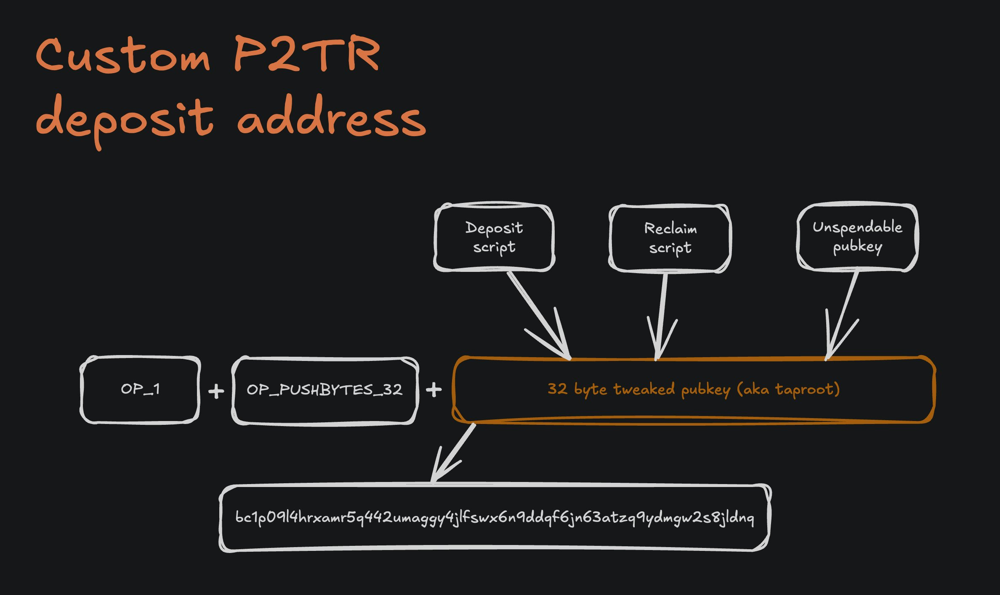

# Depositing: Pegging BTC into sBTC

This guides shows how you can integrate the deposit (peg-in) flow from your front-end app to allow users to peg BTC into sBTC on the Stacks network. For more information about sBTC and an explainer of its architecture, check out the general sBTC section [here](https://app.gitbook.com/s/H74xqoobupBWwBsVMJhK/sbtc) in the Learn category.

### Breakdown of the deposit (peg-in) flow

* **Create Deposit (Bitcoin) Transaction:**
  * Structure a Bitcoin transaction to send funds to the group of signers.
  * Use a specialized format that includes:
    * Deposit Script: Identifies which _Stacks address_ the sBTC will be minted to and what the _maximum fee_ (in satoshis) the signers may take in exchange for minting.
    * Reclaim Script: Allows the sender to reclaim their funds if the transaction is not processed by the signers.
* **Sign and Broadcast the Transaction:**
  * Sign the transaction with the sender's private key.
  * Broadcast the transaction to the Bitcoin network (Bitcoin Regtest for Stacks Testnet).
* **Notify the sBTC API (Emily):**
  * Inform the API about the transaction by submitting its details. This step ensures that the signers are aware of the deposit and can track it.
* **Processing by Signers:** (_no action required_)
  * The signers retrieve and verify the deposit transaction from the Bitcoin blockchain.
  * Once verified, the signers mint the equivalent amount of sBTC on the Stacks network.
* **Receive sBTC (Stacks):** (_no action required_)
  * The minted sBTC is sent to the depositor's designated Stacks address, completing the deposit process.
  * sBTC is SIP-010 compatible and will show up in Stacks wallets and explorers.

In this guide you'll touch on some of the steps above but its much simpler than you'd expect. Using the `sbtc` and `@stacks/connect` libraries, putting together the peg-in process from BTC into sBTC will simply involve the following steps:

1. Building the sBTC deposit address
2. Invoking the user's wallet to sign and broadcast the bitcoin transaction
3. Notifying the sBTC signers
4. Confirm user's sBTC balance


This guide assumes you have a front-end bootstrapped with the Stacks Connect library for wallet interactions. Head to the guides for Stacks Connect before continuing with this guide.




#### Building the sBTC deposit address

You're not directly sending bitcoin to the public sBTC Signers' [bitcoin address](https://mempool.space/address/bc1prcs82tvrz70jk8u79uekwdfjhd0qhs2mva6e526arycu7fu25zsqhyztuy), but rather sending to a custom P2TR address where both the user and sBTC Signers have control over. This custom P2TR address is special because it contains tapscripts that specify which parties are able to unlock the UTXOs via a script path spend.

The construction of these tapscripts is what ultimately generates the custom P2TR address that the user will be sending their UTXOs to. Constructing tapscripts, or bitcoin scripts in general, are complex and tricky. The `sbtc` library provides useful methods for abstracting away the complexities of working with taproot related functions.

```typescript
import { buildSbtcDepositAddress, MAINNET, SbtcApiClientMainnet } from 'sbtc';

// Initialize the sBTC API client based on network
const client = new SbtcApiClientMainnet();

// Build the deposit address with metadata
const deposit = buildSbtcDepositAddress({
  stacksAddress: 'SP14ZYP25NW67XZQWMCDQCGH9S178JT78QJYE6K37', // the address to send/mint the sBTC to
  signersPublicKey: await client.fetchSignersPublicKey(), // the aggregated public key of the signers
  reclaimLockTime: 700, // default value is 950
  reclaimPublicKey: btcPubKey.value, // public key for reclaiming failed deposits
  network: MAINNET,
  maxSignerFee: 4000 // optional property, default value is 80,000 sats
});

// `deposit.address` is the deposit address (send funds here, aka the deposit address as an output)
```


The `maxSignerFee` refers to the fee in the bitcoin transaction sweeping funds into, or out of, the consolidated UTXO locked exclusively by sBTC Signers' aggregate address. Depending on network congestion, specify a custom fee your users would be willing to spend. The default value will be 80,000 sats. The user's responsibility of the actual fee spent is actually deducted from the amount of sBTC that will be minted.


The `buildSbtcDepositAddress` will return with a schema of:

```
deposit {
    depositScript: string;
    reclaimScript: string;
    trOut: P2TROut;
    address: string; // the custom P2TR address to deposit bitcoin to
}
```



#### Sign and broadcast the bitcoin transaction

Invoke the user's Stacks wallet to sign and broadcast the deposit bitcoin transaction.

The string literal `sendTransfer` method will invoke the user's wallet to construct a bitcoin transaction. Be certain that the user's Stacks-supported wallet also supports `sendTransfer` as it is part of [WBIP005](https://wbips.netlify.app/wbips/WBIP005) for default Bitcoin methods.

```typescript
import { request } from '@stacks/connect';
  
const result = await request('sendTransfer', {
  recipients: [
    {
      address: deposit.address,
      amount: 100_000,
    },
  ],
})
```



#### Notify the sBTC Signers

Immediately after the deposit bitcoin transaction is broadcasted, fetch the transaction hex and notify the sBTC Signers via the Emily API.


You'll want to wait until the transaction hits the bitcoin mempool before fetching the transaction hex. Usually this is within seconds.


```typescript
// below should be delayed until txid appears in the bitcoin mempool
const transaction = await client.fetchTxHex(result.txid);

// 3. NOTIFY THE SIGNERS
let response = await client.notifySbtc({ transaction, ...deposit });
console.log('Notify response:', response);
```

The `notifySbtc` method will return with a schema of:


```
export type SbtcApiNotifyResponse = {
    bitcoinTxid: string;
    bitcoinTxOutputIndex: number;
    recipient: string;
    amount: number;
    lastUpdateHeight: number;
    lastUpdateBlockHash: string;
    status: string;
    statusMessage: string;
    parameters: {
        maxFee: number;
        lockTime: number;
    };
    reclaimScript: string;
    depositScript: string;
};
```




#### Confirm user's sBTC balance

The user should expect to receive their newly minted sBTC in about 20 minutes, or within 1 to 2 confirmations on the Bitcoin chain. Poll the user's specified `stacksAddress` to check if they've received sBTC and display that to the user on the front-end.

The API client comes with a `fetchSbtcBalance` method that can help with this:

```typescript
const balance = await client.fetchSbtcBalance('SP3FGQ8Z7JY9BWYZ5WM53E0M9NK7WHJF0691NZ159');
// 1000000n (in micro-sBTC)
```

You could also fetch the deposit data from the API client. This will return data pertaining to the 3 total transactions that make up the entire deposit (peg-in) flow:

1. \[Bitcoin] Initial bitcoin deposit by the user ([example](https://mempool.space/tx/174bff280dff56d5c1d86d341ddee213d248f375c2552d2d333a59d82a59a35c))
2. \[Bitcoin] Sweep bitcoin transaction by the Signers ([example](https://mempool.space/tx/15029c5cabbd759ae31f58d8a08b50f9e0d9181c128fa61c3bea9c48e8ac8ea7))
3. \[Stacks] Mint sBTC by the Signers ([example](https://explorer.hiro.so/txid/0xe26c60bce407147c6f538805776039b1ed2710b903255a5726d46f4bbe97fc75?chain=mainnet))


```typescript
let depositInfo = await client.fetchDeposit(txid) // txid of initial bitcoin deposit

// example depositInfo result below
{
  "nextToken": null,
  "deposits": [
    {
      "bitcoinTxid": "174bff280dff56d5c1d86d341ddee213d248f375c2552d2d333a59d82a59a35c",
      "bitcoinTxOutputIndex": 0,
      "recipient": "0516a3e1feb8787ea10053bcf8761534112f8057e2af",
      "amount": 300000,
      "lastUpdateHeight": 4512460,
      "lastUpdateBlockHash": "297a564dcbc5a327ceac5674e194bde3218f68d55f40616fd748874e0fcdf838",
      "status": "confirmed",
      "statusMessage": "Included in block 297a564dcbc5a327ceac5674e194bde3218f68d55f40616fd748874e0fcdf838",
      "parameters": {
        "maxFee": 80000,
        "lockTime": 950
      },
      "reclaimScript": "02b603b275203b992a2735a7af6da02cbdfcb723fe5e669765505903db59270b852d0f2d6fe3ac",
      "depositScript": "1e00000000000138800516a3e1feb8787ea10053bcf8761534112f8057e2af7520d8c4344861fc7590fd812c24884a3bfd9374d8ba865a787ff53c9060020aa967ac",
      "fulfillment": {
        "BitcoinTxid": "15029c5cabbd759ae31f58d8a08b50f9e0d9181c128fa61c3bea9c48e8ac8ea7",
        "BitcoinTxIndex": 0,
        "StacksTxid": "e26c60bce407147c6f538805776039b1ed2710b903255a5726d46f4bbe97fc75",
        "BitcoinBlockHash": "00000000000000000001aab771f33914381ad92b3f5cfedf729172f2afd9c65c",
        "BitcoinBlockHeight": 921715,
        "BtcFee": 235
      }
    }
  ]
}
```




And that's all to it. You've successfully allowed your app to handle incoming BTC to be pegged into sBTC onto the Stacks network.

***

### \[Additional Insights]

### What scripts make up the custom P2TR bitcoin address?

As mentioned above, you're not directly sending bitcoin to the public sBTC Signers' [bitcoin address](https://mempool.space/address/bc1prcs82tvrz70jk8u79uekwdfjhd0qhs2mva6e526arycu7fu25zsqhyztuy), but rather sending to a custom P2TR address where both the user and sBTC Signers have control over. Besides the default key path spend, this custom P2TR address also contains 2 sets of scripts:

<div data-with-frame="true"><figure><figcaption></figcaption></figure></div>

#### Deposit script

The deposit script is used by the sBTC Signers to "sweep" the deposited UTXO into their aggregate bitcoin address used to hold the entire balance of deposited bitcoin. So in a way they are consolidating all UTXOs into one single UTXO.

The construction of the deposit script:


```typescript
export function buildSbtcDepositScript(opts: {
  maxSignerFee: number;
  stacksAddress: string;
  signersPublicKey: string;
}) {
  const maxSignerFeeBytes = P.U64BE.encode(BigInt(opts.maxSignerFee));
  const recipientBytes = stacksAddressBytes(opts.stacksAddress);
  const signersPublicKeyBytes = hexToBytes(opts.signersPublicKey);

  if (signersPublicKeyBytes.length !== 32) {
    throw new Error('Signers public key must be 32 bytes (schnorr)');
  }

  return btc.Script.encode([
    P.utils.concatBytes(maxSignerFeeBytes, recipientBytes),
    'DROP',
    signersPublicKeyBytes,
    'CHECKSIG',
  ]);
}
```


#### Reclaim script

The reclaim script allows the initial depositor to reclaim their UTXOs.

The construction of the reclaim script:


```typescript
export function buildSbtcReclaimScript(opts: {
  reclaimLockTime: number;
  reclaimPublicKey: string;
}) {
  const reclaimLockTime =
    opts.reclaimLockTime <= 16
      ? opts.reclaimLockTime // number if can be encoded as a OP_<n>
      : btc.ScriptNum().encode(BigInt(opts.reclaimLockTime));
  const publicKeyBytes = hexToBytes(opts.reclaimPublicKey);

  if (publicKeyBytes.length !== 32) throw new Error('Public key must be 32 bytes (schnorr)');

  return btc.Script.encode([
    reclaimLockTime,
    'CHECKSEQUENCEVERIFY',
    'DROP',
    publicKeyBytes,
    'CHECKSIG',
  ]);
}
```


Behind the scenes, these two script construction methods are being abstracted away by `buildSbtcDepositAddress` which you've implemented on the front-end.

### How are fees dealt with?

**During deposits**

The `maxSignerFee` refers to the fee in the bitcoin transaction sweeping funds into the consolidated UTXO locked exclusively by sBTC Signers' aggregate address. Depending on network congestion, specify a custom fee your users would be willing to spend. The default value will be 80,000 sats. The user's responsibility of the actual fee spent (for the sweep transaction) is actually deducted from the amount of sBTC that will be minted.

**During withdrawals**

The fees specified in `max-fee` of the function `initiate-withdrawal-request` of the [`.sbtc-withdrawal`](https://explorer.hiro.so/txid/SM3VDXK3WZZSA84XXFKAFAF15NNZX32CTSG82JFQ4.sbtc-withdrawal?chain=mainnet) contract are referring to the fees paid of the bitcoin withdrawal transaction.

#### How to estimate how much in fees one should spend?

If you want to estimate how much one would expect to be charged in fees, you'd have to estimate the size of the transaction (vbytes) and the current network's fee rate. Below are some estimations you could use as a benchmark:

**For deposits**: \~250 vbytes times the prevailing sats per vbyte fee rate\
**For withdrawals**: \~170 vbtytes times the prevailing sats per vbyte rate

And although many deposits and withdrawals can be combined, these values should be the maximum that a user will be charged regardless of how many other deposits or withdrawals are being serviced in a single transaction by the Signers. Meaning when more than one user's request is included in a sweep transaction on the L1, the users share the fees in proportion to their deposit or withdrawal request's actual weight on the L1.
