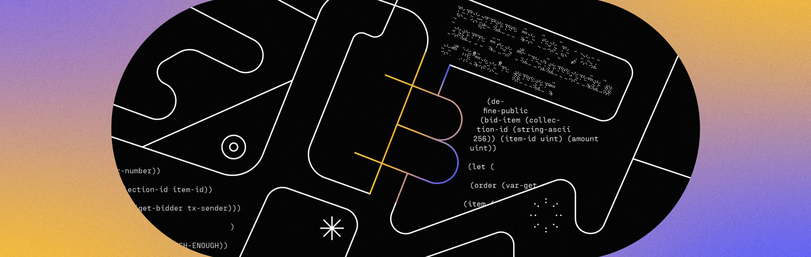

# Verifying Bitcoin Transactions in Clarity

<div data-with-frame="true"><figure><figcaption></figcaption></figure></div>


The current version of the `clarity-bitcoin-lib` is version 7. Click [here](https://explorer.hiro.so/txid/0xe433b35e95acfd24595e601860b4240cfaacd689ae7e7938a80c5505f186516b) for the deployed mainnet contract.


## Intro

One of the unique features of the Stack chain and the Clarity language is that it allows for using read-only functions to trustlessly validate on-chain Bitcoin activity from Clarity smart contracts. This enables developers to build applications that **react to real Bitcoin activity** — such as deposits, transfers, and proofs of inclusion — without relying on off-chain indexers or oracles. In this guide, you’ll learn how to verify Bitcoin transactions in Clarity and safely bridge Bitcoin state into on-chain logic.

> _Knowledge of Bitcoin state: has knowledge of the full Bitcoin state; it can trustlessly read_\
> _Bitcoin transactions and state changes and execute smart contracts triggered by Bitcoin_\
> _transactions. The Bitcoin read functionality helps to keep the decentralized peg state_\
> _consistent with BTC locked on Bitcoin L1, amongst other things. **- Stacks Whitepaper**_

### tl;dr

* We'll be using a popular smart contract `clarity-bitcoin-lib` to verify bitcoin transactions on-chain in Clarity.
* Allows contracts to enforce logic based on Bitcoin events—deposits, withdrawals, lockups, or multisig activity.
* Powers designs like wrapped assets, and deposits that mint or unlock value only after provable Bitcoin transactions.

### Steps

* Fetch bitcoin transaction metadata: block height and header, transaction hex, and the transaction's merkle proof of inclusion.
* Pass in transaction metadata as arguments to `clarity-bitcoin-lib` contract's `was-tx-mined-compact` read-only function.
* Returns `(ok <txid>)` if the proof checks out and the transaction is indeed mined in the specified Bitcoin block.

### Key Tools To Use

* [Clarity Bitcoin library](https://github.com/friedger/clarity-bitcoin): A Clarity library for parsing Bitcoin transactions and verifying Merkle proofs.
* [mempool.space APIs](https://mempool.space/docs/api/rest): Bitcoin explorer APIs used to fetch bitcoin transaction metadata.
* [Bitcoin Transaction Proof](https://github.com/kenrogers/bitcoin-tx-proof) \[optional]: A TypeScript library for generating Bitcoin transaction proofs, including witness data and merkle proofs.
* [Clarity Bitcoin Client](https://github.com/BigMarketDao/clarity-bitcoin-client) \[optional]: Clarity Bitcoin Client is an open-source TypeScript library for interacting with the `clarity-bitcoin-lib` contract on Stacks.

***

## Complete Code

If you want to jump straight to the full implementation, the complete working code used in this guide is shown below.



The below consists of the main client side code of preparing the bitcoin transaction metadata and passing them into a contract call to the `clarity-bitcoin-lib` contract.


```typescript
import {
  fetchCallReadOnlyFunction,
  bufferCV,
  uintCV,
  tupleCV,
  listCV,
  cvToString,
} from "@stacks/transactions"
import { hexToBytes } from "@stacks/common"
import { getTxHex, getTxMerkleProof, getBlkHeader, removeWitnessData } from "./fetch-bitcoin-data.js"

// Data of read-only function of below clarity-bitcoin-lib contract:
const contractAddress = "SP2PABAF9FTAJYNFZH93XENAJ8FVY99RRM50D2JG9"
const contractName = "clarity-bitcoin-lib-v7"
const functionName = "was-tx-mined-compact"

// Fetching btc tx metadata. You can replace this with any bitcoin transaction id.
let txid = "fb88309b4041f76bea0c196633c768dca82bb0dd424cbfe19be38569007f92d9"

// Fetching and returning non-witness tx hex
let fullTxHex = await getTxHex(txid)
let txHex = removeWitnessData(fullTxHex)
let { block_height, merkle, pos } = await getTxMerkleProof(txid)
let { blockHeader } = await getBlkHeader(block_height)

let txIndex = pos
let hashes = merkle.map(hash => bufferCV(hexToBytes(hash).reverse()))
let treeDepth = merkle.length

// Preparing arguments for clarity function call
let functionArgs = [
  // (height)
  uintCV(block_height),
  // (tx)
  bufferCV(Buffer.from(txHex, "hex")),
  // (header)
  bufferCV(Buffer.from(blockHeader, "hex")),
  // (proof)
  tupleCV({
    "tx-index": uintCV(txIndex),
    hashes: listCV(hashes),
    "tree-depth": uintCV(treeDepth)
  })
]

// Calling clarity read-only function
let result = await fetchCallReadOnlyFunction({
  contractAddress,
  contractName,
  functionName,
  functionArgs,
  network: 'mainnet',
  // this could be any principal address
  senderAddress: 'SP1PQHQKV0RJXZFY1DGX8MNSNYVE3VGZJSRCBGD7R'
})

// Logging results
console.log("Full tx hex: ", fullTxHex)
console.log("Non-witness tx hex: ", txHex)
console.log("Block height: ", block_height)
console.log("Block header: ", blockHeader)
console.log("Merkle proof hashes: ", merkle)
console.log("Transaction index in block: ", txIndex)
console.log("Merkle tree depth: ", treeDepth)
console.log("Was the transaction mined (from clarity-bitcoin)? ")
console.log(cvToString(result))
```




Helper functions to fetch the bitcoin transaction metadata from an explorer's API.


```typescript
import mempoolJS from "@mempool/mempool.js"
import { Transaction } from "bitcoinjs-lib"

// https://www.npmjs.com/package/@mempool/mempool.js
const {
  bitcoin: { transactions, blocks }
} = mempoolJS({
  hostname: "mempool.space"
})

export const getTxHex = async (txid: string) => {
  // Using mempool.space's GET /api/tx/:txid/hex
  const txHex = await transactions.getTxHex({ txid })

  return txHex
}

export const getTxMerkleProof = async (txid: string) => {
  // Using mempool.space's GET /api/tx/:txid/merkle-proof
  const { block_height, merkle, pos } = await transactions.getTxMerkleProof({ txid })

  return { block_height, merkle, pos }
}

export const getBlkHeader = async (height: number) => {
  // Using mempool.space's GET /api/block-height/:height
  let blockHash = await blocks.getBlockHeight({ height })

  // Using mempool.space's GET /api/block/:hash/header
  const blockHeader = await blocks.getBlockHeader({ hash: blockHash })

  return { blockHash, blockHeader }
}

// Function to remove witness data from a Bitcoin transaction hex
// `was-tx-mined-compact` requires non-witness transaction format
export const removeWitnessData = (txHex: string) => {
  const tx = Transaction.fromHex(txHex)

  if (!tx.hasWitnesses()) {
    return txHex
  }

  // Create a new empty transaction
  const newTx = new Transaction()

  // Copy version from original transaction
  newTx.version = tx.version

  // Copy inputs from original transaction
  tx.ins.forEach(input => {
    newTx.addInput(input.hash, input.index, input.sequence, input.script)
  })

  // Copy outputs from original transaction
  tx.outs.forEach(output => {
    newTx.addOutput(output.script, output.value)
  })

  // Copy locktime from original transaction
  newTx.locktime = tx.locktime

  return newTx.toHex()
}
```




This is a snippet of the contract function we invoke to verify a bitcoin transaction.


```clarity
;; --snip--

(define-read-only (was-tx-mined-compact
    (height uint)
    (tx (buff 4096))
    (header (buff 80))
    (proof {
      tx-index: uint,
      hashes: (list 14 (buff 32)),
      tree-depth: uint,
    })
  )
  (let ((block (unwrap! (parse-block-header header) (err ERR-BAD-HEADER))))
    (was-tx-mined-internal height tx header (get merkle-root block) proof)
  )
)

;; --snip--
```




***

## Walkthrough



### Fetch bitcoin transaction metadata

Using mempool.space's APIs and with a bitcoin txid, fetch the required bitcoin transaction metadata needed for Clarity.

* Fetches the transaction hex
* Fetches the transaction merkle proof
* Fetches the block header
* Removes witness data from transaction hex


```typescript
import mempoolJS from "@mempool/mempool.js"
import { Transaction } from "bitcoinjs-lib"

// https://www.npmjs.com/package/@mempool/mempool.js
const {
  bitcoin: { transactions, blocks }
} = mempoolJS({
  hostname: "mempool.space"
})

export const getTxHex = async (txid: string) => {
  // Using mempool.space's GET /api/tx/:txid/hex
  const txHex = await transactions.getTxHex({ txid })

  return txHex
}

export const getTxMerkleProof = async (txid: string) => {
  // Using mempool.space's GET /api/tx/:txid/merkle-proof
  const { block_height, merkle, pos } = await transactions.getTxMerkleProof({ txid })

  return { block_height, merkle, pos }
}

export const getBlkHeader = async (height: number) => {
  // Using mempool.space's GET /api/block-height/:height
  let blockHash = await blocks.getBlockHeight({ height })

  // Using mempool.space's GET /api/block/:hash/header
  const blockHeader = await blocks.getBlockHeader({ hash: blockHash })

  return { blockHash, blockHeader }
}

// Function to remove witness data from a Bitcoin transaction hex
// `was-tx-mined-compact` requires non-witness transaction format
export const removeWitnessData = (txHex: string) => {
  const tx = Transaction.fromHex(txHex)

  if (!tx.hasWitnesses()) {
    return txHex
  }

  // Create a new empty transaction
  const newTx = new Transaction()

  // Copy version from original transaction
  newTx.version = tx.version

  // Copy inputs from original transaction
  tx.ins.forEach(input => {
    newTx.addInput(input.hash, input.index, input.sequence, input.script)
  })

  // Copy outputs from original transaction
  tx.outs.forEach(output => {
    newTx.addOutput(output.script, output.value)
  })

  // Copy locktime from original transaction
  newTx.locktime = tx.locktime

  return newTx.toHex()
}
```


<details>

<summary>Are there libraries to help with fetching of the bitcoin transaction metadata?</summary>

There sure are. Here are two community-built libraries that can abstract away some of the complexities with gathering the bitcoin transaction metadata.

* [**Bitcoin Transaction Proof**](https://github.com/kenrogers/bitcoin-tx-proof) - A TypeScript library for generating Bitcoin transaction proofs, including witness data and merkle proofs.
* [**Clarity Bitcoin Client**](https://github.com/BigMarketDao/clarity-bitcoin-client) - A TypeScript library for interacting with the clarity-bitcoin-lib contract on Stacks.

</details>

<details>

<summary>Don't have a bitcoin transaction id?</summary>

Learn how to create and broadcast a bitcoin transaction on the frontend [here](creating-btc-tx.md).

</details>



### Prepare metadata as Clarity arguments

Let's circle back to the `was-tx-mined-compact` function of the `clarity-bitcoin-lib` contract for a second and analyze the order/type of parameters.

You can see that it intakes the parameters with a certain typing and order:

* `(height uint)` the block height you are looking to verify the transaction within
* `(tx (buff 1024))` the raw transaction hex of the transaction you are looking to verify
* `(header (buff 80))` the block header of the block
* `(proof { tx-index: uint, hashes: (list 14 (buff 32)), tree-depth: uint})` a merkle proof formatted as a Clarity tuple

In short, the `was-tx-mined-compact` function takes the block height, the transaction hex, the block header, and a merkle proof, and determines that:

* the block header corresponds to the block that was mined at the given Bitcoin height&#x20;
* the transaction's merkle proof links it to the block header's merkle root.


The current version of the `clarity-bitcoin-lib` is version 7. Click [here](https://explorer.hiro.so/txid/0xe433b35e95acfd24595e601860b4240cfaacd689ae7e7938a80c5505f186516b) for the deployed mainnet contract.



```clarity
;; --snip--

(define-read-only (was-tx-mined-compact
    (height uint)
    (tx (buff 4096))
    (header (buff 80))
    (proof {
      tx-index: uint,
      hashes: (list 14 (buff 32)),
      tree-depth: uint,
    })
  )
  (let ((block (unwrap! (parse-block-header header) (err ERR-BAD-HEADER))))
    (was-tx-mined-internal height tx header (get merkle-root block) proof)
  )
)

;; --snip--
```


So after you've fetched the bitcoin tx metadata and have removed the witness data from the original transaction hex, let's go ahead and prepare the metadata into it's Clarity parameter values.


```typescript
import {
  fetchCallReadOnlyFunction,
  bufferCV,
  uintCV,
  tupleCV,
  listCV,
  cvToString,
} from "@stacks/transactions"
import { hexToBytes } from "@stacks/common"
import { getTxHex, getTxMerkleProof, getBlkHeader, removeWitnessData } from "./fetch-bitcoin-data.js"

// Data of read-only function of below clarity-bitcoin-lib contract:
const contractAddress = "SP2PABAF9FTAJYNFZH93XENAJ8FVY99RRM50D2JG9"
const contractName = "clarity-bitcoin-lib-v7"
const functionName = "was-tx-mined-compact"

// Fetching btc tx metadata. You can replace this with any bitcoin transaction id.
let txid = "fb88309b4041f76bea0c196633c768dca82bb0dd424cbfe19be38569007f92d9"

// Fetching and returning non-witness tx hex
let fullTxHex = await getTxHex(txid)
let txHex = removeWitnessData(fullTxHex)
let { block_height, merkle, pos } = await getTxMerkleProof(txid)
let { blockHeader } = await getBlkHeader(block_height)

let txIndex = pos
let hashes = merkle.map(hash => bufferCV(hexToBytes(hash).reverse()))
let treeDepth = merkle.length

// Preparing arguments for clarity function call
let functionArgs = [
  // (height)
  uintCV(block_height),
  // (tx)
  bufferCV(Buffer.from(txHex, "hex")),
  // (header)
  bufferCV(Buffer.from(blockHeader, "hex")),
  // (proof)
  tupleCV({
    "tx-index": uintCV(txIndex),
    hashes: listCV(hashes),
    "tree-depth": uintCV(treeDepth)
  })
]
```


<details>

<summary>What is the purpose of the merkle proof?</summary>

A Merkle proof is a mathematically efficient and compact manner to prove that a transaction is included in a block in the Bitcoin blockchain.

#### How transactions are combined into the Merkle root

Transactions in a block are hashed and paired, then the hashes of the pairs are hashed and paired, and so on until a single hash remains — this is called the Merkle root.

#### Merkle root in the block header

The Merkle root is included in the block header. By providing the hashes that lead from a transaction's hash up to the Merkle root, along with the block header, one can prove that the transaction is included in that block.

#### Merkle proof (Merkle path)

The hashes that connect a transaction to the Merkle root are called the Merkle proof or Merkle path. By providing the Merkle proof along with the transaction hash and block header, anyone can verify that the transaction is part of that block.

#### Efficient decentralized verification

This allows for efficient decentralized verification of transactions without having to download the entire blockchain. One only needs the transaction hash, Merkle proof, and block header to verify.

</details>

<details>

<summary>Why are we removing the witness data from the original tx hex?</summary>

The `clarity-bitcoin-lib` contract's  `was-tx-mined-compact` function only accepts a non-witness transaction hex. Usually only legacy bitcoin transactions are deemed as non-witness transactions. The contract also has a dedicated function for bitcoin transactions with witness data called `was-segwit-tx-mined-compact` .

But you could still verify any transaction type in `was-tx-mined-compact` by simply removing the witness data from the original tx hex.

</details>



### Invoke \`was-tx-mined-compact\` function

Construct a read-only function call, pass in the contract call options, and await the results. If the bitcoin transaction in question is indeed mined in an existing Bitcoin block, the contract will return a response that looks like:

`(ok 0xfb88309b4041f76bea0c196633c768dca82bb0dd424cbfe19be38569007f92d9)`

You'll see your exact bitcoin txid returned wrapped in an `ok` response.


```typescript
// --snip--

// Calling clarity read-only function
let result = await fetchCallReadOnlyFunction({
  contractAddress,
  contractName,
  functionName,
  functionArgs,
  network: 'mainnet',
  // this could be any principal address
  senderAddress: 'SP1PQHQKV0RJXZFY1DGX8MNSNYVE3VGZJSRCBGD7R'
})

// Logging results
console.log("Full tx hex: ", fullTxHex)
console.log("Non-witness tx hex: ", txHex)
console.log("Block height: ", block_height)
console.log("Block header: ", blockHeader)
console.log("Merkle proof hashes: ", merkle)
console.log("Transaction index in block: ", txIndex)
console.log("Merkle tree depth: ", treeDepth)
console.log("Was the transaction mined (from clarity-bitcoin)? ")
console.log(cvToString(result))
```




That's the end-to-end flow: fetch the bitcoin transaction metadata and its merkle proof, prepare and assemble the data for the contract's read-only function call, and finally call the Clarity contract function that verifies inclusion in a Bitcoin block.

***

## Example Usage

Here are some example projects/contracts that would leverage the `clarity-bitcoin-lib` contract in their own code.

#### Square Runes

A Clarity implementation for parsing Bitcoin Runes protocol data. Check out the project repo [here](https://github.com/Rapha-btc/square-runes).

<pre class="language-clarity" data-title="runes-capsule-v0.clar" data-expandable="true"><code class="lang-clarity">;; --snip--

;; Main entry point: Process a Runes deposit with full merkle proof verification
(define-public (process-deposit
    (height uint)
    (wtx {
      version: (buff 4),
      ins: (list 50 { outpoint: { hash: (buff 32), index: (buff 4) }, scriptSig: (buff 1376), sequence: (buff 4) }),
      outs: (list 50 { value: (buff 8), scriptPubKey: (buff 1376) }),
      locktime: (buff 4),
    })
    (witness-data (buff 1650))
    (header (buff 80))
    (tx-index uint)
    (tree-depth uint)
    (wproof (list 14 (buff 32)))
    (witness-merkle-root (buff 32))
    (witness-reserved-value (buff 32))
    (ctx (buff 4096))
    (cproof (list 14 (buff 32)))
    (mom-token &#x3C;sr-trait>)
  )
  (let (
      ;; Build full tx buffer
      (tx-buff (contract-call?
        'SP2PABAF9FTAJYNFZH93XENAJ8FVY99RRM50D2JG9.bitcoin-helper-wtx-v2
        concat-wtx wtx witness-data
      ))
    )
    ;; Verify tx was mined on Bitcoin
    (match (contract-call?
<strong>      'SP2PABAF9FTAJYNFZH93XENAJ8FVY99RRM50D2JG9.clarity-bitcoin-lib-v7
</strong>      was-segwit-tx-mined-compact height tx-buff header tx-index tree-depth
      wproof witness-merkle-root witness-reserved-value ctx cproof
    )
      btc-tx-id (process-verified-deposit btc-tx-id tx-buff height mom-token)
      error (err (* error u1000)) ;; ERR-TX-NOT-MINED
    )
  )
)

;; --snip--
</code></pre>

***

## Additional Resources

* \[[Hiro YT](https://youtu.be/mPba9vJEDlc?si=wTCqweRWWFP-jyCJ)] Bitcoin Enabled NFT - Stacks NFTs Minted By Bitcoin Transactions
* \[[Hiro Blog](https://www.hiro.so/blog/how-to-use-bitcoin-data-in-clarity-unit-tests)] How to Use Bitcoin Data in Clarity Unit Tests
