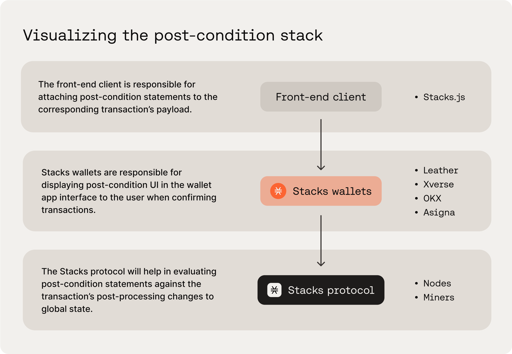
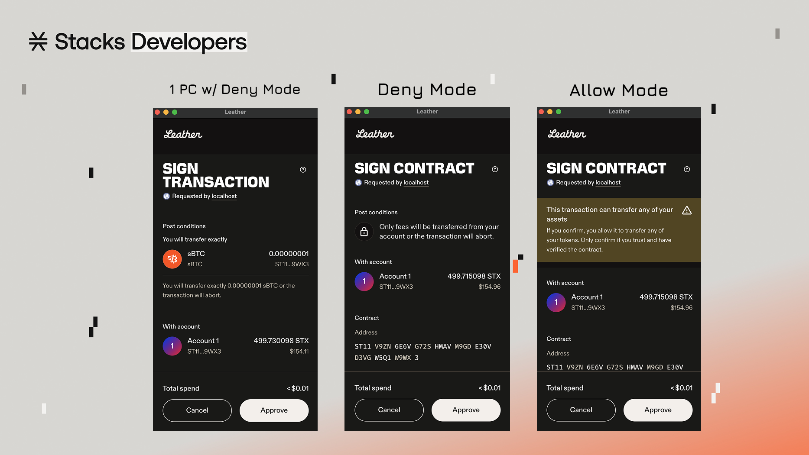

# Overview

<div data-with-frame="true"><figure><figcaption><p>source: <a href="https://www.hiro.so/blog/a-developers-guide-to-post-conditions">Hiro Blog</a></p></figcaption></figure></div>

### What are post-conditions?

Post-conditions are assertions about an on-chain transaction that must be met; otherwise, the transaction will abort during execution. In other words, post-conditions act as a safety net, allowing you to specify what state changes can occur in a transaction. This logic helps limit the amount of damage that can be done to a user and their assets, whether due to a bug or malicious behavior.

Put simply, post conditions are a set of conditions that must be met before a user's transaction will execute. The primary goal behind post conditions is to limit the amount of damage that can be done to a user's assets due to a bug, intentional or otherwise.

Post conditions are an additional safety feature built into the Stacks chain itself that help to protect end users. Rather than being a function of Clarity smart contracts, they are implemented on the client side and meant to be an additional failsafe against malicious contracts.

They are sent as part of the transaction when the user initiates it, meaning we need to implement post-conditions on the frontend. Whenever you are transferring an asset (fungible or non-fungible) from one address to another, you should take advantage of post conditions.

### The post-condition stack

Post-conditions are enforced by the Stacks protocol itself but do not exist in the smart contracts themselves. Instead, they are programmatically constructed in your front-end application code using Stacks.js, specifically by passing them in as options to the transaction payload construction.

By having post-conditions in the frontend code, Stacks-enabled wallets, such as Leather and Xverse, are able to display the post-conditions in a human-readable format for the user when confirming their transactions. Once a user confirms the transaction, the post-conditions get carried along with the transaction payload where eventually the Stacks protocol will evaluate them together.&#x20;

<div data-with-frame="true"><figure><figcaption><p><em>A visualization of the “post-conditions stack" and the entities involved</em></p></figcaption></figure></div>

If there were no post-conditions in the front-end application code, a user’s wallet will display an abstract warning message, where it would be up to the user to decide whether they want to blindly proceed with the transaction or not. And whatever the underlying contract code wants to do, it will do without any post-condition restrictions. So if a contract tries to send your STX tokens to a drainer wallet, it will without you knowing.&#x20;

Even with post-conditions set up on the frontend code, a user is still blind to the underlying Clarity smart contract code, but at least they know what to _expect_ will happen in the transaction. And if that expectation is not met, the transaction will abort and fail.

### Example of a post-condition

Post-conditions act as safeguards that verify asset transfers match your expectations. They can check STX transfers, fungible tokens, and non-fungible token ownership changes.

```ts
import { Pc } from '@stacks/transactions';

const tx = await makeContractCall({
  // ...
  postConditions: [
    Pc.principal('STB44HYPYAT2BB2QE513NSP81HTMYWBJP02HPGK6').willSendEq(1000).ustx(),
  ],
});
```

In the example code snippet below, we are declaring that the user should expect to send exactly 1000 uSTX during the execution of this contract call transaction. If this condition is not met, the transaction will fail.

### Using the Pc helper

The `Pc` helper provides a fluent API for creating post-conditions with better type safety and readability.

```ts
import { Pc } from '@stacks/transactions';

// STX transfer post-condition
const stxCondition = Pc
  .principal('STB44HYPYAT2BB2QE513NSP81HTMYWBJP02HPGK6')
  .willSendGte(1000)
  .ustx();

// Fungible token post-condition
const ftCondition = Pc
  .principal('STB44HYPYAT2BB2QE513NSP81HTMYWBJP02HPGK6')
  .willSendEq(50)
  .ft('SP3D6PV2ACBPEKYJTCMH7HEN02KP87QSP8KTEH335.my-token', 'my-token');

// NFT post-condition
const nftCondition = Pc
  .principal('STB44HYPYAT2BB2QE513NSP81HTMYWBJP02HPGK6')
  .willSendAsset()
  .nft('SP3D6PV2ACBPEKYJTCMH7HEN02KP87QSP8KTEH335.my-nft::my-asset', Cl.uint(1));
```

### Manual creation

Create post-conditions manually using type definitions when building conditions dynamically.

```ts
import {
  StxPostCondition,
  FungiblePostCondition,
  NonFungiblePostCondition
} from '@stacks/transactions';

// STX post-condition
const stxPostCondition: StxPostCondition = {
  type: 'stx-postcondition',
  address: 'SP2JXKMSH007NPYAQHKJPQMAQYAD90NQGTVJVQ02B',
  condition: 'gte', // 'eq' | 'gt' | 'gte' | 'lt' | 'lte'
  amount: '100',
};
```

Available condition types:

* `eq`: Exactly equal to amount
* `gt`: Greater than amount
* `gte`: Greater than or equal to amount
* `lt`: Less than amount
* `lte`: Less than or equal to amount

#### Fungible tokens

```ts
const ftPostCondition: FungiblePostCondition = {
  type: 'ft-postcondition',
  address: 'SP2JXKMSH007NPYAQHKJPQMAQYAD90NQGTVJVQ02B',
  condition: 'eq',
  amount: '100',
  asset: 'SP3D6PV2ACBPEKYJTCMH7HEN02KP87QSP8KTEH335.my-ft-token::my-token',
};
```

#### Non-fungible tokens

```ts
const nftPostCondition: NonFungiblePostCondition = {
  type: 'nft-postcondition',
  address: 'SP2JXKMSH007NPYAQHKJPQMAQYAD90NQGTVJVQ02B',
  condition: 'sent', // 'sent' | 'not-sent'
  asset: 'SP3D6PV2ACBPEKYJTCMH7HEN02KP87QSP8KTEH335.my-nft::my-asset',
  assetId: Cl.uint(602),
};
```

### Post-condition modes

Control how unspecified, unexpected, or unforeseen asset transfers are handled with post-condition mode.

#### **Deny Mode**

Deny mode is the default for post-conditions. Deny is a more-strict setting for post-conditions, and it says that any other asset transfers that do not meet the criteria of the post-condition are denied. In deny mode, any transaction that does not meet the post-condition criteria will fail.

```ts
import { PostConditionMode } from '@stacks/transactions';

const tx = await makeContractCall({
  // ...
  postConditionMode: PostConditionMode.Deny,
  postConditions: [
    // your conditions
  ],
});
```

This setting is useful when you want to limit any transfer events to a specific set of criteria. This setting is ultimately what makes post-conditions powerful, hence the reason why this is defaulted as `deny` if you don’t or forget to pass in a `postConditionMode` option.


Post-condition mode\
Always use `Deny` mode unless you have a specific reason to allow additional transfers. This provides maximum security for users.


#### Allow mode

Allow mode is a less-strict setting, in which it “allows” any transaction to execute as long as it meets the criteria of the specified post-conditions. In other words, this `allow` mode enables additional transactions to occur as long as the post-condition is met in that process. This setting is useful when you want to allow other unknown or dynamic transfers to happen. But usually you wouldn’t want to have this happen as this can open up unintended consequences for the user.

### How post-conditions appear to the user

Since post-conditions are declared on your frontend code, they also need to be visually displayed to users. Stacks-supported wallets handle that by displaying post-conditions on the transaction confirmation modals that popup when a user needs to confirm/approve a transaction.

<div data-with-frame="true"><figure><figcaption><p>How post-conditions appear in wallets under different post-condition modes</p></figcaption></figure></div>

### Things to remember

While powerful, post-conditions have some limitations you should keep in mind. Post-conditions only track who _sends_ an asset, and how much. They do not monitor who owns any set of assets when the transaction finishes, nor do they monitor the sequence of owners an asset might have during transaction execution.

Alongside those limitations, it should be obvious, but it’s worth explicitly stating that post-conditions are not a catch-all. Just because you implement post-conditions doesn’t mean your contract or next transaction are guaranteed to be safe. Bugs can still occur, and you still need to build with security in mind. Debugging and extensive tests are still your best friend.

***

### Additional Resources

* \[[Hiro Blog](https://www.hiro.so/blog/a-developers-guide-to-post-conditions)] A Developer’s Guide to Post-Conditions
* \[[dev.to](https://dev.to/stacks/understanding-stacks-post-conditions-e65)] Understanding Stacks Post Conditions
* \[[Hiro YT](https://youtu.be/xXgQB8NfdEY?si=aEY_wrLybfWPMJTt)] ELI5: Post-Condtions on Stacks
* \[[Hiro YT](https://youtu.be/wagcE_IXfME?si=kDqxzPAQ-XsA478l)] Understanding Post-Conditions in a Stacks Blockchain Transaction
* \[[StacksGov](https://github.com/stacksgov/sips/blob/main/sips/sip-005/sip-005-blocks-and-transactions.md#transaction-post-conditions)] Post-conditions section in SIP-005
