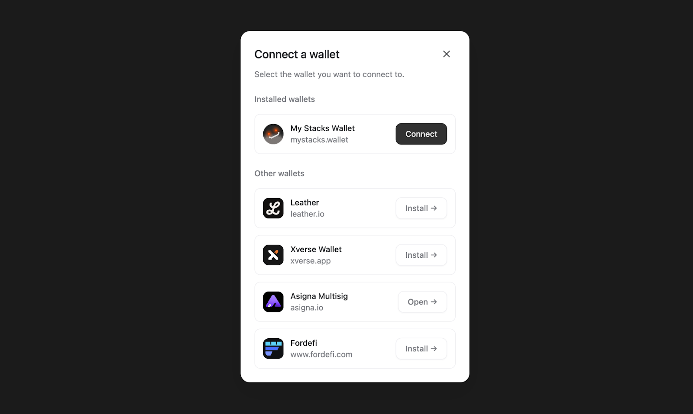
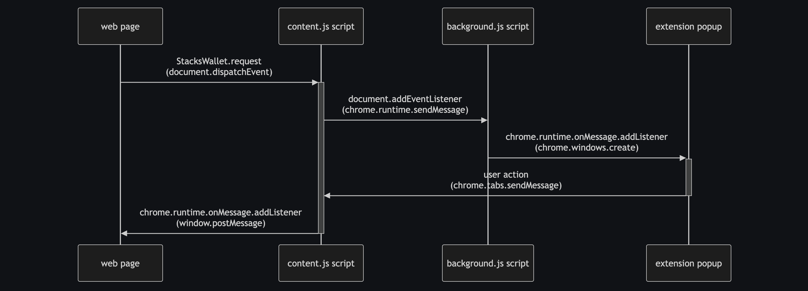
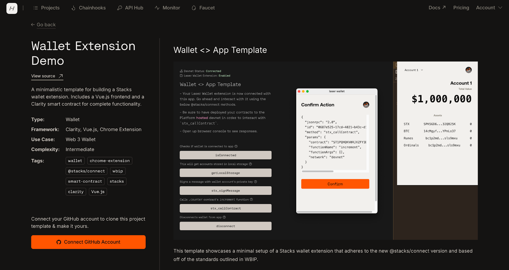

# Wallet Implementation

<div data-with-frame="true"><figure><figcaption></figcaption></figure></div>

Connect provides a streamlined way for wallets to integrate with dapps by using a simple, direct RPC-based protocol, avoiding unnecessary abstraction layers. It defines a clear wallet provider interface and discovery mechanism, enabling consistent, conflict-free wallet connections. This approach makes it easier for applications to integrate wallets and for anyone to build a wallet that is reliably discoverable by Connect-enabled dapps.

### Discovery Mechanism

**Enable Your Custom Wallet to be Detected by Stacks Apps**

<div data-with-frame="true"><figure><figcaption></figcaption></figure></div>

We will show you how your wallet can interact with incoming JSON RPC 2.0 requests and responses to handle modern Connect methods in order to connect to apps. But first, you’ll want to make sure you have a good understanding of the different context script standards of a [Chrome extension](https://developer.chrome.com/docs/extensions). The context scripts mainly consist of your popup script, background script, and content script.

**3 scripts of a Chrome extension:**

* **Popup**: This is the main script that handles the visual UI of the actual popup modal when interacting with an extension.
* **Background**: This script allows your extension to hand off logic that may require intensive computation or for dealing with secure data.
* **Content**: This allows your extension to interact with the web page itself.

In your content script, which enables you to run scripts on the web page a user is currently on, you’ll want to “inject” a `StacksProvider` object type into the global `window` object of the web page. It’s important to note that this must be handled by your extension’s content script, which should automatically load anytime you land on a webpage.  This injected object is what will allow web apps to directly interact with your wallet. It’s like your wallet extension saying, “Hey! I’m available to communicate with your app, let’s connect!”&#x20;

The `StacksProvider` object needs to at least have a `.request` method that takes in the name of a string literal method, and an parameters object.


```typescript
// --snip--

window.MyProvider = {
  async request(method, params) {
    // Somehow communicate with the wallet (e.g. via events)

    // Recommendation: Create a JSON RPC 2.0 request object
    // https://www.jsonrpc.org/specification

    return Promise.resolve({
      // Respond with a JSON RPC 2.0 response object
      id: crypto.randomUUID(), // required, same as request
      jsonrpc: '2.0', // required

      // `.result` is required on success
      result: {
        // object matching specified RPC methods
      },

      // `.error` is required on error
      error: {
        // Use existing codes from https://www.jsonrpc.org/specification#error_object
        code: number, // required, integer
        message: string, // recommended, single sentence
        data: object, // optional
      },
    });
  },
  isMyWallet: true, // optional, a way of identifying the wallet for developers
};

// --snip--
```


This `StacksProvider` object type could be named anything. In the example above, it’s named `MyProvider`.&#x20;

From here, web apps can directly call your wallet extension provider via `window.MyProvider` directly, and you don’t even need to use the Stacks Connect library. However, your wallet app would need to manually handle other important implementation details, such as the storage of the wallet info and individual method calling.&#x20;

But with the Connect library, apps don’t have to manually roll their own methods and implementations. The Connect library will handle all those functionalities for the app.

In order for you to make your wallet provider object (from the previous section) be discoverable by the Connect modal UI wallet selector used by frontend apps, you’ll need to then pass it into a separate `wbip_providers` array on the `window` object. The `wbip_providers` array is a new standard set forth by [WBIP004](https://wbips.netlify.app/wbips/WBIP004).

Any wallet that registers their provider in this array is declaring that they are conforming to the WBIP standards, which are a set of specifications for web apps and client providers to facilitate communication with Bitcoin-related apps. Wallets SHOULD register their provider information under `window.wbip_providers` to be discoverable by websites/libraries expecting this WBIP.


```typescript
// --snip--

window.wbip_providers = window.wbip_providers || [];
window.wbip_providers.push({
  // `WbipProvider` type
  /** The global "path" of the provider (e.g. `"MyProvider"` if registered at `window.MyProvider`) */
  id: 'MyProvider',
  /** The name of the provider, as displayed to the user */
  name: 'My Wallet';
  /** The data URL of an image to show (e.g. `data:image/png;base64,iVBORw0...`) @see https://developer.mozilla.org/en-US/docs/Web/HTTP/Basics_of_HTTP/Data_URLs */
  icon?: 'data:image/png;base64,iVBORw0...';
  /** Web URL of the provider */
  webUrl?: 'https://mywallet.example.com';

  // Additional URLs
  chromeWebStoreUrl?: string;
  mozillaAddOnsUrl?: string;
  googlePlayStoreUrl?: string;
  iOSAppStoreUrl?: string;
});

// --snip--
```


Literally injecting these scripts can come from your content script as shown below. You could leverage the content.js script for injecting the `injection.js` into the document page and forwarding messages between the document page and the background script. Setup is dependent on your architecture.


```typescript
// --snip--

const script = document.createElement("script");
script.src = chrome.runtime.getURL("injection.js");
script.type = "module";
document.head.prepend(script);

// --snip--
```


### Handling Method Requests and Responses <a href="#handling-method-requests-and-responses" id="handling-method-requests-and-responses"></a>

**Enable your wallet to handle requests from the frontend app**

Structuring the manner in which your wallet handles methods internally is up to your discretion (most methods can be properly handled by methods from [@stacks/transactions](https://docs.hiro.so/stacks/stacks.js/packages/transactions)), but receiving and responding to messages should adhere to the JSON RPC 2.0 standard and data types based on the string literal methods of the incoming request.

Let’s take the most basic function of connecting. From the Connect modal UI wallet selector, once a user clicks on the `connect` button of your wallet, it will invoke the string literal method of `getAddresses`, which accepts an optional parameter of `network`.

<div data-with-frame="true"><figure><figcaption><p>Communication flows are based off of standards like WBIP and SIP-030 to allow wallets to communicate with apps in a more simplified and flexible way.</p></figcaption></figure></div>

Once your wallet receives this JSON RPC 2.0 request message, it needs to handle the request and then return a response that conforms to the return type for `getAddresses`.

Using the `MethodParams` and `MethodResult` type helpers from the Connect library can help you here. Here’s a simplified example of how your wallet should handle the string literal method of `getAddresses`, which allows a standard connection between your wallet and app.


```typescript
import { type MethodResult, type MethodParams } from "@stacks/connect";

async function handleGetAddresses(payload: JsonRpcRequest) {
  let params: MethodParams<"getAddresses"> = payload.params;

  // handle generation of account addresses to return back to the app

  let result: MethodResult<"getAddresses"> = {
      addresses: [
        {
          symbol: "BTC",
          address: btcP2PKHAddress,
          publicKey: pubKey,
        },
        {
          symbol: "BTC",
          address: btcP2TRAddress,
          publicKey: pubKey,
        },
        {
          symbol: "STX",
          address: stxAddress,
          publicKey: pubKey,
        }
      ]
  };

  return result
}
```


You can also add your own unstandardized methods to your wallet. However, the minimum recommended methods to handle basic wallet functions are standardized and include:

* `getAddresses`
* `sendTransfer`
* `signPsbt`
* `stx_getAddresses`
* `stx_transferStx`
* `stx_callContract`
* `stx_signMessage`
* `stx_signStructuredMessage`

### Stacks Wallet Template

**Build your own Stacks wallet with the Wallet Template in the Hiro Platform**

<div data-with-frame="true"><figure><figcaption></figcaption></figure></div>

This template is a Chrome extension that comes with basic wallet functionalities, such as generating Stacks and Bitcoin addresses, changing accounts, and importing of external mnemonic seed phrases. Using this template as a starting point, you can build on this template to add other wallet features, such as displaying Stacks NFTs, fetching [Ordinals](https://www.hiro.so/ordinals-api) or [Runes](https://www.hiro.so/runes-api) balances with our dedicated APIs, securing of user mnemonic seed phrases, and much more.

It’s important to have an ecosystem that boasts a plethora of diverse wallet providers for different use cases, and learning how to build a wallet is a great entry point to Web3 and the Stacks ecosystem. Check out this [article](https://www.hiro.so/blog/an-intro-to-web3-wallets-for-web3-founders) to learn more about the importance of web3 wallets for web3 founders.

Head to the [Hiro Platform](https://platform.hiro.so/) to start building with this template.

***

### Additional Resources

* \[[Hiro Platform](https://platform.hiro.so/templates/wallet-extension)] Stacks Wallet Extension Template
* \[[Hiro YT](https://www.youtube.com/watch?v=PdluvfFPWoU)] Build Your Own Bitcoin L2 Wallet Browser Extension
* \[[Github repo](https://github.com/hirosystems/platform-template-stacks-wallet)] Open-source repo of the Stacks wallet extension template
* \[[WBIP](https://wbips.netlify.app/)] Stacks Wallet BIPs
* \[[SIP-030](https://github.com/janniks/sips/blob/main/sips/sip-030/sip-030-wallet-interface.md)] Definition of a Modern Stacks Wallet Interface Standard
