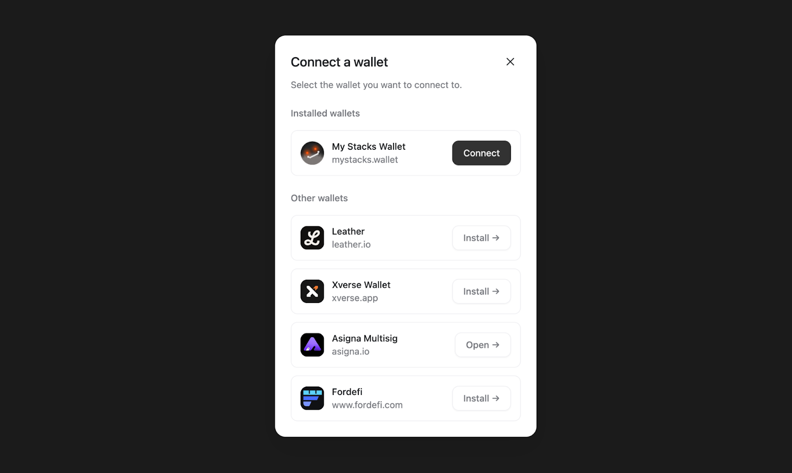
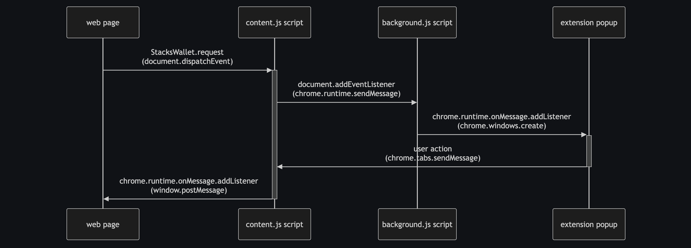
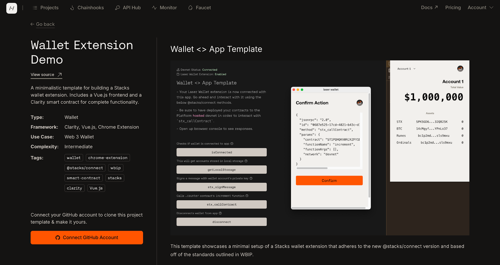

# Wallet Implementation

<div data-with-frame="true"><figure><figcaption></figcaption></figure></div>

Connect lets wallets integrate with dapps over a direct JSON-RPC 2.0 protocol. It defines a wallet provider interface and a discovery mechanism, so two wallets on the same page do not overwrite each other. An app integrates one interface, and a wallet that registers itself is discoverable by Connect-enabled dapps.

### Discovery Mechanism

**Enable Your Custom Wallet to be Detected by Stacks Apps**

<div data-with-frame="true"><figure><figcaption></figcaption></figure></div>

We will show you how your wallet can interact with incoming JSON RPC 2.0 requests and responses to handle modern Connect methods in order to connect to apps. But first, you'll want to make sure you have a good understanding of the different context script standards of a [Chrome extension](https://developer.chrome.com/docs/extensions). The context scripts mainly consist of your popup script, background script, and content script.

**3 scripts of a Chrome extension:**

* **Popup**: This is the main script that handles the visual UI of the actual popup modal when interacting with an extension.
* **Background**: This script allows your extension to hand off logic that may require intensive computation or for dealing with secure data.
* **Content**: This allows your extension to interact with the web page itself.

In your content script, which enables you to run scripts on the web page a user is currently on, inject an object that implements the `StacksProvider` interface into the global `window` object, under a key unique to your wallet. Your extension's content script must handle this, and it should load automatically on every page. This injected object is what will allow web apps to directly interact with your wallet.

The `StacksProvider` interface requires a `.request` method that takes a string literal method name and a parameters object.


```typescript
// --snip--

window.MyProvider = {
  async request(method, params) {
    // Somehow communicate with the wallet (e.g. via events)

    // Recommendation: Create a JSON RPC 2.0 request object
    // https://www.jsonrpc.org/specification

    return Promise.resolve({
      // Respond with a JSON RPC 2.0 response object
      id: crypto.randomUUID(), // required, same as request
      jsonrpc: '2.0', // required

      // `.result` is required on success
      result: {
        // object matching specified RPC methods
      },

      // `.error` is required on error
      error: {
        code: -32000, // required, integer; see Error codes below
        message: 'User rejected the request', // recommended, single sentence
        data: {}, // optional
      },
    });
  },
  isMyWallet: true, // optional, a way of identifying the wallet for developers
};

// --snip--
```


The key on `window` can be anything unique to your wallet. In the example above it is `MyProvider`. SIP-030 discourages a shared global: the historical `window.StacksProvider` was overwritten by whichever wallet loaded last, which left registration undefined.

From here, web apps can directly call your wallet extension provider via `window.MyProvider` directly, and you don't even need to use the Stacks Connect library. However, your wallet app would need to manually handle other important implementation details, such as the storage of the wallet info and individual method calling.

But with the Connect library, apps don't have to manually roll their own methods and implementations. The Connect library will handle all those functionalities for the app.

In order for you to make your wallet provider object (from the previous section) be discoverable by the Connect modal UI wallet selector used by frontend apps, you'll need to then pass it into a separate `wbip_providers` array on the `window` object. The `wbip_providers` array is a new standard set forth by [WBIP004](https://wbips.netlify.app/wbips/WBIP004).

Any wallet that registers their provider in this array is declaring that they are conforming to the WBIP standards, which are a set of specifications for web apps and client providers to facilitate communication with Bitcoin-related apps. Wallets SHOULD register their provider information under `window.wbip_providers` to be discoverable by websites/libraries expecting this WBIP.


```typescript
// --snip--

window.wbip_providers = window.wbip_providers || [];
window.wbip_providers.push({
  // The global "path" of the provider, so `"MyProvider"` for `window.MyProvider`
  id: 'MyProvider',
  // The name shown to the user
  name: 'My Wallet',
  // Optional: a data URL for the icon
  icon: 'data:image/png;base64,iVBORw0...',
  // Optional: web URL of the provider
  webUrl: 'https://mywallet.example.com',
  // Optional: chromeWebStoreUrl, mozillaAddOnsUrl, googlePlayStoreUrl, iOSAppStoreUrl
});

// --snip--
```


Literally injecting these scripts can come from your content script as shown below. You could leverage the content.js script for injecting the `injection.js` into the document page and forwarding messages between the document page and the background script. Setup is dependent on your architecture.


```typescript
// --snip--

const script = document.createElement("script");
script.src = chrome.runtime.getURL("injection.js");
script.type = "module";
document.head.prepend(script);

// --snip--
```


### Handling Method Requests and Responses <a href="#handling-method-requests-and-responses" id="handling-method-requests-and-responses"></a>

**Enable your wallet to handle requests from the frontend app**

Structuring the manner in which your wallet handles methods internally is up to your discretion (most methods can be properly handled by methods from [@stacks/transactions](https://docs.stacks.co/reference/stacks.js/stacks-transactions)), but receiving and responding to messages should adhere to the JSON RPC 2.0 standard and data types based on the string literal methods of the incoming request.

Let's take the most basic function of connecting. From the Connect modal UI wallet selector, once a user clicks on the `connect` button of your wallet, it will invoke the string literal method of `getAddresses`, which accepts an optional parameter of `network`.

<div data-with-frame="true"><figure><figcaption><p>Communication flows are based off of standards like WBIP and SIP-030 to allow wallets to communicate with apps in a more simplified and flexible way.</p></figcaption></figure></div>

Once your wallet receives this JSON RPC 2.0 request message, it needs to handle the request and then return a response that conforms to the return type for `getAddresses`.

Using the `MethodParams` and `MethodResult` type helpers from the Connect library can help you here. Here's a simplified example of how your wallet should handle the string literal method of `getAddresses`, which allows a standard connection between your wallet and app.


```typescript
import { type MethodResult, type MethodParams } from "@stacks/connect";

async function handleGetAddresses(payload: JsonRpcRequest) {
  let params: MethodParams<"getAddresses"> = payload.params;

  // handle generation of account addresses to return back to the app

  let result: MethodResult<"getAddresses"> = {
      addresses: [
        {
          symbol: "BTC",
          address: btcP2PKHAddress,
          publicKey: pubKey,
        },
        {
          symbol: "BTC",
          address: btcP2TRAddress,
          publicKey: pubKey,
        },
        {
          symbol: "STX",
          address: stxAddress,
          publicKey: pubKey,
        }
      ]
  };

  return result
}
```


#### Post-conditions

**Read what the user asked you to protect**

A `stx_callContract` request carries two parameters that decide what the user is protected against. A wallet that ignores them signs away that protection without telling anyone.

`postConditions` is an array. Each entry is a hex-encoded string or a JSON object. `postConditionMode` decides what happens to asset movements no post-condition covers.

The node accepts three modes:

| Mode         | Byte   | Effect on uncovered transfers                                                                     |
| ------------ | ------ | ------------------------------------------------------------------------------------------------- |
| `allow`      | `0x01` | Permitted                                                                                         |
| `deny`       | `0x02` | Rejected                                                                                          |
| `originator` | `0x03` | Rejected when the sender is the transaction's origin account, permitted for every other principal |

`originator` comes from [SIP-040](https://github.com/stacksgov/sips/blob/main/sips/sip-040/sip-040-post-conds.md) and is live from Epoch 3.4. SIP-030's published parameter table lists `'allow' | 'deny'`, because it was written before SIP-040 and SIP-045 were ratified. [PR #279](https://github.com/stacksgov/sips/pull/279) tracks the amendment. Build against the three modes the node accepts.

There are five post-condition types. The first three are from SIP-005, the last two from [SIP-045](https://github.com/stacksgov/sips/blob/main/sips/sip-045/sip-045-pox-5-bitcoin-staking.md) and live from Epoch 4.0:

| Type                    | Byte   | Guards                                                                                                                       |
| ----------------------- | ------ | ---------------------------------------------------------------------------------------------------------------------------- |
| `stx-postcondition`     | `0x00` | STX sent by a principal                                                                                                      |
| `ft-postcondition`      | `0x01` | Fungible token sent by a principal                                                                                           |
| `nft-postcondition`     | `0x02` | A named non-fungible token instance                                                                                          |
| `staking-postcondition` | `0x03` | STX staked or restaked: `stake`, `register-for-bond`, `stake-update`                                                         |
| `pox-postcondition`     | `0x04` | PoX state changes that do not alter locking: `unstake`, `unstake-sbtc`, `update-bond-registration`, `announce-l1-early-exit` |

A wallet that cannot represent `staking-postcondition` cannot show the user what a bond registration will lock. The types are exported from `@stacks/transactions`, so a wallet using that package for its transaction handling gets them without extra work.

Two condition-code additions matter for display. The NFT comparator gained `maybe-sent` (`0x12`, SIP-040), which always passes and counts as covering that token instance. The PoX comparator is its own set: `will-not-perform`, `may-perform`, `will-perform`.

Show the user every post-condition before signing, and show the mode. A user who reads `allow` and a user who reads `deny` are agreeing to different things.

#### Error codes

Return JSON-RPC 2.0 error objects. SIP-030 reserves two ranges beyond the standard codes, so an app can tell a user rejection apart from a wallet fault.

| Code     | Name                    | When                                           |
| -------- | ----------------------- | ---------------------------------------------- |
| `-32700` | Parse Error             | Invalid JSON                                   |
| `-32600` | Invalid Request         | Malformed request object                       |
| `-32601` | Method Not Found        | Method not available in this wallet            |
| `-32602` | Invalid Params          | Bad method parameters                          |
| `-32603` | Internal Error          | Internal JSON-RPC error                        |
| `-32000` | User Rejection          | The user rejected the request                  |
| `-32001` | Method Address Mismatch | Address mismatch for the requested method      |
| `-32002` | Method Access Denied    | Access denied for the requested method         |
| `-31000` | Unknown Error           | External error, not from the wallet            |
| `-31001` | User Canceled           | The user canceled, possibly outside the wallet |

`-32099` to `-32000` is the implementation-defined wallet range. `-31099` to `-31000` is the custom range outside JSON-RPC's own codes.

#### Methods to implement

You can also add your own unstandardized methods to your wallet. The minimum recommended methods to handle basic wallet functions are standardized across two specifications.

From [SIP-030](https://github.com/stacksgov/sips/blob/main/sips/sip-030/sip-030-wallet-interface.md), for Stacks:

* `stx_getAddresses`
* `stx_transferStx`
* `stx_callContract`
* `stx_signTransaction`
* `stx_signMessage`
* `stx_signStructuredMessage`

From the WBIP standards, for Bitcoin:

* `getAddresses`
* `sendTransfer`
* `signPsbt`

Implement `stx_signTransaction` even if your wallet builds its own transactions. Apps that construct a transaction themselves, including every app using `@stacks/bitcoin-staking`, hand the wallet a hex-encoded raw transaction rather than a set of contract-call arguments.

SIP-030 defines six further methods (`stx_transferSip10Ft`, `stx_transferSip9Nft`, `stx_deployContract`, `stx_getAccounts`, `stx_getNetworks`, `stx_updateProfile`) and two events (`stx_accountChange`, `stx_networkChange`). Wallets that hold multiple accounts or let the user switch networks should emit the two events, because an app has no other way to learn that the active account changed. `@stacks/connect` does not route `stx_getNetworks` or either event, so apps reach them only through your provider object.

### Stacks Wallet Template

**Build your own Stacks wallet with the Wallet Template**

<div data-with-frame="true"><figure><figcaption></figcaption></figure></div>

This template is a Chrome extension that comes with basic wallet functionalities, such as generating Stacks and Bitcoin addresses, changing accounts, and importing of external mnemonic seed phrases. Using this template as a starting point, you can build on this template to add other wallet features, such as displaying Stacks NFTs and securing user mnemonic seed phrases.

Check out the wallet template [here](https://github.com/hirosystems/platform-template-stacks-wallet).

***

### Additional Resources

* \[[Hiro YT](https://www.youtube.com/watch?v=PdluvfFPWoU)] Build Your Own Bitcoin L2 Wallet Browser Extension
* \[[Github repo](https://github.com/hirosystems/platform-template-stacks-wallet)] Open-source repo of the Stacks wallet extension template
* \[[WBIP](https://wbips.netlify.app/)] Stacks Wallet BIPs
* \[[SIP-030](https://github.com/stacksgov/sips/blob/main/sips/sip-030/sip-030-wallet-interface.md)] Definition of a Modern Stacks Wallet Interface Standard
