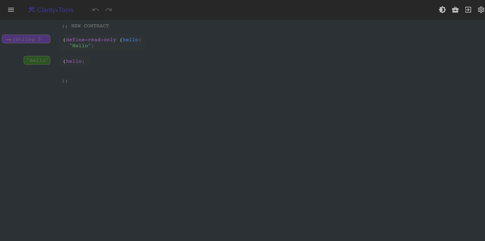

You now understand why Clarity exists and what problems it was designed to solve.
:::note
If you didn't read the previous section, go ahead and [do that first](./index.md).
:::

Now let's do a really quick introduction to Clarity so you can familiarize yourself with the language and syntax.

This crash course is designed for people who have some experience with programming but are new to Clarity. You don't need smart contract development experience, but if you do, with something like Solidity, you'll pick this up really quick.

Once you've familiarized yourself with the language, if you'd like to continue your journey and master Clarity to become a smart contract developer, we recommend either the book, [Clarity of Mind](https://book.clarity-lang.org/title-page.html), or the course, [Clarity Universe](https://clarity-lang.org/universe), which has both a self-paced and guided cohort-based version.

## Your First Clarity Smart Contract

We're going to build a basic Clarity smart contract using [Clarity Tools](https://clarity.tools/code/new), so you won't have to install anything for this introduction.

Visit that link, and it will open up a new contract for you.



Already we can take a look at a few basic features of both Clarity and Clarity Tools. First, on the left you'll see that our Clarity code is being evaluated in real-time for us. This is really nice for experimenting and demonstrating basic Clarity code.

Next up we can see our first bit of Clarity code.

Those two semicolons are how we denote comments in Clarity.

Then the next line down we have a public function declaration.

Here is out first glimpse of Clarity's syntax, which may be new to you depending on your development background.

For those new to Clarity, it's a little weird and uncomfortable at first, but one of the core design tenets of Clarity is simplicity and readability, and the more you work with it the more you come to appreciate the succinctness and _clarity_ (sorry) of the code you are writing.

Clarity takes inspiration from LISP, and you can think of everything in Clarity as a list inside of a list, or an expression inside of an expression. Everything in Clarity is wrapped in parentheses, function definitions, variable declarations, function parameters, etc.

So here we are saying that we want to:

1. Call a function called `define-read-only`. This is a built-in function, one of many that you can refer to [in the docs](./language-functions.md).

2. Pass it a parameter of hello, which corresponds to the method signature type.

3. Pass it a parameter of "Hello", which corresponds to the function body.

You can refer to the [`define-read-only`](https://docs.stacks.co/docs/write-smart-contracts/clarity-language/language-functions#define-read-only) documentation to see these parameters.

Why am I describing this as if we are calling a function? Because we are, and it's an important concept in Clarity that everything is an expression inside of an expression.

Let's expand on this concept a bit by deleting this and writing a new function.

```clojure
(define-data-var count int 0)
(define-public (add-number (number int))
    (let
        (
            (current-count count)
        )

        (var-set count (+ 1 number))
        (ok (var-get count))
    )
)


(add-number 5)
```

If you type that into Clarity Tools, you'll see the result that gets printed is 6.


Okay there are actually a lot of Clarity concepts packed into this simple code.

Let's go over what this code is doing, and you'll pick up some Clarity concepts along the way.

The first thing we are doing here is defining a new variable called `count` and setting its initial value to 0.

This will be a persistent state variable, so this is actually getting written to the blockchain. If you are new to smart contract development, the fact that data is persisted within the file like this might take some getting used to.

So if we were to write and deploy this contract (which you can do in the Stacks Explorer if you like), as soon as it gets deployed, it will run through the contract line by line executing anything at the root level.

Remember that Clarity is interpreted, not compiled, so there's not compile step when developing Clarity contracts.

So this `define-data-var` will be evaluated and the `count` variable will be initialized with a value of 0.

Next we are defining a public function called `add-number`, which will be created (but not called) on deploy as well.

:::note
In Clarity, we have public, private, and read only functions. Public allow you to modify chain state and can be called from anywhere, private do the same except they can only be called from within the contract, and read only will fail if they attempt to modify state.
:::

This function is taking a single parameter, called `number` that is a type of `int`.

Now, what is this `let` business all about? Remember that we said that everything in Clarity is an expression and declaring new functions is just a matter of calling the `define-public` function?

Well the second argument to this is the function body, but it can only evaluate a single expression.

So this `let` function is a way of wrapping a multi-step function into a single argument.

But it does one other crucial thing at the beginning. This line:

```clojure
(current-count count)
```

Sets a variable that only exists in the context of this particular function. So here we are saying, create a new variable called `current-count` and set it equal to the value of `count`.

Then we use that in our actual function body down below.

In the next step we are setting the value of our `count` variable to 1 plus whatever number we passed in. The `+` is just another call to a function where the parameters are the numbers we want to add.

Then, finally, we are returning the new value of `count` with our `ok` response, indicating that the function completed successfully.

Then in the very last line we are actually calling this function, passing in 5.

This was a very brief overview of Clarity just to get your feet wet and give you a taste of how it works.

If you are interested in diving into the details, we highly recommend going through either the [Clarity Book](https://book.clarity-lang.org/title-page.html) or [Clarity Universe](https://clarity-lang.org/universe), depending on your learning style.

If you prefer to dive directly into the docs, you can continue on ahead and check out the types, keywords, and functions available in Clarity, as well as a few sample contracts.
