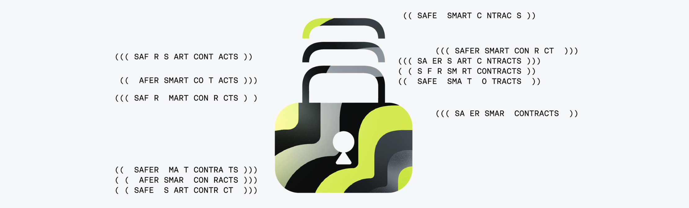

# Example Contracts

<figure><figcaption></figcaption></figure>

This page collects example Clarity contracts that developers can use as practical starting points when building on Stacks.

You’ll find **starter contracts** that demonstrate common patterns and best practices in Clarity, as well as **notable production contracts** currently used by popular Stacks applications. Together, these examples are intended to help you understand how real-world contracts are structured, how different features are implemented, and how Clarity is used in practice.

Use these contracts as references, learning aids, or foundations to adapt and extend for your own applications.

## Tokens

#### Example Templates

* [**Fungible Token**](fungible-token.md): A minimal SIP-010 fungible token contract implementation
* [**Non-Fungible Token**](non-fungible-token.md): A minimal SIP-009 non-fungible token contract implementation
* [**Semi-Fungible Token**](https://github.com/MarvinJanssen/stx-semi-fungible-token): A minimal SIP-013 semi-fungible token contract implementation

#### Real Implementations

* [**sBTC token**](https://explorer.hiro.so/txid/SM3VDXK3WZZSA84XXFKAFAF15NNZX32CTSG82JFQ4.sbtc-token): The SIP-010 fungible token implementation of BTC on Stacks.
* [**USDCx token**](https://explorer.hiro.so/txid/0x07ea0a8d7262acd0cb094006969527351883281e08ebb6535843c5dbbde31ce9): The SIP-010 fungible token implementation for USDC on Stacks.
* [**Megapont Ape Club NFT**](megapont-ape-club-nft.md)**:** A production-ready SIP-009 compliant NFT implementation featuring a 2,500-piece limited collection with built-in marketplace functionality.&#x20;
* [**AIBTCDEV Airdrop NFT**](https://explorer.hiro.so/txid/SP97M6Z0T8MHKJ6NZE0GS6TRERCG3GW1WVJ4NVGT.aibtcdev-airdrop-1): The NFT contract behind the largest airdrop in Bitcoin layers history, sending out nearly 800,000 NFTs.

***

## DeFi

#### Example Templates

* [**DeFi Lending**](defi-lending.md)**:** A DeFi lending protocol that allows users to deposit STX, borrow against their deposits, and earn yield from interest payments.&#x20;
* [**NFT Marketplace**](nft-marketplace.md)**:** A tiny NFT marketplace contract that enables users to list, buy, and sell NFTs with flexible payment options.
* [**AMM DEX**](https://github.com/serayd61/stacks-amm-dex): A minimal, production-ready decentralized exchange (DEX) on Stacks (Bitcoin L2) implementing a constant-product AMM (x · y = k).

#### Real Implementations

* [**StackingDAO Core**](https://docs.stackingdao.com/stackingdao/core-contracts/ststx-stacking-dao-core-v6): The main entry point contract for all StackingDAO user-related actions such as depositing and withdrawing STX, looking up the stSTX/STX ratio or a withdrawal NFT position of a user.
* [**Bitflow Stableswap Core**](https://explorer.hiro.so/txid/SPQC38PW542EQJ5M11CR25P7BS1CA6QT4TBXGB3M.stableswap-stx-ststx-v-1-2): An advanced swap contract of the Stableswap protocol.
* [**STX.City's bonding curve DEX**](https://explorer.hiro.so/txid/SP38GBVK5HEJ0MBH4CRJ9HQEW86HX0H9AP1HZ3SVZ.trevors-beard-dex): An implementation of a simple bonding curve DEX, for deployed tokens, that facilitates the trading of tokens using a bonding curve mechanism.
* [**xBTC to sBTC swap**](https://explorer.hiro.so/txid/SP2PABAF9FTAJYNFZH93XENAJ8FVY99RRM50D2JG9.xbtc-sbtc-swap-v2): This contract implements a one-way, 1:1 swap from xBTC to sBTC, letting users send xBTC to the contract and receive the same amount of sBTC as long as the contract is sufficiently backed. It also allows a custodian to withdraw excess, unbacked sBTC and supports enrolling the contract into Dual Stacking.

***

## Utilities

#### Example Templates

* [**Smart Wallets**](smart-wallets.md)**:** A smart contract wallet with specific rules, which is a sophisticated wallet abstraction that enables programmable spending rules and multi-admin governance.
* [**Send Many**](send-many.md)**:** Enables efficient batch STX transfers to multiple recipients in a single transaction.&#x20;
* [**Counter**](counter.md)**:** A simple on-chain counter that maintains individual count values for each principal address.&#x20;
* [**Multi-Sig Vault**](https://github.com/clarity-lang/book/blob/main/projects/multisig-vault/contracts/multisig-vault.clar): A simple multisig vault that allows members to vote on who should receive the STX contents.
* [**Timelocked Wallet**](https://github.com/clarity-lang/book/blob/main/projects/timelocked-wallet/contracts/timelocked-wallet.clar): A time-locked vault contract that becomes eligible to claim by the beneficiary after a certain block-height has been reached.

#### Real Implementations

* [**Bitflow's Keepers**](https://explorer.hiro.so/txid/SP3R9DNHRSBPT42JX98J92ZJHASWSBXT5ZW8X4XCK.keeper-4-qd5kcui30-v-1-1): A smart wallet implementation for Bitflow users that assists with complex automated DeFi strategies.
* [**Pyth**](https://github.com/stx-labs/stacks-pyth-bridge): A set of contracts that enables Pyth's price oracles on Stacks.
* [**DIA**](https://explorer.hiro.so/txid/SP1G48FZ4Y7JY8G2Z0N51QTCYGBQ6F4J43J77BQC0.dia-oracle): The DIA price oracle contract on Stacks.
* [**Arkadiko Oracle**](https://explorer.hiro.so/txid/SP2C2YFP12AJZB4MABJBAJ55XECVS7E4PMMZ89YZR.arkadiko-oracle-v2-3): A community managed oracle contract by Arkadiko.

***

## Cross-chain

* [**Ordinals Swap**](ordinals-swap.md)**:** Enables trustless peer-to-peer atomic swaps between Bitcoin Ordinals and STX tokens.
* [**Clarity Bitcoin Library**](https://github.com/friedger/clarity-bitcoin): A stateless contract that enables you to verify that a transaction was mined in a certain Bitcoin block and parse a bitcoin transaction.

***

## DAOs

#### Example Templates

* [**ExecutorDAO Framework**](executordao-framework.md)**:** ExecutorDAO is a modular, extensible DAO framework that uses a trait-based architecture to enable flexible governance structures.
* [**On-Chain Voting**](https://github.com/serayd61/stacks-voting): Decentralized on-chain voting for DAOs and communities on Stacks blockchain.
* [**Crowdfunding**](https://github.com/serayd61/stacks-crowdfund): Create campaigns, raise STX, and build community-funded projects.

***

## Other notable contracts on mainnet

* [**Proof of Transfer (PoX)**](proof-of-transfer-pox.md)**:** The core system contract that implements Stacks' consensus mechanism, enabling STX holders to lock their tokens and earn Bitcoin rewards.
* [**SIP-019 Token Metadata Update**](https://explorer.hiro.so/txid/SP1H6HY2ZPSFPZF6HBNADAYKQ2FJN75GHVV95YZQ.token-metadata-update-notify): A helper contract that emits a SIP-019 print event notification for updating token metadata.
* [**BNS v2**](https://explorer.hiro.so/txid/SP2QEZ06AGJ3RKJPBV14SY1V5BBFNAW33D96YPGZF.BNS-V2): A decentralized naming system built on the Stacks blockchain. It allows users to register, manage, and transfer names within different namespaces.
