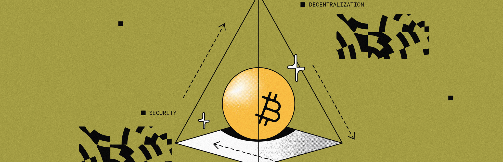

# Bitcoin Finality

<div data-with-frame="true"><figure><figcaption></figcaption></figure></div>

The concept of 100% Bitcoin finality is fundamental to Stacks' design as a Bitcoin L2. This is what allows Stacks to inherit all of Bitcoin's security properties and makes reversing Stacks transactions as difficult as reversing Bitcoin transactions themselves.

## What is Bitcoin Finality?

Finality refers to the point at which transactions become irreversible. Once a blockchain reaches finality, changing the ledger's history requires extraordinary measures that are computationally and economically prohibitive.

When we say Stacks blocks have 100% Bitcoin finality, we mean that **reversing them is as hard as reversing Bitcoin transactions**. This is achieved through Stacks' unique Proof-of-Transfer (PoX) consensus mechanism and the architectural changes introduced in the Nakamoto upgrade, which went live on October 29, 2024 at Bitcoin block #867867.


**Since the Nakamoto upgrade**: Stacks now offers 100% Bitcoin finality and can no longer fork independently of Bitcoin. Once a transaction is confirmed on Stacks, reversing it is at least as hard as reversing a Bitcoin transaction.


## How Stacks Achieves Bitcoin Finality

### Tenure-Based Mining

Under the Nakamoto upgrade, Stacks miners are elected through Bitcoin-based cryptographic sortition. Instead of mining one block per Bitcoin block, elected miners now produce multiple Stacks blocks during their "tenure" — the period corresponding to a single Bitcoin block.

This separation of block production from miner election enables:
- **Fast blocks**: Stacks blocks are produced approximately every 5-10 seconds
- **Bitcoin security**: Each tenure is anchored to Bitcoin, ensuring finality
- **Efficient throughput**: Higher transaction capacity without sacrificing security

### Indexed Block Hash Mechanism

As part of their block-commit transaction on Bitcoin, Stacks miners include an **indexed block hash**. This is the SHA512/256 hash of:

1. The consensus hash of all previously-accepted Bitcoin transactions that Stacks recognizes
2. The hash of the first block produced by the last Stacks miner in their tenure

This anchors the entire Stacks chain history to Bitcoin up to the start of the previous miner's tenure, as well as all causally-dependent Bitcoin state that Stacks has processed.

### The Finality Guarantee

At every Bitcoin block N + 1, the state of the Stacks chain as of the start of tenure N is written to Bitcoin. This creates an immutable record on the Bitcoin blockchain that cannot be changed without rewriting Bitcoin history itself.

**Key implications:**

- Even if all Stackers' signing keys were compromised in the future, they could not rewrite Stacks history for tenure N without rewriting Bitcoin history back to tenure N + 1
- Stacks transactions achieve Bitcoin finality after the tenure they are part of concludes (at Bitcoin block N + 1)
- The Stacks blockchain cannot fork on its own — forks can only occur if Bitcoin itself forks


**Example**: If you initiate a Stacks transaction that gets confirmed by a Stacks miner, at the conclusion of that miner's tenure (the end of the current Bitcoin block), that transaction will be anchored to Bitcoin as part of the Stacks chain state. All future miners are required to build off of that chain tip, making reversing the transaction as difficult as reversing the corresponding Bitcoin transaction.


## The Role of Stackers

Stackers (STX holders who lock their tokens to participate in consensus) play a critical role in maintaining Bitcoin finality:

- **Fork prevention**: Stackers must approve blocks with 70% consensus before they become part of the canonical chain
- **Miner policing**: While miners decide which transactions are included in blocks, Stackers make the final determination on whether blocks are included in the chain
- **Security enforcement**: This separation of duties ensures miners cannot act maliciously without Stacker approval

This design puts fork prevention responsibility on Stackers rather than relying solely on miner connectivity, further strengthening the system's security.

## Post-Nakamoto Network Performance

Since the Nakamoto upgrade activated in October 2024, Stacks has delivered on its key promises:

### Fast Blocks
- Block production occurs every 5-10 seconds on average
- Significantly improved from the pre-Nakamoto 10-30 minute block times
- Enables responsive DeFi applications and better user experience

### Ongoing Optimizations
Following the initial Nakamoto release, several enhancements have been implemented or are in progress:

**Tenure Extensions (SIP-034)**
- Implemented in early 2025 to address cost limit constraints
- Allows miners to refresh specific budget dimensions (like read-count) without resetting others
- Enables high-throughput workloads even when the cost model is pessimistic
- Optimizes for missed Bitcoin blocks and reduces processing delays

**Transaction Replay Feature**
- Designed to replay transactions orphaned by Bitcoin reorgs
- Ensures transactions aren't lost due to Bitcoin chain reorganizations
- Currently in testing phase as of Q4 2025

## Bitcoin Reorgs and Transaction Types

If Bitcoin forks, how does it affect Stacks transactions? To answer this, we need to distinguish between two types of Stacks transactions:

### Bitcoin-Reliant Transactions

**Bitcoin-reliant transactions** read Bitcoin state. If Bitcoin forks, these transactions will change, as they depend on Bitcoin's chain state.

**Example**: If you move BTC from Bitcoin L1 to Stacks L2 (via sBTC), you must wait for Bitcoin finality before your L2 BTC can be used. If the L1 transaction becomes unconfirmed due to a fork, you don't have any L2 BTC.

For these transactions, you cannot do better than following Bitcoin finality — which is exactly what Stacks provides.

### Internal Transactions

**Internal transactions** don't rely on Bitcoin state and won't change if Bitcoin forks. These can have faster confirmations because even if Bitcoin forks, Signers can ensure they are reprocessed in the same order.

**Example**: Pure STX transfers, Clarity contract calls that don't read Bitcoin state, or interactions that only involve Stacks-native assets.


**Key Takeaway**: Under Nakamoto, Stacks transactions won't impactfully reorganize due to a Bitcoin fork. Not only are Bitcoin reorgs relatively infrequent, but transactions on Stacks that get reorganized due to a Bitcoin fork behave identically to reorganized Bitcoin transactions. With ongoing research and development, internal L2 transactions may eventually become entirely unaffected by Bitcoin reorgs.


## sBTC and Bitcoin Finality

The launch of sBTC (a 1:1 Bitcoin-backed asset on Stacks) fully leverages Bitcoin finality:

### sBTC Status (January 2026)

**Deposits**: Live since December 17, 2024
- Users can deposit BTC and mint sBTC on Stacks
- Initial cap of 1,000 BTC has been expanded through multiple cap increases
- Over 3,000 BTC deposited as of January 2026

**Withdrawals**: Enabled on April 30, 2025
- Permissionless conversion of sBTC back to native BTC
- Trust-minimized process secured by Signer network
- Initial withdrawal cap of 150 BTC per day for security (being gradually lifted)

**Security Model**:
- Institutional Signer network of 15+ entities (Blockdaemon, Kiln, Copper, Figment, etc.)
- 70% consensus required for all deposit/withdrawal operations
- Moving toward fully decentralized, permissionless Signer set in Phase 3

### How sBTC Uses Bitcoin Finality

sBTC operations inherit Stacks' Bitcoin finality guarantees:

1. **Deposits**: Once a deposit transaction receives Bitcoin finality (6 Bitcoin block confirmations), the sBTC minted on Stacks is as secure as the underlying Bitcoin
2. **Withdrawals**: sBTC burn operations on Stacks receive Bitcoin finality after the tenure concludes, ensuring the withdrawal cannot be reversed
3. **DeFi Operations**: sBTC used in Stacks smart contracts benefits from the same finality as native STX transactions

This means sBTC truly represents Bitcoin capital with Bitcoin security, unlocking Bitcoin's $1T+ in value for productive DeFi use cases.

## Technical Details

<details>
<summary>Deep Dive: Indexed Block Hash Construction</summary>

The indexed block hash mechanism works as follows:

1. **Tenure Start**: When miner M begins their tenure at Bitcoin block N, they start producing Stacks blocks
2. **Block Commit**: When preparing their block-commit transaction for tenure N+1, miner M+1 must include:
   - Standard block hash (as before)
   - **New**: Indexed block hash of the first block miner M produced in tenure N
3. **Hash Components**:
   ```
   indexed_block_hash = SHA512/256(consensus_hash || block_hash)
   ```
   Where:
   - `consensus_hash` = hash of all Bitcoin transactions Stacks recognizes up to that point
   - `block_hash` = hash of the actual Stacks block

4. **Chain Anchoring**: This creates an immutable chain: Bitcoin block N+1 contains a cryptographic commitment to Stacks state as of Bitcoin block N

This design ensures that even with compromised keys, historical Stacks blocks cannot be altered without altering Bitcoin blocks.

</details>

<details>
<summary>Read More About Bitcoin Reorg Behavior</summary>

For detailed information on how Stacks handles Bitcoin reorganizations, including:
- Affected transaction identification and recovery
- Stacker and miner responsibilities during reorgs
- Node synchronization mechanisms
- Transaction replay procedures

See the [Bitcoin Reorgs](bitcoin-reorgs.md) page of the documentation.

</details>

## Real-World Security Implications

### What Bitcoin Finality Means for Builders

1. **No Independent Forks**: Your application won't experience Stacks-only forks. The only way Stacks forks is if Bitcoin forks.

2. **Predictable Finality**: Transactions achieve Bitcoin-level finality at the end of each tenure (~10 minutes), providing clear security guarantees.

3. **Composable Security**: Applications built on Stacks automatically inherit Bitcoin's $500B+ security budget without compromising on programmability.

4. **Institutional Confidence**: Bitcoin finality provides the security guarantees institutional users require for deploying significant capital.

### Attack Resistance

To successfully attack Stacks post-Nakamoto, an attacker would need to:

1. **Compromise 70% of Stackers** to approve malicious blocks, AND
2. **Execute a 51% attack on Bitcoin** to rewrite the blocks where Stacks state was anchored

The second requirement alone makes Stacks as secure as Bitcoin itself, as Bitcoin's hash power and economic security make such attacks prohibitively expensive (estimated at billions of dollars).

## Nakamoto Upgrade Impact Summary

| Metric | Pre-Nakamoto | Post-Nakamoto (Current) |
|--------|--------------|-------------------------|
| **Block Time** | ~10-30 minutes | 5-10 seconds |
| **Fork Resistance** | Moderate (Stacks-only forks possible) | High (Bitcoin finality) |
| **Finality Time** | After 1 Bitcoin block | After 1 Bitcoin block (tenure end) |
| **Security Model** | Proof-of-Transfer | PoX + Signer approval |
| **Independent Forking** | Possible | Impossible |
| **Bitcoin Dependency** | Miner election only | Full state anchoring |

## Future Developments

The Stacks ecosystem continues to evolve Bitcoin finality mechanisms:

### Satoshi Upgrades (2025-2026)

Research is ongoing into:
- **Dual Stacking**: BTC and STX staking for enhanced yield (launched July 2025)
- **Self-Custodial sBTC**: Reducing trust assumptions by enabling unilateral withdrawals for certain use cases
- **Bitcoin Post-Conditions**: Allowing users to define conditions under which Bitcoin on L1 can move, combining L1 self-custody with L2 programmability

### PoX 5 (Under Consideration)

Potential improvements to the Proof-of-Transfer consensus mechanism to further enhance:
- Stacking efficiency and economics
- Signer decentralization
- Transaction throughput
- Cross-chain interoperability

## Resources

### Technical Documentation
- [Nakamoto Upgrade Overview](../nakamoto-upgrade/)
- [Proof-of-Transfer (PoX) Mechanism](../consensus/)
- [Bitcoin Reorgs Handling](bitcoin-reorgs.md)
- [sBTC Operations](../sbtc/)

### Community & Development
- [Stacks Roadmap](https://stacksroadmap.com)
- [Stacks Forum](https://forum.stacks.org)
- [GitHub - Stacks Core](https://github.com/stacks-network/stacks-core)
- [SIP-021: Nakamoto Consensus](https://github.com/stacksgov/sips/blob/main/sips/sip-021/sip-021-nakamoto.md)

### Research Papers
- [Nakamoto Whitepaper](https://stacks.org/nakamoto-release)
- [sBTC Whitepaper](https://stacks.org/sbtc-design)

---

*Last updated: January 2026 - Reflects post-Nakamoto mainnet status with sBTC Phase 2 (withdrawals) enabled*
