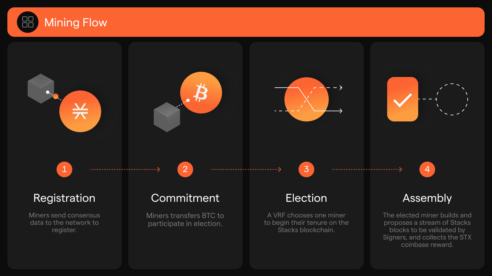
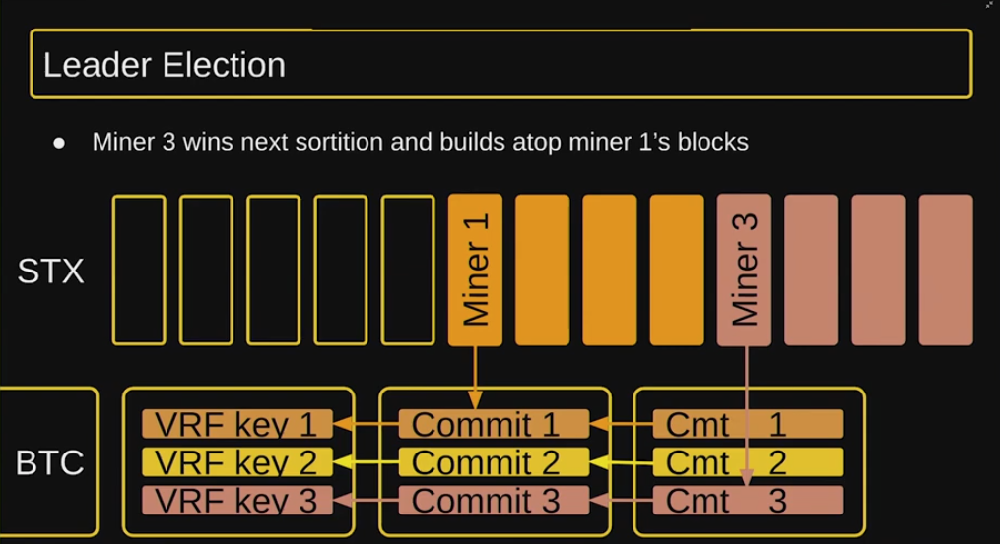
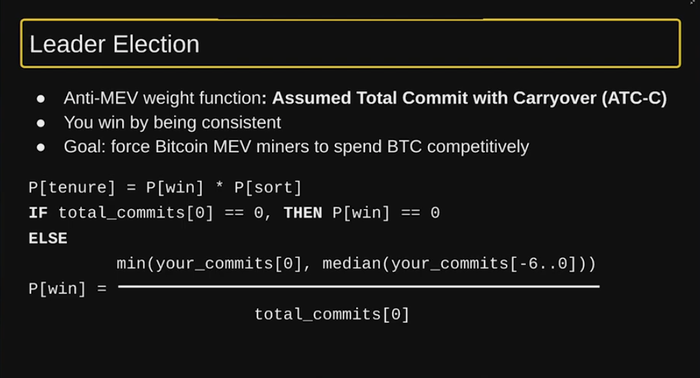

# Mining

<figure><figcaption></figcaption></figure>


**Builder Resources**

* For running your own Stacks miner, [here](https://app.gitbook.com/s/4cpTb2lbw0LAOuMHrvhA/run-a-miner).
* For data analytics on Stacks mining, [here](https://app.signal21.io/stacks/mining).


#### The Big Picture

* PoX selects a randomized single-leader block miner once per BTC block
* PoX incentivizes miners to make STX blocks and earn STX rewards + tx fees
* Miners send _block commit_ transactions on Bitcoin L1.
* Block commits include: (block hash, VRF seed) pair
* Deterministic but unpredictable winner at each Bitcoin block
* PoX disincentivizes BTC L1 miners from interfering via ATC-C

***

## Intro

Stacks mining is built around a simple but powerful idea: miners spend Bitcoin to earn the right to produce new Stacks blocks. Rather than introducing an entirely separate consensus mechanism, Stacks adapts and extends Bitcoin’s existing Proof of Work. In this sense, Stacks leverages Bitcoin’s security and economic weight to secure a layer built on top of it.

When miners commit BTC as part of the mining process, that Bitcoin is not burned or wasted. Instead, it is transferred to Stackers — STX holders who lock up their tokens to help validate and sign blocks. This flow of Bitcoin from miners to Stackers is the core innovation behind Proof of Transfer (PoX). The “transfer” of BTC is what anchors Stacks to Bitcoin’s security while aligning incentives between miners and network participants.

## Mining Flow Breakdown

In the previous version of Stacks (before the Nakamoto Upgrade), Stacks miners would mine new Stacks blocks at a one-to-one cadence with Bitcoin blocks. After Nakamoto, this is no longer the case. Under Nakamoto rules, miners are instead selected for a tenure that corresponds to a Bitcoin block. During this tenure, miners build and propose multiple Stacks blocks (roughly every 10 seconds) and stackers will approve and append them.


[What was the Nakamoto Upgrade?](what-was-the-nakamoto-upgrade.md)


<figure><figcaption></figcaption></figure>

Miners run Stacks nodes with mining enabled to participate in the PoX mechanism. The node implements the PoX mechanism, which ensures proper handling and incentives through four key phases:

1. **Registration**: miners register for a future election by sending consensus data to the network
2. **Commitment**: registered miners transfer Bitcoin to participate in the election. Committed BTC are sent to a set participating STX token holders, aka stackers.
3. **Election**: a verifiable random function chooses one miner for a new tenure to write blocks on the Stacks blockchain
4. **Assembly**: the elected miner writes the new blocks by pulling transactions from the mempool and collects rewards in form of new STX tokens

## Miner Selection Process

As opposed to a block race, as in PoW, Stacks utilizes a single-leader election process called a cryptographic sortition. That is facilitated through an embedded verifiable random function state in Bitcoin transactions. This in turn allows for deterministic but unpredictable winners at each Bitcoin block.

What is a cryptographic sortition?

A cryptographic sortition is a process of randomly selecting one or more entities from a set using cryptography. This is a decentralized and verifiable way to select participants for a variety of tasks, such as consensus protocols, lotteries, and auctions.

More specifically, miner sortition in the context of Stacks is the weighted cryptographic sortition process by which a miner candidate is selected as the next miner (leader).

First off, every Stacks miner must register a VRF public key in a bitcoin transaction. Once they do that, they can then issue _block commit_ transactions on Bitcoin. Block commit transactions on bitcoin contain:

`(block hash, VRF seed) pair`

These block commit transactions not only contains a pointer to the block stream they intend to produce, but also includes all the relevant info to re-seed the next VRF for the next sortition. Miners cannot tamper with the VRF seed. This is enforced by the property:&#x20;

`VRF seed = hash(VRF proof)`&#x20;

And that VRF proof can only be generated by the miner's VRF private key.

How do block commits relate to each other?

<figure><figcaption></figcaption></figure>


To be considered for a tenure, a miner must have a block commit included in a Bitcoin block. If a miner wishes to update their commitment after submission, they may use Bitcoin's Replace-By-Fee.


### Probability to mine next block

The miner who is selected to mine the next block is chosen depending on the amount of BTC the miners transfer. The probability for a miner to mine the next block is determined using a variation of the Assumed Total Commitment with Carryforward (ATC-C) [MEV](https://github.com/stacksgov/sips/blob/main/sips/sip-021/MEV-Report.pdf) mitigation strategy to allocate block rewards to miners. The probability a miner will win the sortition and be granted the current tenure will be based on a function that accounts for the total block commit spend on the blocks leading up to the current sortition.

While there is no minimum BTC commitment enforced by the protocol, in practice, there's a floor constrained by dust: basically, if the fees for a transaction exceed the value of the spent output, it's considered dust. How dust is [calculated](https://github.com/bitcoin/bitcoin/blob/master/src/policy/policy.cpp#L14) depends on a number of factors, we've found 5,500 satoshis to be a good lower bound per output. Bitcoin transactions from Stacks miners contain two outputs (for Proof-of-Transfer), so a commitment of at least 11,000 satoshis / block is recommended.

To calculate the amount of BTC to send, miners should:

* Guess the price BTC/STX for the next day (100 blocks later)
* Guess the total amount of bitcoin committed by all miners


Stackers are in charge of both validating and appending new blocks and conducting miner tenure changes. The next section will explain how that works, and then we'll see how this process results in Bitcoin finality.


### Block Commit Transactions (on Bitcoin)

Miners commit Bitcoin to **two** addresses in every leader block commit transaction. The amount committed to each address must be the same. The addresses are chosen from the current reward set of stacking participants. Addresses are chosen using a verifiable-random-function, and determining the correct two addresses for a given block requires monitoring the Stacks chain.

<figure><figcaption></figcaption></figure>

What does a block commit transaction actually look like?

* Watch this [clip](https://youtube.com/shorts/HPRsn-aSYrg?si=Y7hA7_9BeHFxV0zz) describing what goes into a block commit transaction on Bitcoin.
* Check out a previous block commit transaction on Bitcoin [here](https://mempool.space/tx/42834cb7ec9ca3e2b51e2ff16bd809ae049c925ed8d3da099c9ce3d5292d2a91).

## Miner rewards

Miners receive Stacks blocks' coinbase rewards for tenures they win.

The reward amounts are:

* 1000 STX per tenure are released in the first 4 years of mining
* 500 STX per tenure are released during the following 4 years
* 250 STX per tenure are released during the following 4 years
* 125 STX per tenure are released from then on indefinitely.

These "halvings" are synchronized with Bitcoin halvings.

#### Transaction fees

Miners also receive Stacks fees for transactions mined in any block they produce.

#### Reward maturity

Block rewards and transaction fees take 100 blocks on the Bitcoin blockchain to mature. After successfully mining a block your rewards appear in your Stacks account after \~24 hours.

## Stacks mining in practice

If you take a look at [SIgnal21's mining dashboard](https://app.signal21.io/stacks/mining), you can view some interesting data about mining on the Stacks network, including BTC spent per block, STX earned per block, the total number of miners over the course of the chain's history, and the number of miners for any given block.

Many people notice the seemingly small number of miners on Stacks. Without context, this can sometimes raise eyebrows. Let's dig into how mining works on Stacks so we can understand why this isn't an issue for decentralization.

Stacks miners function similarly to sequencers in L2 systems in that they are only responsible for constructing and proposing new blocks, not appending them to the chain. But unlike most Ethereum L2s that operate with just a single centralized sequencer, Stacks consistently has at least 4-5 miners with open membership allowing anyone to join.

It's important to note that there are two primary parties involved in the block production process on Stacks: miners and stackers. These two roles serve complementary relationships in the block production process, and stackers drastically reduce any potential destructive power miners have over the chain.

Miners cannot reorganize the chain. In the worst case, all miners can do is omit (some kinds of) transactions, and all that is required to address this is to run your own miner.

Furthermore, more miners on the network would mean fewer BTC rewards for Stackers, as miners would have to spend more of their funds on Bitcoin L1 fees rather than sending it to the Stackers.

<strong>Wouldn't more miners mean more competition, meaning more rewards?</strong>

The reason more miners means fewer rewards is because miners act economically rationally, and they don't have an unlimited amount of BTC to work with.

Miners are paying their PoX commitments plus their Bitcoin fees for a chance to win the coinbase (1,000 STX) plus fees for a tenure. If there are more miners, they will each pay less, because they will have a lower chance of winning. They can't pay ever-increasing amounts of BTC because at some point they will never be profitable, so there is a limit to how much BTC they can spend in order to try and win a tenure.

As they pay less, the Bitcoin fee becomes a more significant portion of their expenses, and that also decreases their odds of winning the tenure.

Here's a concrete example:

Let's say Stacks is trading at 1,000 Sats per STX.

The total spend from all miners, if everyone is acting logically and we ignore Stacks fees, would be less than 1,000,000 Sats (1,000 STX coinbase \* 1000 Sats/STX).

If that is from 5 miners, then it could be 10,000 Sats (2,000 Sats for each transaction) going to Bitcoin fees and 990,000 Sats going to PoX.

If there are 100 miners, then it would be 200,000 Sats going to Bitcoin fees, and 800,000 Sats going to PoX.

This creates a natural economic equilibrium where:



**Enough miners participate to ensure blocks are produced reliably**



**Stackers receive optimal BTC rewards**



**The network maintains censorship resistance without unnecessary mining competition**



This design is intentional - by having stackers as complimentary security guarantors who receive BTC rewards via PoX, Stacks achieves security without requiring an excessive number of miners competing solely to win block production rights.

Unlike other chains where miners alone determine the canonical chain, Stacks' two-party system provides stronger guarantees:

* Miners cannot force invalid transactions or blocks (stackers won't sign them, and even if they did, the nodes would not accept them)
* No miner can unilaterally reorg the chain (stackers control chain finality)
* The 70% stacker threshold signature requirement ensures broad consensus before blocks are accepted

This separation of concerns between miners and stackers is what makes Stacks uniquely secure despite having a small number of miners.

What happened to microblocks?

Microblocks are a legacy feature of the previous version of Stacks that no longer exist. They were originally created as a way to improve transaction throughput, but without the functionality of Nakamoto, they never worked in practice.

Instead of microblocks, Nakamoto instead utilizes a block production structure that creates Stacks blocks at a rapid cadence as described here.

## Bitcoin MEV Mitigation

Miner Extractable Value (MEV) has been a longstanding issue across many blockchains, including Stacks pre-Nakamoto.

MEV refers to the potential profit miners can extract from the manipulation of transaction inclusion and ordering within the blocks they produce, which can lead to unfair practices and diminished trust in the network.

Specifically in pre-Nakamoto releases of Stacks, Bitcoin miners with a significant percentage of Bitcoin’s hashrate had the ability to censor commitment transactions of other Stacks miners ensuring they were able to win the block rewards and fees of Stacks blocks where they were also the winner of the Bitcoin block as a Bitcoin miner.

The Nakamoto system uses a variation of the Assumed Total Commitment with Carryforward (ATC-C) [MEV](https://github.com/stacksgov/sips/blob/main/sips/sip-021/MEV-Report.pdf) mitigation strategy to allocate block rewards to miners. The probability a miner will win the block and be granted the current tenure will be based on a function that accounts for the total block commit spend on the blocks leading up to the current block.

<figure><figcaption></figcaption></figure>

The ATC solution leaves the option for a block to have no valid winner. The TenureChange-Extend transaction mitigates the majority of adverse effects caused by a missed block.

***

### Additional Resources

* \[[Stacks YT](https://youtu.be/F31B-my510A?si=E0SRw0bbhuevB4kj)] The Stacks & Bitcoin Miners Relationship
* \[[Stacks YT](https://youtu.be/bhVyM5CYoh4?si=3bQl8Q_iJ_3z5jX-)] Long Term Security Budget & Miner Incentives for Bitcoin
